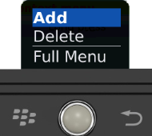

                               

ScrollBox Properties
--------------------

The basic properties of ScrollBox widget are:

*   [bounces](#bounces)
*   [containerHeight](#containerheight)
*   [containerHeightReference](#containerheightreference)
*   [containerWeight](#containerweight)
*   [contextMenu](#contextmenu)
*   [enableCache](#enablecache)
*   [enablesScrollByPage](#enablescrollbypage)
*   [id](#id)
*   [info](#info)
*   [isVisible](#isvisible)
*   [layoutAlignment](#layoutalignment)
*   [margin](#margin)
*   [marginInPixel](#margininpixel)
*   [orientation](#orientation)
*   [padding](#padding)
*   [paddingInPixel](#paddinginpixel)
*   [percent](#percent)
*   [position](#position)
*   [pullToRefreshI18NKey](#pulltorefreshi18nkey)
*   [pullToRefreshSkin](#pulltorefreshskin)
*   [pushToRefreshI18NKey](#pushtorefreshi18nkey)
*   [pushToRefreshSkin](#pushtorefreshskin)
*   [releaseToPullRefreshI18NKey](#releasetopullrefreshi18nkey)
*   [releaseToPushRefreshI18NKey](#releasetopushrefreshi18nkey)
*   [scrollArrowConfig](#scrollarrowconfig)
*   [scrollDirection](#scrolldirection)
*   [scrollToTop](#scrollstotop)
*   [showFadingEdges](#showfadingedges)
*   [showScrollbars](#showscrollbars)
*   [skin](#skin)
*   [viewConfig](#viewconfig)

### a11yIndex

The property helps you define index to each child widget in a container.

You can set indexing keys to the child widgets using integers starting from 1. If any child widget is not defined with any integer value, that child widget is visible after displaying all widgets, for which keys are defined, in sequence.

Suppose multiple widgets in a container are set with same integer value, the displaying order of the widgets is based on the addition of the widgets to the container. That is, the widget added first to the container will be read first and followed by other widgets in sequence.

<b>Syntax</b>

**JavaScript:** a11yIndex

<b>Type</b>

**JavaScript:** Number

<b>Read/Write</b>

Read + Write

<b>Example</b>

```

//Defining properties for a ScrollBox with bounces:true
var scrollBasic = {id :"scrollBox", skin:"scrlSkin", isVisible:true, orientation:constants.BOX_LAYOUT_HORIZONTAL, showScrollbars:true, "accessibilityConfig": { 		"a11yNavigationMode": constants.ACCESSIBILITY_NAVIGATION_PARENT,     **"a11yIndex": 1**}};};

var scrollLayout	= {padding:[2,2,2,2], containerWeight:100, margin:[5,5,5,5], containerHeight:100, percent:true};

var scrollPSP = {bounces:true };

//Creating the ScrollBox.
var scrollBox = new voltmx.ui.ScrollBox(scrollBasic, scrollLayout, scrollPSP);
```

<b>Platform Availability</b>

*   iOS

### a11yNavigationMode

The property helps to specify the type of navigation order that should be used in the ScrollBox.

You can define any one of the following values to the property:

*   constants.ACCESSIBILITY\_NAVIGATION\_MODE\_NATIVE: Native accessibility navigation. Applies the platform's default accessibility navigation order. This is the default value for the property.
*   constants.ACCESSIBILITY\_NAVIGATION\_MODE\_PARENT: Applies a custom navigation for widgets based on the a11yIndices set to the child widgets.
*   constants.ACCESSIBILITY\_NAVIGATION\_MODE\_DEFAULT: Derives the property value from its immediate parent going all the way to form level.

<b>Syntax</b>

**JavaScript:** a11yNavigationMode

<b>Type</b>

**JavaScript:** Number

<b>Read/Write</b>

Read + Write

<b>Example</b>

```

//Defining properties for a ScrollBox with bounces:true
var scrollBasic = {id :"scrollBox", skin:"scrlSkin", isVisible:true, orientation:constants.BOX_LAYOUT_HORIZONTAL, showScrollbars:true, "accessibilityConfig": {     **"a11yNavigationMode": constants.ACCESSIBILITY_NAVIGATION_PARENT**, 		"a11yIndex": 1}};};

var scrollLayout	= {padding:[2,2,2,2], containerWeight:100, margin:[5,5,5,5], containerHeight:100, percent:true};

var scrollPSP = {bounces:true };

//Creating the ScrollBox.
var scrollBox = new voltmx.ui.ScrollBox(scrollBasic, scrollLayout, scrollPSP);
```

<b>Platform Availability</b>

*   iOS


<h3 id="bounces">bounces</h3>  

Specifies whether the scroll view bounces past the edge of the content and back again.

**Default:**_true_

If set to _false,_ the scroll view bounce is not applied.

If set to _true,_ the scroll view bounce is applied.

<b>Syntax</b>

bounces

<b>Type</b>

Boolean

<b>Read/Write</b>

Yes - (Read and Write)

<b>Example</b>

```

//Defining properties for a ScrollBox with bounces:true
var scrollBasic = {id :"scrollBox", skin:"scrlSkin", isVisible:true, orientation:constants.BOX_LAYOUT_HORIZONTAL, showScrollbars:true};

var scrollLayout	= {padding:[2,2,2,2], containerWeight:100, margin:[5,5,5,5], containerHeight:100, percent:true};

var scrollPSP = {**bounces:true** };

//Creating the ScrollBox.
var scrollBox = new voltmx.ui.ScrollBox(scrollBasic, scrollLayout, scrollPSP);
```

<b>Accessible from IDE</b>

Yes

<b>Platform Availability</b>

*   iPhone
*   iPad

### containerHeight

Specifies the available height of the container in terms of percentage. The percentage is with reference to the value of containerHeightReference property.

For example, On a Form you have a ScrollBox with 5 labels and 5 buttons in it and a _CloseButton_ below the ScrollBox. If the containerHeight is set as 100 (percentage) and containerHeightReference is set as SCROLLBOX\_HEIGHT\_BY\_FORM\_REFERENCE, then the ScrollBox occupies the height of the Form excluding the height occupied by the _CloseButton_.

**Default:**  If not configured, the value may vary depending on the platforms.

Additional rules for containerHeight property based on the scrollDirection:

*   When the scrollDirection is set to SCROLLBOX\_SCROLL\_NONE or SCROLLBOX\_SCROLL\_HORIZONTAL preferred height is determined by the child widget.
*   When the scrollDirection is set to SCROLLBOX\_SCROLL\_BOTH or SCROLLBOX\_SCROLL\_VERTICAL preferred height is determined as follows:

  
| containerHeight | containerHeightReference | Result |
| --- | --- | --- |
| Not provided | Not provided | Height determined by its child widgets |
| Not provided | SCROLLBOX\_HEIGHT\_BY\_FORM\_REFERENCE / SCROLLBOX\_HEIGHT\_BY\_PARENT\_WIDTH | Height determined by its child widgets |
| \>=0 | Not provided | Assume containerHeightReference as SCROLLBOX\_HEIGHT\_BY\_FORM\_REFERENCE |
| \>=0 | SCROLLBOX\_HEIGHT\_BY\_FORM\_REFERENCE | Based on containerHeight and containerHeightReference appropriately |
| \>=0 | SCROLLBOX\_HEIGHT\_BY\_PARENT\_WIDTH | Based on containerHeight and containerHeightReference appropriately |

<b>Syntax</b>

containerHeight

<b>Type</b>

Number

<b>Read/Write</b>

Yes- (Read and Write)

<b>Example</b>

```

//Defining properties for a ScrollBox with enableScrollByPage:true
var scrollBasic = {id :"scrollBox",skin:"scrlSkin", isVisible:true, orientation:constants.BOX_LAYOUT_HORIZONTAL, enableScrollByPage:true};

var scrollLayout	= {padding:[2,2,2,2], containerWeight:100, margin:[5,5,5,5], **containerHeight:100**, percent:true};

var scrollPSP = {};

//Creating the ScrollBox.
var scrollBox = new voltmx.ui.ScrollBox(scrollBasic, scrollLayout, scrollPSP);


```

Accessible form IDE

No

<b>Platform Availability</b>

Available on all platforms. platforms.

### containerHeightReference

This property is enabled when you set the [containerHeight](#containerheight). The widget height percentage is calculated based on the following options.

**Default:** CONTAINER\_HEIGHT\_BY\_FORM\_REFERENCE

The container height percentage is calculated based on the below options.

*   CONTAINER\_HEIGHT\_BY\_FORM\_REFERENCE: The scrollbox height is percentage calculated based on the height of the Form excluding headers and footers. This property doesn't have any effect if the scrollbox is placed inside a popup or headers/footers.
*   CONTAINER\_HEIGHT\_BY\_PARENT\_WIDTH: Use this option if the scrollbox is placed inside a Box. The width is calculated based on the width of the Box. The BlackBerry10 platform supports this option only.

> **_Note:_** To set the value through code, prefix the option with _constants._ such as _**constants.<option>**_ .

<b>Syntax</b>

containerHeightReference

<b>Type</b>

Number

<b>Read/Write</b>

Yes - (Read and Write)

<b>Example</b>

```

//Defining properties for a ScrollBox with containerHeightReference:constants.SCROLLBOX_HEIGHT_BY_PARENT_WIDTH
var scrollBasic = {id :"scrollBox", skin:"scrlSkin", isVisible:true, orientation:constants.BOX_LAYOUT_HORIZONTAL};

var scrollLayout	= {padding:[2,2,2,2], containerWeight:100, margin:[5,5,5,5], containerHeight:100, percent:true, **containerHeightReference:constants.CONTAINER_HEIGHT_BY_PARENT_WIDTH**};

var scrollPSP = {};

//Creating the ScrollBox.
var scrollBox = new voltmx.ui.ScrollBox(scrollBasic, scrollLayout, scrollPSP);

//Reading the containerHeightReference of the ScrollBox.
alert("ScrollBox containerHeightReference ::"+scrollBox.containerHeightReference);	


```

<b>Accessible from IDE</b>

Yes

<b>Platform Availability</b>

Available on all platforms. platforms.

### containerWeight

Specifies percentage of width to be allocated by its parent widget. The parent widget space is distributed to its child widgets based on this weight factor. All its child widgets should sum up to 100% of weight except when placed in **voltmx.ui.ScrollBox**.

<b>Syntax</b>

containerWeight

<b>Type</b>

Number

<b>Read/Write</b>

Yes - (Read and Write)

<b>Example</b>

```

//Defining properties for a ScrollBox with containerWeight:100
var scrollBasic = {id :"scrollBox", skin:"scrlSkin", isVisible:true, orientation:constants.BOX_LAYOUT_HORIZONTAL};

var scrollLayout = {padding:[2,2,2,2], **containerWeight:100**, margin:[5,5,5,5], containerHeight:100, percent:true};

var scrollPSP = {};

//Creating the ScrollBox.
var scrollBox = new voltmx.ui.ScrollBox(scrollBasic, scrollLayout, scrollPSP);

//Reading the containerWeight of the ScrollBox.
alert("ScrollBox containerWeight ::"+scrollBox.containerWeight);
```

<b>Accessible from IDE</b>

Yes

<b>Platform Availability</b>

Available on all platforms. platforms.

### contextMenu

Shows the list of actions (appropriate to the widget in focus) as menu items.

> **_Note:_** The property is available only on BlackBerry platform.

The following are the characteristics of a context menu on _BlackBerry_ platform:

*   You can invoke the context menu either by clicking on the widget (applicable only on BlackBerry versions 6.x and above) or by a long press on the screen (or trackpad).
*   You can choose to add icons to indicate the menu items in the context menu (applicable only on BlackBerry versions 6.x and above).
*   BlackBerry layouts menu items in a 3 item grid view. The menu items _Switch Application_, _Help_, _Close_, and _Full Menu_ are added automatically based on the number of menu items added in the context menu. For example, If you add a context menu with 2 items, it will display _Full Menu_ item along with the items added. If you add a context menu with 3 items, it will display _Full Menu_, _Help_, _Switch Application_ items along with the items added.
*   If the focus is on a widget that has a context menu; and if you click the _"menu key"_, the Full Menu appears along with the context menu items.
*   On Blackberry Non-Touch Devices, only _Full Menu_ item is displayed irrespective of number of items added in the context menu.

> **_Note:_** The context menu items in the _Full Menu_ will disappear if the focus is shifted from the widget which has the context menu.

The following images illustrates the context menu on various BlackBerry devices:  

  
| BlackBerry 6.x | BlackBerry Touch Device | BlackBerry Non-Touch Device |
| --- | --- | --- |
|  |  |  |

  

<b>Syntax</b>

contextMenu

<b>Type</b>

JSObject

<b>Read/Write</b>

Yes - (Read and Write)

<b>Example</b>

```

//Defining contextMenu items for Windows 8 platform.
var appMenu1 = {id:"appmenuitemid1", text:"Add", image:"tc.png", onclick:callbackMenuItem1 };

var appMenu2 = {id:"appmenuitemid2", text:"Remove", image:"tc.png", onclick:callbackMenuItem2 };

var appMenu3 = {id:"appmenuitemid3", text:"Edit", image:"tc.png", onclick:callbackMenuItem3};

var appMenu4 = {id:"appmenuitemid4", text:"Close", image:"tc.png", onclick: callbackMenuItem4};
	
function callbackMenuItem1()
{
		alert("Clicked on First menu item");
}

function callbackMenuItem2()
{
		alert("Clicked on Second menu item");
}

function callbackMenuItem3()
{
		alert("Clicked on Third menu item");
}

function callbackMenuItem4()
{
		alert("Clicked on Fourth menu item");
}
  
  
//Defining properties for a ScrollBox with contextMenu:[appMenu1,appMenu2,appMenu3,appMenu4]
var scrollBasic = {id :"scrollBox", skin:"scrlSkin", isVisible:true, orientation:constants.BOX_LAYOUT_HORIZONTAL, showScrollbars:true};

var scrollLayout	= {padding:[2,2,2,2], containerWeight:100, margin:[5,5,5,5], containerHeight:100, percent:true};

var scrollPSP = {**contextMenu:[appMenu1,appMenu2,appMenu3,appMenu4]**};

//Creating the ScrollBox.
var scrollBox = new voltmx.ui.ScrollBox(scrollBasic, scrollLayout, scrollPSP);


```

  
<b>Accessible from IDE</b>

No

<b>Platform Availability</b>

*   BlackBerry
*   Android
*   Windows Tablet

### enableCache

This property enables you to improve the performance of Positional Dimension Animations.

> **_Note:_** When this property is used, it increases the memory consumption by the application. It enables tradeoff between performance and visual quality of the content.

**Default:**_true_

<b>Syntax</b>

enableCache

<b>Type</b>

Boolean

<b>Read/Write</b>

Yes - (Read and Write)

<b>Accessible from IDE</b>

Yes

<b>Platform Availability</b>

This property is supported only on Windows platform

### enableScrollByPage

Enables the scrolling of the content in increments of the width of the scrollbox on swipe gesture.

**Default:** false

If set to _true,_ the scroll by page is enabled.

If set to _false,_ the scroll by page is disabled.

<b>Syntax</b>

enableScrollByPage

<b>Type</b>

Boolean

<b>Read/Write</b>

No

<b>Example</b>

```

//Defining properties for a ScrollBox with enableScrollByPage:true
var scrollBasic = {id :"scrollBox",skin:"scrlSkin", isVisible:true, orientation:constants.BOX_LAYOUT_HORIZONTAL, **enableScrollByPage:true**};

var scrollLayout	= {padding:[2,2,2,2], containerWeight:100, margin:[5,5,5,5], containerHeight:100, percent:true};

var scrollPSP = {};

//Creating the ScrollBox.
var scrollBox = new voltmx.ui.ScrollBox(scrollBasic, scrollLayout, scrollPSP);


```

<b>Accessible from IDE</b>

Yes

<b>Platform Availability</b>

*   iPhone
*   iPad
*   Android

### id

id is a unique identifier of a ScrollBox consisting of alpha numeric characters. Every ScrollBox should have a unique id within a Form.

<b>Syntax</b>

id

<b>Type</b>

String

<b>Read/Write</b>

Yes - (Read only)

<b>Example</b>

```

//Defining properties for a ScrollBox with id:"scrollBox"
var scrollBasic = {**id :"scrollBox"**,skin:"scrlSkin", isVisible:true, orientation:constants.BOX_LAYOUT_HORIZONTAL};

var scrollLayout	= {padding:[2,2,2,2], containerWeight:100, margin:[5,5,5,5], containerHeight:100, percent:true};

var scrollPSP = {};

//Creating the ScrollBox.
var scrollBox = new voltmx.ui.ScrollBox(scrollBasic, scrollLayout, scrollPSP);
```

  
<b>Accessible from IDE</b>

Yes

<b>Platform Availability</b>

Available on all platforms

### info

A custom JSObject with the key value pairs that a developer can use to store the context with the widget. This will help in avoiding the globals to most part of the programming.

> **_Note:_** This is a **non-Constructor** property. You cannot set this property through widget constructor. But you can read and write data to it.

Info property can hold any JSObject. After assigning the JSObject to info property, the JSObject should not be modified. For example,

```

var inf = {a: 'hello'};
widget.info = inf; //works
widget.info.a = 'hello world'; //This will not update the widget info a property to Hello world. widget.info.a will have old value as hello.
```

<b>Syntax</b>

info

<b>Type</b>

JSObject

<b>Read/Write</b>

Yes - (Read and Write)

<b>Example</b>

```

//Defining properties for a ScrollBox with info property.
var scrollBasic = {id :"scrollBox", skin:"scrlSkin", isVisible:true, orientation:constants.BOX_LAYOUT_HORIZONTAL};

var scrollLayout	= {padding:[2,2,2,2], containerWeight:100, margin:[5,5,5,5], containerHeight:100, percent:true};

var scrollPSP = {};

//Creating the ScrollBox.
var scrollBox = new voltmx.ui.ScrollBox(scrollBasic, scrollLayout, scrollPSP);  
**scrollBox.info = {key:"SCROLL"};**
```

<b>Accessible from IDE</b>

No

<b>Platform Availability</b>

Available on all platforms

### isVisible

Specifies the visibility of the widget.

**Default:** _true_

If set to _false,_ the widget is not displayed.

If set to _true,_ the widget is displayed.

<b>Syntax</b>

isVisible

<b>Type</b>

Boolean

<b>Read/Write</b>

Yes - (Read and Write)

<b>Example</b>

```

//Defining properties for a ScrollBox with isVisible:true
var scrollBasic = {id :"scrollBox",skin:"scrlSkin", **isVisible:true**, orientation:constants.BOX_LAYOUT_HORIZONTAL};

var scrollLayout	= {padding:[2,2,2,2], containerWeight:100,margin:[5,5,5,5], containerHeight:100, percent:true};

var scrollPSP = {};

//Creating the ScrollBox
var scrollBox = new voltmx.ui.ScrollBox(scrollBasic, scrollLayout, scrollPSP);


```

> **_Note:_** You can set the visibility of a widget dynamically from code using the setVisibility method.

<b>Accessible from IDE</b>

Yes

<b>Platform Availability</b>

Available on all platforms. platforms.

### layoutAlignment

This property is enabled when you set the [percent](#percent) property as _false_. Specifies the direction in which the widgets are laid out.

**Default:** BOX\_LAYOUT\_ALIGN\_FROM\_LEFT

The available options are:

*   BOX\_LAYOUT\_ALIGN\_FROM\_LEFT: The widgets are aligned from left in the scrollbox.
*   BOX\_LAYOUT\_ALIGN\_FROM\_CENTER: The widgets are aligned center.
*   BOX\_LAYOUT\_ALIGN\_FROM\_RIGHT: The widgets are aligned from right.

> **_Note:_** To set the value through code, prefix the option with _constants._ such as _**constants.<option>**_ .

<b>Syntax</b>

layoutAlignment

<b>Type</b>

Number

<b>Read/Write</b>

No

<b>Example</b>

```

//creating ScrollBox with layoutAlignment:constants.BOX_LAYOUT_ALIGN_FROM_CENTER
var scrollBasic = {id :"scrollBox", skin:"scrlSkin", isVisible:true, orientation:constants.BOX_LAYOUT_HORIZONTAL};

var scrollLayout	= {padding:[2,2,2,2], containerWeight:100, margin:[5,5,5,5], containerHeight:100, percent:false, **layoutAlignment:constants.BOX_LAYOUT_ALIGN_FROM_CENTER**};

var scrollPSP = {};
  
//Creating the ScrollBox.
var scrollBox = new voltmx.ui.ScrollBox(scrollBasic, scrollLayout, scrollPSP);
```

<b>Accessible from IDE</b>

Yes

<b>Platform Availability</b>

Available on all platforms. platforms.

### margin

Defines the space around a widget. You can use this option to define the left, top, right, and bottom distance between the widget and the next element.

To define the margin values for a platform, click the () button against the property to open the _Margin_ screen. Select the checkbox against the platform for which you want to define the margins and enter the top, left, right, and bottom margin values.

If you want to use the margin values set for a platform across other platforms, you can click the _Apply To_ button and select the platforms on which you want the margin values to be applied.

The following image illustrates the window to define the margins for platforms:


The following image illustrates a widget with a defined margin:


<b>Syntax</b>

margin

<b>Type</b>

Array

<b>Read/Write</b>

Yes - (Read and Write)

<b>Example</b>

```

//Defining properties for a ScrollBox with margin:[5,5,5,5]
var scrollBasic = {id :"scrollBox", skin:"scrlSkin", isVisible:true, orientation:constants.BOX_LAYOUT_HORIZONTAL};

var scrollLayout	= {padding:[2,2,2,2], containerWeight:100, **margin:[5,5,5,5]**, containerHeight:100, percent:true};

var scrollPSP = {};

//Creating the ScrollBox.
var scrollBox = new voltmx.ui.ScrollBox(scrollBasic, scrollLayout, scrollPSP);


```

<b>Accessible from IDE</b>

Yes

<b>Platform Availability</b>

Available on all platforms. platforms.

### marginInPixel

Indicates if the margin is to be applied in pixels or in percentage.

**Default:** _false_

If set to _true,_ the margins are applied in pixels.

If set to _false,_ the margins are applied as set in [margin](#margin) property.

<b>Syntax</b>

marginInPixel

<b>Type</b>

Boolean

<b>Read/Write</b>

No

<b>Example</b>

```

//Defining properties for a ScrollBox with margin in pixels.
var scrollBasic = {id :"scrollBox", skin:"scrlSkin", isVisible:true, orientation:constants.BOX_LAYOUT_HORIZONTAL};

var scrollLayout	= {padding:[2,2,2,2], containerWeight:100, margin:[5,5,5,5], containerHeight:100, percent:true, **marginInPixel:true**};

var scrollPSP = {};

//Creating a ScrollBox.
var scrollBox = new voltmx.ui.ScrollBox(scrollBasic, scrollLayout, scrollPSP);
```

<b>Accessible from IDE</b>

Yes

<b>Platform Availability</b>

*   iPhone
*   iPad
*   Android
*   Windows Phone

### orientation

Specifies how you can stack the widgets within the ScrollBox. You can set the orientation of the ScrollBox as _horizontal_ or _vertical_.

> **_Note:_** ScrollBox with a vertical orientation cannot be placed directly on a form. It has to be placed inside an HBox and only then you can place a ScrollBox with vertical orientation.

**Default:** BOX\_LAYOUT\_HORIZONTAL

The available options are:

*   BOX\_LAYOUT\_HORIZONTAL: Enables you to stack the content within the scrollbox horizontally.
*   BOX\_LAYOUT\_VERTICAL: Enables you to stack the content within the scrollbox vertically.

> **_Note:_** To set the value through code, prefix the option with _constants._ such as _**constants.<option>**_ .

<b>Syntax</b>

orientation

<b>Type</b>

Number

<b>Read/Write</b>

Yes - (Read only)

<b>Example</b>

```

//Defining properties for a ScrollBox with orientation:constants.BOX_LAYOUT_HORIZONTAL
var scrollBasic = {id :"scrollBox", skin:"scrlSkin", isVisible:true, **orientation:constants.BOX_LAYOUT_HORIZONTAL**};

var scrollLayout = {padding:[2,2,2,2], containerWeight:100, margin:[5,5,5,5], containerHeight:100, percent:true};

var scrollPSP = {};

//Creating the ScrollBox.
var scrollBox = new voltmx.ui.ScrollBox(scrollBasic, scrollLayout, scrollPSP);


```

  
<b>Accessible from IDE</b>

Yes

<b>Platform Availability</b>

Available on all platforms. platforms.

### padding

Defines the space between the content of the widget and the widget boundaries. You can use this option to define the top, left, right, and bottom distance between the widget content and the widget boundary.

To define the padding values for a platform, click the () button against the property to open the _Padding_ screen. Select the checkbox against the platform for which you want to define the padding's and enter the top, left, right, and bottom padding values.

If you want to use the padding values set for a platform across other platforms, you can click the _Apply To_ button and select the platforms on which you want the padding values to be applied.

> **_Note:_** Due to Browser restrictions, you cannot apply Padding for a [ComboBox](ComboBox.md), [Form](Form.md) and [ListBox](ListBox.md) widgets on Mobile Web platform.

> **_Note:_** If no skin is applied to a Button, then Padding is not supported on iPhone. This is due to iOS Safari browser limitation. If you want the padding to be applied, apply a skin to the button and then apply padding.

The following image illustrates the window to define the padding's for platforms:

  
  
The following image illustrates a widget with a defined padding:


<b>Syntax</b>

padding

<b>Type</b>

Array of Numbers

<b>Read/Write</b>

Yes - (Read and Write)

<b>Example</b>

```

//Defining the properties for a ScrollBox with padding:[2,2,2,2]
var scrollBasic = {id :"scrollBox",skin:"scrlSkin", isVisible:true, orientation:constants.BOX_LAYOUT_HORIZONTAL};

var scrollLayout = {**padding:[2,2,2,2]**, containerWeight:100, margin:[5,5,5,5], containerHeight:100, percent:true};

var scrollPSP = {};

//Creating the ScrollBox.
var scrollBox = new voltmx.ui.ScrollBox(scrollBasic, scrollLayout, scrollPSP);


```

<b>Accessible from IDE</b>

Yes

<b>Platform Availability</b>

Available on all platforms. platforms.

### paddingInPixel

Indicates if the padding is to be applied in pixels or in percentage.

**Default:** _false_

If set to _true,_ the padding are applied in pixels.

If set to _false,_ the padding are applied as set in [padding](#padding) property.

> **_Note:_** This property can be set to _true_ or _false_ only for iPhone, iPad, Android and Windows Phone. On other platforms this property does not give any results even when set to _true_.

> **_Note:_** For backward compatibility on older projects, this property is will be made _true_ for iPhone, iPad, Android and Windows Phone and for other platforms it will be _false_.

<b>Syntax</b>

paddingInPixel

<b>Type</b>

Boolean

<b>Read/Write</b>

No

<b>Example</b>

```

//Defining properties for a ScrollBox with padding in pixels.
var scrollBasic = {id :"scrollBox",skin:"scrlSkin", isVisible:true, orientation:constants.BOX_LAYOUT_HORIZONTAL};

var scrollLayout = {padding:[2,2,2,2], containerWeight:100, margin:[5,5,5,5], containerHeight:100, percent:true, **paddingInPixel: true**};

var scrollPSP = {};

//Creating the ScrollBox.
var scrollBox = new voltmx.ui.ScrollBox(scrollBasic, scrollLayout, scrollPSP);
```

<b>Accessible from IDE</b>

Yes

<b>Platform Availability</b>

*   iPhone
*   iPad
*   Android
*   Windows Phone

### percent

Specifies if the child widgets weight factor must be considered during layout.

> **_Note:_** In _voltmx.application.setApplicationBehaviors_ API the parameter _retainSpaceOnHide_ is only applicable when percent property is set to True for ScrollBox.

**Default:**_true_

If set to _false,_ the [layoutAlignment](#layoutalignment) is considered.

If set to _true,_ the [containerWeight](#containerweight) is considered.

<b>Syntax</b>

percent

<b>Type</b>

Boolean

<b>Read/Write</b>

No

<b>Example</b>

```

//Defining properties for a ScrollBox with percent:true
var scrollBasic = {id :"scrollBox",skin:"scrlSkin", isVisible:true, orientation:constants.BOX_LAYOUT_HORIZONTAL};

var scrollLayout = {padding:[2,2,2,2], containerWeight:100, margin:[5,5,5,5], containerHeight:100, **percent:true**};

var scrollPSP = {};

//Creating the ScrollBox.
var scrollBox = new voltmx.ui.ScrollBox(scrollBasic, scrollLayout, scrollPSP);


```

<b>Accessible from IDE</b>

Yes

<b>Platform Availability</b>

Available on all platforms. platforms.

### position

Specifies if the ScrollBox must be positioned as a header or footer of the form.

**Default:** BOX\_POSITION\_AS\_NORMAL.

The available options are:

*   BOX\_POSITION\_AS\_HEADER: Specifies the position of the ScrollBox is fixed at the top of the Form.
*   BOX\_POSITION\_AS\_FOOTER: Specifies the position of the ScrollBox is fixed at the bottom of the Form.
*   BOX\_POSITION\_AS\_NORMAL: Retains the original position of the ScrollBox.
*   BOX\_POSITION\_AS\_SCREENLEVEL\_SEG\_HEADER: This option is useful if the box is placed on a form with a Segment on it. You must set the screenLevelWidget property of the particular segment to _true_. The scrollbox attaches itself to the Segment as a header and scrolls along with the segment. If the screelLevelWidget property of the particular segment is not set, then this value is ignored and the box is treated as normal. This option is not supported on all Windows platforms.
*   BOX\_POSITION\_AS\_SCREENLEVEL\_SEG\_FOOTER: This option is useful if the box is placed on a form with a Segment on it. You must set the screenLevelWidget property of the particular segment to _true_. The scrollbox attaches itself to the Segment as footer and scrolls along with the segment. If the screelLevelWidget property of the particular segment is not set, then this value is ignored and the box is treated as normal. This option is not supported on all Windows platforms.

This property is respected only for immediate child box (with horizontal orientation) of Form container.

> **_Note:_** To set the value through code, prefix the option with _constants._ such as _**constants.<option>**_ .

<b>Syntax</b>

position

<b>Type</b>

Number

<b>Read/Write</b>

No

<b>Example</b>

```

//Defining properties for a ScrollBox with position:constants.BOX_POSITION_AS_FOOTER
var scrollBasic = {id :"scrollBox", skin:"scrlSkin", isVisible:true, orientation:constants.BOX_LAYOUT_HORIZONTAL, **position:constants.BOX_POSITION_AS_FOOTER**};

var scrollLayout = {padding:[2,2,2,2], containerWeight:100, margin:[5,5,5,5], containerHeight:100, percent:true};

var scrollPSP = {};

//Creating the ScrollBox.
var scrollBox = new voltmx.ui.ScrollBox(scrollBasic, scrollLayout, scrollPSP);


```

<b>Accessible from IDE</b>

Yes

<b>Platform Availability</b>

Available on all platforms. and Desktop Web platforms.

### pullToRefreshI18NKey

Specifies the i18N key for "pull to refresh" title. The platforms get the value from the existing application locale specific i18N resource bundle. If the key is not found in the resource bundle, then platforms use the default (english locale) title text.

> **_Note:_** This property is supported when the orientation is set as BOX\_LAYOUT\_VERTICAL.

<b>Syntax</b>

pullToRefreshI18NKey

<b>Type</b>

String

<b>Read/Write</b>

Yes - (Read and Write)

<b>Accessible from IDE</b>

Yes

<b>Platform Availability</b>

Available on all platforms except Windows Desktop.

### pullToRefreshSkin

Specifies the skin to be applied to the pull to refresh title.

> **_Note:_** This property is supported when the orientation is set as BOX\_LAYOUT\_VERTICAL.

Following are the skin definition properties:

*   font\_weight
*   font\_style
*   font\_size
*   font\_color
*   font\_name
*   background\_color
*   bg\_type
*   background\_style

> **_Note:_** The "release to refresh" title picks the skin of "pull to refresh" or "release to refresh" respectively.

<b>Syntax</b>

pullToRefreshSkin

<b>Type</b>

String

<b>Read/Write</b>

Yes - (Read and Write)

<b>Accessible from IDE</b>

Yes

<b>Platform Availability</b>

Available on all platforms except Windows Desktop

### pushToRefreshI18NKey

Specifies the i18N key for "push to refresh" title. The platforms get the value from the existing application locale specific i18N resource bundle. If the key is not found in the resource bundle, then platforms use the default (english locale) title text.

> **_Note:_** This property is supported when the orientation is set as BOX\_LAYOUT\_VERTICAL.

<b>Syntax</b>

pushToRefreshI18NKey

<b>Type</b>

String

<b>Read/Write</b>

Yes - (Read and Write)

<b>Accessible from IDE</b>

Yes

<b>Platform Availability</b>

Available on all platforms except Windows Desktop

### pushToRefreshSkin

Specifies the skin to be applied to the push to refresh title.

> **_Note:_** This property is supported when the orientation is set as BOX\_LAYOUT\_VERTICAL.

Following are the skin definition properties:

*   font\_weight
*   font\_style
*   font\_size
*   font\_color
*   font\_name
*   background\_color
*   bg\_type
*   background\_style

> **_Note:_** The "release to refresh" title picks the skin of "pull to refresh" or "release to refresh" respectively.

<b>Syntax</b>

pushToRefreshSkin

<b>Type</b>

String

<b>Read/Write</b>

Yes - (Read and Write)

<b>Accessible from IDE</b>

Yes

<b>Platform Availability</b>

Available on all platforms except Windows Desktop

### releaseToPullRefreshI18NKey

Specifies the i18N key for "release to refresh" title that appears for pull to refresh. The platforms get the value from the existing application locale specific i18N resource bundle. If the key is not found in the resource bundle, then platforms use the default (english locale) title text.

> **_Note:_** This property is supported when the orientation is set as BOX\_LAYOUT\_VERTICAL.

<b>Syntax</b>

releaseToPullRefreshI18NKey

<b>Type</b>

String

<b>Read/Write</b>

Yes - (Read and Write)

<b>Accessible from IDE</b>

Yes

<b>Platform Availability</b>

Available on all platforms except BlackBerry, Windows Desktop

### releaseToPushRefreshI18NKey

Specifies the i18N key for "release to refresh" title that appears for push for refresh. The platforms get the value from the existing application locale specific i18N resource bundle. If the key is not found in the resource bundle, then platforms use the default (english locale) title text.

> **_Note:_** This property is supported when the orientation is set as BOX\_LAYOUT\_VERTICAL.

<b>Syntax</b>

releaseToPushRefreshI18NKey

<b>Type</b>

String

<b>Read/Write</b>

Yes - (Read and Write)

<b>Accessible from IDE</b>

Yes

<b>Platform Availability</b>

Available on all platforms except BlackBerry, Windows Desktop

### scrollArrowConfig

Specifies the images to indicate the scroll arrows of the ScrollBox in four directions. Use the below options to set the appropriate value:

*   leftArrow:Specifies the image location of the left arrow.
*   rightArrow:Specifies the image location of the right arrow.
*   topArrow:Specifies the image location of the top arrow.
*   bottomArrow:Specifies the image location of the bottom arrow.

<b>Syntax</b>

scrollArrowConfig

<b>Type</b>

Array

<b>Read/Write</b>

No

<b>Example</b>

```

//Defining properties for a ScrollBox with scrollArrowConfig:["leftArrow.png", "topArrow.png", "rightArrow.png", "bottomArrow.png"]
var scrollBasic = {id :"scrollBox", skin:"scrlSkin", isVisible:true, orientation:constants.BOX_LAYOUT_HORIZONTAL, showScrollbars:true};

var scrollLayout	= {padding:[2,2,2,2], containerWeight:100, margin:[5,5,5,5], containerHeight:100, percent:true};

var scrollPSP = {**scrollArrowConfig:["leftArrow.png", "topArrow.png", "rightArrow.png", "bottomArrow.png"]** };

//Creating the ScrollBox.
var scrollBox = new voltmx.ui.ScrollBox(scrollBasic, scrollLayout, scrollPSP);


```

<b>Accessible from IDE</b>

Yes

<b>Platform Availability</b>

*   SPA (iPhone/Android/BlackBerry/Windows NTH)

### scrollDirection

Specifies how you can scroll the content within the ScrollBox.

**Default:** SCROLLBOX\_SCROLL\_HORIZONTAL

The available options are:

*   SCROLLBOX\_SCROLL\_HORIZONTAL: Enables you to scroll the content within the ScrollBox horizontally.
*   SCROLLBOX\_SCROLL\_VERTICAL: Enables you to scroll the content within the ScrollBox vertically. (Applicable on iPhone and Android platforms only)
*   SCROLLBOX\_SCROLL\_BOTH: Enables you to scroll the content within the ScrollBox horizontally as well as vertically. (Applicable on iPhone and Android platforms only)
*   SCROLLBOX\_SCROLL\_NONE: Disables scrolling of the content in the ScrollBox.

> **_Note:_** On SPA and BlackBerry10 platforms, SCROLLBOX\_SCROLL\_HORIZONTAL is not supported when the [orientation](#orientation) is set as BOX\_LAYOUT\_VERTICAL and SCROLLBOX\_SCROLL\_VERTICAL is not supported when the [orientation](#orientat) is set as BOX\_LAYOUT\_HORIZONTAL.

> **_Note:_** To set the value through code, prefix the option with _constants._ such as _**constants.<option>**_ .

<b>Syntax</b>

scrollDirection

<b>Type</b>

Number

<b>Read/Write</b>

No

<b>Example</b>

```

//Defining properties for a ScrollBox with scroll direction as vertical.
var scrollBasic = {id :"scrollBox", skin:"scrlSkin", isVisible:true, orientation:constants.BOX_LAYOUT_HORIZONTAL, **scrollDirection:constants.SCROLLBOX_SCROLL_VERTICAL**};

var scrollLayout = {padding:[2,2,2,2], containerWeight:100, margin:[5,5,5,5], containerHeight:100, percent:true};

var scrollPSP = {};

//Creating the ScrollBox.
var scrollBox = new voltmx.ui.ScrollBox(scrollBasic, scrollLayout, scrollPSP);
```

<b>Accessible from IDE</b>

Yes

<b>Platform Availability</b>

Available on all platforms. platforms.

### scrollsToTop

This property enables you to scroll the ScrollBox to top on tapping a device’s status bar.

Default:false

> **_Note:_** If this property is true for more than one widget, then this property is not applied to any of the widgets.

<b>Syntax</b>

scrollsToTop

<b>Type</b>

Boolean

<b>Read/Write</b>

Yes - (Read and Write)

<b>Example</b>

```

//Defining properties for a ScrollBox
var scrollBasic = {id :"scrollBox", skin:"scrlSkin", isVisible:true, orientation:constants.BOX_LAYOUT_HORIZONTAL, showScrollbars:true};

var scrollLayout	= {padding:[2,2,2,2], containerWeight:100, margin:[5,5,5,5], containerHeight:100, percent:true};

var scrollPSP = {showFadingEdges:true };

//Creating the ScrollBox.
var scrollBox = new voltmx.ui.ScrollBox(scrollBasic, scrollLayout, scrollPSP);  
  
frm.scrollBox.scrollsToTop = true
```

<b>Accessible from IDE</b>

No

<b>Platform Availability</b>

*   iPhone
*   iPad

### showFadingEdges

Specifies whether the horizontal and vertical edges of the ScrollBox should appear as faded when it is scrolled horizontally or vertically.

**Default:**_true_

If set to _false,_ the scroll view horizontal and vertical edges are not faded when scrolled.

If set to _true,_ the scroll view horizontal and vertical edges will appear as faded when scrolled.

<b>Syntax</b>

showFadingEdges

<b>Type</b>

Boolean

<b>Read/Write</b>

Yes - (Read and Write)

<b>Example</b>

```

//Defining properties for a ScrollBox with showFadingEdges:true
var scrollBasic = {id :"scrollBox", skin:"scrlSkin", isVisible:true, orientation:constants.BOX_LAYOUT_HORIZONTAL, showScrollbars:true};

var scrollLayout	= {padding:[2,2,2,2], containerWeight:100, margin:[5,5,5,5], containerHeight:100, percent:true};

var scrollPSP = {**showFadingEdges:true** };

//Creating the ScrollBox.
var scrollBox = new voltmx.ui.ScrollBox(scrollBasic, scrollLayout, scrollPSP);


```

<b>Accessible from IDE</b>

No

<b>Platform Availability</b>

This property is available on Android platform.

### showScrollbars

Specifies the visibility of the ScrollBars. If you set the [scrollDirection](#scrolldirection) to other than _none_ preserve">var var setting showScrollbars property to _true_, enables you to view the scrollbars.

**Default:** _true_

If set to _false,_ the scrollbars are not displayed.

If set to _true,_ the scrollbars are displayed.

> **_Note:_** On iPhone platform scrollbars are visible while scrolling and become invisible once you stop scrolling.

<b>Syntax</b>

showScrollbars

<b>Type</b>

Boolean

<b>Read/Write</b>

No

<b>Example</b>

```

//Defining properties for a ScrollBox with showScrollbars:true
var scrollBasic = {id :"scrollBox", skin:"scrlSkin", isVisible:true, orientation:constants.BOX_LAYOUT_HORIZONTAL, **showScrollbars:true**};

var scrollLayout	= {padding:[2,2,2,2], containerWeight:100, margin:[5,5,5,5], containerHeight:100, percent:true};

var scrollPSP = {};

//Creating the ScrollBox.
var scrollBox = new voltmx.ui.ScrollBox(scrollBasic, scrollLayout, scrollPSP);


```

<b>Accessible from IDE</b>

Yes

<b>Platform Availability</b>

Available on all platforms except BlackBerry 10, and Windows Desktop platforms.

### skin

Specifies a background skin for ScrollBox widget.

<b>Syntax</b>

skin

<b>Type</b>

String

<b>Read/Write</b>

Yes - (Read and Write)

<b>Example</b>

```

//Defining properties for a ScrollBox with skin:"scrlSkin"
var scrollBasic = {id :"scrollBox", **skin:"scrlSkin"**, isVisible:true, orientation:constants.BOX_LAYOUT_HORIZONTAL};

var scrollLayout	= {padding:[2,2,2,2], containerWeight:100, margin:[5,5,5,5], containerHeight:100, percent:true};

var scrollPSP = {};

//Creating the ScrollBox.
var scrollBox = new voltmx.ui.ScrollBox(scrollBasic, scrollLayout, scrollPSP);

```

<b>Accessible from IDE</b>

Yes

<b>Platform Availability</b>

Available on all platforms. platforms

### viewConfig

View Configuration is applicable only when container widget layout is grid.

> **_Note:_** For more information on applying the Grid layout please refer Volt MX Iris User Guide.  

ViewConfig displays two types of views:

*   Normal view
*   Grid view

The type of view will be determined by the Reference Width and Reference Height of the view config property, if reference height and width are greater than 0, then view set is grid view.

For example, if you set an _onClick_ to a box, the _onClick_ event will be executed whenever you click each cell. Set righttap event using _setGestureRecognizer_ to a box and you can see right click behavior on each cell of grid view.

Possible value for Reference width and Height:

Default application displays 0,you can give any number greater than 0 to get grid view type of a widget.

Possible values for Size Mode:

*   constants.GRID\_TYPE\_FIXED
*   constants.GRID\_TYPE\_GROW\_COLUMNS
*   constants.GRID\_TYPE\_GROW\_ROWS

<b>Syntax</b>

viewConfig

<b>Type</b>

Object

<b>Read/Write</b>

No

<b>Example</b>

```

//Defining properties for a ScrollBox with scrollArrowConfig:["leftArrow.png", "topArrow.png", "rightArrow.png", "bottomArrow.png"]
var scrollBasic = {id :"scrollBox", s
	kin:"scrlSkin", 
	isVisible:true, 
	orientation:constants.BOX_LAYOUT_HORIZONTAL, 
	showScrollbars:true};

var scrollLayout = {padding:[2,2,2,2], 
	containerWeight:100, 
	margin:[5,5,5,5], 
	containerHeight:100, 
	percent:true};

var scrollPSP = {viewConfig: 
	{
		referenceHeight: 0,
		sizeMode: "constants.GRID_TYPE_FIXED",
		referenceWidth: 0
	}
};

//Creating the ScrollBox.
var scrollBox = new voltmx.ui.ScrollBox(scrollBasic, scrollLayout, scrollPSP);

```

<b>Accessible from IDE</b>

Yes

<b>Platform Availability</b>

This property is available on Windows Tablet platform.

