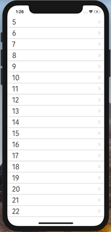
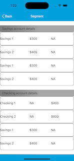

                                  


SegmentedUI Properties
======================

The properties for the Segment widget are:

* * *


<details close markdown="block"><summary>accessibilityConfig Property</summary>

* * *

Enables you to control accessibility behavior and alternative text for the widget.

For more information on using accessibility features in your app, see the [Accessibility](../../../Iris/app_design_dev/Content/Accessibility_Overview.md) appendix in the VoltMX IrisUser Guide.

### Syntax

```

accessibilityConfig
```

### Type

Object

### Read/Write

Read + Write

### Remarks

*   The accessibilityConfig property is enabled for all the widgets which are supported under the Flex Layout.

> **_Note:_** From VoltMX Iris V9 SP2 GA version, you can provide i18n keys as values to all the attributes used inside the `accessibilityConfig` property. Values provided in the i18n keys take precedence over values provided in `a11yLabel`, `a11yValue`, and `a11yHint` fields.

The accessibilityConfig property is a JavaScript object which can contain the following key-value pairs.

  
| Key | Type | Description | ARIA Equivalent |
| --- | --- | --- | --- |
| a11yIndex | Integer with no floating or decimal number. | This is an optional parameter. Specifies the order in which the widgets are focused on a screen. | For all widgets, this parameter maps to the `aria-index`, `index`, or `taborder` properties. |
| a11yLabel | String | This is an optional parameter. Specifies alternate text to identify the widget. Generally the label should be the text that is displayed on the screen. | For all widgets, this parameter maps to the `aria-labelledby` property of ARIA in HTML. > **_Note:_** For the Image widget, this parameter maps to the **alt** attribute of ARIA in HTML. |
| a11yValue | String | This is an optional parameter. Specifies the descriptive text that explains the action associated with the widget. On the Android platform, the text specified for a11yValue is prefixed to the a11yHint. | This parameter is similar to the a11yLabel parameter. If the a11yValue is defined, the value of a11yValue is appended to the value of a11yLabel. These values are separated by a space. |
| a11yHint | String | This is an optional parameter. Specifies the descriptive text that explains the action associated with the widget. On the Android platform, the text specified for a11yValue is prefixed to the a11yHint. | For all widgets, this parameter maps to the `aria-describedby` property of ARIA in HTML. |
| a11yHidden | Boolean | This is an optional parameter. Specifies if the widget should be ignored by assistive technology. The default option is set to _false_. This option is supported on iOS 5.0 and above, Android 4.1 and above, and SPA | For all widgets, this parameter maps to the `aria-hidden` property of ARIA in HTML. |
| a11yARIA | Object | This is an optional parameter. For each widget, the key and value provided in this object are added as the attribute and value of the HTML tags respectively. Any values provided for attributes such as `aria-labelledby` and `aria-describedby` using this attribute, takes precedence over values given in `a11yLabel` and `a11yHint` fields. When a widget is provided with the following key value pair or attribute using the a11yARIA object, the tabIndex of the widget is automatically appended as zero.`{"role": "main"}``aria-label` | This parameter is only available on the Desktop Web platform. |

Android limitations

*   If the results of the concatenation of a11y fields result in an empty string, then `accessibilityConfig` is ignored and the text that is on widget is read out.
*   The soft keypad does not gain accessibility focus during the right/left swipe gesture when the keypad appears.

SPA/Desktop Web limitations

*   When `accessibilityConfig` property is configured for any widget, the `tabIndex` attribute is added automatically to the `accessibilityConfig` property.
*   The behavior of accessibility depends on the Web browser, Web browser version, Voice Over Assistant, and Voice Over Assistant version.
*   Currently SPA/Desktop web applications support only a few ARIA tags. To achieve more accessibility features, use the attribute a11yARIA. The corresponding tags will be added to the DOM as per these configurations.

### Example 1

This example uses the button widget, but the principle remains the same for all widgets that have an accessibilityConfig property.

```
//This is a generic property that is applicable for various widgets.
//Here, we have shown how to use the accessibilityConfig Property for button widget.
/*You need to make a corresponding use of the accessibilityConfig property for other applicable widgets.*/

Form1.myButton.accessibilityConfig = {
    "a11yLabel": "Label",
    "a11yValue": "Value",
    "a11yHint": "Hint"    
};
```

### Example 2

This example uses the button widget to implement internationalization in `accessibilityConfig` property, but the principle remains the same for all widgets.

```
/*Sample code to implement internationalization in accessibilityConfig property in Native platform.*/

Form1.myButton.accessibilityConfig = {
    "a11yLabel": voltmx.i18n.getLocalizedString("key1")     
};  
/*Sample code to implement internationalization in accessibilityConfig property in Desktop Web platform.*/

Form1.myButton.accessibilityConfig = {
    "a11yLabel": "voltmx.i18n.getLocalizedString(\"key3\")"
};
```

### Platform Availability

*   Available in the IDE
*   iOS, Android, SPA, and Desktop Web

* * *

</details>
<details close markdown="block"><summary>alternateRowSkin Property</summary>

* * *

Specifies the skin that is applied to every alternate _even numbered_ row in the segment.

### Syntax

```

alternateRowSkin
```

### Type

String

### Read/Write

Read + Write

### Remarks

For example, if you have 5 segments, the alternate row skin is applied to segments 2 and 4.

If you delete any even segment using the method [removeAt](Segment_Methods.md#removeAt), the odd indexes will reset and become even. The Alternate skin is applied to these new even indexes.  
For example, if you have 5 segments and you delete segment 2, the odd indexes reset and segment 3 becomes segment 2 and the alternate skin is applied to it.

### Example

```
//Sample code to define the alternateRowSkin property for Segment.
frmSegment.mySegment.alternateRowSkin="alternateSkin";
```

### Platform Availability

*   Available in the IDE
*   Available on all platforms

* * *

</details>
<details close markdown="block"><summary>anchorPoint Property</summary>

* * *

Specifies the anchor point of the widget bounds rectangle using the widget's coordinate space.

### Syntax

```

anchorPoint
```

### Type

JSObject

### Read/Write

Read + Write

### Remarks

The value for this property is a JavaScript dictionary object with the keys "x" and "y". The values for the "x" and "y" keys are floating-point numbers ranging from 0 to 1. All geometric manipulations to the widget occur about the specified point. For example, applying a rotation transform to a widget with the default anchor point causes the widget to rotate around its center.

The default value for this property is center ( {"x":0.5, "y":0.5} ), that represents the center of the widgets bounds rectangle. The behavior is undefined if the values are outside the range zero (0) to one (1).

### Example

```
Form1.widget1.anchorPoint = {
    "x": 0.5,
    "y": 0.5
};
```

### Platform Availability

*   iOS, Android, Windows, and SPA

* * *

</details>
<details close markdown="block"><summary>animateFocusChanges Property</summary>

* * *

This property is used to bring the row specified in the selectedRowIndex property to the visible region.

### Syntax

```

animateFocusChanges
```

### Type

Boolean

### Read/Write

Read + Write

### Remarks

*   If you set the animateFocusChanges property as true, the row specified in the [selectedRowIndex](#selected) property moves to the viewable area on the screen with animation. This property is supported for all the values of the property [viewtype](#viewType).
*   If you set the animateFocusChanges property as false, the selected row moves to the viewable area without animation.

### Example

```
frmHome.seg.animateFocusChanges = true;
```

### Platform Availability

Not available in the IDE.

*   iOS

* * *

</details>
<details close markdown="block"><summary>autogrowMode Property (Deprecated)</summary>

* * *

The autogrowMode property is deprecated in 6.0.3 release. The autogrowMode property is used to set the height of a widget dynamically based on the derived height of the widget’s content, or from the child widget’s contents. The options are:

*   voltmx.flex.AUTOGROW\_NONE (value is 0)
*   voltmx.flex.AUTOGROW\_HEIGHT (value is 1)

### Syntax

```

autogrowMode
```

### Type

Number

### Read/Write

Read only

### Remarks

> **_Note:_** If you want to configure this property in VoltMX Iris, configure the height property of FlexContainer as preferred, then VoltMX Iris generates the autogrowMode property as voltmx.flex.AUTOGROW\_HEIGHT.

The default value for this property is voltmx.flex.AUTOGROW\_NONE.

> **_Note:_** If one or all the child widgets height or other properties such as centerY, top, bottom, minHeight or maxHeight are used in determining the height given in percentage (%), then the autogrowMode property will not work for the FlexContainer and its height fallback to default configuration value.

Rules and priorities of autogrowMode property

*   The autogrowMode property is ignored if the height of the widget is computable either through explicit value or implicit calculation.
    
*   If the autogrowMode property is configured as voltmx.flex.AUTOGROW\_HEIGHT, then preferredSize (based on content or child widgets ) is computed, and min/max constraints are applied.
*   If the autogrowMode property is configured as voltmx.flex.AUTOGROW\_NONE, the default value is applied with min/max constraints.
*   The height of a FlexContainer widget will not grow dynamically if the height of any widget changes because of the change in widget's skin state (such as from normal to focus).
*   If a widgets top value is given in negative values, then the widget is clipped in case of Free Form and overlapped on the previous widget in case of Flow Vertical.
*   The autogrowMode property is not supported for a FlexContainer widget that is placed inside an HBox or a VBox.
*   For example, a FlexContainer (flexA) has a FlexContainer (flexB), which is not set to grow dynamically, whose clipBounds is set to false. The children of flexB that are out of the bounds of flexB do not have any effect on the height of flexA. Only the heights of direct children of flexA will decide the height of flexA.
*   In templates, FlexContainer will grow only in SegmentedUI Table View only. In all other views, autogrowMode property is not supported.
*   The autogrowMode property for a FlexContainer is not supported in the Tab Widget.
*   In the Windows 10 platform, the autogrowMode property of a SegmentedUI is not supported inside a FlexContainer.
*   In the Android platform, the autogrowMode property of a SegmentedUI with a large number of rows leads to performance and memory issues.
*   When animating the height property of the child widget of a FlexContainer in iOS, Windows, and SPA platforms, after the animation is complete, then parent containers height increases based on the value provided in 100th step when fillMode is configured as voltmx.anim.FILL\_MODE\_FORWARDS.
*   When animating the height property of the child widget of a FlexContainer in the Android platform, the parent container's height grows along with the child widget's height.

When to Use

*    If the height of the FlexContainer is dependent on the heights of the child widgets that are added.
*   If you are using the FlexContainer in a SegmentedUI template, where each row of the SegmentedUI row height is dependent on the child widgets content. Configure the height property of the FlexContainer as preferred, then VoltMX Iris generates the autogrowMode property as voltmx.flex.AUTOGROW\_HEIGHT.

### Example

Setting the autogrowMode property on an existing widget

```

//widget will use the set height flex property to derive height
frmHome.autogrow1.autogrowMode=voltmx.flex.AUTOGROW_NONE;

//widget will use the widget contents or child widget contents to derive height
frmHome.autogrow1.autogrowMode=voltmx.flex.AUTOGROW_HEIGHT;
```

### Platform Availability

Not available in the IDE.

*   iOS
*   Android
*   Windows
*   SPA

* * *

</details>
<details close markdown="block"><summary>border Property</summary>

* * *

Specifies the border to the SegmentedUI.

### Syntax

```

border
```

### Type

Number

### Read/Write

Read + Write

### Remarks

The default value for this property is SEGUI\_BORDER\_BOTH\_BOTTOM\_TOP.

The available options are:

*   SEGUI\_BORDER\_NONE: The border is not displayed on the segment.
*   SEGUI\_BORDER\_TOP\_ONLY: The border is displayed on top of the segment.
*   SEGUI\_BORDER\_BOTTOM\_ONLY: The border is displayed at the bottom of the segment.
*   SEGUI\_BORDER\_BOTH\_BOTTOM\_TOP: The border is displayed on top and bottom of the segment.

This property is applicable only when the segment viewType is set to SEGUI\_VIEW\_TYPE\_TABLE\_VIEW.

To set the value through code, prefix the option with _constants._ such as _**constants.<option>**_.

### Example

```
//Sample code to define border property for a Segment widget.
frmSegment.mySegment.border=constants.SEGUI_BORDER_TOP_ONLY;
```

### Platform Availability

*   Available in the IDE
*   Server side Mobile Web (basic)
*   Server side Mobile Web (BJS)
*   Server side Mobile Web (advanced)
*   SPA

* * *

</details>
<details close markdown="block"><summary>bottom Property</summary>

* * *

This property determines the bottom edge of the widget and is measured from the bottom bounds of the parent container.

The bottom property determines the position of the bottom edge of the widget’s bounding box. The value may be set using DP (Device Independent Pixels), Percentage, or Pixels. In freeform layout, the distance is measured from the bottom edge of the parent container. In flow-vertical layout, the value is ignored. In flow-horizontal layout, the value is ignored.

The bottom property is used only if the Height property is not provided.

### Syntax

```

bottom
```

### Type

String

### Read/Write

Read + Write

### Remarks

The property determines the bottom edge of the widget and is measured from the bottom bounds of the parent container.

If the layout Type is set as voltmx.flex.FLOW\_VERTICAL, the bottom property is measured from the top edge of bottom sibling widget. The vertical space between two widgets is measured from bottom of the top sibling widget and the top of the bottom sibling widget.

### Example

```
//Sample code to set the bottom property for widgets by using DP, Percentage and Pixels.
frmHome.widgetID.bottom = "50dp";

frmHome.widgetID.bottom = "10%";

frmHome.widgetID.bottom = "10px";
```

### Platform Availability

*   Available in the IDE
*   iOS, Android, Windows, SPA , and Desktop Web

* * *

</details>
<details close markdown="block"><summary>bounces Property</summary>

* * *

Specifies whether the scroll view bounces past the edge of the content and back again.

### Syntax

```

bounces
```

### Type

Boolean

### Remarks

The default value for this property is true.

If set to _false,_ the scroll view bounce is not applied.

If set to _true,_ the scroll view bounce is applied.

This property is applicable only when the segment viewType is set to SEGUI\_VIEW\_TYPE\_TABLE\_VIEW.

### Example

```
//Sample code to enable bounces property for a Segment widget.
frmSegment.mySegment.bounces=true;
```

### Platform Availability

*   Available in the IDE
*   iOS and SPA

* * *

</details>
<details close markdown="block"><summary>centerX Property</summary>

* * *

This property determines the center of a widget measured from the left bounds of the parent container.

The centerX property determines the horizontal center of the widget’s bounding box. The value may be set using DP (Device Independent Pixels), Percentage, or Pixels. In freeform layout, the distance is measured from the left edge of the parent container. In flow-vertical layout, the distance is measured from the left edge of the parent container. In flow-horizontal layout, the distance is measured from the right edge of the previous sibling widget in the hierarchy.

### Syntax

```

centerX
```

### Type

String

### Read/Write

Read + Write

### Remarks

If the layout Type is set as voltmx.flex.FLOW\_HORIZONTAL, the centerX property is measured from right edge of the left sibling widget.

### Example

```
//Sample code to set the centerX property for widgets by using DP, Percentage and Pixels.
frmHome.widgetID.centerX = "50dp";

frmHome.widgetID.centerX = "10%";

frmHome.widgetID.centerX = "10px";
```

### Platform Availability

*   Available in the IDE
*   iOS, Android, Windows, SPA, and Desktop Web

* * *

</details>
<details close markdown="block"><summary>centerY Property</summary>

* * *

This property determines the center of a widget measured from the top bounds of the parent container.

The centerY property determines the vertical center of the widget’s bounding box. The value may be set using DP (Device Independent Pixels), Percentage, or Pixels. In freeform layout, the distance is measured from the top edge of the parent container. In flow-horizontal layout, the distance is measured from the top edge of the parent container. In flow-vertical layout, the distance is measured from the bottom edge of the previous sibling widget in the hierarchy.

### Syntax

```

centerY
```

### Type

String

### Read/Write

Read + Write

### Remarks

If the layout Type is set as voltmx.flex.FLOW\_VERTICAL, the centerY property is measured from bottom edge of the top sibling widget.

### Example

```
//Sample code to set the centerY property for widgets by using DP, Percentage and Pixels.
frmHome.widgetID.centerY = "50dp";

frmHome.widgetID.centerY = "10%";

frmHome.widgetID.centerY = "10px";
```

### Platform Availability

*   Available in the IDE
*   iOS, Android, Windows, SPA, and Desktop Web

* * *

</details>
<details close markdown="block"><summary>contentInsetAdjustmentType Property</summary>

* * *

On scroll view, the contentInsetAdjustmentBehaviour property automatically adds the required SegmentedUI insets to the scroll view. This automatic addition of insets occurs when the content in the scroll view is not in the safe area and if the value is set to constants.CONTENTINSET\_ADJUSTMENT\_AUTOMATIC.

As specified later, this property plays an important role in various iPhone X layout scenarios.

### Syntax

```

contentInsetAdjustmentType
```

### Type

Constant (Number)

### Read/Write

Read + Write

Constants exposed to JsWorld

*   constants. CONTENTINSET\_ADJUSTMENT\_AUTOMATIC: Automatically adjusts the SegmentedUI insets.
    
*   constants.CONTENTINSET\_ADJUSTMENT\_SCROLLABLEAXES: Adjusts the SegmentedUI insets in only scrollable directions.
    
*   constants.CONTENTINSET\_ADJUSTMENT\_NEVER: Does not adjust the SegmentedUI insets.
    
*   constants.CONTENTINSET\_ADJUSTMENT\_ALWAYS: Always includes the SegmentedUI insets in content adjustment.
    

Default Value

*   constants. CONTENTINSET\_ADJUSTMENT\_NEVER
    

iPhone X Layout Scenario

If you want to position the Segment in the lower unsafe area of iPhone X, you must enable the extendBottom property for the form. In that scenario, if you want to view the entire Segment as a whole after scrolling, you must set the contentInsetAdjustmentType property to constants.CONTENTINSET\_ADJUSTMENT\_AUTOMATIC.

In all other cases, you must set the contentInsetAdjustmentType property to its default value of constants.CONTENTINSET\_ADJUSTMENT\_NEVER.

When the extendBottom property for the form is set to true, the relevant states of the iPhone X layout are as follows:

**State 1**: Before scrolling


State 2: After scrolling; with contentInsetAdjustmentType = constants.CONTENTINSET\_ADJUSTMENT\_NEVER


**State 3**: After scrolling; with contentInsetAdjustmentType = constants.CONTENTINSET\_ADJUSTMENT\_AUTOMATIC



### Example

```
function setContentInsetAdjustmentType(){
     Form1.SegmentInForm1.contentInsetAdjustmentType = constants.CONTENTINSET_ADJUSTMENT_AUTOMATIC;
}

```

### Platform Availability

*   iOS 11 and later
*   Not available in the IDE

* * *

</details>
<details close markdown="block"><summary>contentOffsetMeasured Property</summary>

* * *

This property returns the current coordinates of the top left corner of the scrollable region in the segment.

### Syntax

```

contentOffsetMeasured
```

### Type

JavaScript Object

### Read/Write

Read only

### Remarks

Returns the following key:value pairs:

{x:valueInDP, y:valueInDP}

The values are numbers that represent device pixels (DP).

Limitation

If the Image widget has preferred height and if the image source is from the network, i.e., **src**, the contentOffsetMeadured property does not turn on.

The segment widget reuses row-templates. Rows which move out of the screen stop downloading the image and that affects the height calculation of the row height.

### Example

```

var offset = frmHome.seg.contentOffsetMeasured;
voltmx.print (“contentOffsetMeasured:” + frmHome.seg.contentOffsetMeasured);
```

### Platform Availability

*   Available in the IDE
*   iOS
*   Android

* * *

</details>
<details close markdown="block"><summary>cursorType Property</summary>

* * *

In Desktop Web applications, when you hover the mouse over any widget, a mouse pointer appears. Using the cursorType property in Iris, you can specify the type of the mouse pointer.

### Syntax

```

cursorType
```

### Type

String.

You must provide valid CSS cursor value such as wait, grab, help, etc. to the cursorType property.

### Read/Write

Read + Write

### Remarks

To add the `cursorType` property using VoltMX Iris in a Desktop Web application, follow these steps.

1.  In VoltMX Iris, open the Desktop Web application. From the **Project** explorer, expand **Responsive Web/ Desktop**\> **Forms** and select the form to which you need to make the changes.
2.  On the canvas, select the widget for which you want to specify the cursor type. For example, button.
3.  From the **Properties** panel, navigate to the **Skin** tab > **Hover Skin** tab.  
    You will find that the details of the hover skin is not enabled here.
4.  Check the **Enable** option to add a hover skin to your widget.  
    The details and configurations of the hover skin is enabled.
5.  Under the **General** section, for the Platform option, click the ellipsis icon.  
    The **Fork Skin** window appears.
6.  In the **Fork Skin** window, for **Desktop**, check under **HTML5 SPA**.
7.  Click **Ok**. You have successfully forked your hover skin for Desktop Web application.  
    You can see that the **Cursor Type** property has been added under the **General** section.
8.  Select a value from the drop-down list to set the **Cursor Type** for the widget.

### Example

```
 //This is a generic property and is applicable for many widgets.  
  
/*The example provided is for the Button widget. Make the required changes in the example while using other widgets.*/
  
frmButton.myButton.cursorType = "wait";

```

### Platform Availability

*   Available in IDE
*   Desktop Web

* * *

</details>
<details close markdown="block"><summary>data Property</summary>

* * *

Specifies the set of values that must be displayed on each row of the segment.

### Syntax

```

data
```

### Type

Array

### Read/Write

Read + Write

### Remarks

The data is categorized into Sections and Rows. The Sections information is optional. You can set the data in three different formats.

*   Format1: Set the data without any sections.
*   Format 2: Set the data with sections where section header is a name.
*   Format 3: Set the data with sections where header is driven by template.

The below table explains the type and description of template key:

<table style="width: 100%;mc-table-style: url('Resources/Stylesheets/Basic.css');border-top-left-radius: 0px;border-top-right-radius: 0px;border-bottom-right-radius: 0px;border-bottom-left-radius: 0px;border-left-style: solid;border-left-width: 2px;border-left-color: #000000;border-right-style: solid;border-right-width: 2px;border-right-color: #000000;border-top-style: solid;border-top-width: 2px;border-top-color: #000000;border-bottom-style: solid;border-bottom-width: 2px;border-bottom-color: #000000;margin-left: 0;margin-right: auto;" class="TableStyle-Basic" cellspacing="0"><colgroup><col style="width: 121px;" class="TableStyle-Basic-Column-Column1"> <col style="width: 124px;" class="TableStyle-Basic-Column-Column1"> <col class="TableStyle-Basic-Column-Column1"> <col style="width: 331px;" class="TableStyle-Basic-Column-Column1"></colgroup><tbody><tr class="TableStyle-Basic-Body-Body1"><td style="font-weight: bold;color: #ffffff;background-color: #005386;text-align: center;" class="TableStyle-Basic-BodyE-Column1-Body1">Key</td><td style="font-weight: bold;color: #ffffff;background-color: #005386;text-align: center;" class="TableStyle-Basic-BodyE-Column1-Body1">Key</td><td style="font-weight: bold;color: #ffffff;background-color: #005386;text-align: center;" class="TableStyle-Basic-BodyE-Column1-Body1">Type</td><td style="font-weight: bold;color: #ffffff;background-color: #005386;text-align: center;" class="TableStyle-Basic-BodyD-Column1-Body1">Comments</td></tr><tr class="TableStyle-Basic-Body-Body1"><td class="TableStyle-Basic-BodyB-Column1-Body1">template</td><td class="TableStyle-Basic-BodyB-Column1-Body1">Not Applicable</td><td class="TableStyle-Basic-BodyB-Column1-Body1">JavaScript: Object</td><td class="TableStyle-Basic-BodyA-Column1-Body1">Indicates the template to be used for the specific row</td></tr></tbody></table>

### Example

```
//Sample code to define data property for a Segment widget.
frmSegment.mySegment.data = [{
 "dataId1": "data1",
 "dataId2": "data2",
 "dataId3": "data3",
 "accessibilityConfig": "acObject"
}, {
 "dataId1": "datax",
 "dataId2": "datay",
 "dataId3": "dataz",
 "template": "box1",
 "accessibilityConfig": "acObject"
}];
```

### Example of Format 1

```
[{
    "dataId1": "foo",
    "dataId2": "foo",
    "dataId3": "foo",
    "accessibilityConfig": "acObject"
}, {
    "dataId1": "bar",
    "dataId2": "bar",
    "dataId3": "bar",
    "template": "boxRef2",
    "accessibilityConfig": "acObject"
}, {
    "dataId1": "bar",
    "dataId2": "bar",
    "dataId3": {
        "isVisible" :true,
      "skin" : "nskin",
      "focusSkin": "fskin",
      "text" : "Foo"
    },
    "accessibilityConfig": "acObject"
}]
```

In the above example, **template** is the standard key which can be optionally to override the common rowTemplate provided with a specific template for the row. For template always the value has to be valid box reference, if not it falls back to the common rowTemplate. **mentainfo** is another standard key which can be used to specify meta information about the row. iOS specific standard parameters that **metainfo** can support are _clickable, skin and editmode_.

In the above examples, the values of dataId1, dataId2 are shown as string, but dataId3 is key value pair. The key value pair format allows you to set the properties specific to the widget. In the above example, you are setting the _isVisible_ property to true and **text** property to "Foo", **skin** property with ID nskin and **focusSkin** to a skin with ID fskin. If a string is provided, typically is mapped to the **text** property for button and labels and the _src_ property for the image.

### Example of Format 2

```
/*set the data with sections where section header is a name. 
This example has two sections and each section with two rows.*/
[
    ["section1", [{
        "dataId1": "foo",
        "dataId2": "foo",
        "dataId3": "foo",
        "accessibilityConfig": "acObject"
    }, {
        "dataId1": "bar",
        "dataId2": "bar",
        "dataId3": "bar",
        "accessibilityConfig": "acObject"
    }], "acObject"],
    ["section2", [{
        "dataId1": "foo",
        "dataId2": "foo",
        "dataId3": "foo",
        "accessibilityConfig": "acObject"
    }, {
        "dataId1": "bar",
        "dataId2": "bar",
        "dataId3": "bar",
        "accessibilityConfig": "acObject"
    }], "acObject"]
]  

```

### Example of Format 3

```
/*set the data with sections where section header driven by template. This example has two sections and each section with two rows.*/
[
    [{
            "secDataId1": "",
            "secDataId2": "",
            "template": "secHeaderBoxRef2",
            "accessibilityConfig": "acObject"
        },
        [{
            "dataId1": "foo",
            "dataId2": "foo",
            "dataId3": "foo",
            "accessibilityConfig": "acObject"
        }, {
            "dataId1": "bar",
            "dataId2": "bar",
            "dataId3": "bar",
            "accessibilityConfig": "acObject"
        }]
    ],
    [{
            "secDataId1": "",
            "secDataId2": "",
            "template": "secHeaderBoxRef2",
            "accessibilityConfig": "acObject"
        },
        [{
            "dataId1": "foo",
            "dataId2": "foo",
            "dataId3": "foo",
            "accessibilityConfig": "acObject"
        }, {
            "dataId1": "bar",
            "dataId2": "bar",
            "dataId3": "bar",
            "accessibilityConfig": "acObject"
        }]
    ]
]
```

Use Components without Contract in Segment Templates

You can use components without contract inside Segment templates. You can map the child widgets of the component to a key in the [widgetDataMap](#widgetDa) property by using the dot operator.

The **data** property is then used to set the values that are to be displayed in the child widgets of the component. You can assign this set of values directly to the key or to the properties of the child widgets.

> **_Note:_** Segment Templates do not provide support for component with contract.

In the following example, after the mapping is done, the **data** property assigns value to the _Comp1lbl1_ and _Comp1Img1_ keys. This value is then assigned to the child widgets- _lbl1_ and _img1_ of the _segComp1_component.

```
/*In this example, segComp1 is the component with lbl1 and img1 as child widgets. Comp1lbl1, and Comp1Img1 are the keys.*/  
mySegment.widgetDataMap = {
 " template1": " template1",
 "segComp1.lbl1": "Comp1lbl1",
 "segComp1.img1": "Comp1Img1"
};
//There are two methods to assign data to the widgets inside the component.  
//Method One- assign directly by using the key  
mySegment.data = [{
  "comp1lbl1": "Row One",
  "comp1img1": "icon1.png"
 },
 {
  "comp1lbl1": "Row Two",
  "comp1img1": "icon2.png"
 }
];
//Method Two- assign to the properties of the child widgets
mySegment.data = [{
  "comp1lbl1": {
   "text": "Row One",
   "skin": "lblskn1"
  },
  "comp1img1": {
   "src": "icon1.png",
   "left": "100dp"
  }
 },
 {
  "comp1lbl1": {
   "text": "Row Two",
   "skin": "lblskn1"
  },
  "comp1img1": {
   "src": "icon2.png",
   "left": "10dp"
  }
 }
];  

```

> **_Note:_** When components are rendered inside a Segment template, the events and gestures assigned to the child widgets of the components are retained.

### Platform Availability

*   Available in the IDE
*   Available on all platforms

* * *

</details>
<details close markdown="block"><summary>defaultSelection Property</summary>

* * *

Specifies if the first clickable element (Image or Label) of the segment is selected by default.

### Syntax

```

defaultSelection
```

### Type

Boolean

### Read/Write

Read + Write

### Remarks

The default value for this property is true.

If set to _false,_ the default selection is not applied.

If set to _true,_ the default selection is applied.

This property is applicable only when the segment viewType is set to SEGUI\_VIEW\_TYPE\_TABLE\_VIEW.

### Example

```
//Sample code to enable defaultSelection Property for a Segment widget
frmSegment.mySegment.defaultSelection=true;
```

### Platform Availability

*   Available in the IDE
*   Server side Mobile Web (basic)
*   Server side Mobile Web (BJS)

* * *

</details>
<details close markdown="block"><summary>displayType Property</summary>

* * *

The displayType property specifies the display type of segmentPageView, either in PivotView or FlipView.

### Syntax

```

displayType
```

### Type

Constant

### Read/Write

Read + Write

### Remarks

This property can be set for a Segment that is placed in either a flex form or a vbox form.

The possible values for this property are:

*   SEGPAGE\_VIEW\_TYPE\_DEFAULT: The default value of this property, dependent on the device where the application is running, such as FlipView for Windows 10.
*   SEGPAGE\_VIEW\_TYPE\_PHONE: The rows of the segment appear in PivotView. The pivot must be swiped to view the rows.
*   SEGPAGE\_VIEW\_TYPE\_TABLET: The rows of the segment appear in FlipView. The arrows must be clicked to view the rows.

### Example

```
//Sample code to define displayType property for a Segment widget
frmSegment.mySegment.displayType=constants.SEGPAGE_VIEW_TYPE_PHONE;
```

### Platform Availability

Windows

* * *

</details>
<details close markdown="block"><summary>dockSectionHeaders Property</summary>

* * *

The docking header property enables you to dock or place the section header at the top of the segment while scrolling the section content.

### Syntax

```

dockSectionHeaders
```

### Type

Boolean

### Read/Write

Read + Write

### Remarks

If you are scrolling the segment data, the next section header will be docked on top of the segment.

This property is applicable only when the segment is a screenLevelWidget and viewType is set to SEGUI\_VIEW\_TYPE\_TABLE\_VIEW and has sections data.

For example, If you scroll the segment data shown in the figure below, as the segment data scrolls up, the **Savings account details** docked header moves out of view and is replaced with the **Checking account details** section header which is now docked.


The default value for this property is false.

> **_Important:_** When the segment height is given as preferred, the property is not supported.

If set to _false,_ the section header is not docked.

If set to _true,_ the section header is docked.

### Example

```
//Sample code to enable dockSectionHeaders property for a Segment widget

frmSegment.mySegment.dockSectionHeaders=true;
```

### Platform Availability

*   Available in the IDE
*   Available on Android platforms only

* * *

</details>
<details close markdown="block"><summary>editStyle Property</summary>

* * *

Specifies the editing style to be applied to the rows in the SegmentedUI.

### Syntax

```

editStyle
```

#### Type

Number

### Read/Write

Read + Write

### Remarks

The default value for this property is SEGUI\_EDITING\_STYLE\_NONE.

Following are the available options:

*   SEGUI\_EDITING\_STYLE\_ICON: An icon will be displayed on the left hand side of each row.
*   SEGUI\_EDITING\_STYLE\_SWIPE: A delete or insert button will be shown on the right hand side of each row when the user performs a SWIPE gesture on the row. Whether an insert button or delete button is to be shown is controlled by the editmode property that is set using the data property of the SegmentedUI.
*   SEGUI\_EDITING\_STYLE\_NONE: No special edit styles are applied.

This property is applicable only when the segment viewType is set to SEGUI\_VIEW\_TYPE\_TABLE\_VIEW.

To set the value through code, prefix the option with _constants._ such as _**constants.<option>**_.

For information regarding the Meta Info that can be set for the rows, see [Methods](Segment_Methods.md#segmentedui-methods) associated with the segment.

If you want to enable Swipe to delete feature for a row in the SegmentedUI then set the editing style to constants.SEGUI.EDITING\_STYLE\_SWIPE (a delete confirmation appears when you swipe a row).

### Example

```
//Sample code to define editStyle property for a Segment widget

frmSegment.mySegment.editStyle= constants.SEGUI_EDITING_STYLE_SWIPE;
```

<!-- The following image illustrates the _Icon_ edit style: -->

**Icon Edit Style**


**Swipe Edit Style**


### Platform Availability

*   iPhone
*   iPad

* * *

</details>
<details close markdown="block"><summary>enable Property</summary>

* * *

The `enable` property is used to control the actionability of the widgets. In a scenario where you want to display a widget but not invoke any action on the widget, configure the `enable` property to false to achieve it.

This is a constructor level property and applicable for all widgets in VoltMX Iris.

### Syntax

```

nable
```

### Type

Boolean

### Read/Write

Read + Write

### Remarks

The default value of this property is true.

When `enable` property is configured to true, the action associated with a widget can be invoked by the user in the application.

When `enable` property is configured to false, the action associated with a widget cannot be invoked by the user in the application.

### Example

```
//This is a generic property and is applicable for many widgets.  
  
/*The example provided is for the Button widget. Make the changes required in the example while using other widgets.*/
  
frmButton.myBtn.enable= true;
```

### Platform Availability

*   Android, iOS, Windows, SPA, and Desktop web

 

* * *

</details>
<details close markdown="block"><summary>enableCache Property</summary>

* * *

The property enables you to improve the performance of Positional Dimension Animations.

### Syntax

```

enableCache
```

### Type

Boolean

### Read/Write

Read + Write

### Remarks

The default value for this property is true.

> **_Note:_** When the property is used, application consumes more memory. The usage of the property enables tradeoff between performance and visual quality of the content. Use the property cautiously.

### Example

```
Form1.widgetID.enableCache = true;
```

### Platform Availability

*   Available in the IDE.
*   Windows

* * *

</details>
<details close markdown="block"><summary>enableCloneControllerForRowTemplates Property</summary>

* * *

This property helps you to create multiple copies of the controller of a Segment row template.

When you set the value of this property as `true`, multiple copies of the row template controller is created. You can then use `this.view` to access a particular row and the row's data. When the value of this property is set as `false`, the multiple copies of the row template controller is not created.

### Syntax

```

enableCloneControllerForRowTemplates
```

### Type

Boolean

The default value of this property is false.

### Read/Write

Read + Write

### Example

```
/*Sample code to enable enableCloneControllerForRowTemplates property for a Segment widget.*/

frmSegment.mySegment.enableCloneControllerForRowTemplates = true;
```

### Platform Availability

*   Android

* * *

</details>
<details close markdown="block"><summary>enableDictionary Property</summary>

* * *

Specifies if dictionary must be enabled for easy navigation.

### Syntax

```

enableDictionary
```

### Type

Boolean

### Remarks

If the dictionary property is enabled, alphabets from A to Z appear on the screen and when you select any alphabet, all the corresponding results that start with the selected alphabet are displayed.

This property is applicable if screenLevelWidget property is set to true, viwType is set to SEGUI\_VIEW\_TYPE\_TABLE\_VIEW, and the section headers have been set.

The default value for this property is false.

If set to _true,_ the dictionary is available.

If set to _false,_ the dictionary is not available.

The following image illustrates the behavior of the Enable Dictionary property when set to _true_:


### Example

```
 //Sample code to enable enableDictionary property for a Segment widget

frmSegment.mySegment.enableDictionary=true;
```

### Platform Availability

*   Available in the IDE
*   iPhone
*   iPad

* * *

</details>
<details close markdown="block"><summary>enableHapticFeedback Property</summary>

* * *

Allows you to enable or disable haptic feedback on the Segment widget.

### Syntax

```

enableHapticFeedback
```

### Type

Boolean.  
If the enableHapticFeedback property is not specified, haptic feedback is not enabled on the Segment widget.

### Read/Write

Read + Write

### Remarks

*   The enableHapticFeedback property is supported for Segment widgets only when the onClick callback event is defined.
*   iOS
    
    *   The Haptic Feedback feature is available on iPhone 7 devices and later. These devices have Taptic Engine hardware and users can enable/disable Haptics from Device Settings-> Sounds & Haptics-> System Haptics.
        
*   Android
    *   Users can enable the Vibrate on touch feature from Settings-> Sound & notification-> Other sounds.
        
*   Windows
    *   Haptic Feedback is supported on Windows devices with OS build version 10.0.15063.0 or later.

### Example

```
//Sample code to set the enableHapticFeedback property on a Segment widget.
frmSegment.mySegment.enableHapticFeedback = true;
```

### Platform Availability

*   Android
*   iOS
*   Windows

* * *

</details>
<details close markdown="block"><summary>enableLazyLoad Property</summary>

* * *

This property helps you to enable the lazy loading capability for the rows of a Segment. When lazy loading is enabled for a segment, the data in the rows is loaded only when required. Lazy loading improves the performance of a segment as all the data is not loaded simultaneously.

> **_Important:_** The lazy loading feature is only available for Segments present in a Responsive Web App that is built in the CSS Library mode (with the **Enable JS Library Mode (Legacy)** option disabled in the Project Settings). If the **Enable JS Library Mode (Legacy)** option is enabled for the app, the lazy loading feature does not work at run-time, and the [loadingPlaceholderImage](#loadingPlaceholderImage) property does not appear.

When you set the value of this property as `true`, lazy loading is enabled for the segment, by default.

> **_Note:_** Support for this property has been introduced in the VoltMX Iris V9 Service Pack 2 Fix Pack 7 release.

### Syntax

```

enableLazyLoad
```

### Type

Boolean

The default value of this property is false.

### Read/Write

Read + Write

### Example

```
/*Sample code to enable enableLazyLoad property for a Segment widget.*/

frmSegment.mySegment.enableLazyLoad = true;
```

### Remarks

As lazy loading only loads selective segment rows, the row animations and the onRowDisplay event callbacks are only triggered for the segment rows that are loaded.

When lazy loading is enabled, a default loading image is displayed when users scroll through the segment. Developers can use the [loadingPlaceholderImage](#loadingPlaceholderImage) property to display a desired image as the background (in place of the default background image).

### Platform Availability

*   Responsive Web

* * *

</details>
<details close markdown="block"><summary>enableReordering Property</summary>

* * *

The property allows you enable or disable reordering the rows in a Segment.

### Syntax

```

enableReordering
```

### Type

Boolean

### Read/Write

Read + Write

### Remarks

To allow users to reorder (drag and drop) the rows in a segment, set the property to true. The reordering of the rows works only when the segment's view type is table view. To do so, set the [viewType](#viewType) property as SEGUI\_VIEW\_TYPE\_TABLEVIEW.

### Example

Setting the enableReordering property on an existing widget

```
form1.Sgmnt1.enableReordering = true;
```

### Platform Availability

*   Available in the IDE
*   Android
*   iOS

* * *

</details>
<details close markdown="block"><summary>groupCells Property</summary>

* * *

Specifies if all the rows in the segment should grouped using a rounded corner background and border.

### Syntax

```

groupCells
```

### Type

Boolean

### Remarks

The default value for this property is true.

If set to _false,_ the cells will not have rounded border.

If set to _true,_ the cells will have a rounded border.



<!--  -->

### Example

```
//Sample code to enable groupCells property for a Segment widget

frmSegment.mySegment.groupCells= true;
```

### Platform Availability

*   Available in the IDE
*   Available on all platforms except Desktop Web and Server side Mobile Web platforms

* * *

</details>
<details close markdown="block"><summary>height Property</summary>

* * *

It determines the height of the widget and measured along the y-axis.

The height property determines the height of the widget’s bounding box. The value may be set using DP (Device Independent Pixels), Percentage, or Pixels. For supported widgets, the height may be derived from either the widget or container’s contents by setting the height to “preferred”.

### Syntax

```

height
```

### Type

Number, String, and Constant

### Read/Write

Read + Write

### Remarks

Following are the available measurement options:

*   %: Specifies the values in percentage relative to the parent dimensions.
*   px: Specifies the values in terms of device hardware pixels.
*   dp: Specifies the values in terms of device independent pixels.
*   default: Specifies the default value of the widget.
*   voltmx.flex.USE\_PREFERED\_SIZE: When this option is specified, the layout uses preferred height of the widget as height and preferred size of the widget is determined by the widget and may varies between platforms.

### Example

```
//Sample code to set the height property for widgets by using DP, Percentage and Pixels.
frmHome.segment1.height="50dp";

frmHome.segment1. height="10%";

frmHome.segment1. height="10px";

```

### Platform Availability

*   Available in the IDE
*   iOS
*   Android
*   Windows
*   SPA

* * *

</details>
<details close markdown="block"><summary>id Property</summary>

* * *

A unique identifier of Segment consisting of alpha numeric characters. Every Segment should have a unique id within a Form.

### Syntax

```

id
```

### Type

String

### Read/Write

Read only

### Example

```
//Defining the properties for a Segment with id:"segId".
var segBasic = {
    **id**: "segment",
    isVisible: true,
    widgetSkin: "widSkin",
    rowSkin: "rowSkn",
    rowFocusSkin: "rowFSkn",
    alternateRowSkin: "altSkin",
    sectionHeaderSkin: "secHSkin",
    widgetDataMap: {
        widgetId1: "dataid1",
        widgetId2: "dataId2",
        widgetId3: "dataId3",
        widgetId4: "secDataId1",
        widgetId5: "secDataId2"
    },
    rowTemplate: box1
};

var segLayout = {
    padding: [5, 5, 5, 5],
    margin: [5, 5, 5, 5]
};

var segPSP = {};

//Creating the Segment.
var segment = new voltmx.ui.SegmentedUI2(segBasic, segLayout, segPSP);

//Reading the id of the SegmentedUI.
voltmx.print("SegmentedUI Id ::" + segment.id);
```

### Platform Availability

*   Available in the IDE
*   Available on all platforms

* * *

</details>
<details close markdown="block"><summary>indicator Property</summary>

* * *

Specifies the indicator type as _rowSelect_, _rowClick_, or _none_.

### Syntax

```

indicator
```

### Type

Number

### Remarks

Based on your selection, the behavior is exhibited:

The default value for this property is SEGUI\_ROW\_SELECT.

The available options are:

*   SEGUI\_ROW\_SELECT: Specifies the disclosure indicator. The indicator appears as follows:


> If the user selects the indicator, the related content appears in the next screen .

*   SEGUI\_ROW\_CLICK: Specifies the detail button. The button appears as follows:


> If the user selects the detail button, the detailed content appears.  

----
 
> **_Note:_** Below indicator property types are supported from 9.5.30

*   SEGUI\_ROW\_CLICKANDSELECT: Specifies the detail and disclosure button. <br>The button appears as follows:


> If the user selects the detail or disclosure button, the detailed content appears.

*   SEGUI\_ROW\_CHECK: Specifies the check button.The button appears as follows:


> If the user selects the check button, the detailed content appears.

*   SEGUI_NONE: No indicator or button is displayed.

To set the value through code, prefix the option with constants. such as <b>constants..</b>

### Example

```
//Sample code to set indicator property for a Segment widget

frmSegment.mySegment.indicator=constants.SEGUI_ROW_CLICK;
```

### Platform Availability

*   Available in the IDE
*   iPhone
*   iPad

* * *

</details>
<details close markdown="block"><summary>info Property</summary>

* * *

A custom JSObject with the key value pairs that a developer can use to store the context with the widget.

### Syntax

```

info
```

### Type

JSObject

### Read/Write

Read + Write

### Remarks

This will help in avoiding the globals to most part of the programming.

This is a **non-Constructor** property. You cannot set this property through widget constructor. But you can read and write data to it.

Info property can hold any JSObject. After assigning the JSObject to info property, the JSObject should not be modified.

### Example

```
var inf = {
    a: 'hello'
};
widget.info = inf; //works
widget.info.a = 'hello world';
//This will not update the widget info a property to Hello world. 
//widget.info.a will have old value as hello.
```

```
//Sample code to set info property for a Segment widget

frmSegment.mySegment.info = {
    key: "segmentobjects"
};

//Reading the info of the Segment widget.
voltmx.print("SegmentedUI info ::" +frmSegment.mySegment.info);
```

### Platform Availability

*   Available in the IDE
*   Available on all platforms

* * *

</details>
<details close markdown="block"><summary>isMaster Property</summary> 

* * *

Specifies whether the container is a master container.

### Syntax

```

isMaster
```

### Type

Boolean

### Read/Write

Read Only after initialization.

### Remarks

If the `isMaster` property is true, the current widget is a master container and all of the rules and limitations of master containers apply to it. For more information, please see [Masters](Masters.md) in the Overviews section of this guide, as well as [Using Masters](../../../Iris/iris_user_guide/Content/Introduction.md) in the [Iris User Guide](../../../Iris/iris_user_guide/Content/Introduction.md).

Your app can set the `isMaster` property in this container's constructor. After that, this property is read-only.

### Example

```

var isMasterContainer = segContainer1.isMaster;
```

### Platform Availability

*   Available in the IDE (except for form/popup)
*   Available on all platforms

* * *

</details>
<details close markdown="block"><summary>isVisible Property</summary> 

* * *

This property controls the visibility of a widget on the form.

### Syntax

```

isVisible
```

### Type

Boolean

### Read/Write

Read + Write

### Remarks

The default value for this property is true.

If set to _false,_ the widget is not displayed.

If set to _true,_ the widget is displayed.

### Example

```
//Sample code to set isVisible property for a Segment widget
frmSegment.mySegment.isVisible=true;
```

> **_Note:_** You can set the visibility of a widget dynamically from code using the setVisibility method.

### Platform Availability

*   Available in the IDE (except for form/popup)
*   Available on all platforms

* * *

</details>
<details close markdown="block"><summary>left Property</summary>

* * *

This property determines the lower left corner edge of the widget and is measured from the left bounds of the parent container.

The left property determines the position of the left edge of the widget’s bounding box. The value may be set using DP (Device Independent Pixels), Percentage, or Pixels. In freeform layout, the distance is measured from the left edge of the parent container. In flow-vertical layout, the distance is measured from the left edge of the parent container. In flow-horizontal layout, the distance is measured from the right edge of the previous sibling widget in the hierarchy.

### Syntax

```

left
```

### Type

String

### Read/Write

Read + Write

### Remarks

If the layoutType is set as voltmx.flex.FLOW\_HORIZONTAL, the left property is measured from right edge of the left sibling widget.

### Example

```
//Sample code to set the left property for widgets by using DP, Percentage and Pixels.
frmHome.widgetID.left = "50dp";

frmHome.widgetID.left = "10%";

frmHome.widgetID.left = "10px";
```

### Platform Availability

*   Available in the IDE
*   iOS, Android, Windows, SPA, and Desktop Web

* * *

</details>
<details close markdown="block"><summary>loadingPlaceholderImage</summary> 

* * *

Specifies the image to be used as a background to indicate that the rows are loading while the user scrolls through the segment at a fast pace.

> **_Note:_** Support for this property has been introduced in the VoltMX Iris V9 Service Pack 2 Fix Pack 7 release.

### Syntax

```

loadingPlaceholderImage
```

### Type

String

### Read/Write

Read + Write

### Remarks

The following image formats are supported:

*   .png
*   .gif
*   .svg

### Example

```
//Sample code to assign Loading Placeholder Image property of a Segment widget
frmSegment.mySegment.loadingPlaceholderImage = "loader.gif";
```

### Remarks

The lazy loading feature is only available for Segments present in a Responsive Web App that is built in the CSS Library mode (with the **Enable JS Library Mode (Legacy)** option disabled in the Project Settings). If the **Enable JS Library Mode (Legacy)** option is enabled for the app, the lazy loading feature does not work at run-time, and the [loadingPlaceholderImage](#loadingPlaceholderImage) property does not appear.

### Platform Availability

Available in the IDE

*   Responsive Web

* * *

</details>
<details close markdown="block"><summary>maxHeight Property</summary>

* * *

This property specifies the maximum height of the widget and is applicable only when the height property is not specified.

The maxHeight property determines the maximum height of the widget’s bounding box. The value may be set using DP (Device Independent Pixels), Percentage, or Pixels. The maxHeight value overrides the preferred, or “autogrow” height, if the maxHeight is less than the derived content height of the widget.

### Syntax

```

maxHeight
```

### Type

Number

### Read/Write

Read + Write

### Example

```
//Sample code to set the maxHeight property for widgets by using DP, Percentage and Pixels.
frmHome.widgetID.maxHeight = "50dp";

frmHome.widgetID.maxHeight = "10%";

frmHome.widgetID.maxHeight = "10px";
```

### Platform Availability

*   Available in the IDE
*   iOS, Android, Windows, SPA, and Desktop Web

* * *

</details>
<details close markdown="block"><summary>maxWidth Property</summary>

* * *

This property specifies the maximum width of the widget and is applicable only when the width property is not specified.

The Width property determines the maximum width of the widget’s bounding box. The value may be set using DP (Device Independent Pixels), Percentage, or Pixels. The maxWidth value overrides the preferred, or “autogrow” width, if the maxWidth is less than the derived content width of the widget.

### Syntax

```

maxWidth
```

### Type

Number

### Read/Write

Read + Write

### Example

```
//Sample code to set the maxWidth property for widgets by using DP, Percentage and Pixels.
frmHome.widgetID.maxWidth = "50dp";

frmHome.widgetID.maxWidth = "10%";

frmHome.widgetID.maxWidth = "10px";
```

### Platform Availability

*   Available in the IDE
*   iOS, Android, Windows, SPA, and Desktop Web

* * *

</details>
<details close markdown="block"><summary>metaInfo Property</summary>

* * *

Allows to capture row level attributes.

### Syntax

```

metaInfo
```

### Type

JS Object

### Read/Write

Read + Write

### Remarks

<table style="width: 100%;mc-table-style: url('Resources/Stylesheets/Basic.css');border-top-left-radius: 0px;border-top-right-radius: 0px;border-bottom-right-radius: 0px;border-bottom-left-radius: 0px;border-left-style: solid;border-left-width: 2px;border-left-color: #000000;border-right-style: solid;border-right-width: 2px;border-right-color: #000000;border-top-style: solid;border-top-width: 2px;border-top-color: #000000;border-bottom-style: solid;border-bottom-width: 2px;border-bottom-color: #000000;margin-left: 0;margin-right: auto;" class="TableStyle-Basic" cellspacing="0"><colgroup><col style="width: 124px;" class="TableStyle-Basic-Column-Column1"> <col class="TableStyle-Basic-Column-Column1"> <col style="width: 331px;" class="TableStyle-Basic-Column-Column1"></colgroup><tbody><tr class="TableStyle-Basic-Body-Body1"><td style="font-weight: bold;color: #ffffff;background-color: #005386;text-align: center;" class="TableStyle-Basic-BodyE-Column1-Body1">Key</td><td style="font-weight: bold;color: #ffffff;background-color: #005386;text-align: center;" class="TableStyle-Basic-BodyE-Column1-Body1">Type</td><td style="font-weight: bold;color: #ffffff;background-color: #005386;text-align: center;" class="TableStyle-Basic-BodyD-Column1-Body1">Comments</td></tr><tr class="TableStyle-Basic-Body-Body1"><td class="TableStyle-Basic-BodyE-Column1-Body1">clickable</td><td class="TableStyle-Basic-BodyE-Column1-Body1">JavaScript: Boolean</td><td class="TableStyle-Basic-BodyD-Column1-Body1">Specifies if the row is clickable and supported by all platforms.</td></tr><tr class="TableStyle-Basic-Body-Body1"><td class="TableStyle-Basic-BodyE-Column1-Body1">editMode ( in JS)</td><td class="TableStyle-Basic-BodyE-Column1-Body1">JavaScript: Number <u>Possible values</u> constants.SEGUI_EDIT_MODE_INSERT ( displays a "+" icon on the left handside of the row) constants.SEGUI_EDIT_MODE_DELETE ( displays a "-" icon on the left handside of the row)</td><td class="TableStyle-Basic-BodyD-Column1-Body1">eidtMode is only applicable if the <b>editStyle</b> has been set to either constants.SEGUI_EDITING_STYLE_ICON or constants.SEGUI_EDITING_STYLE_SWIPE If the editMode property is not specified for a row then it is not enabled for editing (even though an <b>editStyle</b> has been set). constants.SEGUI_EDIT_MODE_INSERT is not applicable for constants.SEGUI_EDITING_STYLE_SWIPE</td></tr><tr class="TableStyle-Basic-Body-Body1"><td class="TableStyle-Basic-BodyE-Column1-Body1">editModeCustomConfig</td><td class="TableStyle-Basic-BodyE-Column1-Body1">JavaScript: Object ### Example: <tt>metaInfo: {editModeCustomConfig :[{title:"custom edit", backgroundColor:"0xff000000", callback: Callback object},{title:"custom edit1", backgroundColor:"0xffff0000", callback: Callback object1},…]}</tt> &nbsp;</td><td class="TableStyle-Basic-BodyD-Column1-Body1">The editModeCustomConfig property defines a single action to present when the user swipes horizontally on a row. When user performs a horizontal swipe in a row, by default, the Delete button is displayed. To delete the row by clicking on this button, in the associated callback, you need to write the segment.removeAt function. This configuration lets you define one or more custom actions to display for a given row. Each instance of this configuration represents a single action to perform and includes the text, formatting information, and behavior for the corresponding button. Set the editMode as constants.SEGUI_EDIT_MODE_DELETE to get the canned swipe as delete behavior by configuring a new property. Parameters: title - Specify a title for the button. backgroundColor - Optional. By default, red color is set. callback - Optional. Callback signature is:<code>function mycallbcak (widgetHandle, section, row)</code></td></tr><tr class="TableStyle-Basic-Body-Body1"><td class="TableStyle-Basic-BodyE-Column1-Body1"><a name="enableScrolling"></a>enableScrolling</td><td class="TableStyle-Basic-BodyE-Column1-Body1">Boolean ### Example: <tt>metaInfo:{"enableScrolling":false}</tt></td><td class="TableStyle-Basic-BodyD-Column1-Body1">Allows you enable or disable the vertical scrolling of a page added as a row inside the Segment Widget. By default, the property is set to true. <span class="autonumber"><span><b><i><span style="color: #0a9c4a;" class="mcFormatColor">Note: </span></i></b></span></span>The enableScrolling parameter is applicable only when the <a href="#viewType" class="selected">viewType</a> property is set to SEGUI_VIEW_TYPE_PAGEVIEW. Sample Code: <tt>var seg = new voltmx.ui.SegmentedUI2({"data": [{ "metaInfo":{"enableScrolling":true}}],"viewType": constants.SEGUI_VIEW_TYPE_PAGEVIEW //which is required});</tt></td></tr><tr class="TableStyle-Basic-Body-Body1"><td class="TableStyle-Basic-BodyB-Column1-Body1">skin</td><td class="TableStyle-Basic-BodyB-Column1-Body1">JavaScript: Object</td><td class="TableStyle-Basic-BodyA-Column1-Body1">ID of the skin that needs to be applied to the entire row.</td></tr></tbody></table>

### Example

```
Form3.seg1.data = {
    metaInfo: {
        editModeCustomConfig: [{
            title: "custom edit",
            backgroundColor: "0xff000000",
            callback: "Callback_object"
        }, {
            clickable: true
        }]
    }
};
```

### Platform Availability

*   Available in the IDE
*   Available on all platforms

* * *

</details>
<details close markdown="block"><summary>minHeight Property</summary>

* * *

This property specifies the minimum height of the widget and is applicable only when the height property is not specified.

The minHeight property determines the minimum height of the widget’s bounding box. The value may be set using DP (Device Independent Pixels), Percentage, or Pixels. The minHeight value overrides the preferred, or “autogrow” height, if the minHeight is larger than the derived content height of the widget.

### Syntax

```

minHeight
```

### Type

Number

### Read/Write

Read + Write

### Example

```
//Sample code to set the minHeight property for widgets by using DP, Percentage and Pixels.
frmHome.widgetID.minHeight = "50dp";

frmHome.widgetID.minHeight = "10%";

frmHome.widgetID.minHeight = "10px";
```

### Platform Availability

*   Available in the IDE
*   iOS, Android, Windows, SPA, and Desktop Web

* * *

</details>
<details close markdown="block"><summary>minWidth Property</summary>

* * *

This property specifies the minimum width of the widget and is applicable only when the width property is not specified.

The minWidth property determines the minimum width of the widget’s bounding box. The value may be set using DP (Device Independent Pixels), Percentage, or Pixels. The minWidth value overrides the preferred, or “autogrow” width, if the minWidth is larger than the derived content width of the widget.

### Syntax

```

minWidth
```

### Type

Number

### Read/Write

Read only

### Example

```
//Sample code to set the minWidth property for widgets by using DP, Percentage and Pixels.
frmHome.widgetID.minWidth = "50dp";

frmHome.widgetID.minWidth = "10%";

frmHome.widgetID.minWidth = "10px";
```

### Platform Availability

*   Available in the IDE
*   iOS, Android, Windows, SPA, and Desktop Web

* * *

</details>
<details close markdown="block"><summary>needPageIndicator Property</summary>

* * *

A Page Indicator is a succession of docs centered below the SegmentedUI widget.

### Syntax

```

needPageIndicator
```

### Type

Boolean

### Read/Write

Read + Write

### Remarks

Each dot corresponds to a row segment with the white dot indicating the currently viewed page.

Specifies if the page indicator must be displayed when a segment is dispalayed using pageView. This property is available only when the viewType is selected as pageView.

The default value for this property is true.

If set to _false,_ the page indicator is not displayed.

If set to _true,_ the page indicator is displayed.

### Example

```
//Sample code to set needPageIndicator property for a Segment widget
frmSegment.mySegment.needPageIndicator=true;
```

### Platform Availability

*   Available in the IDE
*   Available on all platforms

* * *

</details>
<details close markdown="block"><summary>orientation Property</summary>

* * *

Specifies how you can stack the widgets within the SegmentedUI. You can set the orientation of the SegmentedUI as _horizontal_ or _vertical_.

### Syntax

```

orientation
```

### Type

Number

### Read/Write

Read only

### Remarks

The default value for this property is BOX\_LAYOUT\_HORIZONTAL.

The available options are:

*   BOX\_LAYOUT\_HORIZONTAL: Enables you to stack the content within the SegmentedUI horizontally.
*   BOX\_LAYOUT\_VERTICAL: Enables you to stack the content within the SegmentedUI vertically.

To set the value through code, prefix the option with _constants._ such as _**constants.<option>**_.

### Example

```
//Sample code to set orientation property for a Segment widget as BOX_LAYOUT_HORIZONTAL.
frmSegment.mySegment.orientation=constants.BOX_LAYOUT_HORIZONTAL;
   
```

### Platform Availability

*   Available in the IDE
*   Available on all platforms.

* * *

</details>
<details close markdown="block"><summary>opacity Property</summary>

* * *

Specifies the opacity of the widget. The value of this property must be in the range 0.0 (transparent) to 1.0 (opaque). Any values outside this range are fixed to the nearest minimum or maximum value.

Specifies the opacity of the widget. Valid opacity values range from 0.0 (transparent), to 1.0 (opaque). Values set to less than zero will default to zero. Values more than 1.0 will default to 1. Interaction events set on a transparent widget will still be fired. To disable the events, also set the “isVisible” property to “false”.

### Syntax

```

opacity
```

### Type

Number

### Read/Write

Read + Write

### Remarks

> **_Note:_** This property has more priority compared to the values coming from the configured skin.

### Example

```
//Sample code to make the widget transparent by using the opacity property.
frmHome.widgetID.opacity = 0;

//Sample code to make the widget opaque by using the opacity property.
frmHome.widgetID.opacity = 1;
```

### Platform Availability

*   Not available in the IDE.
*   iOS, Android, Windows, SPA, and Desktop Web

* * *

</details>
<details close markdown="block"><summary>parent Property</summary>

* * *

Helps you access the parent of the widget. If the widget is not part of the widget hierarchy, the parent property returns null.

### Syntax

```

parent
```

### Read/Write

Read only

### Remarks

> **_Note:_** The property works for all the widgets inside a FlexForm, FlexContainer or FlexScrollContainer.

### Example

```
function func() {

    voltmx.print("The parent of the widget" + JSON.stringify(Form1.widgetID.parent));

}
```

### Platform Availability

*   Not available in the IDE
*   iOS, Android, Windows, SPA, and Desktop Web

* * *

</details>
<details close markdown="block"><summary>pageOnDotImage Property</summary>

* * *

Specifies the image to indicate that the page is currently being viewed.

### Syntax

```

pageOnDotImage
```

### Type

String / image Object

### Read/Write

Read + Write

### Remarks

This property is available only when the [viewType](#viewType) is selected as pageview. By default a white dot indicates the currently viewed page.

You can create an image Object by using voltmx.image Namespace 
functions.


* iOS - The image size should be 7x7 px for non-retina devices, and 14x14 px for retina devices.

* On iOS 14 (and later) devices, the page control displays an opaque version of the image provided for the pageOnDotImage, without the colors. Support to apply colors to page dots has been provided by the iOS native platform and can be implemented in Volt MX Iris by using the pageOnTintColor property in the preShow event.The default color for the pageOnTintColor is an opaque white dot.

> **_Note:_** Support for the pageOnTintColor Property is available from the following releases:<br><br>
Volt MX Iris V9 ServicePack2 Fixpack 54</br>

When the Segment is rendered, the size of the dots is decided by the size of the image provided for the pageOnDotImage property. The width and height of the page dot is the same as the resolution of the image passed as the input. If you do not provide an image, the default dot is displayed. To display a dot with a custom size, the image for the dot must be set in the widget properties.


### Example

Using a string to define a local image resource:

```
//Sample code to assign pageOnDotImage property of a Segment widget with dot.png.
frmSegment.mySegment.pageOnDotImage="dot.png";
```

Using an image object (voltmx.image) to specify the pageOnDotImage image

```

var imgObjRef = voltmx.image.createImage("local.png");
var segment = new voltmx.ui.SegmentedUI2(segBasic, segLayout, segPSP);
segment.pageOnDotImage=imgObjRef;
if (this.view.seg.viewType == constants.SEGUI_VIEW_TYPE_PAGEVIEW) {
this.view.seg.pageOnTintColor = "ffb812";
}
```

### Platform Availability


*   Available in the IDE
*   iOS
*   Android
*   Windows

* * *

</details>
<details close markdown="block"><summary>pageOffDotImage Property</summary>

* * *
Specifies the image to indicate that the page is currently not being viewed. 


### Syntax

```

pageOffDotImage
```

### Type

String / image Object

### Read/Write

Read + Write

### Remarks

This property is available only when the [viewType](#viewType) is selected as pageview. By default a black/grey dot indicates the currently viewed page.

You can create an image Object by using volt mx.image Namespace functions.

* iOS - The image size should be 7x7 px for non-retina devices, and 14x14 px for retina devices.

* On iOS 14 (and later) devices, the page control displays an opaque version of the image provided for the pageOffDotImage, without the colors. Support to apply colors to page dots has been provided by the iOS native platform and can be implemented in Volt MX Iris by using the pageOffTintColor property in the preShow event.
The default color for the pageOffTintColor is a translucent white (or gray) dot.


> **_Note:_** Support for the pageOffTintColor property is available from the following releases:<br><br>
Volt MX Iris V9 ServicePack2 Fixpack 54</br>

When the Segment is rendered, the size of the dots is decided by the size of the image provided for the pageOffDotImage property. The width and height of the page dot is the same as the resolution of the image passed as the input. If you do not provide an image, the default dot is displayed. To display a dot with a custom size, the image for the dot must be set in the widget properties.


### Example

Using a string to define a local image resource:

```
//Sample code to assign pageOnDotImage property of a Segment widget with off.png.
frmSegment.mySegment.pageOffDotImage="off.png";
```

Using an image object (voltmx.image) to set pageOffDotImage:

```

var imgObjRef = voltmx.image.createImage("local.png");
var segment = new voltmx.ui.SegmentedUI2(segBasic, segLayout, segPSP);
segment.pageOffDotImage=imgObjRef;
if (this.view.seg.viewType == constants.SEGUI_VIEW_TYPE_PAGEVIEW) {
this.view.seg.pageOffTintColor = "bababa";
}

```

### Platform Availability


*   Available in the IDE
*   iOS
*   Android
*   Windows

* * *

</details>
<details close markdown="block"><summary>pageSkin Property</summary>

* * *

Specifies the skin for page indicator. This property is applicable only when the viewType is set as SEGUI\_VIEW\_TYPE\_PAGEVIEW.

### Syntax

```

pageSkin
```

### Type

String

### Read/Write

Read + Write

### Remarks

Use the pageSkin property to customize the color of the Segment Indicator for a segment with Page View. By default, the page indicator is displayed with a black background color.

To change the default black background color page indicator, use the below code snippet in form preshow. You can change the black background color to any desired color by creating skin manually for any widget and assigning that skin to the segment page indicator as shown below.

In case you want to change the color of the dots on the Segment page indicator, use images on pageOnDotImage and pageOffDotImage in segment widget as per your requirement.

### Example

```
frmSegment.mySegment.pageSkin="skinName";  

```

### Platform Availability

*   iOS

* * *

</details>
<details close markdown="block"><summary>pressedSkin Property</summary>

* * *

Specifies the skin to indicate that the row of the segment is pressed or clicked.

### Syntax

```

pressedSkin
```

### Type

String

### Read/Write

Read + Write

### Remarks

If you do not specify the _pressedSkin_, the rowFocusSkin is applied.

### Example

```
//Sample code to assign value to the pressedSkin property for a Segment widget. frmSegment.mySegment.pressedSkin="pressedSkn";  

```

### Platform Availability

*   Available in the IDE
*   This property is available on Android only

* * *

</details>
<details close markdown="block"><summary>progressIndicatorColor Property</summary>

* * *

Specifies the color of the progress indicator as white or grey.

### Syntax

```

progressIndicatorColor
```

### Type

Number

### Remarks

The default for this property is PROGRESS\_INDICATOR\_COLOR\_WHITE.

The available options are:

*   PROGRESS\_INDICATOR\_COLOR\_WHITE: The progress indicator is white in color
*   PROGRESS\_INDICATOR\_COLOR\_GREY: The progress indicator is grey in color

To set the value through code, prefix the option with _constants._ such as _**constants.<option>**_.

### Example

```
/*Sample code to define the properties for a Segment with 
progressIndicatorColor:constants.PROGRESS_INDICATOR_COLOR_GREY.*/
frmSegment.mySegment.progressIndicatorColor=constants.PROGRESS_INDICATOR_COLOR_GREY;
```

### Platform Availability

*   Available in the IDE
*   iPhone
*   iPad

* * *

</details>
<details close markdown="block"><summary>pullToRefreshI18NKey Property</summary>

* * *

Specifies the i18N key for "pull to refresh" title.

### Syntax

```

pullToRefreshI18NKey
```

### Type

String

### Read/Write

Read + Write

### Remarks

The platforms get the value from the existing application locale specific i18N resource bundle. If the key is not found in the resource bundle, then platforms use the default (english locale) title text.

This property is supported when the viewType is set as SEGUI\_VIEW\_TYPE\_TABLEVIEW and the property screenLevelWidget is set to true.

### Example

```
Form1.mySegment.pullToRefreshI18NKey= "Pull To Refresh";
```

### Platform Availability

*   Available in the IDE
*   Available on all platforms except Desktop WebF and Server side Mobile Web platforms

* * *

</details>
<details close markdown="block"><summary>pullToRefreshSkin Property</summary>

* * *

Specifies the skin to be applied to the pull to refresh title.

### Syntax

```

pullToRefreshSkin
```

### Type

String

### Read/Write

Read + Write

### Remarks

This property does not support image as background.

This property is supported when the viewType is set as SEGUI\_VIEW\_TYPE\_TABLEVIEW and the property screenLevelWidget is set to true.

Following are the skin definition properties:

*   font\_weight
*   font\_style
*   font\_size
*   font\_color
*   font\_name
*   background\_color
*   bg\_type
*   background\_style

> **_Note:_** The "release to refresh" title picks the skin of "pull to refresh" or "release to refresh" respectively.

### Example

```
Form3.seg1.pullToRefreshSkin="segPullSkin"; 
/*Here segPullSkin is a skin created as a 
Pull refresh skin under Skins Tab->segment*/
```

### Platform Availability

*   Available in the IDE
*   Available on all platforms except Desktop Web and Server side Mobile Web platforms

* * *

</details>
<details close markdown="block"><summary>pushToRefreshI18NKey Property</summary>

* * *

Specifies the i18N key for "push to refresh" title.

### Syntax

```

pushToRefreshI18NKey
```

### Type

String

### Read/Write

Read + Write

### Remarks

The platforms get the value from the existing application locale specific i18N resource bundle. If the key is not found in the resource bundle, then platforms use the default (english locale) title text.

This property is supported when the viewType is set as SEGUI\_VIEW\_TYPE\_TABLEVIEW and the property screenLevelWidget is set to true.

### Example

```
Form1.mySegment.pushToRefreshI18NKey= "Push To Refresh";
```

### Platform Availability

*   Available in the IDE
*   Available on all platforms except Desktop Web and Server side Mobile Web platforms

* * *

</details>
<details close markdown="block"><summary>pushToRefreshSkin Property</summary>

* * *

Specifies the skin to be applied to the push to refresh title.

### Syntax

```

pushToRefreshSkin
```

### Type

String

### Read/Write

Read + Write

### Remarks

This property does not support image as background.

This property is supported when the viewType is set as SEGUI\_VIEW\_TYPE\_TABLEVIEW and the property screenLevelWidget is set to true.

Following are the skin definition properties:

*   font\_weight
*   font\_style
*   font\_size
*   font\_color
*   font\_name
*   background\_color
*   bg\_type
*   background\_style

> **_Note:_** The "release to refresh" title picks the skin of "pull to refresh" or "release to refresh" respectively.

### Example

```
Form3.seg1.pushToRefreshSkin="segPushSkin"; 
/*Here segPullSkin is a skin created as a 
Push refresh skin under Skins Tab->segment*/
```

### Platform Availability

*   Available in the IDE
*   Available on all platforms except Desktop Web and Server side Mobile Web platforms

* * *

</details>
<details close markdown="block"><summary>releaseToPullRefreshI18NKey Property</summary>

* * *

Specifies the i18N key for "release to refresh" title that appears for pull to refresh.

### Syntax

```

releaseToPullRefreshI18NKey
```

### Type

String

### Read/Write

Read + Write

### Remarks

The platforms get the value from the existing application locale specific i18N resource bundle. If the key is not found in the resource bundle, then platforms use the default (english locale) title text.

This property is supported when the viewType is set as SEGUI\_VIEW\_TYPE\_TABLEVIEW and the property screenLevelWidget is set to true.

### Example

```
Form1.mySegment.releaseToPullRefreshI18NKey = "Release To Refresh";
```

### Platform Availability

*   Available in the IDE
*   Available on all platforms except Desktop Web and Server side Mobile Web platforms

* * *

</details>
<details close markdown="block"><summary>releaseToPushRefreshI18NKey Property</summary>

* * *

Specifies the i18N key for "release to refresh" title that appears for push for refresh.

### Syntax

```

releaseToPushRefreshI18NKey
```

### Type

String

### Read/Write

Read + Write

### Remarks

The platforms get the value from the existing application locale specific i18N resource bundle. If the key is not found in the resource bundle, then platforms use the default (english locale) title text.

This property is supported when the viewType is set as SEGUI\_VIEW\_TYPE\_TABLEVIEW and screenLevelWidget is set to true.

### Example

```
Form1.mySegment.releaseToPushRefreshI18NKey = "Release To Refresh";
```

### Platform Availability

*   Available in the IDE
*   Available on all platforms except Desktop Web and Server side Mobile Web platforms

* * *

</details>
<details close markdown="block"><summary>retainContentAlignment Property</summary>

* * *

This property is used to retain the content alignment property value, as it was defined.

> **_Note:_** Locale-level configurations take priority when invalid values are given to this property, or if it is not defined.

The mirroring widget layout properties should be defined as follows.

```
function getIsFlexPositionalShouldMirror(widgetRetainFlexPositionPropertiesValue) {
    return (isI18nLayoutConfigEnabled &&
    localeLayoutConfig[defaultLocale]
    ["mirrorFlexPositionalProperties"] == true &&
    !widgetRetainFlexPositionPropertiesValue);
}
```

The following table illustrates how widgets consider Local flag and Widget flag values.

  
| Properties | Local Flag Value | Widget Flag Value | Action |
| --- | --- | --- | --- |
| Mirror/retain FlexPositionProperties | true | true | Use the designed layout from widget for all locales. Widget layout overrides everything else. |
| Mirror/retain FlexPositionProperties | true | false | Use Mirror FlexPositionProperties since locale-level Mirror is true. |
| Mirror/retain FlexPositionProperties | true | not specified | Use Mirror FlexPositionProperties since locale-level Mirror is true. |
| Mirror/retain FlexPositionProperties | false | true | Use the designed layout from widget for all locales. Widget layout overrides everything else. |
| Mirror/retain FlexPositionProperties | false | false | Use the Design/Model-specific default layout. |
| Mirror/retain FlexPositionProperties | false | not specified | Use the Design/Model-specific default layout. |
| Mirror/retain FlexPositionProperties | not specified | true | Use the designed layout from widget for all locales. Widget layout overrides everything else. |
| Mirror/retain FlexPositionProperties | not specified | false | Use the Design/Model-specific default layout. |
| Mirror/retain FlexPositionProperties | not specified | not specified | Use the Design/Model-specific default layout. |

### Syntax

```

retainContentAlignment
```

### Type

Boolean

### Read/Write

No (only during widget-construction time)

### Example

```
//This is a generic property that is applicable for various widgets.
//Here, we have shown how to use the retainContentAlignment property for Button widget.
/*You need to make a corresponding use of the 
retainContentAlignment property for other applicable widgets.*/
var btn = new voltmx.ui.Button({
    "focusSkin": "defBtnFocus",
    "height": "50dp",
    "id": "myButton",
    "isVisible": true,
    "left": "0dp",
    "skin": "defBtnNormal",
    "text": "text always from top left",
    "top": "0dp",
    "width": "260dp",
    "zIndex": 1
}, {
    "contentAlignment": constants.CONTENT_ALIGN_TOP_LEFT,
    "displayText": true,
    "padding": [0, 0, 0, 0],
    "paddingInPixel": false,
    "retainFlexPositionProperties": false,
    "retainContentAlignment": true
}, {});
```

### Platform Availability

*   Available in IDE
*   Windows, iOS, Android, and SPA

* * *

</details>
<details close markdown="block"><summary>retainFlexPositionProperties Property</summary>

* * *

This property is used to retain flex positional property values as they were defined. The flex positional properties are left, right, and padding.

> **_Note:_** Locale-level configurations take priority when invalid values are given to this property, or if it is not defined.

The mirroring widget layout properties should be defined as follows.

```
function getIsFlexPositionalShouldMirror(widgetRetainFlexPositionPropertiesValue) {
    return (isI18nLayoutConfigEnabled &&
    localeLayoutConfig[defaultLocale]
    ["mirrorFlexPositionalProperties"] == true &&
    !widgetRetainFlexPositionPropertiesValue);
}
```

The following table illustrates how widgets consider Local flag and Widget flag values.

  
| Properties | Local Flag Value | Widget Flag Value | Action |
| --- | --- | --- | --- |
| Mirror/retain FlexPositionProperties | true | true | Use the designed layout from widget for all locales. Widget layout overrides everything else. |
| Mirror/retain FlexPositionProperties | true | false | Use Mirror FlexPositionProperties since locale-level Mirror is true. |
| Mirror/retain FlexPositionProperties | true | not specified | Use Mirror FlexPositionProperties since locale-level Mirror is true. |
| Mirror/retain FlexPositionProperties | false | true | Use the designed layout from widget for all locales. Widget layout overrides everything else. |
| Mirror/retain FlexPositionProperties | false | false | Use the Design/Model-specific default layout. |
| Mirror/retain FlexPositionProperties | false | not specified | Use the Design/Model-specific default layout. |
| Mirror/retain FlexPositionProperties | not specified | true | Use the designed layout from widget for all locales. Widget layout overrides everything else. |
| Mirror/retain FlexPositionProperties | not specified | false | Use the Design/Model-specific default layout. |
| Mirror/retain FlexPositionProperties | not specified | not specified | Use the Design/Model-specific default layout. |

### Syntax

```

retainFlexPositionProperties
```

### Type

Boolean

### Read/Write

No (only during widget-construction time)

### Example

```
//This is a generic property that is applicable for various widgets.
//Here, we have shown how to use the retainFlexPositionProperties property for Button widget.
/*You need to make a corresponding use of the 
retainFlexPositionProperties property for other applicable widgets.*/
var btn = new voltmx.ui.Button({
    "focusSkin": "defBtnFocus",
    "height": "50dp",
    "id": "myButton",
    "isVisible": true,
    "left": "0dp",
    "skin": "defBtnNormal",
    "text": "always left",
    "top": "0dp",
    "width": "260dp",
    "zIndex": 1
}, {
    "contentAlignment": constants.CONTENT_ALIGN_CENTER,
    "displayText": true,
    "padding": [0, 0, 0, 0],
    "paddingInPixel": false,
    "retainFlexPositionProperties": true,
    "retainContentAlignment": false
}, {});
```

### Platform Availability

*   Available in IDE
*   Windows, iOS, Android, and SPA

* * *

</details>
<details close markdown="block"><summary>retainFlowHorizontalAlignment Property</summary>

* * *

This property is used to convert Flow Horizontal Left to Flow Horizontal Right.

> **_Note:_** Locale-level configurations take priority when invalid values are given to this property, or if it is not defined.

The mirroring widget layout properties should be defined as follows.

```
function getIsFlexPositionalShouldMirror(widgetRetainFlexPositionPropertiesValue) {
    return (isI18nLayoutConfigEnabled &&
    localeLayoutConfig[defaultLocale]
    ["mirrorFlexPositionalProperties"] == true &&
    !widgetRetainFlexPositionPropertiesValue);
}
```

The following table illustrates how widgets consider Local flag and Widget flag values.

  
| Properties | Local Flag Value | Widget Flag Value | Action |
| --- | --- | --- | --- |
| Mirror/retain FlexPositionProperties | true | true | Use the designed layout from widget for all locales. Widget layout overrides everything else. |
| Mirror/retain FlexPositionProperties | true | false | Use Mirror FlexPositionProperties since locale-level Mirror is true. |
| Mirror/retain FlexPositionProperties | true | not specified | Use Mirror FlexPositionProperties since locale-level Mirror is true. |
| Mirror/retain FlexPositionProperties | false | true | Use the designed layout from widget for all locales. Widget layout overrides everything else. |
| Mirror/retain FlexPositionProperties | false | false | Use the Design/Model-specific default layout. |
| Mirror/retain FlexPositionProperties | false | not specified | Use the Design/Model-specific default layout. |
| Mirror/retain FlexPositionProperties | not specified | true | Use the designed layout from widget for all locales. Widget layout overrides everything else. |
| Mirror/retain FlexPositionProperties | not specified | false | Use the Design/Model-specific default layout. |
| Mirror/retain FlexPositionProperties | not specified | not specified | Use the Design/Model-specific default layout. |

### Syntax

```

retainFlowHorizontalAlignment
```

### Type

Boolean

### Read/Write

No (only during widget-construction time)

### Example

```
//This is a generic property that is applicable for various widgets.
//Here, we have shown how to use the retainFlowHorizontalAlignment property for Button widget.
/*You need to make a corresponding use of the 
retainFlowHorizontalAlignment property for other applicable widgets. */
var btn = new voltmx.ui.Button({
 "focusSkin": "defBtnFocus",
 "height": "50dp",
 "id": "myButton",
 "isVisible": true,
 "left": "0dp",
 "skin": "defBtnNormal",
 "text": "always left",
 "top": "0dp",
 "width": "260dp",
 "zIndex": 1
}, {
 "contentAlignment": constants.CONTENT_ALIGN_CENTER,
 "displayText": true,
 "padding": [0, 0, 0, 0],
 "paddingInPixel": false,
 "retainFlexPositionProperties": true,
 "retainContentAlignment": false,
 "retainFlowHorizontalAlignment ": false
}, {});
```

### Platform Availability

*   Available in IDE
*   Windows, iOS, Android, and SPA

* * *

</details>
<details close markdown="block"><summary>retainScrolledPage Property</summary>

* * *

This property helps you to maintain the same page when the Segment widget with the [viewType](#retainScrolledPage) property set as`SEGUI_VIEW_TYPE_PAGEVIEW` is reloaded.

### Syntax

```

retainScrolledPage
```

### Type

Boolean

The default value for this property is false.

If set to _true,_ the scrolled page is retained when the Segment widget is reloaded.

If set to _false,_ the scrolled page is not retained, when the Segment widget is reloaded.

### Read/Write

Read + Write

### Example

```
//Sample code to enable retainScrolledPage property for a Segment widget.
frmSegment.mySegment.retainScrolledPage=true;
```

### Platform Availability

*   iOS

* * *

</details>
<details close markdown="block"><summary>retainSelection Property</summary>

* * *

Specifies if the segment should retain the selection made even when the user navigates out of the form and revisits the form.

### Syntax

```

retainSelection
```

### Type

Boolean

### Read/Write

Read + Write

### Remarks

The default value for this property is false.

If set to _true,_ the selection is retained when the user navigates to different form.

If set to _false,_ the selection is not retailed.

The retainSelection property works only when segment viewType is TableView.

### Example

```
//Sample code to enable retainSelection property for a Segment widget.
frmSegment.mySegment.retainSelection=true;
```

### Platform Availability

*   Available in the IDE
*   iPad
*   iPhone
*   Android
*   SPA

* * *

</details>
<details close markdown="block"><summary>right Property</summary>

* * *

This property determines the lower right corner of the widget and is measured from the right bounds of the parent container.

The right property determines the position of the right edge of the widget’s bounding box. The value may be set using DP (Device Independent Pixels), Percentage, or Pixels. In freeform layout, the distance is measured from the left edge of the parent container. In flow-vertical layout, value is ignored. In flow-horizontal layout, the value is ignored.

The right property is used only if the width property is not provided.

### Syntax

```

right
```

### Type

String

### Read/Write

Read + Write

### Remarks

If the layout Type is set as voltmx.flex.FLOW\_HORIZONTAL, the right property is measured from left edge of the right sibling widget. The horizontal space between two widgets is measured from right of the left sibling widget and left of the right sibling widget.

### Example

```
//Sample code to set the right property for widgets by using DP, Percentage and Pixels.
frmHome.widgetID.right = "50dp";

frmHome.widgetID.right = "10%";

frmHome.widgetID.right = "10px";
```

### Platform Availability

*   Available in the IDE
*   iOS, Android, Windows, SPA, and Desktop Web

* * *

</details>
<details close markdown="block"><summary>rowFocusSkin Property</summary>

* * *

Specifies the skin that must be applied when user selects the row.

### Syntax

```

rowFocusSkin
```

### Type

String

### Read/Write

Read + Write

### Example

```
//Sample code to set the rowFocusSkin property for a Segment widget as rowFSkn.
frmSegment.mySegment.rowFocusSkin="rowFSkn";
```

### Platform Availability

*   Available in the IDE
*   Available on all platforms

* * *

</details>
<details close markdown="block"><summary>rowHeight Property</summary>

* * *

This property specifies the height of the row of a SegmentedUI.

### Syntax

```

rowHeight
```

### Type

Number

### Read/Write

Read + Write

### Remarks

Following are the options:

*   %: Specifies the values in percentage relative to the parent dimensions.
*   px: Specifies the values in terms of device hardware pixels.
*   dp: Specifies the values in terms of device independent pixels.
*   default: Specifies the default value of the widget.
*   voltmx.flex.USE\_PREFERED\_SIZE: When this option is specified, the layout uses preferred height of the widget as height. The preferred size of the widget is determined by the widget and may varies between platforms.

### Example

Setting the rowHeight property on an existing widget

```

//Using DP units
frmHome.seg1.rowHeight="50dp";

//Using Percentage
frmHome.seg1.rowHeight="10%";

//Using Pixels
frmHome.seg1.rowHeight="10px";
```

### Platform Availability

*   Available in the IDE
*   iOS
*   SPA

* * *

</details>
<details close markdown="block"><summary>rowSkin Property</summary>

* * *

Specifies the skin that must be applied for each row.

### Syntax

```

rowSkin
```

### Type

String

### Read/Write

Read + Write

### Example

```
//Sample code to set the rowSkin property for a Segment widget as rowSkn.
frmSegment.mySegment.rowSkin="rowSkn";
```

### Platform Availability

*   Available in the IDE
*   Available on all platforms

* * *

</details>
<details close markdown="block"><summary>rowTemplate Property</summary>

* * *

Indicates the common template to be used for each row while creating the row and filling the data.

### Syntax

```

rowTemplate
```

### Type

voltmx.ui.FlexContainer

### Read/Write

Read + Write

### Remarks

This can be overridden at the row level when setting the data using the **template** key.

On iOS platform, when a FlexContainer is used as a template for SegmentedUI, the layout properties are not applicable.

> **_Note:_** If you are switching between the templates of the segment, ensure that the widgetDataMap property is defined after the segment template is set. The mapping of the widgets needs to be refreshed after setting the template on a segment.

### Example

```
/*In this example, TempFlexContainer is the immediate child FlexContainer of a Segment Row Template.*/  
frmSegment.mySegment.rowTemplate = TempFlexContainer;  

```

### Platform Availability

*   Available in the IDE
*   Available on all platforms

* * *

</details>
<details close markdown="block"><summary>rowWidth Property</summary>

* * *

This property specifies the width of the row of a SegmentedUI.

### Syntax

```

rowWidth
```

### Type

Number

### Read/Write

Read + Write

### Remarks

Following are the options:

*   %: Specifies the values in percentage relative to the parent dimensions.
*   px: Specifies the values in terms of device hardware pixels.
*   dp: Specifies the values in terms of device independent pixels.
*   default: Specifies the default value of the widget.
*   voltmx.flex.USE\_PREFERED\_SIZE: When this option is specified, the layout uses preferred height of the widget as height. The preferred size of the widget is determined by the widget and may varies between platforms.

### Example

Setting the rowWidth property on an existing widget

```

//Using DP units
frmHome.seg1.rowWidth ="50dp";

//Using Percentage
frmHome.seg1.rowWidth ="10%";

//Using Pixels
frmHome.seg1.rowWidth ="10px";
```

### Platform Availability

*   Available in the IDE
*   iOS
*   SPA

* * *

</details>
<details close markdown="block"><summary>scrollsToTop Property</summary>

* * *

This property enables you to scroll the Segment to top on tapping a device’s status bar.

### Syntax

```

scrollsToTop
```

### Type

Boolean

### Read/Write

Read + Write

### Remarks

This property is supported only when the viewType is set as SEGUI\_VIEW \_TYPE\_TABLEVIEW or SEGUI\_VIEW \_TYPE\_PAGEVIEW.

The default value for this property is false.

If this property is true for more than one widget, then this property is not applied to any of the widgets.

### Example

```
//Sample code to enable the scrollsToTop property for a Segment widget. frmSegment.mySegment.scrollsToTop = true;  

```

### Platform Availability

*   iPhone
*   iPad

* * *

</details>
<details close markdown="block"><summary>searchBy Property</summary>

* * *

Indicates the identifier of the widget placed inside the row of the SegmentedUI.

### Syntax

```

searchBy
```

### Type

String

### Read/Write

Read + Write

### Remarks

Search will be performed against the content present inside the widget.

This property is applicable only when screenLevelWidget of SegmentedUI is set to _true_ preserve">var var viewType is set to SEGUI\_VIEW\_TYPE\_TABLE\_VIEW.

### Example

```
 /*Sample code to enable the searchBy property for a Segment widget with searchBy:"widgetId1".*/
frmSegment.mySegment.searchBy="widgetId1";
```

### Platform Availability

*   Available in the IDE
*   iPhone
*   iPad

* * *

</details>
<details close markdown="block"><summary>searchCriteria Property</summary>

* * *

Specifies the search criteria to be applied when searching has been enabled on the SegmentedUI.

### Syntax

```

searchCriteria
```

### Type

Number

### Read/Write

Read + Write

### Remarks

This property is applicable only when screenLevelWidget of SegmentedUI is set to true, viewType is set to SEGUI\_VIEW\_TYPE\_TABLE\_VIEW, and [searchBy](#searchBy) property has been set.

SEGUI\_SEARCH\_CRITERIA\_STARTSWITH

The available options are:

*   SEGUI\_SEARCH\_CRITERIA\_STARTSWITH: The search is performed on the strings that start with the input string.
*   SEGUI\_SEARCH\_CRITERIA\_ENDSWITH: The search is performed on the strings that end with the input string.
*   SEGUI\_SEARCH\_CRITERIA\_CONTAINS: The search is performed on the strings that contain the input string.

To set the value through code, prefix the option with _constants._ such as _**constants.<option>**_.

The following image illustrates the search with _startsWith_ criteria:


### Example

```
 /*Sample code to enable the searchCriteria property for a Segment widget with
searchCriteria:constants.SEGUI_SEARCH_CRITERIA_ENDSWITH */
frmSegment.mySegment.searchCriteria=constants.SEGUI_SEARCH_CRITERIA_ENDSWITH;
```

### Platform Availability

*   Available in the IDE
*   iPhone
*   iPad

* * *

</details>
<details close markdown="block"><summary>sectionHeaderSkin Property</summary>

* * *

Specifies the skin to be applied to the Section Header.

### Syntax

```

sectionHeaderSkin
```

### Type

String

### Read/Write

Read + Write

### Example

```
//Sample code to define the sectionHeaderSkin property for Segment.
frmSegment.mySegment.sectionHeaderSkin ="secHSkin";
```

### Platform Availability

Available in the IDE

Available on all platforms

* * *

</details>
<details close markdown="block"><summary>sectionHeaderTemplate Property</summary>

* * *

Specifies the common template to be used for each section while creating the section header and filling the data.

### Syntax

```

sectionHeaderTemplate
```

### Type

voltmx.ui.FlexContainer

### Read/Write

Read + Write

### Remarks

This is optional parameter and if not provided the default template provided by each platform will be used. It can also be provided at each section level when setting the data. Please refer [data](#data) property for examples.

When a Section Header is provided along with the rows/items, the Section Header is "clamped" to the top of the scrollable area (on the Form) as one scrolls through a long list of items (for example, if you have a long list of contacts that all begin with the letter "A", the "A" header will be fixed at the top until you scroll down past the last "A" item). This behavior can be clearly seen iPhone's Contacts application.  
  
This behavior of Section Headers is available on iOS and Android platform and is enabled when the [screenLevelWidget](#screenLe) has been set to true.

### Example

```
frmSegment.mySegment.sectionHeaderTemplate = template1
```

### Platform Availability

*   Available in the IDE
*   Available on all platforms

* * *

</details>
<details close markdown="block"><summary>selectedRowIndex Property</summary>

* * *

Indicates the currently selected row in single select or multi select modes in the SegmentedUI.

### Syntax

```

selectedRowIndex
```

### Type

Array

### Read/Write

Read + Write

### Remarks

The index is with respect to the order in which data is set with [data](#data) property.

Programmatically setting the selectedRow Index will not make any visible differences in the row, however it will bring the row at the index into the view able area on the screen.

Setting this value before the parent form is shown may result in the value not being changed. To avoid this you can set this value in the onDidFinishDataLoading callback for the SegmentUI widget.

Setting this value it to _null/nil_ clears the selection state and also sets the [selectedRowIndices](#selected2) to _null_ in cases where segui selection behavior is SEGUI\_SINGLE\_SELECT or SEGUI\_DEFAULT\_BEHAVIOR or SEGUI\_MULTI\_SELECT\_BEHAVIOR.

The selectedRowIndex is not updated when clicked on any child widget of a Row. For example, a Button or an HBox.

selectedRowIndex Array format:

```
[sectionIndex1, [rowIndex1],  
  
For example,  
[1,3] indicates 4th row in 2nd section.  
[1,4] indicates 5th row in 2nd section.
```

selectedRowIndex is not updated when a row is swiped in PAGE\_VIEW or COVERFLOW\_VIEW. It is updated only when clicked on a row.

If data contains the sections then the _selectedIndex_ indicates the selected row index within the section.

### Example

```
//Sample code to set the selectedRowIndex property for a Segment as four.
frmSegment.mySegment.selectedRowIndex= 4;  
  
//Reading the selectedRowIndex of the Segment widget.
voltmx.print("SegmentedUI selectedRowIndex ::" + frmSegment.mySegment.selectedRowIndex);  

```

### Platform Availability

Available on all platforms

* * *

</details>
<details close markdown="block"><summary>selectedRowIndices Property</summary>

* * *

Specifies an array of indexes which indicates the selected rows.

### Syntax

```

selectedRowIndices
```

### Type

Array

### Read/Write

Read + Write

### Remarks

Setting this value before the parent form is shown may result in the value not being changed. To avoid this you can set this value in the onDidFinishDataLoading callback for the SegmentUI widget.

In case of MULTI\_SELECT there can be more than one selected index and the array represents the same.

In case of SINGLE\_SELECT and DEFAULT\_BEHAVIOR the array contains only one element indicating the [selectedIndex](#selected).

Setting it to _null/nil_ clears the selection state and also sets the selectedIndices to _null/nil_.

The selectedRowIndices is not updated when clicked on any child widget of a Row. For example, a Button or an HBox.

When this property is read from the SegmentedUI the list structure depends on the usage of sections.

selectedRowIndices Array format:

```
[  
 [sectionIndex1, [rowIndex1, rowIndex2, ...],  
 [sectionIndex3, [rowIndex4, rowIndex5, ...],  
 .....  
]  

```

For example:

*   \[ **\[0, \[2\] \]** \] indicates 3rd row is selected in the first selection.
*   \[ **\[0, \[1, 4\] \]** \] indicates 2nd and 5th rows are selected in the first section.  
    
*   \[ **\[0, \[0, 3\] \]**, **\[2, \[1, 3, 4\] \]** \] indicates the 1st, 4th rows, of 1st section and also 2nd , 4th and 5th rows in 3rd section.  
    

> **_Note:_** selectedRowIndices is not updated when a row is swiped in PAGE\_VIEW or COVERFLOW\_VIEW. It is updated only when clicked on a row.

Behavior when data is modified in the segment

> *   If you set new data in the segment using the _[setData](Segment_Methods.md#setData)_ method, the earlier selected indices are cleared.
> *   If you add additional data to the segment using the _[addAll](Segment_Methods.md#addAll)_ method, the earlier selected indices are retained.

### Example

```
//Sample code to set the selectedRowIndices property for a Segment as [4,5].
frmSegment.mySegment.selectedRowIndices= [4, 5];  
  
//Reading the selectedRowIndices of the Segment widget.
voltmx.print("SegmentedUI selectedRowIndices ::" + frmSegment.mySegment.selectedRowIndices);  

```

### Platform Availability

Available on all platforms.

* * *

</details>
<details close markdown="block"><summary>selectedRowItems Property</summary>

* * *

Returns the data of the selected rows in the segmentedUI.

### Syntax

```

selectedRowItems
```

### Type

Array of objects

### Read/Write

Read only

### Remarks

Use the property name as _selectedItem_ for backward compatibility.

Setting this value before the parent form is shown may result in the value not being changed. To avoid this you can set this value in the onDidFinishDataLoading callback for the SegmentUI widget.

### Example

```
 var row_items=Form3.seg1.selectedRowItems;
  voltmx.print("The selected row items are"+JSON.stringify(row_items));
```

### Platform Availability

Available on all platforms

* * *

</details>
<details close markdown="block"><summary>selectionBehavior Property</summary>

* * *

Specifies if the segment can support single or multiple selection.

### Syntax

```

selectionBehavior
```

### Type

Number

### Read/Write

Read + Write

### Remarks

The default value for this property is SEGUI\_DEFAULT\_BEHAVIOR.

The available options are:

*   SEGUI\_DEFAULT\_BEHAVIOR: Indicates that the segment does not support either single or multiple selection. This option allows you to define an [onRowClick](Segment_Events.md#onRowCli) event for the segment.

*   SEGUI\_SINGLE\_SELECT\_BEHAVIOR: Indicates that you can make one selection when you have many choices in the segment (the behavior is similar to a [RadioButtonGroup](RadioButtonGroup.md)).
*   SEGUI\_MULTI\_SELECT\_BEHAVIOR: Indicates that you can make more than one selection when you have many choices in the segment (the behavior is similar to a [CheckBoxGroup](CheckBox.md)).

> **_Note:_** To set the value through code, prefix the option with _constants._ such as _**constants.<option>**_.

### Example

```
/*Sample code to set the selectionBehavior property for a Segment as constants.SEGUI_MULTI_SELECT_BEHAVIOR.*/
frmSegment.mySegment.selectionBehavior= constants.SEGUI_MULTI_SELECT_BEHAVIOR;  
  

```

### Platform Availability

*   Available in the IDE
*   Available on all platforms

* * *

</details>
<details close markdown="block"><summary>selectionBehaviorConfig Property</summary>

* * *

This property is enabled if you select either _singleselect_ or _multiselect_.

### Syntax

```

selectionBehaviorConfig
```

### Type

JSObject

### Read/Write

Read + Write

### Remarks

It specifies the Image widget ID which is used to indicate to the user that the row is selected or deselected. Following are the key value configurations:

_imageIdentifier_ - Identifier of the Image widget that is placed in template box and this will be used to indicate the selection state by toggling selectedStateImage and unselectedStateImage.

Only after you specify the _imageIdentifier_, the _selectStateImage_ preserve">var var _unselectedStateImage_ properties will be available.

selectedStateImage

Specifies the image to be displayed when the user selects the row.

unselectedStateImage

Specifies the image to be displayed when the user deselects the row.

> **_Note:_** The image size should be equal for both selectedStateImage and unselectedStateImage otherwise the UI gets distorted.

### Example

```
//Sample code to set the selectionBehaviorConfig property for a Segment widget. 
frmSegment.mySegment.selectionBehaviorConfig = {
 imageIdentifier: img,
 selectedStateImage: "sel.png",
 unselectedStateImage: "unSel.png"
};  
  

```

### Platform Availability

*   Available in the IDE
*   Available on all platforms

* * *

</details>
<details close markdown="block"><summary>separatorColor Property</summary>

* * *

Specifies the color of the separator between row of segmentedUI.

### Syntax

```

separatorColor
```

### Type

String

### Read/Write

Read + Write

### Remarks

The color property follows hex format (#RRGGBBAA) which includes even transparency portion. For example, if the seperator color is green and transparency is 50% then value is **00ff0032**. Similarly if the transparency is 100% then the value is **00ff0064**.

### Example

```
//Sample code to set the seperatorColor property for a Segment widget.  
frmSegment.mySegment.seperatorColor="#FF0000";  

```

### Platform Availability

*   Available in the IDE
*   Available on all platforms

* * *

</details>
<details close markdown="block"><summary>separatorRequired Property</summary>

* * *

Specifies if the segment should display the separator between the rows of the SegmentedUI.

### Syntax

```

separatorRequired
```

### Type

Boolean

### Remarks

The default value for this property is false.

If set to _true,_ the separator is displayed.

If set to _false,_ the separator is not displayed.

### Example

```
//Sample code to enable the seperatorRequired property for a Segment widget.  
frmSegment.mySegment.separatorRequired=true;  

```

### Platform Availability

*   Available in the IDE
*   Available on all platforms

* * *

</details>
<details close markdown="block"><summary>separatorThickness Property</summary>

* * *

Specifies the thickness of the separator in pixels.

### Syntax

```

separatorThickness
```

### Type

Number

### Read/Write

Read + Write

### Remarks

The default value for this property is 1 px.

For iOS platform, this property is applicable only when you set the [groupCells](#groupCel) property as _true_.

From iOS7 onwards this property is not applicable even when you set the groupCells property as _true_.

### Example

```
//Sample code to set the separatorThickness property for a Segment widget.  
  
frmSegment.mySegment.separatorThickness= 20;  
  

```

### Platform Availability

*   Available in the IDE
*   Available on all platforms except iPhone and iPad

* * *

</details>
<details close markdown="block"><summary>showProgressIndicator Property</summary>

* * *

Specifies if the progress indicator must be displayed.

### Syntax

```

showProgressIndicator
```

### Type

Boolean

### Remarks

The default value for this property is true (the progress indicator is displayed on the widget).

If you do not want the progress indicator to be displayed, set the value to _none_.

### Example

```
//Sample code to enable the showProgressIndicator property for a Segment widget.  
frmSegment.mySegment.showProgressIndicator=true;  

```

### Platform Availability

*   Available in the IDE
*   iPhone
*   iPad

* * *

</details>
<details close markdown="block"><summary>showScrollbars Property</summary>

* * *

Specifies if the scrollbars must be visible all the time.

### Syntax

```

showScrollbars
```

### Type

Boolean

### Remarks

The default value for this property depends on the individual native behavior.

If set to _true,_ the scrollbars are displayed.

If set to _false,_ the scrollbars are not displayed.

### Example

```
//Sample code to enable the showScrollbars property for a Segment widget.  
frmSegment.mySegment.showScrollbar=true;  

```

### Platform Availability

*   Available in the IDE
*   iOS, Windows, SPA, and Desktop Web

* * *

</details>
<details close markdown="block"><summary>supportSectionHeaderIndex Property</summary>

* * *

When this property is enabled, VoltMX Iris allows indexing of section headers of Segment widget. You can bring the section headers to the visible region by setting the [selectedRowIndex](#selected) Property.

### Syntax

```

supportSectionHeaderIndex
```

### Type

Boolean

### Remarks

You can use this property in the following scenarios:

*   To bring the rows of a section to the visible region For example,, to bring the 0th row of a section in the visible region, set this property as true. Then, set selectedRowIndex to \[sectionIndex, 0\].
*   To bring a section header to the visible region For example,, to bring the section with sectionIndex as ‘0’, set this property as true. Then, set selectedRowIndex to \[0, -1\].

If set through code, enable this property in the preShow/postShow of the form.

### Example

```
Form1.segment1.supportSectionHeaderIndex = true;
```

### Platform Availability

*   Available in the IDE
*   Android
*   iOS
*   Windows
*   SPA

* * *

</details>
<details close markdown="block"><summary>stopRerenderOnSetDataAt Property</summary>

* * *

This property is used to enable only the modified contents of a Segment row to be updated while using the [setDataAt](Segment_Methods.md#setDataA) method.

Consider a scenario where there are two widgets in a Segment row, such as a Label and a Button widget. By using a tab key, if the focus was set on the Button widget and the text of the Label widget was modified using the setDataAt method, the whole row gets modified. After the row has been modified, the Button widget in the row is no longer in focus. The focus goes to the top-right corner of the page. When you enable the `stopRerenderOnSetDataAt` property, only the modified contents of the row are updated in the Segment widget.

### Syntax

```

stopRerenderOnSetDataAt
```

### Type

Boolean

### Remarks

The default value of the `stopRerenderOnSetDataAt` property is false.

*   When you specify the value of this property as _true_, only the properties in the row that are modified using setDataAt method is updated.
*   When you specify the value of this property as _false_, the content of the entire row is modified.

Limitations

*   The `stopRerenderOnSetDataAt` property is not enabled, when the old and new data have different row templates.
*   The `stopRerenderOnSetDataAt` property is not enabled, if the [isVisible](#isVisible) property of a widget is modified.

### Example

```
/*Sample code to enable the stopRerenderOnSetDataAt property by using mySegment Segment widget in frmSegment Form.*/  
frmSegment.mySegment.stopRerenderOnSetDataAt=true;
```

### Platform Availability

*   SPA and Desktop Web

* * *

</details>
<details close markdown="block"><summary>top Property</summary>

* * *

This property determines the top edge of the widget and measured from the top bounds of the parent container.

The top property determines the position of the top edge of the widget’s bounding box. The value may be set using DP (Device Independent Pixels), Percentage, or Pixels. In freeform layout, the distance is measured from the top edge of the parent container. In flow-vertical layout, the distance is measured from the bottom edge of the previous sibling widget in the hierarchy. In flow-horizontal layout, the distance is measured from the left edge of the parent container.

### Syntax

```

top
```

### Type

String

### Read/Write

Read + Write

### Remarks

If the layoutType is set as voltmx.flex.FLOW\_VERTICAL, the top property is measured from the bottom edge of the top sibling widget. The vertical space between two widgets is measured from bottom of the top sibling widget and top of the bottom sibling widget.

### Example

```
//Sample code to set the top property for widgets by using DP, Percentage and Pixels.
frmHome.widgetID.top = "50dp";

frmHome.widgetID.top = "10%";

frmHome.widgetID.top = "10px";
```

### Platform Availability

*   Available in the IDE
*   iOS, Android, Windows, SPA, and Desktop Web

* * *

</details>
<details close markdown="block"><summary>transform Property</summary>

* * *

Contains an animation transformation that can be used to animate the widget.

### Syntax

```

transform
```

### Type

JSObject

### Read/Write

Read + Write

### Remarks

This property is set to the identify transform by default. Any transformations applied to the widget occur relative to the widget's anchor point. The transformation contained in this property must be created using the [voltmx.ui.makeAffineTransform](../../../Iris/iris_api_dev_guide/content/voltmx.ui_functions.md#makeAffi) function.

### Example

This example uses the button widget, but the principle remains the same for all widgets that have a transform property.

```
//Animation sample
var newTransform = voltmx.ui.makeAffineTransform();
newTransform.translate3D(223, 12, 56);

//translates by 223 xAxis,12 in yAxis,56 in zAxis
widget.transform = newTransform;
```

### Platform Availability

*   iOS, Android, Windows, and SPA

* * *

</details>
<details close markdown="block"><summary>viewConfig Property</summary>

* * *

The viewConfig property is applicable on widgets when the [viewType](#viewType) property has the following values:

*   SEGUI\_VIEW\_TYPE\_COVERFLOW (For Android and iOS)
*   SEGUI\_VIEW\_TYPE\_TABLEVIEW (For iOS only)
*   SEGUI\_VIEW\_TYPE\_CYLINDER (For iOS only)
*   SEGUI\_VIEW\_TYPE\_INVERTED\_CYLINDER (For iOS only)
*   SEGUI\_VIEW\_TYPE\_INVERTED\_ROTARY (For iOS only)
*   SEGUI\_VIEW\_TYPE\_LINEAR (For iOS only)
*   SEGUI\_VIEW\_TYPE\_ROTARY (For iOS only)
*   SEGUI\_VIEW\_TYPE\_STACK (For iOS only)

### Syntax

```

viewConfig
```

### Type

JSObject

### Read/Write

Read + Write

### Remarks

When the viewType is set as SEGUI\_VIEW\_TYPE\_COVERFLOW, then you can set the viewConfig Property through canvas for Android.

You can set the following properties for Android:

> *   **projectionAngle** \[Number\]: Specifies the angle in degrees between a row except at center and z-axis. When the projection angle is 0, all rows are aligned along z-axis one after the other. When previewed, only one rows appears at the center. When the projection angle is 90, all rows are aligned along x-axis side by side. If the value entered is negative, then the resultant angle is 90 + entered value. For example, if the projection angle is -30 then resultant projection angle, is 90 - 30 = 60 degrees. Projection angle accepts a range between -90 and +90 only.  
>     
> *   **rowItemRotationAngle**\[Number\]: Specifies the angle in degrees of rotation of each row along its own y-axis. The parameter accepts a range between 0 and 360.  
>     
> *   **spaceBetweenRowItems** \[Number\]: Specifies the space between each row. The parameter accepts the value in pixels.  
>     
> *   **rowItemWidth**\[Number\]: Specifies the width in percentage relative to its parent width. The parameter accepts a range between 1 and 100.  
>     
> *   **isCircular**\[Boolean\]: When set to true, isCircular parameter specifies the widget to scroll endlessly (repeating the first row after you reach the last row). When set to false, the widget stops scrolling after you reach the last row.

For iOS, isCircular is the only parameter that is applicable.

*   **isCircular**\[Boolean\]: When set to true, isCircular parameter specifies the widget to scroll endlessly (repeating the first row after you reach the last row). When set to false, the widget stops scrolling after you reach the last row.  
      
    isCircular property needs to be given in the following ways in iOS:

*   SEGUI\_VIEW\_TYPE\_COVERFLOW  
    viewConfig:{coverflowConfig:{isCircular:true}}
*   SEGUI\_VIEW\_TYPE\_CYLINDER  
    viewConfig:{cylinderConfig:{isCircular:true}}
*   SEGUI\_VIEW\_TYPE\_INVERTED\_CYLINDER  
    viewConfig:{invertedCylinderConfig:{isCircular:true}}
*   SEGUI\_VIEW\_TYPE\_INVERTED\_ROTARY  
    viewConfig:{invertedRotatoryConfig:{isCircular:true}}
*   SEGUI\_VIEW\_TYPE\_LINEAR  
    viewConfig:{linearConfig:{isCircular:true}}
*   SEGUI\_VIEW\_TYPE\_ROTARY  
    viewConfig:{rotatoryConfig:{isCircular:true}}
*   SEGUI\_VIEW\_TYPE\_STACK  
    viewConfig:{stackConfig:{isCircular:true}}

When the viewType is set as SEGUI\_VIEW\_TYPE\_TABLEVIEW(in iOS), viewConfig will have the following keys:

*   **tableViewConfig**\[JSObject\]: This is a string key whose value is a map which accepts the configurations for customizing the index bar of the table view. Following are the keys and their respective values:
*   **indexColor** \[String\]: Specifies the color of the index in hex format as a string. This option is available from iOS 6 and above.
*   **indexBackgroundColor** \[String\]: Specifies the background color of the index in hex format as a string. This option is available from iOS 7 and above.
*   **indexTrackingBackgroundColor** \[String\]: Specifies the tracking background color of the index in hex format as a string. This option is available from iOS 6 and above.

All the above keys are optional.

### Example

```
/*This example uses the segment widget, 
but the principle remains the same for all widgets that have a viewConfig property. In this sample code the viewType is SEGUI_VIEW_TYPE_COVERFLOW.*/  
frmSegment.mySegment.viewConfig = {
 coverflowConfig: {
  isCircular: true
 }
};  
  

```

### Platform Availability

*   Available in the IDE (only for Android)
*   iOS and Android

* * *

</details>
<details close markdown="block"><summary>viewType Property</summary>

* * *

You can use this property to select the view type of a segment.

### Syntax

```

viewType
```

### Type

Number

### Read/Write

Read + Write

> **_Note:_** On Android platform, this property cannot be changed dynamically.

### Remarks

The default value for this property is SEGUI\_VIEW\_TYPE\_TABLEVIEW.

Only the view type SEGUI\_VIEW\_TYPE\_TABLEVIEW supports sections. All other views do not support sections but display rows of all sections continuously one below the other without any indication of sections.However, all section related APIs, sectionIndex, rowIndex work with all views of the segui without any code level changes when switching from one view to the other view.

The following are the available view types that you can select and their appearances on iPhone native client:

> *   **SEGUI\_VIEW\_TYPE\_TABLEVIEW**: The rows of the segment appear in a table as a list.  
>       
>     
>       
>     
> *   **SEGUI\_VIEW\_TYPE\_PAGEVIEW**: The rows of the segment appear in pages and you need to scroll through the pages to view the rows.  
>       
>     
>     
>     
> 
> > **_Note:_** To avoid UI issues with segment, ensure that each page of segment with pageview has equal size and also the height of segment should fit into the screen viewport area.
> 
> The below option applicable to iPhone, iPad, and Android/Android Tablet platforms.  
> 
> *   **SEGUI\_VIEW\_TYPE\_COVERFLOW**: Regular cover flow view. The cover flow view enables you to flip through the widgets placed in a segment and bring the associated widget into view. You can flip through the widgets placed in a segment as shown in the figure.

> > > 
> 
> Following are the options applicable to iPhone and iPad only.

> *   **SEGUI\_VIEW\_TYPE\_CYLINDER**: Displays the widgets placed in a segment as a cylinder. All the widgets placed in a segment form a horizontal cylinder (polygon) and the cylinder rotates based on the user's gesture. In the Cylinder view, the widgets appear as if the user is viewing at the cylinder from outside. The widgets gets skewed as you move along the axis of reference of the cylinder. You can rotate the widgets placed in a segment around the axis of reference as shown in the figure.

> > > 

> *   **SEGUI\_VIEW\_TYPE\_INVERTED\_CYLINDER**: Displays the widgets placed in a segment as a cylinder. All the widgets of the segment form a horizontal cylinder (polygon) and the cylinder rotates based on user's gesture. In the Inverted Cylinder view, the widgets placed in a segment appear as if the user is viewing the cylinder from inside. The widgets in a segment gets skewed as you move the segment along the axis of reference. You can rotate the widgets placed in a segment around the axis of reference as shown in the figure.

> > > 

> *   **SEGUI\_VIEW\_TYPE\_INVERTED\_ROTARY**: Displays the widgets placed in a segment that rotates around the axis of reference, where the current objects are projected inwards and the other widget appear closer to the user than the current widget. There won't be any widgets skewing or tilting like in the cover flow view.

> > > 

> *   **SEGUI\_VIEW\_TYPE\_LINEAR**: Displays the widgets placed in a segment in a linear view; which is very similar to the existing views, where you can scroll the widgets horizontally. You can scroll across the widgets by moving them forward or backward as shown in the figure.

> > > 

> *   **SEGUI\_VIEW\_TYPE\_ROTARY**: Displays the widgets placed in a segment that rotates around the axis of reference, where the current widget protrudes outwards and other widget appear slightly behind the current widget. There won't be any widget skewing or tilting like in the cover flow view.

> > >   

> *   **SEGUI\_VIEW\_TYPE\_STACK**: Custom stack view where the widgets placed in a segment appear as a stack. The widgets can be moved inside and outside the stack based on the user's gesture as shown in the figure below.

> > > 

### Example

```
/*Sample code to set the viewType property for a Segment widget to SEGUI_VIEW_TYPE_PAGEVIEW.*/  
frmSegment.mySegment.viewType=constants.SEGUI_VIEW_TYPE_PAGEVIEW;  

```

### Platform Availability

*   Available in the IDE
*   Available on all platforms

* * *

</details>
<details close markdown="block"><summary>widgetDataMap Property</summary>

* * *

Specifies the mapping information between the widget id's and the keys in the data.

### Syntax

```

widgetDataMap
```

### Type

JSObject

### Read/Write

Read + Write

### Remarks

It is developer responsibility to ensure that widgetDataMap to accommodate all the widget ids required including the widgets referred in dynamic templates.

```
{  
 widgetID1: "dataId1",  
 widgetId2: "dataId2",  
 widgetId3: "dtaId3",  
 widgetId4: "secDataId1"  
 widgetId5: "secDataId2"  
}  

```

> **_Note:_** Only after you specify the mapping information, you can use the [Methods](Segment_Methods.md#segmentedui-methods) applicable for a segment.

### Example

```
/*Sample code to set the properties for a Segment with widgetDataMap:
{widgetId1:"dataid1", widgetId2:"dataId2", widgetId3:"dataId3",
 widgetId4:"secDataId1", widgetId5:"secDataId2" }. */
frmSegment.mySegment.widgetDataMap= {
        widgetId1: "dataid1",
        widgetId2: "dataId2",
        widgetId3: "dataId3",
        widgetId4: "secDataId1",
        widgetId5: "secDataId2"
    };  

```

Use Components without Contract in Segment Templates

You can use components without contract inside Segment templates. You can map the child widgets of the component to a key in the **widgetDataMap** property by using the dot operator.

The **[data](#data)** property is then used to set the values that are to be displayed in the child widgets of the component. You can assign this set of values directly to the key or to the properties of the child widgets.

> **_Note:_** Segment Templates do not provide support for component with contract.

In the following example, after the mapping is done, the **[data](#data)** property assigns value to the _Comp1lbl1_ and _Comp1Img1_ keys. This value is then assigned to the child widgets- _lbl1_ and _img1_ of the _segComp1_ component.

```
  
/*In this example, segComp1 is the component with lbl1 and img1 as child widgets. Comp1lbl1 and Comp1Img1 are the keys.*/  
mySegment.widgetDataMap = {
 " template1": " template1",
 "segComp1.lbl1": "Comp1lbl1",
 "segComp1.img1": "Comp1Img1"
};
//There are two methods to assign data to the widgets inside the component.  
//Method One- assign directly by using the key  
mySegment.data = [{
  "comp1lbl1": "Row One",
  "comp1img1": "icon1.png"
 },
 {
  "comp1lbl1": "Row Two",
  "comp1img1": "icon2.png"
 }
];
//Method Two- assign to the properties of the child widgets
mySegment.data = [{
  "comp1lbl1": {
   "text": "Row One",
   "skin": "lblskn1"
  },
  "comp1img1": {
   "src": "icon1.png",
   "left": "100dp"
  }
 },
 {
  "comp1lbl1": {
   "text": "Row Two",
   "skin": "lblskn1"
  },
  "comp1img1": {
   "src": "icon2.png",
   "left": "10dp"
  }
 }
];
```

> **_Note:_** When components are rendered inside a Segment template, the events and gestures assigned to the child widgets of the components are retained.

### Platform Availability

Available on all platforms.

* * *

</details>
<details close markdown="block"><summary>widgetSkin Property</summary>

* * *

Specifies the skin to be applied to the entire SegmentedUI.

### Syntax

```

widgetSkin
```

### Type

String

### Read/Write

Read + Write

### Remarks

In widgetSkin property with Border style as rounded corner is supported only when you set the border property as SEGUI\_BORDER\_NONE.

### Example

```
//Sample code to define the widgetSkin property for Segment.
frmSegment.mySegment.widgetSkin="widSkin";
```

### Platform Availability

*   Available in the IDE
*   Available on all platforms

* * *

</details>
<details close markdown="block"><summary>widgetSwipeMove Property</summary>

* * *

This property is used to enable and configure left or right swipe actions for a widget. The widgetSwipeMove Property can be used for all widgets . The most common use case is for implementing swipe action for individual rows in Segment.

### Syntax

```

widgetSwipeMove
```

### Type

String

### Read/Write

Read + Write

Input Parameters

<table style="width: 100%;margin-left: 0;margin-right: auto;mc-table-style: url('Resources/TableStyles/2015DefinitiveBasicTable.css');" class="TableStyle-2015DefinitiveBasicTable" cellspacing="0"><colgroup><col class="TableStyle-2015DefinitiveBasicTable-Column-Column1" style="width: 80px;"> <col class="TableStyle-2015DefinitiveBasicTable-Column-Column1" style="width: 80px;"> <col class="TableStyle-2015DefinitiveBasicTable-Column-Column1" style="width: 184px;"> <col class="TableStyle-2015DefinitiveBasicTable-Column-Column1" style="width: 300px;"></colgroup><tbody><tr class="TableStyle-2015DefinitiveBasicTable-Body-Body1"><td class="TableStyle-2015DefinitiveBasicTable-BodyE-Column1-Body1" style="text-align: center;">Parameter Name</td><td class="TableStyle-2015DefinitiveBasicTable-BodyE-Column1-Body1">Type</td><td class="TableStyle-2015DefinitiveBasicTable-BodyE-Column1-Body1" style="text-align: center;">Default Value</td><td class="TableStyle-2015DefinitiveBasicTable-BodyD-Column1-Body1" style="text-align: center;">Description</td></tr><tr class="TableStyle-2015DefinitiveBasicTable-Body-Body1"><td class="TableStyle-2015DefinitiveBasicTable-BodyE-Column1-Body1">translate</td><td class="TableStyle-2015DefinitiveBasicTable-BodyE-Column1-Body1">Boolean</td><td class="TableStyle-2015DefinitiveBasicTable-BodyE-Column1-Body1">true</td><td class="TableStyle-2015DefinitiveBasicTable-BodyD-Column1-Body1">This is an optional parameter. When the value of this parameter is set as true, the widget moves along with the swipe in the same direction.</td></tr><tr class="TableStyle-2015DefinitiveBasicTable-Body-Body1"><td class="TableStyle-2015DefinitiveBasicTable-BodyE-Column1-Body1">Xboundaries</td><td class="TableStyle-2015DefinitiveBasicTable-BodyE-Column1-Body1">Array</td><td class="TableStyle-2015DefinitiveBasicTable-BodyE-Column1-Body1">Size of the current widget</td><td class="TableStyle-2015DefinitiveBasicTable-BodyD-Column1-Body1">This is an optional parameter and it defines the boundaries of the swipe in the X-axis.</td></tr><tr class="TableStyle-2015DefinitiveBasicTable-Body-Body1"><td class="TableStyle-2015DefinitiveBasicTable-BodyE-Column1-Body1">swipeLeft/swipeRight</td><td class="TableStyle-2015DefinitiveBasicTable-BodyE-Column1-Body1">JS Object</td><td class="TableStyle-2015DefinitiveBasicTable-BodyE-Column1-Body1">&nbsp;</td><td class="TableStyle-2015DefinitiveBasicTable-BodyD-Column1-Body1">This is an optional parameter and it is used to define the configuration of the widget while swiping to the left/ right. Each <i>swipeLeft</i> or <i>swipeRight</i>parameter is an array of configuration attributes containing <i>translateRange</i> , <i>callback</i> , <i>translatePos</i> , and <i>translate</i>. This JS&nbsp;Object defines the behavior of the widget during the swipe action.</td></tr><tr class="TableStyle-2015DefinitiveBasicTable-Body-Body1"><td class="TableStyle-2015DefinitiveBasicTable-BodyE-Column1-Body1">translateRange</td><td class="TableStyle-2015DefinitiveBasicTable-BodyE-Column1-Body1">Array</td><td class="TableStyle-2015DefinitiveBasicTable-BodyE-Column1-Body1">Size of the current widget</td><td class="TableStyle-2015DefinitiveBasicTable-BodyD-Column1-Body1">This is an optional parameter and it defines the sub-boundaries for the action when the swipe action ends.</td></tr><tr class="TableStyle-2015DefinitiveBasicTable-Body-Body1"><td class="TableStyle-2015DefinitiveBasicTable-BodyE-Column1-Body1">translatePos</td><td class="TableStyle-2015DefinitiveBasicTable-BodyE-Column1-Body1">Array</td><td class="TableStyle-2015DefinitiveBasicTable-BodyE-Column1-Body1">Previous position of the widget</td><td class="TableStyle-2015DefinitiveBasicTable-BodyD-Column1-Body1">This is an optional parameter and it determines the final translation position to be applied to the widget when the widget swipe reaches the <i>translateRange</i> value.</td></tr><tr class="TableStyle-2015DefinitiveBasicTable-Body-Body1"><td class="TableStyle-2015DefinitiveBasicTable-BodyB-Column1-Body1">callback</td><td class="TableStyle-2015DefinitiveBasicTable-BodyB-Column1-Body1">JS Object</td><td class="TableStyle-2015DefinitiveBasicTable-BodyB-Column1-Body1">null</td><td class="TableStyle-2015DefinitiveBasicTable-BodyA-Column1-Body1">This is an optional parameter and it defines the callback which needs to be triggered when the finger swipe reaches the sub boundary defined in <i>translateRange</i>. The attributes inside this parameter are described in the following table.</td></tr></tbody></table>

The following table consists of the parameters of the _callback_ parameter:

<table style="width: 100%;margin-left: 0;margin-right: auto;mc-table-style: url('Resources/TableStyles/2015DefinitiveBasicTable.css');" class="TableStyle-2015DefinitiveBasicTable" cellspacing="0"><colgroup><col class="TableStyle-2015DefinitiveBasicTable-Column-Column1" style="width: 111px;"> <col class="TableStyle-2015DefinitiveBasicTable-Column-Column1" style="width: 93px;"> <col class="TableStyle-2015DefinitiveBasicTable-Column-Column1"></colgroup><tbody><tr class="TableStyle-2015DefinitiveBasicTable-Body-Body1"><td class="TableStyle-2015DefinitiveBasicTable-BodyE-Column1-Body1" style="text-align: center;">Parameter Name</td><td class="TableStyle-2015DefinitiveBasicTable-BodyE-Column1-Body1">Type</td><td class="TableStyle-2015DefinitiveBasicTable-BodyD-Column1-Body1" style="text-align: center;">Description</td></tr><tr class="TableStyle-2015DefinitiveBasicTable-Body-Body1"><td class="TableStyle-2015DefinitiveBasicTable-BodyE-Column1-Body1">widgetHandle</td><td class="TableStyle-2015DefinitiveBasicTable-BodyE-Column1-Body1">&nbsp;</td><td class="TableStyle-2015DefinitiveBasicTable-BodyD-Column1-Body1">This parameter consists of the widget handle or ID of the widget on which the swipe action has been performed.</td></tr><tr class="TableStyle-2015DefinitiveBasicTable-Body-Body1"><td class="TableStyle-2015DefinitiveBasicTable-BodyE-Column1-Body1">context</td><td class="TableStyle-2015DefinitiveBasicTable-BodyE-Column1-Body1">JS Object</td><td class="TableStyle-2015DefinitiveBasicTable-BodyD-Column1-Body1">This is applicable only for widgets inside the Segment with row templates. Each context parameter consists of <i>rowIndex</i>, <i>sectionIndex</i> and <i>widgetref</i></td></tr><tr class="TableStyle-2015DefinitiveBasicTable-Body-Body1"><td class="TableStyle-2015DefinitiveBasicTable-BodyE-Column1-Body1">rowIndex</td><td class="TableStyle-2015DefinitiveBasicTable-BodyE-Column1-Body1">Number</td><td class="TableStyle-2015DefinitiveBasicTable-BodyD-Column1-Body1">This parameter stores the row index of the Segment containing the swiped widget.</td></tr><tr class="TableStyle-2015DefinitiveBasicTable-Body-Body1"><td class="TableStyle-2015DefinitiveBasicTable-BodyE-Column1-Body1">sectionIndex</td><td class="TableStyle-2015DefinitiveBasicTable-BodyE-Column1-Body1">Number</td><td class="TableStyle-2015DefinitiveBasicTable-BodyD-Column1-Body1">This parameter stores the section index of the Segment containing the swiped widget.</td></tr><tr class="TableStyle-2015DefinitiveBasicTable-Body-Body1"><td class="TableStyle-2015DefinitiveBasicTable-BodyB-Column1-Body1">widgetref</td><td class="TableStyle-2015DefinitiveBasicTable-BodyB-Column1-Body1">widgetHandle</td><td class="TableStyle-2015DefinitiveBasicTable-BodyA-Column1-Body1">This parameter stores the handle of the Segment containing the swiped widget.</td></tr></tbody></table>

### Remarks

*   For a Segment, the **widgetSwipeMove** Property is configured while setting the data of the Segment.

> **_Note:_** It is not recommended to assign the widgetSwipeMove property on a top Flex container of the segment template widget.

Limitations

*   When a translation animation is applied to the same widget that has **widgetSwipeMove** already configured, the action which has been performed last takes precedence. For example, if you have set a translation animation on a FlexContainer and then set the _widgetSwipeMove_ property, the actions set in _widgetSwipeMove_ take precedence over the translation animation.
*   The state of the swipe transition of the widget is not retained.
*   In a Segment, the _widgetSwipeMove_ Property must be configured for the rows so that they reset to the previous position.

*   If the widgetSwipeMove property is configured on a top level Flex container of a segment template, the onRowClick event will not be triggered. - Applicable on iOS, Android, and SPA.
*   Android limitation: On Android devices, when the user lifts their finger, the transition occurs immediately.

### Example

Following is a code snippet for a mail app. Here we have used a Segment for listing the mail and the _widgetSwipeMove_ Property has been configured for the _SwipeFlex_ FlexContainer.

```
//This is a generic property that is applicable for various widgets.  
//Here, we have shown how to use the widetSwipeMove property for Button widget.
/*You need to make a corresponding use of the 
widgetSwipeMove property for other applicable widgets.*/  
//### Example of a swipe move configuration.  
var swipeMoveConfig = {
 "translate": true,
 "Xboundaries": ["-60%", "60%"],
 "swipeLeft": [{
  "translateRange": ["-60%", "0%"],
  "callback": null,
  "translatePos": "-60%",
  "translate": true
 }, {
  "translateRange": ["0%", "60%"],
  "callback": null,
  "translatePos": "0%",
  "translate": true
 }],
 "swipeRight": [{
  "translateRange": ["-60%", "0%"],
  "callback": null,
  "translatePos": "0%",
  "translate": true
 }, {
  "translateRange": ["0%", "60%"],
  "callback": this.onCallback1,
  "translatePos": "60%",
  "translate": true
 }]
};  
  
this.view.myButton.widgetSwipeMove=swipeMoveConfig;  

```

### Platform Availability

*   Android, iOS, and SPA

* * *

</details>
<details close markdown="block"><summary>width Property</summary>

* * *

This property determines the width of the widget and is measured along the x-axis.

The width property determines the width of the widget’s bounding box. The value may be set using DP (Device Independent Pixels), Percentage, or Pixels. For supported widgets, the width may be derived from either the widget or container’s contents by setting the width to “preferred”.

### Syntax

```

width
```

### Type

Number, String, and Constant

### Read/Write

Read + Write

### Remarks

Following are the options that can be used as units of width:

*   %: Specifies the values in percentage relative to the parent dimensions.
*   px: Specifies the values in terms of device hardware pixels.
*   dp: Specifies the values in terms of device independent pixels.
*   default: Specifies the default value of the widget.
*   voltmx.flex.USE\_PREFERED\_SIZE: When this option is specified, the layout uses preferred width of the widget as width and preferred size of the widget is determined by the widget and may varies between platforms.

### Example

```
//Sample code to set the width property for widgets by using DP, Percentage and Pixels.
frmHome.widgetID.width = "50dp";

frmHome.widgetID.width = "10%";

frmHome.widgetID.width = "10px";
```

### Platform Availability

*   Available in the IDE
*   iOS, Android, Windows, SPA, and Desktop Web

* * *

</details>
<details close markdown="block"><summary>zIndex Property</summary>

* * *

This property specifies the stack order of a widget. A widget with a higher zIndex is always in front of a widget with a lower zIndex.

The zIndex property is used to set the stack, or layer order of a widget. Widgets with higher values will appear “over”, or “on top of” widgets with lower values. Widgets layered over other widgets will override any interaction events tied to widgets beneath. Modifying the zIndex does not modify the order of the widgets in the VoltMX Iris hierarchy, inside of a flexContainer or form. The zIndex property accepts only positive values.

### Syntax

```

zIndex
```

### Type

Number

### Read/Write

Read + Write

### Remarks

The default value for this property is 1.

> **_Note:_** Modifying the zIndex does not modify the order of the widgets inside the FlexContainer. If zIndex is same for group of overlapping widgets then widget order decides the order of overlapping. The last added widget is displayed on top.

From VoltMX Iris V9 SP2 FP7, developers can configure the Z Index value for a Responsive Web app as **Auto** or **Custom**. When the selected Z Index value is **Auto**, the default Z Index value of 1 is applied. When the selected Z Index value is **Custom**, developers can specify a desired numeric value.

Prior to the V9 SP2 FP7 release, the default value for the Z Index was **1**. When developers imported any third-party libraries with the Z index set as **Auto**, content overflow was disabled as the value of Auto is less than 1.

> **_Note:_** The Z Index value Auto is supported only when the Enable JS Library mode is configured as unchecked.

For existing components, the value of the Z Index is configured as **1** for the Native channel. For the Responsive Web channel, the Z Index will be set as **Custom** with **1** as the value.

For new components, the value of the Z Index is configured as **1** for the Native channel. For the Responsive Web channel, the Z Index will be set as **Auto** or **1** based on the project level settings.

> **_Note:_** If ModalContainer property is set to true in any of the FlexContainer widget, the Z Index value of that container and all of its parent containers should be set to **Custom**.

**voltmx.flex.ZINDEX\_AUTO** : Constant to configure the Z Index value as **auto** programmatically.

```
//Sample code to set the ZIndex value to Auto  
 var flx = new voltmx.ui.FlexContainer({ 
  "id": "flx"
  "zIndex": voltmx.flex.ZINDEX_AUTO
});

```
```
//Sample code to set the ZIndex value to Auto
flx.zIndex = voltmx.flex.ZINDEX\_AUTO;

```

### Example

```
//Sample code to set the zIndex property for widgets.  
frmHome.widgetID.zIndex = 300;
```

### Platform Availability

*   Available in the IDE
*   iOS, Android, Windows, SPA, and Desktop Web

* * *

