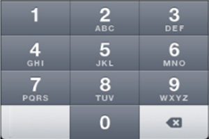

     

## <a id="textarea-properties"></a>TextArea Properties


The properties for TextArea widget are:

* * *

accessibilityConfig Property

* * *

* * *

activeStateSkin Property

* * *

* * *

anchorPoint Property

* * *

* * *

autoCapitalize Property

* * *

Specifies the character capitalization behavior.

Syntax

autoCapitalize

Type

Number

Read/Write

Read + Write

Remarks

The default value for this property is TEXTAREA\_AUTO\_CAPITALIZE\_NONE.

For Desktop Web platform, autoCapitalize property is not supported, use the events [onBeginEditing, onEndEditing, onKeyUp, and onKeyDown, and onDone](TextArea_Events.md) as necessary.

Following are the options available:

*   TEXTAREA\_AUTO\_CAPITALIZE\_NONE: If you leave this option unchanged, no action takes place on the input string.  
    Example:This is sample text.  
    
*   TEXTAREA\_AUTO\_CAPITALIZE\_WORDS: This option changes the first character of all the words to uppercase.  
    Example:This Is Sample Text.  
    
*   TEXTAREA\_AUTO\_CAPITALIZE\_SENTENCES: This option changes the first character of all the sentences to uppercase.  
    Example:This is sample text.  
    
*   TEXTAREA\_AUTO\_CAPITALIZE\_ALL: This option changes all the characters to uppercase. (Not supported on Mobile Web)  
    Example:THIS IS SAMPLE TEXT.

Example

```
/\*Defining properties for a TextArea with the 
autoCapitalize:constants.TEXTAREA\_AUTO\_CAPITALIZE\_ALL\*/
var tAreaBasic = {
    id: "txtArea",
    text: "Text",
    isVisible: true,
    secureTextEntry: true,
    autoCapitalize: constants.TEXTAREA\_AUTO\_CAPITALIZE\_ALL
};

var tAreaLayout = {
    padding: \[5, 5, 5, 5\],
    margin: \[5, 5, 5, 5\],
    containerWeight: 100,
    hExpand: true,
    widgetAlignment: constants.WIDGET\_ALIGN\_TOP\_LEFT
};

var tAreaPSP = {};

//Creating the TextArea.
var txtArea = new voltmx.ui.TextArea2(tAreaBasic, tAreaLayout, tAreaPSP);

//Reading the autoCapitalize of the TextArea
alert("TextArea autoCapitalize ::" + txtArea.autoCapitalize);
```
```
//Sample code to set the autoCapitalize property of TextArea widget.

frmTxtArea.myTxtArea.autoCapitalize=constants.TEXTAREA\_AUTO\_CAPITALIZE\_ALL;
```

Platform Availability

*   Available in the IDE
*   Available on all platforms
*   Available on the Desktop Web, SPA

* * *

autoCorrect Property

* * *

This property determines whether auto-correction is enabled or disabled during typing.

Syntax

autoCorrect

Type

Boolean

Read/Write

Read + Write

Remarks

With auto-correction enabled, the text object tracks unknown words and suggests a more suitable replacement candidate to the user, replacing the typed text automatically unless the user explicitly overrides the action.

The default value for this property is false.

*   If set to _true_, the auto correction option is enabled.
*   If set to _false_, the auto correction option is not enabled.

Example

```
//Defining the properties for a TextArea with autoCorrect:true.
var tAreaBasic = {
    id: "txtArea",
    skin: "txtSkin",
    focusSkin: "txtFSkin",
    text: "Text",
    maxTextLength: 20,
    isVisible: true
};

var tAreaLayout = {
    padding: \[5, 5, 5, 5\],
    margin: \[5, 5, 5, 5\],
    containerWeight: 100,
    hExpand: true,
    widgetAlignment: constants.WIDGET\_ALIGN\_TOP\_LEFT
};

var tAreaPSP = {
    autoCorrect: true
};

//Creating the TextArea.
var txtArea = new voltmx.ui.TextArea2(tAreaBasic, tAreaLayout, tAreaPSP);
```
```
//Sample code to set the autoCorrect property of TextArea widget.

frmTxtArea.myTxtArea.autoCorrect=true;
```

Platform Availability

*   Available in the IDE
*   iOS

* * *

autoResize Property

* * *

This property supports dynamic resizing of the TextArea widget until it reaches the specified max height. If the text crosses the maximum height threshold, the TextArea widget displays a scroll bar.

If you enable the autoResize property, you must set the height property of the TextArea widget to **Preferred**.

Syntax

autoResize

Type

Boolean

Read/Write

Read + Write

Remarks

The default value for this property is false.

*   If set to _true_, the auto resize option is enabled.
*   If set to _false_, the auto resize option is not enabled.

Limitations

*   **Desktop Web**
If you set the value of the minHeight, maxHeight, or the height parameter to 0, the value is not respected on the Desktop Web platform as every browser has a default minimum value of its own.

 

Example

```
//Sample code to set the autoResize property of the TextArea widget.

frmTxtArea.myTxtArea.autoResize=true;
```

Platform Availability

*   Android
*   iOS
*   Desktop Web

* * *

autoSuggestions Property

* * *

* * *

backgroundColor Property

* * *

* * *

backgroundColorMultiStepGradient Property

* * *

* * *

backgroundColorTwoStepGradient Property

* * *

* * *

backgroundImage Property

* * *

* * *

blockedUISkin Property-Deprecated as per DOC-3942

* * *

Specifies the skin that must be used to block the interface until the action in progress (for example, a service call) is completed.

Syntax

blockedUISkin

Type

String

Read/Write

Read + Write

Remarks

For the skin to be available in the list, you must add a skin for Blocked UI under Widget Skins.

The default value for this property is None (No skin is applied).

To specify a skin, select a skin from the list.

Example

```
//Defining the properties for a TextArea with blockedUISkin:"blockedUISkin".
var tAreaBasic = {
    id: "txtArea",
    skin: "txtSkin",
    focusSkin: "txtFSkin",
    text: "Text",
    isVisible: true
};

var tAreaLayout = {
    padding: \[5, 5, 5, 5\],
    margin: \[5, 5, 5, 5\],
    containerWeight: 100,
    hExpand: true,
    widgetAlignment: constants.WIDGET\_ALIGN\_TOP\_LEFT
};

var tAreaPSP = {
    blockedUISkin: "blockedUISkin"
};

/\*Creating the TextArea.var txtArea = new voltmx.ui.TextArea2(tAreaBasic,
tAreaLayout, tAreaPSP);\*/

//Reading the blockedUISkin of the TextArea.
alert("TextArea blockedUISkin ::" + txtArea.blockedUISkin);
```
```
//Sample code to set the blockedUISkin property of TextArea widget.

frmTxtArea.myTxtArea.blockedUISkin="blockUISkin";
```

Platform Availability

*   Available in the IDE
*   SPA

* * *

borderColor Property

* * *

* * *

borderColorGradient Property

* * *

* * *

borderStyle Property

* * *

* * *

borderWidth Property

* * *

* * *

bottom Property

* * *

* * *

centerX Property

* * *

* * *

centerY Property

* * *

* * *

closeButtonText Property

* * *

Specifies the text to replace the "_Done_" button that appears in the Keypad (opens when you select a textbox).

Syntax

closeButtonText

Type

String

Remarks

The default value for this property is Done (The text on the close button is "Done").

If you want to change the text for the close button, enter the text of your choice. For example, if you want to change the text from Done to Go, enter Go in the property field. The following image illustrates the Keypad when the text in the property is changed to _Go_:


Example

```
//Defining the properties for a TextArea with closeButtonText:"done"
var tAreaBasic = {
    id: "txtArea",
    skin: "txtSkin",
    focusSkin: "txtFSkin",
    text: "Text",
    maxTextLength: 20,
    isVisible: true
};

var tAreaLayout = {
    padding: \[5, 5, 5, 5\],
    margin: \[5, 5, 5, 5\],
    containerWeight: 100,
    hExpand: true,
    widgetAlignment: constants.WIDGET\_ALIGN\_TOP\_LEFT
};

var tAreaPSP = {
    closeButtonText: "Done"
};


//Creating the TextArea.
var txtArea = new voltmx.ui.TextArea2(tAreaBasic, tAreaLayout, tAreaPSP);
```
```
//Sample code to set the closeButtonText property of TextArea widget.

frmTxtArea.myTxtArea.closeButtonText="Done";
```

Platform Availability

Available in the IDE

Available only on iPhone

* * *

contentAlignment Property

* * *

* * *

cornerRadius Property

* * *

* * *

cursorType Property

* * *

* * *

disabledStateSkinProperties Property

* * *

* * *

enable Property

* * *

* * *

enableCache Property

* * *

* * *

enableHapticFeedback Property

* * *

Allows you to enable or disable haptic feedback on the TextArea widget.

Haptic feedback is provided on the Copy, Cut, and Paste options.

Syntax

enableHapticFeedback

Type

Boolean.  
If the enableHapticFeedback property is not specified, haptic feedback is not enabled on the TextArea widget.

Read/Write

Read + Write

Remarks

*   iOS
    
    *   The Haptic Feedback feature is available on iPhone 7 devices and later. These devices have Taptic Engine hardware and users can enable/disable Haptics from Device Settings-> Sounds & Haptics-> System Haptics.
        
*   Android
    *   Users can enable the Vibrate on touch feature from Settings-> Sound & notification-> Other sounds.
        

Limitations and Behavior

*   For iOS, haptic feedback is not supported for keyboard. Users can enable the haptic feedback functionality by configuring the TextArea widget\`s **onTextChange** event with the **performHapticFeedback** API. **selectAll**, **LookUp**, and **Share** do not support haptic feedback.
    
*   For Windows, haptic feedback is not available on keyboard.
    
*   This property is not applicable for Android. For Android, Native OS provides haptic feedback for keyboard. To disable haptic for keyboard, users can disable haptics from the device settings.
*   Haptic Feedback is supported on Windows devices with OS build version 10.0.16299.0 or later.

Example

```
//Setting the enableHapticFeedback property on widget creation
var tAreaBasic = {
    "enableHapticFeedback": true,
    id: "txtArea",
    skin: "txtSkin",
    focusSkin: "txtFSkin",
    text: "Text",
    maxTextLength: 20,
    isVisible: true,
    secureTextEntry: true
};
var tAreaLayout = {
    padding: \[5, 5, 5, 5\],
    margin: \[5, 5, 5, 5\],
    containerWeight: 100,
    hExpand: true,
    widgetAlignment: constants.WIDGET\_ALIGN\_TOP\_LEFT
};
var tAreaPSP = {};

//Creating the TextArea
var txtArea = new voltmx.ui.TextArea2 (tAreaBasic, tAreaLayout, tAreaPSP);

//Setting the enableHapticFeedback property on an existing widget
Form1.textarea1.enableHapticFeedback = true;
```
```
//Sample code to set the enableHapticFeedback property of TextArea widget.

frmTxtArea.myTxtArea.enableHapticFeedback=true;
```

Platform Availability

*   iOS
*   Windows

* * *

focusSkin Property

* * *

Specifies the look and feel of the widget when in focus.

Syntax

focusSkin

Type

String

Read/Write

Read + Write

Remarks

*   Mobile Web does not support this property, instead browser specific focus will be applied.

Example

```
//Defining properties for a TextArea with the focusSkin:"txtFSkin".
var tAreaBasic = {
    id: "txtArea",
    skin: "txtSkin",
    focusSkin: "txtFSkin",
    text: "Text",
    maxTextLength: 20,
    isVisible: true,
    secureTextEntry: true
};

var tAreaLayout = {
    padding: \[5, 5, 5, 5\],
    margin: \[5, 5, 5, 5\],
    containerWeight: 100,
    hExpand: true,
    widgetAlignment: constants.WIDGET\_ALIGN\_TOP\_LEFT
};

var tAreaPSP = {};


//Creating the TextArea.
var txtArea = new voltmx.ui.TextArea2(tAreaBasic, tAreaLayout, tAreaPSP);
```
```
//Sample code to set the focusSkin property of TextArea widget.

frmTxtArea.myTxtArea.focusSkin="txtFSkin";
```

Platform Availability

*   Available in the IDE
*   Available on all platforms except and SPA (Android) platforms

* * *

focusStateSkinProperties Property

* * *

* * *

fontColor Property

* * *

* * *

fontFamily Property

* * *

* * *

fontSize Property

* * *

* * *

fontStyle Property

* * *

* * *

fontWeight Property

* * *

* * *

height Property

* * *

It determines the height of the widget and measured along the y-axis.

The height property determines the height of the widget’s bounding box. The value may be set using DP (Device Independent Pixels), Percentage, or Pixels. For supported widgets, the height may be derived from either the widget or container’s contents by setting the height to “preferred”.

Syntax

height

Type

Number, String, and Constant

Read/Write

Read + Write

Remarks

Following are the available measurement options:

*   %: Specifies the values in percentage relative to the parent dimensions.
*   px: Specifies the values in terms of device hardware pixels.
*   dp: Specifies the values in terms of device independent pixels.
*   default: Specifies the default value of the widget.
*   voltmx.flex.USE\_PREFERED\_SIZE: When this option is specified, the layout uses preferred height of the widget as height and preferred size of the widget is determined by the widget and may varies between platforms.

Example

Setting the height property on an existing widget

```
/\*Sample code to set the height property for a TextArea widget by using DP, Percentage and Pixels.\*/
frmTxtArea.myTxtArea.height="50dp";

frmTxtArea.myTxtArea.height="10%";

frmTxtArea.myTxtArea.height="10px";

```

Setting the height property on widget creation

```
//Defining the properties for textarea with height: "150dp" 
var textarea1 = new voltmx.ui.Textarea({
    "id": "&lt;ID for the Widget",
    "top": "19dp",
    "width": "200dp",
    "height": "150dp",
    "right": "23dp",
    "zIndex": 1,
    "isVisible": true,
    "clipBounds": true
});
```

Platform Availability

*   Available in the IDE
*   iOS
*   Android
*   Windows
*   SPA

* * *

hoverSkin Property

* * *

Specifies the look and feel of a widget when the cursor hovers on the widget.

Syntax

hoverSkin

Type

String

Read/Write

Read + Write

Example

```
//Defining the properties for a TextArea with hoverSkin:"hskin"
var tAreaBasic = {
    id: "txtArea",
    skin: "txtSkin",
    focusSkin: "txtFSkin",
    text: "Text",
    maxTextLength: 20,
    isVisible: true
};

var tAreaLayout = {
    padding: \[5, 5, 5, 5\],
    margin: \[5, 5, 5, 5\],
    containerWeight: 100,
    hExpand: true,
    widgetAlignment: constants.WIDGET\_ALIGN\_TOP\_LEFT
};

var tAreaPSP = {
    hoverSkin: "hskin"
};

//Creating the TextArea.
var txtArea = new voltmx.ui.TextArea2(tAreaBasic, tAreaLayout, tAreaPSP);
```
```
//Sample code to set the hoverSkin property of TextArea widget.

frmTxtArea.myTxtArea.hoverSkin="hskin";
```

Platform Availability

*   Available in the IDE
*   Windows

* * *

hoverStateSkinProperties Property

* * *

* * *

id Property

* * *

A unique identifier of TextArea consisting of alpha numeric characters. Every TextArea should have a unique id within a Form.

Syntax

id

Type

String

Read/Write

Read only

Example

```
//Defining properties for a TextArea with the id:"txtArea"
var tAreaBasic = {
    id: "txtArea",
    skin: "txtSkin",
    focusSkin: "txtFSkin",
    text: "Text",
    maxTextLength: 20,
    isVisible: true,
    secureTextEntry: true
};

var tAreaLayout = {
    padding: \[5, 5, 5, 5\],
    margin: \[5, 5, 5, 5\],
    containerWeight: 100,
    hExpand: true,
    widgetAlignment: constants.WIDGET\_ALIGN\_TOP\_LEFT
};

var tAreaPSP = {};

//Creating the TextArea.
var txtArea = new voltmx.ui.TextArea2(tAreaBasic, tAreaLayout, tAreaPSP);

//Reading the id of the TextArea		
alert("TextArea Id ::" + txtArea.id);
```

Platform Availability

*   Available in the IDE
*   Available on all platforms

* * *

info Property

* * *

A custom JSObject with the key value pairs that a developer can use to store the context with the widget.

Syntax

info

Type

JSObject

Read/Write

Read + Write

Remarks

This will help in avoiding the globals to most part of the programming.

This is a **non-Constructor** property. You cannot set this property through widget constructor. But you can read and write data to it.

Info property can hold any JSObject. After assigning the JSObject to info property, the JSObject should not be modified. For example,

```
var inf = {
    a: 'hello'
};
widget.info = inf; //works

widget.info.a = 'hello world';
/\*This will not update the widget info a property to Hello world. 
widget.info.a will have old value as hello.\*/
```

Example

```
//Defining properties for a TextArea with the info property.
var tAreaBasic = {
    id: "txtArea",
    skin: "txtSkin",
    focusSkin: "txtFSkin",
    text: "Text",
    maxTextLength: 20,
    isVisible: true,
    secureTextEntry: true
};

var tAreaLayout = {
    padding: \[5, 5, 5, 5\],
    margin: \[5, 5, 5, 5\],
    containerWeight: 100,
    hExpand: true,
    widgetAlignment: constants.WIDGET\_ALIGN\_TOP\_LEFT
};

var tAreaPSP = {};

//Creating the TextArea.
var txtArea = new voltmx.ui.TextArea2(tAreaBasic, tAreaLayout, tAreaPSP);
txtArea.info = {
    key: "text of textarea"
};

//Reading the info of the TextArea		
alert("TextArea info is ::" + txtArea.info);
```
```
//Sample code to set the info property for a TextArea widget.
frmTxtArea.myTxtArea.info={
    key: "text of textarea"
};
//Reading info of the TextArea widget.
alert("TextArea widget info is ::" +frmTxtArea.myTxtArea.info);

```

Platform Availability

Available on all platforms

* * *

inputAccessoryViewType Property

* * *

While building iPhone applications that support or provide text input, it is necessary to create some extra buttons (or other controls) beyond the ones provided by the default keyboard interface. by default, adds the Previous, Next, and Done buttons to the applicable input controls. These buttons allow specific operations needed by your application, such as moving to the next or previous text field, making the keyboard disappear and so on. The area above the keyboard is known as Input Accessory View.

Syntax

inputAccessoryViewType

Type

Number

Read/Write

Yes

Remarks

The default value for this property is TEXTAREA\_INPUTACCESSORYVIEW\_DEFAULT.

This property, allows you to specify the type of accessory view that will be shown for all the input controls for **TextArea** widget.

For iOS, a header with 'Prev' and Next' buttons is added to the keypad by default. You can turn off this header at three levels: application-level, form-level, and widget-level.

To know more about how to set inputAccessoryViewType property at application-level and form-level, you can refer the [inputAccessoryViewType](FlexForm_Properties.md#inputAcc) property under Flexform widget.

To turn on/off the header at widget-level, assign any of the following constants to inputAccessoryViewType property. You must specify each constant with the ‘constants.xx’ prefix.

*   TEXTAREA\_INPUTACCESSORYVIEW\_NONE: Use this option if you do not want to specify the toolbar. This option should be used carefully, as setting this option for widgets like calendar leaves the user with no option to select and drop-down a wheel calendar.
*   TEXTAREA\_INPUTACCESSORYVIEW\_DEFAULT:Specifies that the toolbar that is defined in the Application level settings. To set the Application level settings, right-click on the project and navigate to **Properties> Native App>iPhone/iPad.**  
    
*   TEXTAREA\_INPUTACCESSORYVIEW\_NEXTPREV: Specifies the navigation options as Next, Previous, and Done for a form.

*   TEXTAREA\_INPUTACCESSORYVIEW\_CANCEL: Specifies that the input accessory view has a Cancel button. This option does not trigger any events.

Example

```
//Defining the property inputAccessoryViewType in the constructor level
	var tAreaBasic = {id:"txtArea", 
	skin:"txtSkin", 
	focusSkin:"txtFSkin",text:"Text", 
	maxTextLength:20, 
	isVisible:true, 
	secureTextEntry:true};

var tAreaLayout = {padding:\[5,5,5,5\], 
	hExpand:true, 
	widgetAlignment:constants.WIDGET\_ALIGN\_TOP\_LEFT};

var tAreaPSP ={
  "**inputAccessoryViewType**":constants.TEXTAREA\_INPUTACCESSORYVIEWTYPE\_DEFAULT
};

//Creating the TextArea.
var txtArea = new voltmx.ui.TextArea2 (tAreaBasic, tAreaLayout, tAreaPSP);

//Reading the inputAccessoryViewType of the TextArea		
voltmx.print("The value of input Accessory View Type property is:"+txtArea.inputAccessoryViewType);
//Defining the property inputAccessoryViewType outside the constructor

Form1.textArea1.inputAccessoryViewType=constants.TEXTAREA\_INPUTACCESSORYVIEWTYPE\_DEFAULT;
```
```
//Sample code to set the inputAccessoryViewType property of TextArea widget.

frmTArea.myTxtArea.inputAccessoryViewType=constants.TEXTAREA\_INPUTACCESSORYVIEWTYPE\_DEFAULT;
```

Platform Availability

*   Available in the IDE
*   iPhone
*   iPad

* * *

isReadOnly PropertyDeprecated property - Pramod Garikapati 24/7/18

* * *

This property allows you to specify whether text in the TextArea Widget should be read only or can be edited.

Syntax

isReadOnly

Type

Boolean

Read/Write

Read + Write

Remarks

The default value for this property is false.

*   If set to _true_, the text in the TextArea Widget will be read only.
*   If set to _false_, the text in the TextArea Widget can be edited.

Example

```
/\* Defining the properties for a Textarea with the
isReadOnly:constants.TEXTAREA\_KEYBOARD\_LABEL\_SEARCH\*/
var txtBasic = {
    id: "textArea1",
    isVisible: true,
    "isReadOnly": true
};

var txtLayout = {
    padding: \[5, 5, 5, 5\],
    containerWeight: 100,
    hExpand: true
};

var txtPSP = {};

//Creating the TextArea.
var textArea1 = new voltmx.ui.TextArea2(txtBasic, txtLayout, txtPSP);

//Reading the isReadOnly of the Textarea
alert("Textarea isReadOnly ::" + textArea1.isReadOnly);
```

Platform Availability

This property is available on Windows Desktop

* * *

isSelectable Property

* * *

isSelectable property allows you to select the content inside a TextArea widget.

Syntax

isSelectable

Type

Boolean

Read/Write

Read + Write

Remarks

The default value for this property is true.

*   If set to _true_, the text in the TextArea Widget can be selected.
*   If set to _false_, the text in the TextArea Widget cannot be selected.

Example

```
myForm.myTextArea.isSelectable = false;  

```

Platform Availability

*   Not available from IDE
*   iOS

* * *

isSensitiveText Property

* * *

* * *

isVisible Property

* * *

This property controls the visibility of a widget on the form.

Syntax

isVisible

Type

Boolean

Read/Write

Read + Write

Remarks

The default value for this property is true.

*   If set to _false,_ the widget is not displayed.
*   If set to _true,_ the widget is displayed.

Example

```
//Defining properties for a TextArea with the isVisible:true.
var tAreaBasic = {
    id: "txtArea",
    skin: "txtSkin",
    focusSkin: "txtFSkin",
    text: "Text",
    maxTextLength: 20,
    isVisible: true,
    secureTextEntry: true
};

var tAreaLayout = {
    padding: \[5, 5, 5, 5\],
    margin: \[5, 5, 5, 5\],
    containerWeight: 100,
    hExpand: true,
    widgetAlignment: constants.WIDGET\_ALIGN\_TOP\_LEFT
};

var tAreaPSP = {};

//Creating the TextArea.
var txtArea = new voltmx.ui.TextArea2(tAreaBasic, tAreaLayout, tAreaPSP);

//Reading the isVisible of the TextArea		
alert("TextArea isVisible ::" + txtArea.isVisible);
```
```
//Sample code to set the isVisible property of TextArea widget.

frmTxtArea.myTxtArea.isVisible=true;
```

You can set the visibility of a widget dynamically from code using the setVisibility method.

Platform Availability

*   Available in the IDE
*   Available on all platforms.

* * *

keyboardActionLabel Property

* * *

Specifies if the text to be displayed in action key of the keyboard.

Syntax

keyboardActionLabel

Type

Number

Read/Write

Read + Write

Remarks

The default value for this property is TEXTBOX\_KEYBOARD\_LABEL\_DONE.

The following are the available options:

*   TEXTBOX\_KEYBOARD\_LABEL\_DONE
*   TEXTBOX\_KEYBOARD\_LABEL\_GO
*   TEXTBOX\_KEYBOARD\_LABEL\_SEARCH
*   TEXTBOX\_KEYBOARD\_LABEL\_NEXT
*   TEXTBOX\_KEYBOARD\_LABEL\_SEND
*   TEXTBOX\_KEYBOARD\_LABEL\_GOOGLE
*   TEXTBOX\_KEYBOARD\_LABEL\_JOIN
*   TEXTBOX\_KEYBOARD\_LABEL\_ROUTE
*   TEXTBOX\_KEYBOARD\_LABEL\_YAHOO
*   TEXTBOX\_KEYBOARD\_LABEL\_CALLs

The following images illustrate the Keyboard label as _Done_ preserve">var var _Search_ respectively:


Example

```
/\*Defining the properties for a TextArea with 
keyboardActionLabel:constants.TEXTAREA\_KEYBOARD\_LABEL\_SEND.\*/
var tAreaBasic = {
    id: "txtArea",
    skin: "txtSkin",
    focusSkin: "txtFSkin",
    text: "Text",
    maxTextLength: 20,
    isVisible: true
};

var tAreaLayout = {
    padding: \[5, 5, 5, 5\],
    margin: \[5, 5, 5, 5\],
    containerWeight: 100,
    hExpand: true,
    widgetAlignment: constants.WIDGET\_ALIGN\_TOP\_LEFT
};

var tAreaPSP = {
    keyboardActionLabel: constants.TEXTAREA\_KEYBOARD\_LABEL\_SEND
};

//Creating the TextArea.
var txtArea = new voltmx.ui.TextArea2(tAreaBasic, tAreaLayout, tAreaPSP);

//Reading the keyboardActionLabel of the TextArea.		
alert("TextArea keyboardActionLabel ::" + txtArea.keyboardActionLabel);
```
```
//Sample code to set the keyboardActionLabel property of TextArea widget.

frmTxtArea.myTxtArea.keyboardActionLabel=constants.TEXTAREA\_KEYBOARD\_LABEL\_SEND;
```

Platform Availability

*   Available in the IDE
*   iPhone
*   iPad

* * *

keyboardAppearance Property

* * *

Allows you to set the on screen keyboard to a dark or light color scheme.

Syntax

keyboardAppearance

Type

String

Read/Write

Read + Write

Remarks

Possible values are:

*   constants.TEXTBOX\_KEYBOARD\_COLOR\_LIGHT(Default)
*   constants.TEXTBOX\_KEYBOARD\_COLOR\_DARK

Example

```
//Sample code to set the keyboardAppearance property of TextArea widget.

frmTxtArea.myTxtArea.keyboardAppearance=constants.TEXTBOX\_KEYBOARD\_COLOR\_DARK;
```

Availability

Available in the IDE

*   iOS

* * *

keyBoardStyle Property

* * *

When you interact with a TextArea widget, a keyboard is displayed.

Syntax

keyBoardStyle

Type

Number

Read/Write

Read + Write

Remarks

You can use this property to select the type of keyboard that you want to display.

Keys on the keyboard style may vary from platform to platform.

On Desktop Web platform, `keyBoardStyle` property is not supported, use the events [onBeginEditing](TextArea_Events.md#onBeginE), [onEndEditing](TextArea_Events.md#onEndEdi), [onKeyUp](TextArea_Events.md#onKeyUp), [onKeyDown](TextArea_Events.md#onKeyDow), and [onDone](TextArea_Events.md#onDone) as necessary.

iPad device does not support constants.TEXTAREA\_KEY\_BOARD\_STYLE\_DECIMAL.

The following are the available keyboard types when you select [textInputMode](#textInputmode) as constants.TEXTAREA\_INPUT\_MODE\_NUMERIC.

*   constants.TEXTAREA\_KEY\_BOARD\_STYLE\_DEFAULT: Specifies the default numeric keyboard.  
    
*   constants.TEXTAREA\_KEY\_BOARD\_STYLE\_DECIMAL: Specifies the keyboard to enter decimals.  
    
*   constants.TEXTAREA\_KEY\_BOARD\_STYLE\_NUMBER\_PAD: Specifies the keyboard to enter numbers.  
    
*   constants.TEXTAREA\_KEY\_BOARD\_STYLE\_PHONE\_PAD: Specifies the keyboard to enter phone numbers. (Not supported in Windows platform)  
    
*   constants.TEXTAREA\_KEY\_BOARD\_STYLE\_SIGNED\_NUMBER: Specifies the keyboard to enter negative numbers( for example -345). This option is applicable to Android platform only.
*    constants.TEXTAREA\_KEY\_BOARD\_STYLE\_SIGNED\_DECIMAL\_NUMBER: Specifies the keyboard to enter negative decimal numbers (for example -345.87). This option is applicable to Android platform only.
*   constants.TEXTAREA\_KEY\_BOARD\_STYLE\_DEFAULT: Specifies the default numeric keyboard.

The following are the available keyboard types when the value is [textInputMode](#textInputmode) set as constants.TEXTAREA\_INPUT\_MODE\_DATETIME. These options are applicable only for Android platform.

*   constants.TEXTAREA\_KEY\_BOARD\_STYLE\_DATETIME
*   constants.TEXTAREA\_KEY\_BOARD\_STYLE\_DATE
*   constants.TEXTAREA\_KEY\_BOARD\_STYLE\_TIME

Example

```
//Defining properties for a TextArea with the keyBoardStyle to accept URL address.
var tAreaBasic = {
    id: "txtArea",
    text: "Text",
    maxTextLength: 20,
    isVisible: true,
    secureTextEntry: true,
    keyBoardStyle: constants.TEXTAREA\_KEY\_BOARD\_STYLE\_URL
};

var tAreaLayout = {
    padding: \[5, 5, 5, 5\],
    margin: \[5, 5, 5, 5\],
    containerWeight: 100,
    hExpand: true,
    widgetAlignment: constants.WIDGET\_ALIGN\_TOP\_LEFT
};

var tAreaPSP = {};

//Creating the TextArea.
var txtArea = new voltmx.ui.TextArea2(tAreaBasic, tAreaLayout, tAreaPSP);

//Reading the keyBoardStyle of the TextArea		
alert("TextArea keyBoardStyle ::" + txtArea.keyBoardStyle);
```
```
//Sample code to set the keyBoardStyle property of TextArea widget.

frmTxtArea.myTxtArea.keyBoardStyle=constants.TEXTAREA\_KEY\_BOARD\_STYLE\_URL;
```

Platform Availability

*   Available in the IDE
*   Available on all platforms except SPA and Desktop Web platforms.

* * *

left Property

* * *

* * *

maxHeight Property

* * *

* * *

maxWidth Property

* * *

* * *

maxTextLength Property

* * *

Specifies the maximum number of characters that the text field can accept.

Syntax

maxTextLength

Type

Number

Read/Write

Read + Write

Remarks

The default value for this property is empty.

If you specify a number for this property, the number of input characters cannot exceed the specified number.

Example

```
//Defining properties for a TextArea with the maxTextLength:20.
var tAreaBasic = {
    id: "txtArea",
    skin: "txtSkin",
    focusSkin: "txtFSkin",
    text: "Text",
    maxTextLength: 20,
    isVisible: true,
    secureTextEntry: true
};

var tAreaLayout = {
    padding: \[5, 5, 5, 5\],
    margin: \[5, 5, 5, 5\],
    containerWeight: 100,
    hExpand: true,
    widgetAlignment: constants.WIDGET\_ALIGN\_TOP\_LEFT
};

var tAreaPSP = {};

//Creating the TextArea.
var txtArea = new voltmx.ui.TextArea2(tAreaBasic, tAreaLayout, tAreaPSP);

//Reading the maxTextLength of the TextArea		
alert("TextArea maxTextLength ::" + txtArea.maxTextLength);
```
```
//Sample code to set the maxTextLength property of TextArea widget.

frmTxtArea.myTxtArea.maxTextLength=20;
```

Platform Availability

*   Available in the IDE
*   Available on all platforms. platforms

* * *

minHeight Property

* * *

* * *

minWidth Property

* * *

* * *

numberOfVisibleLines Property

* * *

Number of lines to be displayed at a given time in the view port of the TextArea.

Syntax

numberOfVisibleLines

Type

Number

Read/Write

Read + Write

Remarks

This essentially decides the height of the text area.

In Android platform, you cannot fix the height of the TextArea to any value. The form by default is a vertical scroll container, if you restrict the height of TextArea, you will not be able to scroll the content, because of double scrolling issue. For example,  
If the numberOfVisibleLines property is set to 10, then the height of the TextArea will be at least 10 lines tall. As you enter text more than 10 lines, TextArea height expands accordingly.

Example

```
//Defining properties for a TextArea with numberOfVisibleLines:5
var tAreaBasic = {
    id: "txtArea",
    text: "Text",
    maxTextLength: 20,
    isVisible: true,
    secureTextEntry: true,
    numberOfVisibleLines: 5
};

var tAreaLayout = {
    padding: \[5, 5, 5, 5\],
    margin: \[5, 5, 5, 5\],
    containerWeight: 100,
    hExpand: true,
    widgetAlignment: constants.WIDGET\_ALIGN\_TOP\_LEFT
};

var tAreaPSP = {};

//Creating the TextArea.
var txtArea = new voltmx.ui.TextArea2(tAreaBasic, tAreaLayout, tAreaPSP);

//Reading the numberOfVisibleLines of the TextArea		
alert("TextArea numberOfVisibleLines ::" + txtArea.numberOfVisibleLines);
```
```
//Sample code to set the numberOfVisibleLines property of TextArea widget.

frmTxtArea.myTxtArea.numberOfVisibleLines=5;
```

Platform Availability

*   Available in the IDE
*   Available on all platforms.

* * *

opacity Property

* * *

* * *

padding Property

* * *

* * *

paddingInPixel Property

* * *

* * *

parent Property

* * *

* * *

pasteboardType Property

* * *

This property enables an application to share data within the application or with another application using system-wide or application-specific pasteboard.

Syntax

pasteboardType

Type

Number

Read/Write

Read + Write

Remarks

Typically, an object in the application writes data to a pasteboard when the user requests a copy or cut operation on a selection in the user interface. Another object in the same or different application then reads that data from the pasteboard and presents it to the user at a new location; this usually happens when the user requests a paste operation.

You can only paste the text to a textbox with the same pasteboard type as that of the source textbox. For example, if you set the pasteboardType as TEXTAREA\_PASTE\_BOARD\_TYPE\_APP\_LEVEL\_PERSISTENT, you can paste the text only to another textbox whose pasteboard type is set to applevelpersistent.

The different pasteboard types are:

TEXTAREA\_PASTE\_BOARD\_TYPE\_DEFAULT: If you select this option, the value selected in the application properties gets applied.

TEXTAREA\_PASTE\_BOARD\_TYPE\_SYSTEM\_LEVEL: This is the default selection and if this option is unchanged, the text copied from a TextArea can be pasted in TextArea (with the pasteboard type set as systemlevel) across different applications on the device. Even if you exit the source application, the copied text persists in the memory and can be pasted across applications or within the same application.

TEXTAREA\_PASTE\_BOARD\_TYPE\_APP\_LEVEL\_PERSISTENT: If you select this option , the text copied from a TextArea can be pasted in TextArea (with the pasteboard type set as applevel) within the same application. Even if you close the application, the copied text persists in the memory and can be copied to another TextArea whose pasteboard type is applevel, when you restart that application.

TEXTAREA\_PASTE\_BOARD\_TYPE\_APP\_LEVEL\_NON\_PERSISTENT: If you select this option , the text copied from a TextArea can be pasted in TextArea (with the pasteboard type set as applevelnonpersistent) within the same application. This text is not retained in the memory when you close the application.

TEXTAREA\_PASTE\_BOARD\_TYPE\_NO\_PASTE\_BOARD: Select this option, if you want to disable the content to be copied from a TextArea.

Example

```
/\*Defining the properties for a TextArea with 
pasteboardType:constants.TEXTAREA\_PASTE\_BOARD\_TYPE\_SYSTEM\_LEVEL\*/
var tAreaBasic = {
    id: "txtArea",
    skin: "txtSkin",
    focusSkin: "txtFSkin",
    text: "Text",
    maxTextLength: 20,
    isVisible: true
};

var tAreaLayout = {
    padding: \[5, 5, 5, 5\],
    margin: \[5, 5, 5, 5\],
    containerWeight: 100,
    hExpand: true,
    widgetAlignment: constants.WIDGET\_ALIGN\_TOP\_LEFT
};


var tAreaPSP = {
    pasteboardType: constants.TEXTAREA\_PASTE\_BOARD\_TYPE\_SYSTEM\_LEVEL
};

//Creating the TextArea.
var txtArea = new voltmx.ui.TextArea2(tAreaBasic, tAreaLayout, tAreaPSP);

//Reading the pasteboardType of the TextArea.	
alert("TextArea pasteboardType ::" + txtArea.pasteboardType);
```
```
//Sample code to set the pasteboardType property of TextArea widget.

frmTxtArea.myTxtArea.pasteboardType=constants.TEXTAREA\_PASTE\_BOARD\_TYPE\_SYSTEM\_LEVEL;
```

Platform Availability

*   Available in the IDE
*   iPhone
*   iPad

* * *

placeholder Property

* * *

The placeholder attribute specifies a short hint that describes the expected value of an input field (example, a sample value or a short description of the expected format).

Syntax

placeholder

Type

String

Read/Write

Read + Write

Remarks

The hint is displayed in the input field when it is empty, and disappears when the field gets focus.

For example, for the Username field, you can enter the placeholder text as _Enter User ID or Email Address_. The user then clicks on the TextArea widget and enters the Username.

You must be aware of the following:  
\- If you specify text both in the [text](#text) property and the **placeholder** property, the text entered in the [text](#text) property is displayed when rendered. If the user deletes the text, the placeholder text is displayed.  
\- If you programmatically set an empty string for the [text](#text) property, the placeholder text is displayed.

Example

```
//Defining properties for a TextArea with placeholder:"Enter text".
var tAreaBasic = {
    id: "txtArea",
    skin: "txtSkin",
    focusSkin: "txtFSkin",
    text: "Text",
    maxTextLength: 20,
    isVisible: true,
    secureTextEntry: true,
    placeholder: "Enter text"
};

var tAreaLayout = {
    padding: \[5, 5, 5, 5\],
    margin: \[5, 5, 5, 5\],
    containerWeight: 100,
    hExpand: true,
    widgetAlignment: constants.WIDGET\_ALIGN\_TOP\_LEFT
};

var tAreaPSP = {};

//Creating the TextArea.
var txtArea = new voltmx.ui.TextArea2(tAreaBasic, tAreaLayout, tAreaPSP);

//Reading the placeholder of the TextArea		
alert("TextArea placeholder ::" + txtArea.placeholder);
```
```
//Sample code to set the placeholder property of TextArea widget.

frmTxtArea.myTxtArea.placeholder="Enter Text";
```

You can set the placeholder text from the code only on iPhone, Android, and Mobile Web Advanced platforms.

Platform Availability

*   Available in the IDE
*   Available on all platforms.

* * *

placeholderSkin Property

* * *

Specifies the skin to be applied to the placeholder text in the TextArea widget.

Syntax

placeholderSkin

Type

String

Remarks

Only the font color skin attribute is applicable.

The following image illustrates the placeholder text with a placeholder color applied:


Example

```
//Defining the properties for a TextArea with placeholderSkin:"placeholderSkin"
var tAreaBasic = {
    id: "txtArea",
    skin: "txtSkin",
    focusSkin: "txtFSkin",
    text: "Text",
    maxTextLength: 20,
    isVisible: true,
    placeholder: "Enter text"
};

var tAreaLayout = {
    padding: \[5, 5, 5, 5\],
    margin: \[5, 5, 5, 5\],
    containerWeight: 100,
    hExpand: true,
    widgetAlignment: constants.WIDGET\_ALIGN\_TOP\_LEFT
};

var tAreaPSP = {
    placeholderSkin: "placeholderSkin"
};

//Creating the TextArea.
var txtArea = new voltmx.ui.TextArea2(tAreaBasic, tAreaLayout, tAreaPSP);
```
```
//Sample code to set the placeholderSkin property of TextArea widget.

frmTxtArea.myTxtArea.placeholderSkin="pSkin";
```

You cannot specify an image as a skin for a placeholder as of now.

Android and Windows support change in font color only.

Platform Availability

*   Available in the IDE
*   Android
*   Windows

* * *

pressedStateSkinProperties Property

* * *

* * *

retainContentAlignment Property

* * *

* * *

retainFlexPositionProperties Property

* * *

* * *

retainFlowHorizontalAlignment Property

* * *

* * *

restrictCharactersSet Property

* * *

This property restricts users from entering a set of input characters from the soft keyboard in the TextArea widget.

Syntax

restrictCharactersSet

Type

String

Read/Write

Read + Write

Example

```
Form1.textArea1.restrictCharactersSet =  "~#^|$%&\*!";
```

Platform Availability

*   Available in the IDE
*   Android
*   iOS
*   SPA
*   Desktop Web

* * *

right Property

* * *

* * *

secureTextEntry Property

* * *

Specifies whether the text entered by the user will be secured using a mask character, such as asterisk or dot.

Syntax

secureTextEntry

Type

Boolean

Read/Write

Read + Write

Remarks

The default value for this property is false.

*   If set to _true_, the text in the TextArea will be masked.
*   If set to _false_, the text in the TextArea will be displayed as clear text.

This is typically set to _true_ for a password field.

Example

Setting the secureTextEntry on widget creation

```
//Defining the properties for a Textbox with secureTextEntry:true.
var txtBasic = {
    id: "textBox1",
    skin: "txtSkin",
    focusSkin: "txtFSkin",
    text: "Text",
    maxTextLength: 20,
    isVisible: true,
    secureTextEntry: true,
    placeholder: "enter text"
};
var txtLayout = {
    padding: \[5, 5, 5, 5\],
    margin: \[5, 5, 5, 5\],
    containerWeight: 100,
    hExpand: true,
    widgetAlignment: constants.WIDGET\_ALIGN\_TOP\_LEFT
};
var txtPSP = {};
//Creating the Textbox.
var textBox1 = new voltmx.ui.TextArea2(txtBasic, txtLayout, txtPSP);
```
```
//Sample code to set the secureTextEntry property of TextArea widget.

frmTxtArea.myTxtArea.secureTextEntry=true;  
  
//Sample code to read the secureTextEntry property of a TextArea widget.  
alert("The value of the secureTextEntry is:"+frmTxtArea.myTxtArea.secureTextEntry);  

```

Platform Availability

*   Available in the IDE
*   Available on all platforms except iOS and Desktop Web

* * *

<a name="setImportantForAutofill"></a>setImportantForAutofill Property

* * *

The `setImportantForAutoFill` property is used to set preference to a TextArea widget to show the suggestions automatically when the user enters a value.

Consider a FlexForm with multiple TextBox and Text Area widgets that have enabled the auto-fill feature and uses an auto-fill service to provide the suggestions. In this scenario, if a TextArea widget has enabled the `setImportantForAutoFill` property, it is provided the suggestions before other widgets by the auto-fill service.

If the `setImportantForAutoFill` property is not enabled for any of the widgets in the form, the importance of the widgets is decided by the platform during run-time.

Syntax

setImportantForAutofill

Type

Number

Read/Write

Read + Write

Remarks

The default value of `setImportantForAutofill` property is _constants.TEXT\_IMPORTANT\_FOR\_AUTOFILL\_AUTO_.

You can specify any of the following values to this property.

*   _constants.TEXT\_IMPORTANT\_FOR\_AUTOFILL\_AUTO_: When the `setImportantForAutoFill` property is set as this value, the platform decides the importance of the TextArea widget automatically.
*   _constants.TEXT\_IMPORTANT\_FOR\_AUTOFILL\_NO_: When the `setImportantForAutoFill` property is set as this value for a TextArea widget, the widget is not considered for auto-fill feature.
*   _constants.TEXT\_IMPORTANT\_FOR\_AUTOFILL\_YES_: When the `setImportantForAutoFill` property is set as this value for a TextArea widget, the widget is considered for auto-fill feature.

Example

```
/\*Sample code to set the setImportantForAutofill property of TextArea widget.\*/

frmTxtBox.myTxtArea.setImportantForAutofill=constants.TEXT\_IMPORTANT\_FOR\_AUTOFILL\_AUTO;
```

Platform Availability

*   Android

* * *

shadowColor Property

* * *

* * *

shadowDepth Property

* * *

Defines the depth of the shadow effect applied to the TextArea Widget.

Syntax

shadowDepth

Type

Number

Read/Write

Read + Write

Remarks

The depth of the shadow should be specified in DP (Device Independent Pixels) units. The higher the value of shadowDepth, the appearance of the TextArea Widget is elevated from the screen and the casted shadow becomes soft.

Example

Setting the shadowDepth property on an existing widget

```
//Sample code to set the shadowDepth property of TextArea widget.

frmTxtArea.myTxtArea.shadowDepth=10;
```

Setting the shadowDepth property on widget creation

```
//TextArea Creation.
var TxtAr1 = new voltmx.ui.TextArea({
    "id": "TxtAr1",
    "isVisible": true,
    "width": "80%",
    "zIndex": 1,
    "skin": "skin3",
    "shadowDepth": 10,
    "shadowType": constants.VIEW\_BOUNDS\_SHADOW
});
```

Platform Availability

*   Android 5.0 and later versions.

* * *

shadowOffset Property

* * *

* * *

shadowRadius Property

* * *

* * *

shadowType Property

* * *

Sets a type of the shadow effect to apply to the TextArea Widget.

Syntax

shadowType

Type

Number

Read/Write

Read + Write

Remarks

The property specifies a shape to the widget's shadow that is cast. You can apply any one of the following shadow types:

_VIEW\_BOUNDS\_SHADOW_: Shadow matches the widget's rectangular bounds.

_PADDED\_VIEW\_BOUNDS\_SHADOW_: Shadow matches the widget's rectangular padded bounds.

_BACKGROUND\_SHADOW_: Shadow matches the widget's background. This is the default value.

Example

Setting the shadowType property on an existing widget

```
//Sample code to set the shadowType property of TextArea widget.

frmTxtArea.myTxtArea.shadowType=constants.VIEW\_BOUNDS\_SHADOW;
```

Setting the shadowType property on widget creation

```
//TextArea Creation.
var TxtAr1 = new voltmx.ui.TextArea({
    "id": "TxtAr1",
    "isVisible": true,
    "width": "80%",
    "zIndex": 1,
    "skin": "skin3",
    "shadowDepth": 10,
    "shadowType": constants.VIEW\_BOUNDS\_SHADOW
});
```

Platform Availability

*   Android 5.0 and later versions.

* * *

showCloseButton Property

* * *

Specifies if the "_Done_" button that appears in the keypad (opens when you select text box) must be visible or not.

Syntax

showCloseButton

Type

Boolean

Example

```
//Defining the properties for a TextArea with showCloseButton:true.
var tAreaBasic = {
    id: "txtArea",
    skin: "txtSkin",
    focusSkin: "txtFSkin",
    text: "Text",
    maxTextLength: 20,
    isVisible: true
};

var tAreaLayout = {
    padding: \[5, 5, 5, 5\],
    margin: \[5, 5, 5, 5\],
    containerWeight: 100,
    hExpand: true,
    widgetAlignment: constants.WIDGET\_ALIGN\_TOP\_LEFT
};

var tAreaPSP = {
    showCloseButton: true
};

//Creating the TextArea.
var txtArea = new voltmx.ui.TextArea2(tAreaBasic, tAreaLayout, tAreaPSP);
```
```
//Sample code to set the showCloseButton property of TextArea widget.

frmTxtArea.myTxtArea.showCloseButton=true;
```

Remarks

The default value for this property is true.

*   If set to _false_, the "_Done_" button is not visible on the textbox.
*   If set to _true_, the "_Done_" button is visible on the textbox.

You can customize the "_Done_" button using [keyboardActionLabel](#keyboard)

The following image illustrates the Keypad when the property is set to _true_:


The following image illustrates the Keypad when the property is set to _false_:


Platform Availability

*   Available in the IDE
*   Available on iPhone only

* * *

showProgressIndicator Property

* * *

Specifies if there must be an indication to the user that the widget content is being loaded.

Syntax

showProgressIndicator

Type

Boolean

Remarks

You can use this property typically for forms that require network calls during post show.

The default value for this property is true.

*   If set to _false_ the progress indicator is not displayed.
*   If set to _true_ the progress indicator is displayed.

The following image illustrates the progress indicator on iPhone:


Example

```
//Defining the properties for a TextArea with showProgressIndicator:true.
var tAreaBasic = {
    id: "txtArea",
    skin: "txtSkin",
    focusSkin: "txtFSkin",
    text: "Text",
    maxTextLength: 20,
    isVisible: true
};

var tAreaLayout = {
    padding: \[5, 5, 5, 5\],
    margin: \[5, 5, 5, 5\],
    containerWeight: 100,
    hExpand: true,
    widgetAlignment: constants.WIDGET\_ALIGN\_TOP\_LEFT
};

var tAreaPSP = {
    showProgressIndicator: true
};

//Creating the TextArea.
var txtArea = new voltmx.ui.TextArea2(tAreaBasic, tAreaLayout, tAreaPSP);
```
```
//Sample code to set the showProgressIndicator property of TextArea widget.

frmTxtArea.myTxtArea.showProgressIndicator=true;
```

Platform Availability

*   Available in the IDE
*   iPhone
*   iPad

* * *

skin Property

* * *

Specifies the look and feel of the widget when not in focus.

Syntax

skin

Type

String

Read/Write

Read + Write

Example

```
//Defining properties for a TextArea with the skin:"txtSkin"
var tAreaBasic = {
    id: "txtArea",
    skin: "txtSkin",
    focusSkin: "txtFSkin",
    text: "Text",
    maxTextLength: 20,
    isVisible: true,
    secureTextEntry: true
};

var tAreaLayout = {
    padding: \[5, 5, 5, 5\],
    margin: \[5, 5, 5, 5\],
    containerWeight: 100,
    hExpand: true,
    widgetAlignment: constants.WIDGET\_ALIGN\_TOP\_LEFT
};

var tAreaPSP = {};

//Creating the TextArea.
var txtArea = new voltmx.ui.TextArea2(tAreaBasic, tAreaLayout, tAreaPSP);

//Reading the skin of the TextArea		
alert("TextArea skin ::" + txtArea.skin);
```
```
//Sample code to set the skin property of TextArea widget.

frmTxtArea.myTxtArea.skin="txtSkin";
```

Platform Availability

*   Available in the IDE
*   Available on all platforms.

* * *

smartDashes Property

* * *

* * *

smartInsertDelete Property

* * *

* * *

smartQuotes Property

* * *

* * *

text Property

* * *

Specifies a general or descriptive text for the TextArea widget.

Syntax

text

Type

String

From V9 SP1 onwards, when you enable the [isSensitiveText](#isSensitiveText) property,

1.  In Android platform, the text property returns an instance of the [RawBytes](https://{../../../Iris/iris_api_dev_guide/Content/voltmx.types_Objects_RawBytes.md) object. Then you can use the [readAsText](https://{../../../Iris/iris_api_dev_guide/Content/voltmx.io.file_functions.md#readAsText) API on the RawBytes object to retrieve the actual string in JavaScript to process the string. However, ensure that you set the JavaScript variable as null after the string operations are done.
2.  You must set the JavaScript text references to null after the text is no longer required. This will enable the Garbage Collection to delete the text references from the memory. This is valid for all platforms.
3.  In Android platform, you must also use the [clear](https://{../../../Iris/iris_api_dev_guide/Content/voltmx.types_Objects_RawBytes.md#clear) API of the Rawbytes object, to clear the text reference in the Native Android RawBytes object

Read/ Write

Read + Write

Example 1

```
//Defining properties for a TextArea with the text:"Text"
var tAreaBasic = {
    id: "txtArea",
    skin: "txtSkin",
    focusSkin: "txtFSkin",
    text: "Text",
    maxTextLength: 20,
    isVisible: true,
    secureTextEntry: true
};

var tAreaLayout = {
    padding: \[5, 5, 5, 5\],
    margin: \[5, 5, 5, 5\],
    containerWeight: 100,
    hExpand: true,
    widgetAlignment: constants.WIDGET\_ALIGN\_TOP\_LEFT
};

var tAreaPSP = {};

//Creating the TextArea.
var txtArea = new voltmx.ui.TextArea2(tAreaBasic, tAreaLayout, tAreaPSP);

//Reading the text of the TextArea		
alert("TextArea text ::" + txtArea.text);
```
```
//Sample code to set the text property of TextArea widget.

frmTxtArea.myTxtArea.text="Enter Username";
```

Example 2

```
/\*Sample code to read and clear the text property in when the isSensitiveText property is set as true.\*/

//Reading the text from the myTxtArea TextArea widget.
var textContent = frmTxtArea.myTxtArea.text;
var textAsString;

if (voltmx.type(textContent) == "voltmx.types.RawBytes") {
 //Using the readAsText method of the RawBytes object.   
//Call this method only if you must process the String in JavaScript.
 textAsString = textContent.readAsText();

 //Perform the required JS String manipulations on textAsString.
 
}
/\*In Android platform, use the clear method of the Rawbytes object to remove the text references in the native Android RawBytes object.\*/
if (voltmx.type(textContent) == "voltmx.types.RawBytes") {
 textContent.clear();
}  
/\*You must set the JavaScript text references to null, to enable them to be Garbage Collected and cleared from memory\*/
textContent = null;  
textAsString = null;
```

Platform Availability

*   Available in the IDE
*   Available on all platforms.

* * *

textCopyable Property

* * *

The textCopyable property is used to enable or disable the cut, copy and, paste of the text present in the TextArea2 widget.

Syntax

textCopyable

Type

Boolean

Read/Write

Read + Write

Default value

True

Example

```
//Sample code to set the textcopyable property of TextBox2 widget.  
  
this.view.textarea.textCopyable = true;  

```

Platform Availability

*   Android
*   Desktop Web
*   Mobile Web

* * *

textInputMode Property

* * *

This property helps you to specify the type of input characters a user can enter into the TextArea widget.

Syntax

textInputMode

Type

Number

Read/Write

Read + Write

Remarks

You can use this property to restrict the input characters to only numbers or a combination of alphabets, numbers, and special characters.

The default value for this property is constants.TEXTAREA\_INPUT\_MODE\_ANY.

Following are the available options:

*   constants.TEXTAREA\_INPUT\_MODE\_ANY: When you assign this value to the `textInputMode` property, you can provide letters, numbers, special characters, or a combination of all the three as the input to the TextArea widget.
*   constants.TEXTAREA\_INPUT\_MODE\_NUMERIC: When you assign this value to the `textInputMode` property, you can provide only numbers as the input to the TextArea widget.
*   constants.TEXTAREA\_INPUT\_MODE\_DATETIME : When you assign this value to the `textInputMode` property, you can provide date and time as the input to the TextArea widget. This is applicable for Android platform only.

The values of [keyBoardStyle](#keyBoardStyle) property are dependent on these modes.

In Android platform, multiple lines for a textbox is displayed only when textInputMode property is set to constants.TEXTAREA\_INPUT\_MODE\_ANY. When the option is set to constants.TEXTAREA\_INPUT\_MODE\_NUMERIC the text is shown as single line.

Example

```
/\*Defining properties for a TextArea with the 
textInputMode:constants.TEXTAREA\_INPUT\_MODE\_NUMERIC\*/
var tAreaBasic = {
    id: "txtArea",
    text: "Text",
    maxTextLength: 20,
    isVisible: true,
    secureTextEntry: true,
    textInputMode: constants.TEXTAREA\_INPUT\_MODE\_NUMERIC
};

var tAreaLayout = {
    padding: \[5, 5, 5, 5\],
    margin: \[5, 5, 5, 5\],
    containerWeight: 100,
    hExpand: true,
    widgetAlignment: constants.WIDGET\_ALIGN\_TOP\_LEFT
};

var tAreaPSP = {};

//Creating the TextArea.
var txtArea = new voltmx.ui.TextArea2(tAreaBasic, tAreaLayout, tAreaPSP);

//Reading the textInputMode of the TextArea		
alert("TextArea textInputMode ::" + txtArea.textInputMode);
```
```
//Sample code to set the textInputMode property of TextArea widget.

frmTxtArea.myTxtArea.textInputMode=constants.TEXTAREA\_INPUT\_MODE\_NUMERIC;
```

Platform Availability

*   Available in the IDE
*   Available on all platforms

* * *

textShadowColor Property

* * *

* * *

textShadowOffset Property

* * *

* * *

textShadowRadius Property

* * *

* * *

toolTip Property

* * *

Specifies the hint text when the cursor hovers over a widget, without clicking it.

Syntax

toolTip

Type

String

Read/Write

Read + Write

Remarks

The text entered in the tooltip appears as a small box when the cursor hovers over a widget.

Example

```
//Defining the properties for a TextArea with toolTip:sample text
var tAreaBasic = {
    id: "textarea1",
    isVisible: true,
    skin: "txtSkin",
    focusSkin: "txtFSkin",
    text: "Click Here"
};

var tAreaLayout = {
    containerWeight: 100,
    padding: \[5, 5, 5, 5\],
    margin: \[5, 5, 5, 5\],
    hExpand: true,
    vExpand: false,
    displayText: true
};

var tAreaPSP = {
    toolTip: "sample text"
};

//Creating the TextArea.
var textarea1 = new voltmx.ui.TextArea(tAreaBasic, tAreaLayout, tAreaPSP);
```
```
//Sample code to set the toolTip property of TextArea widget.

frmTxtArea.myTxtArea.toolTip="Sample text";
```

Platform Availability

*   Available in the IDE
*   Windows

* * *

top Property

* * *

* * *

transform Property

* * *

* * *

widgetSwipeMove Property

* * *

* * *

width Property

* * *

* * *

wrapText Property

* * *

This property allows you to specify whether text in the TextArea Widget should be wrapped or not.

Syntax

wrapText

Type

Boolean

Read/Write

Read + Write

Remarks

The default value for this property is false.

*   If set to _true_, the text in the TextArea Widget will get wrapped.
*   If set to _false_, the text will be in the same line.

Example

```
// Defining the properties for a Textarea with the
// wrapText:constants.TEXTAREA\_KEYBOARD\_LABEL\_SEARCH
var txtBasic = {
    id: "textArea1",
    isVisible: true,
    "wrapText": true
};

var txtLayout = {
    padding: \[5, 5, 5, 5\],
    containerWeight: 100,
    hExpand: true
};

var txtPSP = {};

//Creating the TextArea.
var textArea1 = new voltmx.ui.TextArea2(txtBasic, txtLayout, txtPSP);

//Reading the wrapText of the TextArea
alert("Textarea wrapText ::" + textArea1.wrapText);
```
```
//Sample code to set the wrapText property of TextArea widget.

frmTxtArea.myTxtArea.wrapText=true;
```

Platform Availability

This property is available on Windows Desktop

* * *

zIndex Property

* * *

* * *