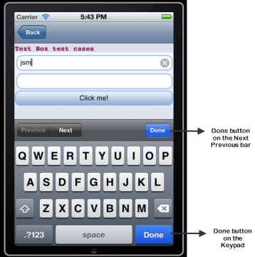

TextBox Events
==============

The TextBox widget has the following events associated with it:

* * *

<details close markdown="block"><summary>doLayout Event</summary>

* * *

This event is invoked for every widget when the widget position and dimensions are computed.

### Syntax

```

doLayout()
```

### Read/Write

Read + Write

### Remarks

This event is invoked for all the widgets placed inside flex containers. This event is invoked in the order in which the widgets are added to the widget hierarchy and expect the frame property of the widget is calculated and available for use within this event.

This event is used to set the layout properties of child widgets in the relation to self and peer widgets whose layout is not yet performed.

The number of times this event invoked may vary per platform. It is not recommended to write business logic assuming that this function is invoked only once when there is a change in positional or dimensional properties. This event will not trigger when transformations are applied though widget is moved or scaled or rotated from its original location.

### Example

```

//Sample code to set doLayout event callback to a button widget.
/*This code changes the top property of button2 and makes it appear below button1.*/
myForm.button1.doLayout=doLayoutButton1;


function doLayoutButton1(){
      
    myForm.button2.top = myForm.button1.frame.height;
}
```

### Platform Availability

*   iOS, Android, Windows, and SPA

* * *

</details>
<details close markdown="block"><summary>onBackKeyPress Event</summary>

* * *

* * *

This is event callback is invoked by the Android platform when the soft- keyboard is open and the back button of the device is clicked.

This event is not be triggered when you use gestures in the mobile device for back navigation.

### Syntax

```

onBackKeyPress()
```

### Read/Write

Read + Write

### Example

```

/*This event is triggered in both TextBox and TextArea widgets for Android platform.*/

/*This example demonstrates how to assign callback to onBackKeyPress event myTxtBox TextBox widget in frmTextBox FlexForm. Use the onBackKeyPress event in TextArea widget in a similar manner.*/
frmTextBox.myTxtBox.onBackKeyPress= onBackKeyPressCallback;

function onBackKeyPressCallback(wdgRef) {
 // handle the event here
 // wdgRef returns the handle of the widget.
}
```

### Platform Availability

*   Android

* * *

</details>
<details close markdown="block"><summary>onBeginEditing Event</summary>

* * *

This is an event callback that is invoked by the platform when the user clicks within the TextBox and is about to start editing.

### Syntax

```

onBeginEditing()
```

### Read/Write

Read + Write

### Example

```

//Sample code to set the onBeginEditing event callback to a TextBox widget.

frmTxtBox.myTxtBox.onBeginEditing =onBeginEditingCallback;

function onBeginEditingCallback(txtBox){
      //Write your logic here.
}

```

### Platform Availability

*   Available in the IDE
*   iOS, Android, and Desktop Web  
    

* * *

</details>
<details close markdown="block"><summary>onCancel Event</summary>

* * *

This event is a callback that is invoked by the platform then the user performs a click action on the _Cancel_ button.

### Syntax

```

onCancel()
```

### Read/Write

Read + Write

### Remarks

This event is triggered only when the viewType is set as TEXTBOX\_VIEW\_TYPE\_SEARCH\_VIEW.

### Example

```

//Sample code to set the onCancel event callback to a TextBox widget.

frmTxtBox.myTxtBox.onCancel=onCancelCallback;

function onCancelCallback(eventobject){
      //Write your logic here.
}

```

### Availability

*   iOS

* * *

</details>
<details close markdown="block"><summary>onDone Event</summary>

* * *

This event is a callback that is invoked by the platform then the user performs a click action on the _Go_ or _Enter_ button.

### Syntax

```

onDone()
```

### Read/Write

Read + Write

### Remarks

In Desktop Web platform, this event is fired when the enter key is pressed when the textbox has focus.

### Example

```

//Sample code to set the onDone event callback to a TextBox widget.

frmTxtBox.myTxtBox.onDone=onDoneCallback;

function onDoneCallback(txtBox){
      //Write your logic here.
}

```

### Availability

*   Available in the IDE
*   Available on all platforms.

* * *

</details>
<details close markdown="block"><summary>onEndEditing Event</summary>

* * *

This is an event callback that is invoked by the platform.

### Syntax

```

onEndEditing()
```

### Read/Write

Read + Write

### Remarks

When the user performs one of the below actions:

*   Click on any other focusable widget(for example, another TextBox)
*   Click on the **Done** button on the **Next Previous** bar.
*   Click on the **Done** button on the keypad.

When you click on the **Done** button of the keypad the following events take place in a sequence:

*   onendediting
*   ondone

In Android platform, onEndEditing event will be triggered when the focus is lost from the textbox. Example, click on any other focusable widget, like a Button.

> 

### Example

Please note that the use of alerts is not recommended inside the event handler. Print statements are recommended.

```

//Sample code to set the onEndEditing event callback to a TextBox widget.

frmTxtBox.myTxtBox.onEndEditing=onEndEditingCallback;

function onEndEditingCallback(txtBox){
      //Write your logic here.
}

```

### Availability

*   iOS and Android

* * *

</details>
<details close markdown="block"><summary>onFocus Event</summary>

* * *

An event that accepts a callback function as an input and executes the functionality defined in the callback function when the widget is in focus.

### Syntax

```
onFocus()
```

### Input Parameters

Callback function

A function that contains the logic to be implemented when the widget is in focus.

The callback function of the onFocus Event contains a new parameter, **activeElement**. The activeElement parameter specifies the widget that is currently in focus.

### Read/Write

Read + Write

### Remarks

Assign a null value to the onFocus event of a widget to remove focus from the widget.

### Example

```
 //This is a generic event that is applicable for various widgets.
/* Here, we have shown how to use the onFocus event for a Button widget. 
   You need to make a corresponding use of the onFocus event for other 
   applicable widgets.*/
   
frmButton.myButton.onFocus = onFocusCallBack;

function onFocusCallBack(widget, activeElement) {
    console.log('onFocus event triggered');
}
```

Platform Availability

*   Available in the IDE
*   Available on the Responsive Web platform

* * *

</details>
<details close markdown="block"><summary>onKeyboardDidHide Event</summary>

* * *

* * *

This is event callback is invoked by the Android platform when the soft keyboard has been closed.

### Syntax

```

onKeyboardDidHide()
```

### Read/Write

Read + Write

### Example

```

/*This event is triggered in both TextBox and TextArea widgets for Android platform.*/

/*This example demonstrates how to assign callback to onKeyBoardDidHide event myTxtBox TextBox widget in frmTextBox FlexForm. Use the onKeyBoardDidHide event in TextArea widget in a similar manner.*/
frmTextBox.myTxtBox.onKeyboardDidHide = keyboardCallbacksDidHide;

function keyboardCallbacksDidHide(wdgRef) {
 // handle the event here
 // wdgRef returns the handle of the widget.
}
```

### Platform Availability

*   Android

* * *

</details>
<details close markdown="block"><summary>onKeyboardDidShow Event</summary>

* * *

* * *

This is event callback is invoked by the Android platform when the soft keyboard has been just brought into view.

### Syntax

```

onKeyboardDidShow()
```

### Read/Write

Read + Write

### Limitation

*   In Android platform, when you close the soft keyboard using back button, and then re-select the text by long-press in TextArea and TextBox widget, the `onKeyBoardDidShow` event is not triggered.

### Example

```

/*This event is triggered in both TextBox and TextArea widgets for Android platform.*/

/*This example demonstrates how to assign callback to onKeyBoardDidShow event myTxtBox TextBox widget in frmTextBox FlexForm. Use the onKeyBoardDidShow event in TextArea widget in a similar manner.*/
frmTextBox.myTxtBox.onKeyboardDidShow = keyboardCallbacksDidShow;

function keyboardCallbacksDidShow(wdgRef) {
 // handle the event here
 // wdgRef returns the handle of the widget.
}
```

### Platform Availability

*   Android

* * *

</details>
<details close markdown="block"><summary>onKeyboardWillHide Event</summary>

* * *

* * *

This is event callback is invoked by the Android platform when the soft keyboard is about to be hidden.

### Syntax

```

onKeyboardWillHide()
```

### Read/Write

Read + Write

### Example

```

/*This event is triggered in both TextBox and TextArea widgets for Android platform.*/

/*This example demonstrates how to assign callback to onKeyBoardWillHide event myTxtBox TextBox widget in frmTextBox FlexForm. Use the onKeyBoardWillHide event in TextArea widget in a similar manner.*/
frmTextBox.myTxtBox.onKeyboardWillHide = keyboardCallbacksWillHide;

function keyboardCallbacksWillHide(wdgRef) {
 // handle the event here
 // wdgRef returns the handle of the widget.
}
```

### Platform Availability

*   Android

* * *

</details>
<details close markdown="block"><summary>onKeyboardWillShow Event</summary>

* * *

* * *

This is event callback is invoked by the Android platform when the soft keyboard is about to be displayed.

### Syntax

```

onKeyboardWillShow()
```

### Read/Write

Read + Write

### Limitation

*   In Android platform, when you close the soft keyboard using back button, and then re-select the text by long-press in TextArea and TextBox widget, the `onKeyBoardWillShow` event is not triggered.

### Example

```

/*This event is triggered in both TextBox and TextArea widgets for Android platform.*/

/*This example demonstrates how to assign callback to onKeyBoardWillShow event myTxtBox TextBox widget in frmTextBox FlexForm. Use the onKeyBoardWillShow event in TextArea widget in a similar manner.*/
frmTextBox.myTxtBox.onKeyboardWillShow = keyboardCallbacksWillShow;

function keyboardCallbacksWillShow(wdgRef) {
 // handle the event here
 // wdgRef returns the handle of the widget.
}
```

### Platform Availability

*   Android

* * *

</details>
<details close markdown="block"><summary>onKeyDown Event</summary>

* * *

This is an event callback that is invoked by the platform when the user presses a key (on the keyboard).

### Syntax

```

onKeyDown()
```

### Read/Write

Read + Write

### Example

```

//Sample code to set the onKeyDown event callback to a TextBox widget.

frmTxtBox.myTxtBox.onKeyDown=onKeyDownCallback;

function onKeyDownCallback(txtBox){
      //Write your logic here.
}

```

### Platform Availability

*   Available in the IDE
*   Desktop Web

* * *

</details>
<details close markdown="block"><summary>onKeyUp Event</summary>

* * *

This is an event callback that is invoked by the platform when the user releases a key (on the keyboard).

### Syntax

```

onKeyUp()
```

### Read/Write

Read + Write

### Example

```

//Sample code to set the onKeyUp event callback to a TextBox widget.

frmTxtBox.myTxtBox.onKeyUp=onKeyUpCallback;

function onKeyUpCallback(txtBox){
      //Write your logic here.
}

```

### Platform Availability

*   Available in the IDE
*   Desktop Web

* * *

</details>
<details close markdown="block"><summary>onTextChange Event</summary>

* * *

This is an event callback triggered when text in the text box changes.

### Syntax

```

onTextChange()
```

### Read/Write

Read + Write

### Remarks

This event is not fired when the text is changed programmatically.

In SPA platform, this event is fired also when the focus is out after changing the text in the textbox.

### Example

```

//Sample code to set the onTextChange event callback to a TextBox widget.

frmTxtBox.myTxtBox.onTextChange=onTextChangeCallback;

function onTextChangeCallback(txtBox){
      //Write your logic here.
}

```

### Availability

*   Available in the IDE
*   Available on all platforms

* * *

</details>
<details close markdown="block"><summary>onTouchEnd Event</summary>

* * *

An event callback is invoked by the platform when the user touch is released from the touch surface.

### Syntax

```

onTouchEnd ()
```

### Optional Parameters

source

Handle to the widget reference on which the user touch has ended.

x

Specifies the x-coordinate with in the widget with respect to widget's co-ordinate system. It is a number indicating device independent pixel.

y

Specifies the y- coordinate with in the widget with respect to widget's co-ordinate system. It is a number indicating device independent pixel.

contextInfo

On devices that support 3D Touch, specifies a key-value pair where the value specifies the force of the touch. The value 1.0 represents the force of an average touch, as determined by the system.

> **_Note:_** 3D Touch is available only on iOS 9.0 and later.

### Read/Write

Read + Write

### Remarks

This event is invoked asynchronously.

### Example

```

function onTouchEndCallback(source, x, y, contextInfo) {
    if (contextInfo) {
        var force = contextInfo[“force”];
        voltmx.print(“value of force is” + force)
    }
}
Form1.widget1.onTouchEnd = onTouchEndCallback;
```

### Platform Availability

*   iOS, Android, Windows, and SPA

* * *

</details>
<details close markdown="block"><summary>onTouchMove Event</summary>

* * *

An event callback is invoked by the platform when the touch moves on the touch surface continuously until movement ends.

### Syntax

```

onTouchMove ()
```

### Optional Parameters

source

Handle to the widget reference on which touch moves.

x

Specifies the x-coordinate with in the widget with respect to widget's co-ordinate system. It is a number indicating device independent pixel.

y

Specifies the y- coordinate with in the widget with respect to widget's co-ordinate system. It is a number indicating device independent pixel.

contextInfo

On devices that support 3D Touch, specifies a key-value pair where the value specifies the force of the touch. The value 1.0 represents the force of an average touch, as determined by the system.

> **_Note:_** 3D Touch is available only on iOS 9.0 and later.

### Read/Write

Read + Write

### Remarks

This event is invoked asynchronously.

### Example

```

function onTouchMoveCallback(source, x, y, contextInfo) {
    if (contextInfo) {
        var force = contextInfo[“force”];
        voltmx.print(“value of force is” + force)
    }
    Form1.widget1.onTouchMove = onTouchMoveCallback;  

```

### Platform Availability

*   iOS, Android, Windows, and SPA

* * *

</details>
<details close markdown="block"><summary>onTouchStart Event</summary>

* * *

An event callback is invoked by the platform when the user touches the touch surface.

### Syntax

```

onTouchStart ()
```

### Optional Parameters

source

Handle to the widget reference on which the user touches.

x

Specifies the X co-ordinate with in the widget with respect to widget's co-ordinate system. It is a number indicating device independent pixel.

y

Specifies the Y co-ordinate with in the widget with respect to widget's co-ordinate system. It is a number indicating device independent pixel.

contextInfo

On devices that support 3D Touch, specifies a key-value pair where the value specifies the force of the touch. The value 1.0 represents the force of an average touch, as determined by the system.

> **_Note:_** 3D Touch is available only on iOS 9.0 and later.

### Read/Write

Read + Write

### Remarks

This event is invoked asynchronously.

### Example

```

function onTouchStartCallback(source, x, y, contextInfo) {
    if (contextInfo) {
        var force = contextInfo[“force”];
        voltmx.print(“value of force is” + force)
    }
}
Form1.widget1.onTouchStart = onTouchStartCallback;  

```

### Platform Availability

*   iOS, Android, Windows, and SPA

* * *

</details>
<details close markdown="block"><summary>onScrollWidgetPosition Event</summary>

* * *

This event callback is invoked by the platform when the widget location position gets changed on scrolling. The onScrollWidgetPosition event returns the positional coordinates of the widget's location with respect to the screen (screenX and screenY) and the parent container (frameX and frameY). This event is invoked asynchronously, and is not available for FlexForm widget.

### Syntax

```

onScrollWidgetPosition()
```

### Read/Write

Read + Write

### Example

```

var LabelWdg = new voltmx.ui.Label(basicConf, layoutConf, pspConf);
form.add(LabelWdg);
LabelWdg.onScrollWidgetPosition = onScrollWidgetPositionCallBack;

function onScrollWidgetPositionCallBack(wdg, screenX, screenY, frameX, frameY) { //wdg : Widget that is registered for onScrollWidgetPosition.
    /*screenX : Position of widget with respect to 
the screen's X - coordinates (after downsizing the navigation bar and status bar).*/
    /*screenY : Position of widget with respect to the screen's Y - 
coordinates (after downsizing the navigation bar and status bar).*/
    //frameX : Position of widget with respect to parent container's X- coordinates.
    //frameY : Position of widget with respect to parent container's Y- coordinates.
}
```

### Platform Availability

*   Not Accessible from IDE
*   Android, iOS, SPA, and Windows

* * *

</details>
<details close markdown="block"><summary>postOnclickJS Event</summary>

* * *

This event allows the developer to execute custom javascript function after the _onClick_ callback of the widget is invoked.

### Syntax

```

postOnclickJS()
```

### Read/Write

Read + Write

### Remarks

This is applicable only for Mobile Web channel.The function must exist in a javascript file under project>module>js folder.

### Example

```

//Sample code to set the postOnclickJS event callback to a TextBox widget.

frmTxtBox.myTxtBox.postOnclickJS=postOnclickJSCallback;

function postOnclickJSCallback(txtBox){
      //Write your logic here.
}

```

### Platform Availability

*   Available in the IDE
*   Available on Server side Mobile Web (Advanced) platform only

* * *

</details>
<details close markdown="block"><summary>preOnclickJS Event</summary>

* * *

This event allows the developer to execute custom javascript function before the _onClick_ callback of the widget is invoked.

### Syntax

```

preOnclickJS()
```

### Read/Write

Read + Write

### Remarks

This is applicable only for Mobile Web channel. The function must exist in a javascript file under project>module>js folder.

In for the events preOnclickJS and postOnclickJS you will not be able to access application model or APIs, as these functions are executed in browser whereas the remaining JS modules are executed in server. For these events you can access browser objects ( window, document etc..) to change UI or perform some validation before server event. If the event preOnclickJS returns true, only then the request is sent to server for subsequent action.  
  
You have to specify the modules to be loaded in browser using import JS tab, only then these files get included in.html script tag otherwise you will not be able to access the objects defined in those modules.

### Example

```

//Sample code to set the preOnclickJS event callback to a TextBox widget.

frmTxtBox.myTxtBox.preOnclickJS=preOnclickJSCallback;

function preOnclickJSCallback(txtBox){
      //Write your logic here.
}

```s

### Platform Availability

*   Available in the IDE
*   Available on Server side Mobile Web (BJS and Advanced) platform only

* * *
</details>

