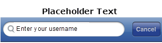
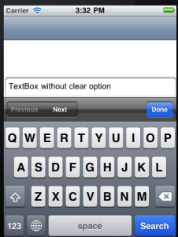
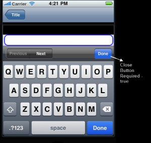

                                  
## <a id="textbox-properties"></a> TextBox Properties


The properties for TextBox widget are as follows.

* * *

### <details close markdown="block"><summary>accessibilityConfig Property</summary>

* * *

Enables you to control accessibility behavior and alternative text for the widget.

For more information on using accessibility features in your app, see the [Accessibility](../../../Iris/app_design_dev/Content/Accessibility_Overview.md) appendix in the Volt MX Iris User Guide.

**Syntax**

```

accessibilityConfig
```

**Type**

Object

**Read/Write**

Read + Write

**Remarks**

*   The accessibilityConfig property is enabled for all the widgets which are supported under the Flex Layout.

> **_Note:_** From Volt MX Iris V9 SP2 GA version, you can provide i18n keys as values to all the attributes used inside the `accessibilityConfig` property. Values provided in the i18n keys take precedence over values provided in `a11yLabel`, `a11yValue`, and `a11yHint` fields.

The accessibilityConfig property is a JavaScript object which can contain the following key-value pairs.

  
| Key | Type | Description | ARIA Equivalent |
| --- | --- | --- | --- |
| a11yIndex | Integer with no floating or decimal number. | This is an optional parameter. Specifies the order in which the widgets are focused on a screen. | For all widgets, this parameter maps to the `aria-index`, `index`, or `taborder` properties. |
| a11yLabel | String | This is an optional parameter. Specifies alternate text to identify the widget. Generally the label should be the text that is displayed on the screen. | For all widgets, this parameter maps to the `aria-labelledby` property of ARIA in HTML. > **_Note:_** For the Image widget, this parameter maps to the **alt** attribute of ARIA in HTML. |
| a11yValue | String | This is an optional parameter. Specifies the descriptive text that explains the action associated with the widget. On the Android platform, the text specified for a11yValue is prefixed to the a11yHint. | This parameter is similar to the a11yLabel parameter. If the a11yValue is defined, the value of a11yValue is appended to the value of a11yLabel. These values are separated by a space. |
| a11yHint | String | This is an optional parameter. Specifies the descriptive text that explains the action associated with the widget. On the Android platform, the text specified for a11yValue is prefixed to the a11yHint. | For all widgets, this parameter maps to the `aria-describedby` property of ARIA in HTML. |
| a11yHidden | Boolean | This is an optional parameter. Specifies if the widget should be ignored by assistive technology. The default option is set to _false_. This option is supported on iOS 5.0 and above, Android 4.1 and above, and SPA | For all widgets, this parameter maps to the `aria-hidden` property of ARIA in HTML. |
| a11yARIA | Object | This is an optional parameter. For each widget, the key and value provided in this object are added as the attribute and value of the HTML tags respectively. Any values provided for attributes such as `aria-labelledby` and `aria-describedby` using this attribute, takes precedence over values given in `a11yLabel` and `a11yHint` fields. When a widget is provided with the following key value pair or attribute using the a11yARIA object, the tabIndex of the widget is automatically appended as zero.`{"role": "main"}``aria-label` | This parameter is only available on the Desktop Web platform. |

**Android limitations**

*   If the results of the concatenation of a11y fields result in an empty string, then `accessibilityConfig` is ignored and the text that is on widget is read out.
*   The soft keypad does not gain accessibility focus during the right/left swipe gesture when the keypad appears.

**SPA/Desktop Web limitations**

*   When `accessibilityConfig` property is configured for any widget, the `tabIndex` attribute is added automatically to the `accessibilityConfig` property.
*   The behavior of accessibility depends on the Web browser, Web browser version, Voice Over Assistant, and Voice Over Assistant version.
*   Currently SPA/Desktop web applications support only a few ARIA tags. To achieve more accessibility features, use the attribute a11yARIA. The corresponding tags will be added to the DOM as per these configurations.

**Example 1**

This example uses the button widget, but the principle remains the same for all widgets that have an accessibilityConfig property.

```

//This is a generic property that is applicable for various widgets.
//Here, we have shown how to use the accessibilityConfig Property for button widget.
/*You need to make a corresponding use of the accessibilityConfig property for other applicable widgets.*/

Form1.myButton.accessibilityConfig = {
    "a11yLabel": "Label",
    "a11yValue": "Value",
    "a11yHint": "Hint"    
};
```

**Example 2**

This example uses the button widget to implement internationalization in `accessibilityConfig` property, but the principle remains the same for all widgets.

```

/*Sample code to implement internationalization in accessibilityConfig property in Native platform.*/

Form1.myButton.accessibilityConfig = {
    "a11yLabel": voltmx.i18n.getLocalizedString("key1")     
};  
/*Sample code to implement internationalization in accessibilityConfig property in Desktop Web platform.*/

Form1.myButton.accessibilityConfig = {
    "a11yLabel": "voltmx.i18n.getLocalizedString(\"key3\")"
};
```

**Platform Availability**

*   Available in the IDE
*   iOS, Android, SPA, and Desktop Web

* * *

</details>
### <details close markdown="block"><summary>anchorPoint Property</summary>

* * *

Specifies the anchor point of the widget bounds rectangle using the widget's coordinate space.

**Syntax**

```

anchorPoint
```

**Type**

JSObject

**Read/Write**

Read + Write

**Remarks**

The value for this property is a JavaScript dictionary object with the keys "x" and "y". The values for the "x" and "y" keys are floating-point numbers ranging from 0 to 1. All geometric manipulations to the widget occur about the specified point. For example, applying a rotation transform to a widget with the default anchor point causes the widget to rotate around its center.

The default value for this property is center ( {"x":0.5, "y":0.5} ), that represents the center of the widgets bounds rectangle. The behavior is undefined if the values are outside the range zero (0) to one (1).

**Example**

```

Form1.widget1.anchorPoint = {
    "x": 0.5,
    "y": 0.5
};
```

**Platform Availability**

*   iOS, Android, Windows, and SPA

* * *

</details>
### <details close markdown="block"><summary>autoCapitalize Property</summary>

* * *

Specifies the character capitalization behavior.

**Syntax**

```

autoCapitalize
```

**Type**

Number

**Read/Write**

Read + Write

**Remarks**

The default value for this property is TEXTBOX\_AUTO\_CAPITALIZE\_NONE.

For Desktop Web platform, autoCapitalize property is not supported, use the events [onBeginEditing](TextBox_Events.md#onbeginediting), [onEndEditing](TextBox_Events.md#onendedi), [onKeyUp](TextBox_Events.md#onKeyUp), [onKeyDown](TextBox_Events.md#onKeyDow), and [onDone](TextBox_Events.md#onDone) as necessary.

Following are the options available:

*   TEXTBOX\_AUTO\_CAPITALIZE\_NONE: If you leave this option unchanged, no action takes place on the input string.  
    Example:This is sample text.  
    
*   TEXTBOX\_AUTO\_CAPITALIZE\_WORDS: This option changes the first character of all the words to uppercase.  
    Example:This Is Sample Text.  
    
*   TEXTBOX\_AUTO\_CAPITALIZE\_SENTENCES: This option changes the first character of all the sentences to uppercase.  
    Example:This is sample text.  
    
*   TEXTBOX\_AUTO\_CAPITALIZE\_ALL: This option changes all the characters to uppercase.  
    Example:THIS IS SAMPLE TEXT.

Below is the browser specific limitations on SPA platform for the available options:

**Example**

```

//Sample code to set the autoCapitalize property of TextBox widget.

frmTxtBox.myTxtBox.autoCapitalize=constants.TEXTBOX_AUTO_CAPITALIZE_SENTENCES;
```

**Platform Availability**

*   Available in the IDE
*   Available on all platforms.
*   Available on the Desktop Web, SPA.

* * *

</details>
### <details close markdown="block"><summary>autoComplete Property</summary>

* * *

autoComplete property enables users to quickly find and select from a prepopulated list of values as they type, leveraging searching and filtering.

**Syntax**

```

autoComplete
```

**Type**

Boolean or String values mentioned [here](https://developer.mozilla.org/en-US/docs/Web/HTML/Attributes/autocomplete#values).

**Read/Write**

No

**Remarks**

The default value for this property is false.

If set to _true_, the word suggestion is enabled.

If set to _false_, the word suggestion is not enabled.

Below is the browser specific limitations on SPA platform when _autoComplete_ property is set to _true/false_.

<table style="mc-table-style: url('Resources/Stylesheets/Basic.css');width: 457px;" class="TableStyle-Basic" cellspacing="0"><colgroup><col style="width: 149px;" class="TableStyle-Basic-Column-Column1"> <col style="width: 167px;" class="TableStyle-Basic-Column-Column1"> <col class="TableStyle-Basic-Column-Column1"></colgroup><tbody><tr class="TableStyle-Basic-Body-Body1"><td class="TableStyle-Basic-BodyE-Column1-Body1" style="font-weight: bold;background-color: #005386;color: #ffffff;">Browsers/Devices</td><td class="TableStyle-Basic-BodyE-Column1-Body1" style="text-align: center;font-weight: bold;color: #ffffff;background-color: #005386;">True</td><td class="TableStyle-Basic-BodyD-Column1-Body1" style="text-align: center;font-weight: bold;color: #ffffff;background-color: #005386;">False</td></tr><tr class="TableStyle-Basic-Body-Body1"><td class="TableStyle-Basic-BodyE-Column1-Body1" style="font-weight: bold;">IE8</td><td class="TableStyle-Basic-BodyE-Column1-Body1" style="text-align: center;">Not supported</td><td class="TableStyle-Basic-BodyD-Column1-Body1" style="text-align: center;">Supported</td></tr><tr class="TableStyle-Basic-Body-Body1"><td class="TableStyle-Basic-BodyE-Column1-Body1" style="font-weight: bold;">IE9</td><td class="TableStyle-Basic-BodyE-Column1-Body1" style="text-align: center;">Not supported</td><td class="TableStyle-Basic-BodyD-Column1-Body1" style="text-align: center;">Supported</td></tr><tr class="TableStyle-Basic-Body-Body1"><td class="TableStyle-Basic-BodyE-Column1-Body1" style="font-weight: bold;">IE10</td><td class="TableStyle-Basic-BodyE-Column1-Body1" style="text-align: center;">Not supported</td><td class="TableStyle-Basic-BodyD-Column1-Body1" style="text-align: center;">Supported</td></tr><tr class="TableStyle-Basic-Body-Body1"><td class="TableStyle-Basic-BodyE-Column1-Body1" style="font-weight: bold;">Chrome 29.0</td><td class="TableStyle-Basic-BodyE-Column1-Body1" style="text-align: center;">Supported if form is submitted to an external url</td><td class="TableStyle-Basic-BodyD-Column1-Body1" style="text-align: center;">Supported</td></tr><tr class="TableStyle-Basic-Body-Body1"><td class="TableStyle-Basic-BodyE-Column1-Body1" style="font-weight: bold;">Firefox 23.0.0</td><td class="TableStyle-Basic-BodyE-Column1-Body1" style="text-align: center;">Supported if form is submitted to an external url</td><td class="TableStyle-Basic-BodyD-Column1-Body1" style="text-align: center;">Supported</td></tr><tr class="TableStyle-Basic-Body-Body1"><td class="TableStyle-Basic-BodyE-Column1-Body1" style="font-weight: bold;">Safari 5</td><td class="TableStyle-Basic-BodyE-Column1-Body1" style="text-align: center;">Not supported</td><td class="TableStyle-Basic-BodyD-Column1-Body1" style="text-align: center;">Supported</td></tr><tr class="TableStyle-Basic-Body-Body1"><td class="TableStyle-Basic-BodyE-Column1-Body1" style="font-weight: bold;">iPhone4 OS 4.2</td><td class="TableStyle-Basic-BodyE-Column1-Body1" style="text-align: center;">Not supported</td><td class="TableStyle-Basic-BodyD-Column1-Body1" style="text-align: center;">Supported</td></tr><tr class="TableStyle-Basic-Body-Body1"><td class="TableStyle-Basic-BodyE-Column1-Body1" style="font-weight: bold;">iPhone5 OS 6.1.3</td><td class="TableStyle-Basic-BodyE-Column1-Body1" style="text-align: center;">Not supported</td><td class="TableStyle-Basic-BodyD-Column1-Body1" style="text-align: center;">Supported</td></tr><tr class="TableStyle-Basic-Body-Body1"><td class="TableStyle-Basic-BodyE-Column1-Body1" style="font-weight: bold;">Android 2.3.3</td><td class="TableStyle-Basic-BodyE-Column1-Body1" style="text-align: center;">Not supported</td><td class="TableStyle-Basic-BodyD-Column1-Body1" style="text-align: center;">Supported</td></tr><tr class="TableStyle-Basic-Body-Body1"><td class="TableStyle-Basic-BodyE-Column1-Body1" style="font-weight: bold;">Android 4.2</td><td class="TableStyle-Basic-BodyE-Column1-Body1" style="text-align: center;">Not supported</td><td class="TableStyle-Basic-BodyD-Column1-Body1" style="text-align: center;">Supported</td></tr><tr class="TableStyle-Basic-Body-Body1"><td class="TableStyle-Basic-BodyB-Column1-Body1" style="font-weight: bold;">Windows</td><td class="TableStyle-Basic-BodyB-Column1-Body1" style="text-align: center;">Not supported</td><td class="TableStyle-Basic-BodyA-Column1-Body1" style="text-align: center;">Supported</td></tr></tbody></table>

**Example 1**

```

//Sample code to set the autoComplete property of TextBox widget.

frmTxtBox.myTxtBox.autoComplete=true;
```

**Example 2**

```
//Sample code to set a String value for the autoComplete property of TextBox widget.

var flx = new kony.ui.TextBox2({
    "autoComplete": "cc-number"
});
```

**Platform Availability**

*   Available in the IDE
*   SPA

* * *

</details>
### <details close markdown="block"><summary>autoCorrect Property</summary>

* * *

This property determines whether auto-correction is enabled or disabled during typing.

**Syntax**

```

autoCorrect
```

**Type**

Boolean

**Read/Write**

Read + Write

**Remarks**

With auto-correction enabled, the text object tracks unknown words and suggests a more suitable replacement candidate to the user, replacing the typed text automatically unless the user explicitly overrides the action.

The default value for this property is false.

If set to _true_, the auto correction option is enabled.

If set to _false_, the auto correction option is not enabled.

Below is the browser specific limitations on SPA platform when _autoCorrect_ property is set to _true/false_.

<table style="mc-table-style: url('Resources/Stylesheets/Basic.css');width: 457px;" class="TableStyle-Basic" cellspacing="0"><colgroup><col style="width: 149px;" class="TableStyle-Basic-Column-Column1"> <col style="width: 167px;" class="TableStyle-Basic-Column-Column1"> <col class="TableStyle-Basic-Column-Column1"></colgroup><tbody><tr class="TableStyle-Basic-Body-Body1"><td class="TableStyle-Basic-BodyE-Column1-Body1" style="font-weight: bold;background-color: #005386;color: #ffffff;">Browsers/Devices</td><td class="TableStyle-Basic-BodyE-Column1-Body1" style="text-align: center;font-weight: bold;color: #ffffff;background-color: #005386;">True</td><td class="TableStyle-Basic-BodyD-Column1-Body1" style="text-align: center;font-weight: bold;color: #ffffff;background-color: #005386;">False</td></tr><tr class="TableStyle-Basic-Body-Body1"><td class="TableStyle-Basic-BodyE-Column1-Body1" style="font-weight: bold;">IE8</td><td class="TableStyle-Basic-BodyE-Column1-Body1" style="text-align: center;">Not supported</td><td class="TableStyle-Basic-BodyD-Column1-Body1" style="text-align: center;">Supported</td></tr><tr class="TableStyle-Basic-Body-Body1"><td class="TableStyle-Basic-BodyE-Column1-Body1" style="font-weight: bold;">IE9</td><td class="TableStyle-Basic-BodyE-Column1-Body1" style="text-align: center;">Not supported</td><td class="TableStyle-Basic-BodyD-Column1-Body1" style="text-align: center;">Supported</td></tr><tr class="TableStyle-Basic-Body-Body1"><td class="TableStyle-Basic-BodyE-Column1-Body1" style="font-weight: bold;">IE10</td><td class="TableStyle-Basic-BodyE-Column1-Body1" style="text-align: center;">Not supported</td><td class="TableStyle-Basic-BodyD-Column1-Body1" style="text-align: center;">Supported</td></tr><tr class="TableStyle-Basic-Body-Body1"><td class="TableStyle-Basic-BodyE-Column1-Body1" style="font-weight: bold;">Chrome 29.0</td><td class="TableStyle-Basic-BodyE-Column1-Body1" style="text-align: center;">Not supported</td><td class="TableStyle-Basic-BodyD-Column1-Body1" style="text-align: center;">Supported</td></tr><tr class="TableStyle-Basic-Body-Body1"><td class="TableStyle-Basic-BodyE-Column1-Body1" style="font-weight: bold;">Firefox 23.0.0</td><td class="TableStyle-Basic-BodyE-Column1-Body1" style="text-align: center;">Not supported</td><td class="TableStyle-Basic-BodyD-Column1-Body1" style="text-align: center;">Supported</td></tr><tr class="TableStyle-Basic-Body-Body1"><td class="TableStyle-Basic-BodyE-Column1-Body1" style="font-weight: bold;">Safari 5</td><td class="TableStyle-Basic-BodyE-Column1-Body1" style="text-align: center;">Not supported</td><td class="TableStyle-Basic-BodyD-Column1-Body1" style="text-align: center;">Supported</td></tr><tr class="TableStyle-Basic-Body-Body1"><td class="TableStyle-Basic-BodyE-Column1-Body1" style="font-weight: bold;">iPhone4 OS 4.2</td><td class="TableStyle-Basic-BodyE-Column1-Body1" style="text-align: center;">Supported</td><td class="TableStyle-Basic-BodyD-Column1-Body1" style="text-align: center;">Supported</td></tr><tr class="TableStyle-Basic-Body-Body1"><td class="TableStyle-Basic-BodyE-Column1-Body1" style="font-weight: bold;">iPhone5 OS 6.1.3</td><td class="TableStyle-Basic-BodyE-Column1-Body1" style="text-align: center;">Supported</td><td class="TableStyle-Basic-BodyD-Column1-Body1" style="text-align: center;">Supported</td></tr><tr class="TableStyle-Basic-Body-Body1"><td class="TableStyle-Basic-BodyE-Column1-Body1" style="font-weight: bold;">Android 2.3.3</td><td class="TableStyle-Basic-BodyE-Column1-Body1" style="text-align: center;">Not supported</td><td class="TableStyle-Basic-BodyD-Column1-Body1" style="text-align: center;">Supported</td></tr><tr class="TableStyle-Basic-Body-Body1"><td class="TableStyle-Basic-BodyE-Column1-Body1" style="font-weight: bold;">Android 4.2</td><td class="TableStyle-Basic-BodyE-Column1-Body1" style="text-align: center;">Not supported</td><td class="TableStyle-Basic-BodyD-Column1-Body1" style="text-align: center;">Supported</td></tr><tr class="TableStyle-Basic-Body-Body1"><td class="TableStyle-Basic-BodyB-Column1-Body1" style="font-weight: bold;">Windows</td><td class="TableStyle-Basic-BodyB-Column1-Body1" style="text-align: center;">Not supported</td><td class="TableStyle-Basic-BodyA-Column1-Body1" style="text-align: center;">Supported</td></tr></tbody></table>

**Example**

```

//Sample code to set the autoCorrect property of TextBox widget.

frmTxtBox.myTxtBox.autoCorrect=true;
```

**Availability**

*   Available in the IDE
*   iOS
*   SPA

* * *

</details>
### <details close markdown="block"><summary>autoFilter Property</summary>

* * *

Specifies if the input characters you enter in the TextBox widget must be matched against the [filterList](#filterLi) and possible matches be displayed.

**Syntax**

```

autoFilter
```

**Type**

Boolean

**Remarks**

This property is applicable only if you set a [filterList](#filterLi).

**Default:**_false_ (the checkbox is not selected and the input characters are not matched against the filterlist)

If you want the input characters to be matched against the filterlist and possible matches to be displayed, set the value to _true_ (select the checkbox).

The following image illustrates the Auto Filter property:


On Windows platform, if you set the autoFilter property to true, the following additional properties are made available :

filterCriteria

Specifies the criteria with which the items attached to the filterlist are compared. You can select one of the following criteria:

> *   _None_ - No criteria is specified. If you leave the selection unchanged, the event associated with _[ontextchange](TextBox_Events.md#ontextchange)_ is triggered.
> *   _StartsWith_: Filters and displays all the values that start with the value defined in this mode.
> *   _StartsWithCaseSensitive_: Filters and displays all the values that start with the value defined in this mode with case sensitivity.
> *   _StartsWithOrdinal_: Filters and displays all the values that start with the sequence of values defined in this mode.
> *   _StartsWithOrdinalCaseSensitive_: Filters and displays all the values that start with the sequence of values defined in this mode with case sensitivity.
> *   _Contains_: Filters and displays all the values that contain the value defined in this mode.
> *   _ContainsCaseSensitive_: Filters and displays all the values that contain the value defined in this mode with case sensitivity.
> *   _ContainsOrdinal_: Filters and displays all the values that contain the sequence of values defined in this mode.
> *   _ContainsOrdinalCaseSensitive_: Filters and displays all the values that contain the sequence of values defined in this mode with case sensitivity.
> *   _Equals_: Filters and displays all the values that are equal to the value defined in this mode.
> *   _EqualsCaseSensitive_: Filters and displays all the values that are equal to the value defined in this mode with case sensitivity.
> *   _EqualsOrdinal_: Filters and displays all the values that are equal to the sequence of values defined in this mode.
> *   _EqualsOrdinalCaseSensitive_: Filters and displays all the values that are equal to the sequence of values defined in this mode with case sensitivity.

filterBoxSkin

Specifies the skin that must be applied to the box in which the filtered values are displayed.

**Example**

```

//Sample code to set the autoFilter property of TextBox widget.

frmTxtBox.myTxtBox.autoFilter=true;
```

**Availability**

*   Available in the IDE
*   Android
*   Windows

* * *

</details>
### <details close markdown="block"><summary>autoSuggestions Property</summary>

* * *

The autoSuggestions property is used to enable or disable suggestions such as spell checker, predictive text and corrections in the application.

**Syntax**

```

autoSuggestions
```

**Type**

Boolean

**Read/Write**

Read + Write

**Remarks**

The default value for this property is true.

*   If set to true, the autoSuggestions property is enabled.
*   If set to false, the autoSuggestions property is disabled.

The autoSuggestions property works only when auto suggestion options are enabled in device settings.

This property works only on devices which have Google keyboard. For example, Google Nexus.

**Example**

This example uses the textBox widget, but the principle remains the same for all widgets that have an autoSuggestions property.

```

//Setting the autoSuggestions property on an existing widget
Form1.textBox1.autoSuggestions = true;
```

**Platform Availability**

*   Available in the IDE
*   Android

* * *

</details>
### <details close markdown="block"><summary>backgroundColor Property</summary>

* * *

Specifies the background color of the widget.

**Syntax**

```

backgroundColor
```

**Type**

Color constant or Hexadecimal number

**Read/Write**

Read + Write

**Remarks**

*   The initial value of backgroundColor has to be specified explicitly. If not, Iris will not deduce the values from the existing skin and this will lead to undefined behavior.
*   Colors can be specified using a 6 digit or an 8-digit hex value with alpha position. For example, ffff65 or ffffff00.
*   When the 4-byte color format (RGBA) string is used, an alpha (A) value of 65 specifies that the color is transparent. If the value is 00, the color is opaque. The Alpha value is in percentage and must be given in the hexadecimal value for the color (100% in hexadecimal value is 65).  
    For example, red complete opaque is FF000000. Red complete transparent is FF000065. The values 0x and # are not allowed in the string.
*   A color constant is a String that is defined at the theme level. Ensure that you append the **$** symbol at the beginning of the color constant.
*   This property does not have a default value.
*   This property has more priority than (and overrides) the background property of the configured skin. Even if there is no skin configured for the widget, this property updates the skin.
*   The backgroundColor, backgroundColorTwoStepGradient, backgroundColoMultiStepGradient, and backgroundImage properties are mutually exclusive. The property that was set most recently is given higher priority over other properties.

**Example**

This example uses the button widget, but the principle remains the same for all widgets that have the backgroundColor property.

```

Form1.btn1.backgroundColor = "ea5075";
```

**Platform Availability**

*   Android
*   iOS
*   Desktop Web (Not available on Desktop Web Legacy SDK)

* * *

</details>
### <details close markdown="block"><summary>backgroundColorMultiStepGradient Property</summary>

* * *

Specifies the multi-step gradient color for the background of the widget.

**Syntax**

```

backgroundColorMultiStepGradient
```

**Type**

JSON Object

**Read/Write**

Read + Write

**Input Parameters**

*   **gradientType** \[Constant\]: Specifies the configuration type of the gradient. This parameter can have the following constant values:
    
    *   `voltmx.skin.MULTI_STEP_GRADIENT_TYPE_TO_TOP`: Constant for the gradient type toTop.
    *   `voltmx.skin.MULTI_STEP_GRADIENT_TYPE_TO_RIGHT`: Constant for the gradient type toRight.
    *   `voltmx.skin.MULTI_STEP_GRADIENT_TYPE_TO_BOTTOM`: Constant for the gradient type toBottom.
    *   `voltmx.skin.MULTI_STEP_GRADIENT_TYPE_TO_LEFT`: Constant for the gradient type toLeft.
    *   `voltmx.skin.MULTI_STEP_GRADIENT_TYPE_CUSTOM`: Constant for the gradient type custom.  
        For the custom gradient type, you must specify the angle by using the [angle](#angle) property.
*   **angle** \[Number\]: Specifies the angle for the gradient in degrees, counted counter-clockwise. This property is only applicable for the custom gradient type.
*   **colors** \[Array\]: Specifies the colors for the multi-step gradient. Colors is an array of color hex values that indicate the reference color values of the gradient. This parameter contains an array of hexadecimal numbers that represent the colors or constants defined at the theme level.
*   **colorStops** \[Array\]: Specifies the color stops for the multi-step gradient. Color Stops are the locations of the reference colors on the gradient, from 0 (the start of the gradient) to 100 (the final value of the gradient). This parameter contains an array of numbers that represent the color stops.

**Remarks**

*   The default value of the gradientType key is `voltmx.skin.MULTI_STEP_GRADIENT_TYPE_TO_TOP`.
*   Colors can be specified using a 6 digit or an 8-digit hex value with alpha position. For example, ffff65 or ffffff00.
*   When the 4-byte color format (RGBA) string is used, an alpha (A) value of 65 specifies that the color is transparent. If the value is 00, the color is opaque. The Alpha value is in percentage and must be given in the hexadecimal value for the color (100% in hexadecimal value is 65).  
    For example, red complete opaque is FF000000. Red complete transparent is FF000065. The values 0x and # are not allowed in the string.
*   A color constant is a String that is defined at the theme level. Ensure that you append the **$** symbol at the beginning of the color constant.
*   This property does not have a default value.
*   This property has more priority than (and overrides) the background property of the configured skin. Even if there is no skin configured for the widget, this property updates the skin.
*   The backgroundColor, backgroundColorTwoStepGradient, backgroundColoMultiStepGradient, and backgroundImage properties are mutually exclusive. The property that was set most recently is given higher priority over other properties.

**Example**

This example uses the button widget, but the principle remains the same for all widgets that have the backgroundColorMultiStepGradient property.

```

Form1.btn1.backgroundColorMultiStepGradient = {
    "gradientType": voltmx.skin.MULTI_STEP_GRADIENT_TYPE_CUSTOM  
    "angle": 45,
    "colors": ["ea5075", "f1fa70", "eefd04"],
    "colorStops": [0, 90, 100]
};
```

**Platform Availability**

*   Android
*   iOS
*   Desktop Web (Not available on Desktop Web Legacy SDK)

* * *

</details>
### <details close markdown="block"><summary>backgroundColorTwoStepGradient Property</summary>

* * *

Specifies the two-step gradient color for the background of the widget.

**Syntax**

```

backgroundColorTwoStepGradient
```

**Type**

JSON Object

**Read/Write**

Read + Write

**Input Parameters**

*   **topColor** \[Constant or Hex\]: Specifies the top color of the two-step gradient. The value of this parameter can be a hexadecimal number that represents a color or a constant that is defined at the theme level.
    
*   **bottomColor** \[Constant or Hex\]:Specifies the bottom color of the two-step gradient. The value of this parameter can be a hexadecimal number that represents a color or a constant that is defined at the theme level.
    
*   **style** \[Constant\]: Specifies the configuration style of the two-step gradient. This parameter can have the following constant values:
    
    *   `voltmx.skin.TWO_STEP_GRADIENT_STYLE_VERTICAL_GRADIENT`: Constant for the vertical gradient style.
    *   `voltmx.skin.TWO_STEP_GRADIENT_STYLE_VERTICAL_SPLIT`: Constant for the vertical split style.
    *   `voltmx.skin.TWO_STEP_GRADIENT_STYLE_HORIZONTAL_GRADIENT`: Constant for the horizontal gradient style.
    *   `voltmx.skin.TWO_STEP_GRADIENT_STYLE_HORIZONTAL_SPLIT`: Constant for the horizontal split style.

**Remarks**

*   The default value of the style key is `voltmx.skin.TWO_STEP_GRADIENT_STYLE_VERTICAL_GRADIENT`.
*   Colors can be specified using a 6 digit or an 8-digit hex value with alpha position. For example, ffff65 or ffffff00.
*   When the 4-byte color format (RGBA) string is used, an alpha (A) value of 65 specifies that the color is transparent. If the value is 00, the color is opaque. The Alpha value is in percentage and must be given in the hexadecimal value for the color (100% in hexadecimal value is 65).  
    For example, red complete opaque is FF000000. Red complete transparent is FF000065. The values 0x and # are not allowed in the string.
*   A color constant is a String that is defined at the theme level. Ensure that you append the **$** symbol at the beginning of the color constant.
*   This property does not have a default value.
*   This property has more priority than (and overrides) the background property of the configured skin. Even if there is no skin configured for the widget, this property updates the skin.
*   The backgroundColor, backgroundColorTwoStepGradient, backgroundColoMultiStepGradient, and backgroundImage properties are mutually exclusive. The property that was set most recently is given higher priority over other properties.

**Example**

This example uses the button widget, but the principle remains the same for all widgets that have the backgroundColorTwoStepGradient property.

```

Form1.btn1.backgroundColorTwoStepGradient = {  
     "topColor": "ea5075",  
    "bottomColor": "eefd04",  
    "style": voltmx.skin.TWO_STEP_GRADIENT_STYLE_VERTICAL_GRADIENT  
};
```

**Platform Availability**

*   Android
*   iOS
*   Desktop Web (Not available on Desktop Web Legacy SDK)

* * *

</details>
### <details close markdown="block"><summary>backgroundImage Property</summary>

* * *

Sets the image for the background of the widget.

**Syntax**

```

backgroundImage
```

**Type**

String

**Read/Write**

Read + Write

**Remarks**

*   This property does not have a default value.
*   This property has more priority than (and overrides) the background property of the configured skin. Even if there is no skin configured for the widget, this property updates the skin.
*   The backgroundColor, backgroundColorTwoStepGradient, backgroundColoMultiStepGradient, and backgroundImage properties are mutually exclusive. The property that was set most recently is given higher priority over other properties.

**Example**

This example uses the button widget, but the principle remains the same for all widgets that have the backgroundImage property.

```

Form1.btn1.backgroundImage = "bgImg.png";
```

**Platform Availability**

*   Android
*   iOS
*   Desktop Web (Not available on Desktop Web Legacy SDK)

* * *

</details>
### <details close markdown="block"><summary>blur Property</summary>

* * *

You can enable or disable a blur-effect for a widget(for example, a FlexContainer) by making use of a constructor-level property, called **blur**. The **blur** property accepts a dictionary that contains the following keys: enabled, value and style. You must specify an appropriate value for the dictionary keys, otherwise the property will not be valid.

**Syntax**

```

blur
```

**Input Parameters**

*   _enabled_: Accepts a Boolean value that basically decides whether to enable or disable the blur-effect for the widget. This is a mandatory attribute.
*   _value_: Level of the blur-effect that needs to be set for the widget. It should ideally be between 0 to 100. If the level is set as 0 no blur is set, even when the enabled property is set as true. This is a mandatory attribute. Even when the _enabled_ attribute is set as false, you need to specify a numerical value to this attribute.
    
*   _style_: Specifies the style in which the blur property can be applied to a widget. This is an optional parameter specific to iOS. The default value of this parameter is constants.BLUR\_EFFECT\_LIGHT. You can specify any of the following values to this parameter:  
    *   constants.BLUR\_EFFECT\_NONE
    *   constants.BLUR\_EFFECT\_EXTRALIGHT
        
    *   constants.BLUR\_EFFECT\_LIGHT (default)
    *   constants.BLUR\_EFFECT\_DARK
        
    *   constants.BLUR\_EFFECT\_REGULAR
        
    *   constants.BLUR\_EFFECT\_PROMINENT
        

**Read/Write**

Read + Write

**Remarks**

*   If you set _enabled_ as true, the blur-effect for the widget is enabled.
*   If you set _enabled_ as false, the blur-effect for the widget is disabled.
*   If you specify _value_ as less than 0, the value is taken as 0.
    
*   If you specify _value_ as greater than 100, the value is taken as 100.

**Limitations**

*   For Android:
    *   If a FlexContainer or a FlexScrollContainer contains a Map widget, the blur-effect is not applied to the map.
        
    *   If a FlexContainer or a FlexScrollContainer contains a Browser or Video widget, the blur-effect is applied but does not get updated. For example, when the video starts playing, the new rendered frame does not get displayed with the blur-effect.
        
    *   Even if you apply 100% blur for widgets that display any text( such as Label or Calendar widgets), the text on these widgets is not blurred. This is a Native Android limitation. To generate the blur effect for the text, apply a skin with darker background to the Label or Calendar widget. This is true even when the widgets are placed in a FlexContainer with blur effect and the widgets do not have a skin.
    *   Blur effect will not work on widgets added inside BOX containers.

**Example 1**

To dynamically set the blur-effect for any widget, such as a FlexContainer, use the following code.

```

//This is a generic property that is applicable for various widgets.
//Here, we have shown how to use the blur property for FlexContainer widget.
/*You need to make a corresponding use of the 
blur property for other applicable widgets.*/

Form1.myFlexContainer.blur = {
    "enabled": true,
    "value": 60
};

```

**Example 2**

To dynamically set the blur-effect for any widget, such as a FlexContainer in iOS, use the following code.

```

Form1.widget1.blur = {
    "enabled": true,
    "value": 60,
    "style": constants.BLUR_EFFECT_DARK
};
```

**Platform Availability**

*   Android, iOS, Windows, SPA , and Desktop web

* * *

</details>
### <details close markdown="block"><summary>borderColor Property</summary>

* * *

Specifies the border color of the widget.

**Syntax**

```

borderColor
```

**Type**

Color constant or Hexadecimal number

**Read/Write**

Read + Write

**Remarks**

*   Colors can be specified using a 6 digit or an 8-digit hex value with alpha position. For example, ffff65 or ffffff00.
*   When the 4-byte color format (RGBA) string is used, an alpha (A) value of 65 specifies that the color is transparent. If the value is 00, the color is opaque. The Alpha value is in percentage and must be given in the hexadecimal value for the color (100% in hexadecimal value is 65).  
    For example, red complete opaque is FF000000. Red complete transparent is FF000065. The values 0x and # are not allowed in the string.
*   A color constant is a String that is defined at the theme level. Ensure that you append the **$** symbol at the beginning of the color constant.
*   This property does not have a default value.
*   This property has more priority than (and overrides) the border property of the configured skin. Even if there is no skin configured for the widget, this property updates the skin.

**Example**

This example uses the button widget, but the principle remains the same for all widgets that have the borderColor property.

```

Form1.btn1.borderColor = "ea5075";
```

**Platform Availability**

*   Android
*   iOS
*   Desktop Web (Not available on Desktop Web Legacy SDK)

* * *

</details>
### <details close markdown="block"><summary>borderColorGradient Property</summary>

* * *

Specifies the multi-step gradient color for the border of the widget.

**Syntax**

```

borderColorGradient
```

**Type**

JSON Object

**Read/Write**

Read + Write

**Input Parameters**

*   **gradientType** \[Constant\]: Specifies the configuration type of the gradient. This parameter can have the following constant values:
    
    *   `voltmx.skin.MULTI_STEP_GRADIENT_TYPE_TO_TOP`: Constant for the gradient type toTop.
    *   `voltmx.skin.MULTI_STEP_GRADIENT_TYPE_TO_RIGHT`: Constant for the gradient type toRight.
    *   `voltmx.skin.MULTI_STEP_GRADIENT_TYPE_TO_BOTTOM`: Constant for the gradient type toBottom.
    *   `voltmx.skin.MULTI_STEP_GRADIENT_TYPE_TO_LEFT`: Constant for the gradient type toLeft.
    *   `voltmx.skin.MULTI_STEP_GRADIENT_TYPE_CUSTOM`: Constant for the gradient type custom.  
        For the custom gradient type, you must specify the angle by using the [angle](#angle) property.
*   **angle** \[Number\]: Specifies the angle for the gradient in degrees, counted counter-clockwise. This property is only applicable for the custom gradient type.
*   **colors** \[Array\]: Specifies the colors for the multi-step gradient. Colors is an array of color hex values that indicate the reference color values of the gradient. This parameter contains an array of hexadecimal numbers that represent the colors or constants defined at the theme level.
*   **colorStops** \[Array\]: Specifies the color stops for the multi-step gradient. Color Stops are the locations of the reference colors on the gradient, from 0 (the start of the gradient) to 100 (the final value of the gradient). This parameter contains an array of numbers that represent the color stops.

Remarks

*   The default value of the gradientType key is `voltmx.skin.MULTI_STEP_GRADIENT_TYPE_TO_TOP`.
*   Colors can be specified using a 6 digit or an 8-digit hex value with alpha position. For example, ffff65 or ffffff00.
*   When the 4-byte color format (RGBA) string is used, an alpha (A) value of 65 specifies that the color is transparent. If the value is 00, the color is opaque. The Alpha value is in percentage and must be given in the hexadecimal value for the color (100% in hexadecimal value is 65).  
    For example, red complete opaque is FF000000. Red complete transparent is FF000065. The values 0x and # are not allowed in the string.
*   A color constant is a String that is defined at the theme level. Ensure that you append the **$** symbol at the beginning of the color constant.
*   This property does not have a default value.
*   This property has more priority than (and overrides) the border property of the configured skin. Even if there is no skin configured for the widget, this property updates the skin.

**Example**

This example uses the button widget, but the principle remains the same for all widgets that have the borderColorGradient property.

```

Form1.btn1.borderColorGradient = {
    "gradientType": voltmx.skin.MULTI_STEP_GRADIENT_TYPE_CUSTOM  
    "angle": 45,
    "colors": ["ea5075", "f1fa70", "eefd04"],
    "colorStops": [0, 90, 100]
};
```

**Platform Availability**

*   Android
*   iOS

* * *

</details>
### <details close markdown="block"><summary>borderStyle Property</summary>

* * *

Specifies the border style for the widget.

**Syntax**

```

borderStyle
```

**Type**

Constant

**Read/Write**

Read + Write

**Remarks**

*   This property can have the following constant values:
    
    *   **voltmx.skin.BORDER\_STYLE\_PLAIN**: Constant for the plain border style.
    *   **voltmx.skin.BORDER\_STYLE\_ROUNDED\_CORNER**: Constant for the rounded corner style.
    *   **voltmx.skin.BORDER\_STYLE\_COMPLETE\_ROUNDED\_CORNER**: Constant for the complete rounded corner style.
    *   **voltmx.skin.BORDER\_STYLE\_CUSTOM**: Constant for the custom border style.
*   The cornerRadius property is only applicable when the borderStyle is voltmx.skin.BORDER\_STYLE\_CUSTOM.
*   This property does not have a default value.
*   This property has more priority than (and overrides) the border property of the configured skin. Even if there is no skin configured for the widget, this property updates the skin.

**Example**

This example uses the button widget, but the principle remains the same for all widgets that have the borderStyle property.

```

Form1.btn1.borderStyle = voltmx.skin.BORDER_STYLE_PLAIN;
```

**Platform Availability**

*   Android
*   iOS

* * *

</details>
### <details close markdown="block"><summary>borderWidth Property</summary>

* * *

Specifies the width of the border for the widget in pixels.

**Syntax**

```

borderWidth
```

**Type**

Number or JSON Object

**Read/Write**

Read + Write

**Remarks**

*   This property does not have a default value.
*   The default unit for the value of this property is pixels.
*   The Desktop Web platform supports both Number and JSON Object (with the top, bottom, right, and left keys) values for the borderWidth parameter. The Android and iOS platforms support only Number values for the borderWidth parameter.
*   This property has more priority than (and overrides) the border property of the configured skin. Even if there is no skin configured for the widget, this property updates the skin.

**Example**

This example uses the button widget, but the principle remains the same for all widgets that have the borderWidth property.

```

Form1.btn1.borderWidth = 2;
```

**Platform Availability**

*   Android
*   iOS
*   Desktop Web (Not available on Desktop Web Legacy SDK)

* * *

</details>
### <details close markdown="block"><summary>bottom Property</summary>

* * *

This property determines the bottom edge of the widget and is measured from the bottom bounds of the parent container.

The bottom property determines the position of the bottom edge of the widget’s bounding box. The value may be set using DP (Device Independent Pixels), Percentage, or Pixels. In freeform layout, the distance is measured from the bottom edge of the parent container. In flow-vertical layout, the value is ignored. In flow-horizontal layout, the value is ignored.

The bottom property is used only if the Height property is not provided.

**Syntax**

```

bottom
```

**Type**

String

**Read/Write**

Read + Write

**Remarks**

The property determines the bottom edge of the widget and is measured from the bottom bounds of the parent container.

If the layoutType is set as voltmx.flex.FLOW\_VERTICAL, the bottom property is measured from the top edge of bottom sibling widget. The vertical space between two widgets is measured from bottom of the top sibling widget and the top of the bottom sibling widget.

**Example**

```

//Sample code to set the bottom property for widgets by using DP, Percentage and Pixels.
frmHome.widgetID.bottom = "50dp";

frmHome.widgetID.bottom = "10%";

frmHome.widgetID.bottom = "10px";
```

**Platform Availability**

*   Available in the IDE
*   iOS, Android, Windows, SPA , and Desktop Web

* * *

</details>
### <details close markdown="block"><summary>centerX Property</summary>

* * *

This property determines the center of a widget measured from the left bounds of the parent container.

The centerX property determines the horizontal center of the widget’s bounding box. The value may be set using DP (Device Independent Pixels), Percentage, or Pixels. In freeform layout, the distance is measured from the left edge of the parent container. In flow-vertical layout, the distance is measured from the left edge of the parent container. In flow-horizontal layout, the distance is measured from the right edge of the previous sibling widget in the hierarchy.

**Syntax**

```

centerX
```

**Type**

String

**Read/Write**

Read + Write

**Remarks**

If the layoutType is set as voltmx.flex.FLOW\_HORIZONTAL, the centerX property is measured from right edge of the left sibling widget.

**Example**

```

//Sample code to set the centerX property for widgets by using DP, Percentage and Pixels.
frmHome.widgetID.centerX = "50dp";

frmHome.widgetID.centerX = "10%";

frmHome.widgetID.centerX = "10px";
```

**Platform Availability**

*   Available in the IDE
*   iOS, Android, Windows, SPA, and Desktop Web

* * *

</details>
### <details close markdown="block"><summary>centerY Property</summary>

* * *

This property determines the center of a widget measured from the top bounds of the parent container.

The centerY property determines the vertical center of the widget’s bounding box. The value may be set using DP (Device Independent Pixels), Percentage, or Pixels. In freeform layout, the distance is measured from the top edge of the parent container. In flow-horizontal layout, the distance is measured from the top edge of the parent container. In flow-vertical layout, the distance is measured from the bottom edge of the previous sibling widget in the hierarchy.

**Syntax**

```

centerY
```

**Type**

String

**Read/Write**

Read + Write

**Remarks**

If the layoutType is set as voltmx.flex.FLOW\_VERTICAL, the centerY property is measured from bottom edge of the top sibling widget.

**Example**

```

//Sample code to set the centerY property for widgets by using DP, Percentage and Pixels.
frmHome.widgetID.centerY = "50dp";

frmHome.widgetID.centerY = "10%";

frmHome.widgetID.centerY = "10px";
```

**Platform Availability**

*   Available in the IDE
*   iOS, Android, Windows, SPA, and Desktop Web

* * *

</details>
### <details close markdown="block"><summary>closeButtonText Property</summary>

* * *

Specifies the text to replace the "_Done_" button that appears in the Keypad (opens when you select a textbox).

**Syntax**

```

closeButtonText
```

**Type**

String

**Remarks**

The default value for this property is Done. The text on the close button is "Done".

If you want to change the text for the close button, enter the text of your choice. For example, if you want to change the text from Done to Go, enter Go in the property field. The following image illustrates the Keypad when the text in the property is changed to _Go_:


**Example**

```

//Sample code to set the closeButtonText property of TextBox widget.

frmTxtBox.myTxtBox.closeButtonText="Done";
```

**Availability**

*   Available in the IDE
*   Available on iPhone only

* * *

</details>
### <details close markdown="block"><summary>contentAlignment Property</summary>

* * *

This property specifies the alignment of the text on the widget with respect to its boundaries.

**Syntax**

```

contentAlignment
```

**Type**

Number

**Read/Write**

Read+Write

**Remarks**

The default value for the property is _CONTENT\_ALIGN\_CENTER_.

The following are the available options:

*   constants.CONTENT\_ALIGN\_TOP\_LEFT
*   constants.CONTENT\_ALIGN\_TOP\_CENTER
*   constants.CONTENT\_ALIGN\_TOP\_RIGHT
*   constants.CONTENT\_ALIGN\_MIDDLE\_LEFT
*   constants.CONTENT\_ALIGN\_CENTER
*   constants.CONTENT\_ALIGN\_MIDDLE\_RIGHT
*   constants.CONTENT\_ALIGN\_BOTTOM\_LEFT
*   constants.CONTENT\_ALIGN\_BOTTOM\_CENTER
*   constants.CONTENT\_ALIGN\_BOTTOM\_RIGHT

**Limitations**

Desktop Web/ SPA platforms do not support _contentAlignment_ property in Camera widget, ComboBox widget and ListBox widget.

**Example**

```

/*Sample code to set the contentAlignment property of the widgetID Button widget in frmHome Form.*/  
  
frmHome.widgetID.contentAlignment=constants.CONTENT_ALIGN_TOP_LEFT;  

```

**Platform Availability**

*   Available in IDE
*   Available on all platforms

* * *

</details>
### <details close markdown="block"><summary>cornerRadius Property</summary>

* * *

Specifies the radius of the border for the widget.

**Syntax**

```

cornerRadius
```

**Type**

Number or JSON Object

**Read/Write**

Read + Write

**Remarks**

*   The cornerRadius property is only applicable when the borderStyle is voltmx.skin.BORDER\_STYLE\_CUSTOM.
*   For a Responsive Web app, a corner radius of value zero applies a plain border, and a corner radius value greater than zero applies a rounded border.
*   The Android and Desktop Web platforms support both Number and JSON Object (with the top, bottom, right, and left keys) values for the cornerRadius parameter. The iOS platform supports only Number values for the cornerRadius parameter.
*   The default unit for the value of this property is pixels.
*   This property does not have a default value.
*   This property has more priority than (and overrides) the border property of the configured skin. Even if there is no skin configured for the widget, this property updates the skin.

**Example**

This example uses the button widget, but the principle remains the same for all widgets that have the cornerRadius property.

```

Form1.btn1.cornerRadius = 60;
```

**Platform Availability**

*   Android
*   iOS
*   Desktop Web (Not available on Desktop Web Legacy SDK)

* * *

</details>
### <details close markdown="block"><summary>cursorType Property</summary>

* * *

In Desktop Web applications, when you hover the mouse over any widget, a mouse pointer appears. Using the cursorType property in Iris, you can specify the type of the mouse pointer.

**Syntax**

```

cursorType
```

**Type**

String.

You must provide valid CSS cursor value such as wait, grab, help, etc. to the cursorType property.

**Read/Write**

Read + Write

**Remarks**

To add the `cursorType` property using Volt MX Iris in a Desktop Web application, follow these steps.

1.  In Volt MX Iris, open the Desktop Web application. From the **Project** explorer, expand **Responsive Web/ Desktop**\> **Forms** and select the form to which you need to make the changes.
2.  On the canvas, select the widget for which you want to specify the cursor type. For example, button.
3.  From the **Properties** panel, navigate to the **Skin** tab > **Hover Skin** tab.  
    You will find that the details of the hover skin is not enabled here.
4.  Check the **Enable** option to add a hover skin to your widget.  
    The details and configurations of the hover skin is enabled.
5.  Under the **General** section, for the Platform option, click the ellipsis icon.  
    The **Fork Skin** window appears.
6.  In the **Fork Skin** window, for **Desktop**, check under **HTML5 SPA**.
7.  Click **Ok**. You have successfully forked your hover skin for Desktop Web application.  
    You can see that the **Cursor Type** property has been added under the **General** section.
8.  Select a value from the drop-down list to set the **Cursor Type** for the widget.

**Example**

```

//This is a generic property and is applicable for many widgets.  
  
/*The example provided is for the Button widget. Make the required changes in the example while using other widgets.*/
  
frmButton.myButton.cursorType = "wait";

```

**Platform Availability**

*   Available in IDE
*   Desktop Web

* * *

</details>
### <details close markdown="block"><summary>disabledStateSkinProperties Property</summary>

* * *

Specifies the skin properties that define the look and feel of the widget, when the widget is disabled or blocked.

**Syntax**

```

disabledStateSkinProperties
```

**Type**

JSON Object

**Read/Write**

Read + Write

**Remarks**

*   This property does not have a default value.
*   This property has more priority than (and overrides) the disabledSkin property of the configured skin. Even if there is no skin configured for the widget, this property updates the skin.

**Example**

This example uses the button widget, but the principle remains the same for all widgets that have the disabledStateSkinProperties property.

```

Form1.btn1.disabledStateSkinProperties= {  
     background: {  
        backgroundType: voltmx.skin.BACKGROUND_TYPE_MULTI_STEP_GRADIENT,  
        backgroundColorMultiStepGradient : {  
            gradientType: voltmx.skin.MULTI_STEP_GRADIENT_TYPE_TO_TOP,  
            colors: ["ea5075", "f1fa70", "eefd04"],  
            colorStops: [0, 90, 100]  
        },  
    },  
    border: {  
        borderType: voltmx.skin.BORDER_TYPE_SINGLE_COLOR,  
        borderColor: "ea5075",  
        borderStyle: voltmx.skin.BORDER_STYLE_PLAIN,  
        borderWidth: 50  
    },  
    fonts: {  
        fontColor: "ea5075",  
        fontFamily: "Serif",  
        fontSize: '100',  
        fontStyle: voltmx.skin.FONT_STYLE_NONE,  
        fontWeight: voltmx.skin.FONT_WEIGHT_NORMAL  
    },  
    textShadow: {  
        textShadowRadius: 5,  
        textShadowColor: "ea5075",  
        textShadowOffset: {  
            x: 20,  
            y: 4  
        }  
    }
```

**Platform Availability**

*   Android

* * *

* * *

</details>
### <details close markdown="block"><summary>enable Property</summary>

* * *

The `enable` property is used to control the actionability of the widgets. In a scenario where you want to display a widget but not invoke any action on the widget, configure the `enable` property to false to achieve it.

This is a constructor level property and applicable for all widgets in Volt MX Iris.

**Syntax**

```

enable
```

**Type**

Boolean

**Read/Write**

Read + Write

**Remarks**

The default value of this property is true.

When `enable` property is configured to true, the action associated with a widget can be invoked by the user in the application.

When `enable` property is configured to false, the action associated with a widget cannot be invoked by the user in the application.

**Example**

```

//This is a generic property and is applicable for many widgets.  
  
/*The example provided is for the Button widget. Make the changes required in the example while using other widgets.*/
  
frmButton.myBtn.enable= true;
```

**Platform Availability**

*   Android, iOS, Windows, SPA, and Desktop web

* * *

</details>
### <details close markdown="block"><summary>enableCache Property</summary>

* * *

The property enables you to improve the performance of Positional Dimension Animations.

**Syntax**

```

enableCache
```

**Type**

Boolean

**Read/Write**

Read + Write

**Remarks**

The default value for this property is true.

> **_Note:_** When the property is used, application consumes more memory. The usage of the property enables tradeoff between performance and visual quality of the content. Use the property cautiously.

**Example**

```

Form1.widgetID.enableCache = true;
```

**Platform Availability**

*   Available in the IDE.
*   Windows

* * *

</details>
### <details close markdown="block"><summary>enableHapticFeedback Property</summary>

* * *

Allows you to enable or disable haptic feedback on the TextBox widget.

> **_Note:_** Haptic feedback is provided on the Copy, Cut, and Paste options.

**Syntax**

```

enableHapticFeedback
```

**Type**

Boolean.  
If the enableHapticFeedback property is not specified, haptic feedback is not enabled on the TextBox widget.

**Read/Write**

Read + Write

**Remarks**

*   iOS
    
    *   The Haptic Feedback feature is available on iPhone 7 devices and later. These devices have Taptic Engine hardware and users can enable/disable Haptics from Device Settings-> Sounds & Haptics-> System Haptics.
*   Android
    *   Users can enable the Vibrate on touch feature from Settings-> Sound & notification-> Other sounds.
        

**Limitations and Behavior**

*   For iOS, haptic feedback is not supported for keyboard. Users can enable the haptic feedback functionality by configuring the TextBox widget\`s **onTextChange** event with the **performHapticFeedback** API. **selectAll**, **LookUp**, and **Share** do not support haptic feedback.
*   For Windows, haptic feedback is not available on keyboard.
*   This property is not applicable for Android. For Android, Native OS provides haptic feedback for keyboard. To disable haptic for keyboard, users can disable haptics from the device settings.
*   Haptic Feedback is supported on Windows devices with OS build version 10.0.16299.0 or later.

**Example**

```

//Sample code to set the enableHapticFeedback property of TextBox widget.

frmTxtBox.myTxtBox.enableHapticFeedback=true;
```

**Platform Availability**

*   iOS
*   Windows

* * *

</details>
### <details close markdown="block"><summary>filterList Property</summary>

* * *

The values you enter in the TextBox are matched against this list and possible matches are displayed.

**Syntax**

```

filterList
```

**Type**

Array

**Read/Write**

Write only

**Remarks**

For Android and Windows platforms, this property is applicable only if the [_autoFilter_](#autoFilt) property is set to _true_.

**Example**

```

//Sample code to set the filterlist property of TextBox widget.

frmTxtBox.myTxtBox.filterlist=["Aaaa", "Bbbb", "Cccc", "Dddd"];
```

**Availability**

*   Windows
*   Android

* * *

</details>
### <details close markdown="block"><summary>focusSkin Property</summary>

* * *

Specifies the look and feel of the widget when in focus.

**Syntax**

```

focusSkin
```

**Type**

String

**Read/Write**

Read + Write

**Example**

```

//Sample code to set the focusSkin property of TextBox widget.

frmTxtBox.myTxtBox.focusSkin="txtFSkin";
```

**Platform Availability**

*   Available in the IDE
*   Available on all platforms

* * *

</details>
### <details close markdown="block"><summary>focusStateSkinProperties Property</summary>

* * *

Specifies the skin properties that define the look and feel of the widget, when the widget is in focus.

**Syntax**

```

focusStateSkinProperties
```

**Type**

JSON Object

**Read/Write**

Read + Write

**Remarks**

*   This property does not have a default value.
*   This property has more priority than (and overrides) the focusSkin property of the configured skin. Even if there is no skin configured for the widget, this property updates the skin.

**Example**

This example uses the button widget, but the principle remains the same for all widgets that have the focusStateSkinProperties property.

```

Form1.btn1.focusStateSkinProperties = {  
     background: {  
        backgroundType: voltmx.skin.BACKGROUND_TYPE_MULTI_STEP_GRADIENT,  
        backgroundColorMultiStepGradient : {  
            gradientType: voltmx.skin.MULTI_STEP_GRADIENT_TYPE_TO_TOP,  
            colors: ["ea5075", "f1fa70", "eefd04"],  
            colorStops: [0, 90, 100]  
        }  
    },  
    border: {  
        borderType: voltmx.skin.BORDER_TYPE_SINGLE_COLOR,  
        borderColor: "ea5075",  
        borderStyle: voltmx.skin.BORDER_STYLE_PLAIN,  
        borderWidth: 5  
    },  
    fonts: {  
        fontColor: "ea5075",  
        fontFamily: "Serif",  
        fontSize: '100',  
        fontStyle: voltmx.skin.FONT_STYLE_NONE,  
        fontWeight: voltmx.skin.FONT_WEIGHT_NORMAL  
    },  
    textShadow: {  
        textShadowRadius: 5,  
        textShadowColor: "ea5075",  
        textShadowOffset: {  
            x: 20,  
            y: 4  
        }  
    }
```

**Platform Availability**

*   Android
*   iOS
*   Desktop Web (Not available on Desktop Web Legacy SDK)

* * *

* * *

</details>
### <details close markdown="block"><summary>fontColor Property</summary>

* * *

Specifies the font color of the widget.

**Syntax**

```

fontColor
```

**Type**

Color constant or Hexadecimal number

**Read/Write**

Read + Write

**Remarks**

*   Colors can be specified using a 6 digit or an 8-digit hex value with alpha position. For example, ffff65 or ffffff00.
*   When the 4-byte color format (RGBA) string is used, an alpha (A) value of 65 specifies that the color is transparent. If the value is 00, the color is opaque. The Alpha value is in percentage and must be given in the hexadecimal value for the color (100% in hexadecimal value is 65).  
    For example, red complete opaque is FF000000. Red complete transparent is FF000065. The values 0x and # are not allowed in the string.
*   A color constant is a String that is defined at the theme level. Ensure that you append the **$** symbol at the beginning of the color constant.
*   This property does not have a default value.
*   This property has more priority than (and overrides) the fonts property of the configured skin. Even if there is no skin configured for the widget, this property updates the skin.

**Example**

This example uses the button widget, but the principle remains the same for all widgets that have the fontColor property.

```

Form1.btn1.fontColor = "ea5075";
```

**Platform Availability**

*   Android
*   iOS
*   Desktop Web (Not available on Desktop Web Legacy SDK)

* * *

</details>
### <details close markdown="block"><summary>fontFamily Property</summary>

* * *

Specifies the font family for the font of the widget.

**Syntax**

```

fontFamily
```

**Type**

String

**Read/Write**

Read + Write

**Remarks**

*   This property does not have a default value.
*   This property has more priority than (and overrides) the fonts property of the configured skin. Even if there is no skin configured for the widget, this property updates the skin.

**Example**

This example uses the button widget, but the principle remains the same for all widgets that have the fontFamily property.

```

Form1.btn1.fontFamily = "Serif";
```

**Platform Availability**

*   Android
*   iOS
*   Desktop Web (Not available on Desktop Web Legacy SDK)

* * *

</details>
### <details close markdown="block"><summary>fontSize Property</summary>

* * *

Specifies the font size for the widget in percentage (%) units.

**Syntax**

```

fontSize
```

**Type**

Number

**Read/Write**

Read + Write

**Remarks**

*   This property does not have a default value.
*   This property has more priority than (and overrides) the fonts property of the configured skin. Even if there is no skin configured for the widget, this property updates the skin.

**Example**

This example uses the button widget, but the principle remains the same for all widgets that have the fontSize property.

```

Form1.btn1.fontSize = 150;
```

**Platform Availability**

*   Android
*   iOS
*   Desktop Web (Not available on Desktop Web Legacy SDK)

* * *

</details>
### <details close markdown="block"><summary>fontStyle Property</summary>

* * *

Specifies the font style for the widget.

**Syntax**

```

fontStyle
```

**Type**

Constant

**Read/Write**

Read + Write

**Remarks**

*   This property can have the following constant values:
    
    *   **voltmx.skin.FONT\_STYLE\_NONE**: Constant for the normal font style.
    *   **voltmx.skin.FONT\_STYLE\_ITALIC**: Constant for the italic font style.
    *   **voltmx.skin.FONT\_STYLE\_UNDERLINE**: Constant for the underline font style.
*   This property does not have a default value.
*   This property has more priority than (and overrides) the fonts property of the configured skin. Even if there is no skin configured for the widget, this property updates the skin.

**Example**

This example uses the button widget, but the principle remains the same for all widgets that have the fontStyle property.

```

Form1.btn1.fontStyle = voltmx.skin.FONT_STYLE_NONE;
```

**Platform Availability**

*   Android
*   Desktop Web (Not available on Desktop Web Legacy SDK)

* * *

</details>
### <details close markdown="block"><summary>fontWeight Property</summary>

* * *

Specifies the weight for the font of the widget.

**Syntax**

```

fontWeight
```

**Type**

Constant

**Read/Write**

Read + Write

**Remarks**

*   This property can have the following constant values:
    
    *   **voltmx.skin.FONT\_WEIGHT\_NORMAL**: Constant for the normal font weight.
    *   **voltmx.skin.FONT\_WEIGHT\_BOLD**: Constant for the bold font weight.
*   This property does not have a default value.
*   This property has more priority than (and overrides) the fonts property of the configured skin. Even if there is no skin configured for the widget, this property updates the skin.

**Example**

This example uses the button widget, but the principle remains the same for all widgets that have the fontWeight property.

```

Form1.btn1.fontWeight = voltmx.skin.FONT_WEIGHT_NORMAL;
```

**Platform Availability**

*   Android
*   Desktop Web (Not available on Desktop Web Legacy SDK)

* * *

</details>
### <details close markdown="block"><summary>height Property</summary>

* * *

It determines the height of the widget and measured along the y-axis.

The height property determines the height of the widget’s bounding box. The value may be set using DP (Device Independent Pixels), Percentage, or Pixels. For supported widgets, the height may be derived from either the widget or container’s contents by setting the height to “preferred”.

**Syntax**

```

height
```

**Type**

Number, String, and Constant

**Read/Write**

Read + Write

**Remarks**

Following are the available measurement options:

*   %: Specifies the values in percentage relative to the parent dimensions.
*   px: Specifies the values in terms of device hardware pixels.
*   dp: Specifies the values in terms of device independent pixels.
*   default: Specifies the default value of the widget.
*   voltmx.flex.USE\_PREFERED\_SIZE: When this option is specified, the layout uses preferred height of the widget as height and preferred size of the widget is determined by the widget and may varies between platforms.

**Example**

```

/*Sample code to set the height property for a TextBox widget by using DP, Percentage and Pixels.*/
frmTxtBox.myTxtBox.height="50dp";

frmTxtBox.myTxtBox.height="10%";

frmTxtBox.myTxtBox.height="10px";

```

**Platform Availability**

*   Available in the IDE
*   iOS
*   Android
*   Windows
*   SPA

* * *

</details>
### <details close markdown="block"><summary>hoverSkin Property</summary>

* * *

Specifies the look and feel of a widget when the cursor hovers on the widget.

**Syntax**

```

hoverSkin
```

**Type**

String

**Read/Write**

Read + Write

**Example**

```

//Sample code to set the hoverSkin property of TextBox widget.

frmTxtBox.myTxtBox.hoverSkin="hSkin";
```

**Platform Availability**

*   Available in the IDE
*   Windows

* * *

</details>
### <details close markdown="block"><summary>hoverStateSkinProperties Property</summary>

* * *

Specifies the skin properties that define the look and feel of the widget, when the cursor hovers on the widget.

**Syntax**

```

hoverStateSkinProperties
```

**Type**

JSON Object

**Read/Write**

Read + Write

**Remarks**

*   This property does not have a default value.
*   This property has more priority than (and overrides) the hoverSkin property of the configured skin.

**Example**

This example uses the button widget, but the principle remains the same for all widgets that have the hoverStateSkinProperties property.

```

Form1.btn1.hoverStateSkinProperties = {  
     background: {  
        backgroundType: voltmx.skin.BACKGROUND_TYPE_MULTI_STEP_GRADIENT,  
        backgroundColorMultiStepGradient : {  
            gradientType: voltmx.skin.MULTI_STEP_GRADIENT_TYPE_TO_TOP,  
            colors: ["ea5075", "f1fa70", "eefd04"],  
            colorStops: [0, 90, 100]  
        }  
    },  
    border: {  
        borderType: voltmx.skin.BORDER_TYPE_SINGLE_COLOR,  
        borderColor: "ea5075",  
        borderStyle: voltmx.skin.BORDER_STYLE_PLAIN,  
        borderWidth: 5  
    },  
    fonts: {  
        fontColor: "ea5075",  
        fontFamily: "Serif",  
        fontSize: '100',  
        fontStyle: voltmx.skin.FONT_STYLE_NONE,  
        fontWeight: voltmx.skin.FONT_WEIGHT_NORMAL  
    },  
    textShadow: {  
        textShadowRadius: 5,  
        textShadowColor: "ea5075",  
        textShadowOffset: {  
            x: 20,  
            y: 4  
        }  
    }
```

**Platform Availability**

*   Desktop Web (Not available on Desktop Web Legacy SDK)

* * *

* * *

</details>
### <details close markdown="block"><summary>id Property</summary>

* * *

id is a unique identifier of TextBox consisting of alpha numeric characters. Every TextBox should have a unique id within a Form.

**Syntax**

```

id
```

**Type**

String

**Read/Write**

Read only

**Example**

```

//Defining the properties for a Textbox with id:"textBox1".
var txtBasic = {
    id: "textBox1",
    skin: "txtSkin",
    focusSkin: "txtFSkin",
    text: "Text",
    maxTextLength: 20,
    isVisible: true,
    secureTextEntry: true,
    placeholder: "enter text"
};

var txtLayout = {
    padding: [5, 5, 5, 5],
    margin: [5, 5, 5, 5],
    containerWeight: 100,
    hExpand: true,
    widgetAlignment: constants.WIDGET_ALIGN_TOP_LEFT
};

var txtPSP = {};

//Creating a Textbox.
var textBox1 = new voltmx.ui.TextBox2(txtBasic, txtLayout, txtPSP);

//Reading the id of the Textbox.		
alert("Textbox Id ::" + textBox1.id);
```

**Platform Availability**

*   Available in the IDE
*   Available on all platforms

* * *

</details>
### <details close markdown="block"><summary>imageForSearchBarBackground Property</summary>

* * *

Sets an image as the background for the TextBox widget in Search View.

**Syntax**

```

imageForSearchBarBackground
```

**Type**

String

**Read/Write**

Read + Write

**Remarks**

When using this property, ensure you set the ViewType property as TEXTBOX\_VIEW\_TYPE\_SEARCH\_VIEW.

**Example**

```

/*Sample code to set the imageForSearchBarBackground property of TextBox widget where image.png is an image file in the resources folder.*/

frmTxtBox.myTxtBox.imageForSearchBarBackground="image.png";
```

**Platform Availability**

Available on the iOS platform.

* * *

</details>
### <details close markdown="block"><summary>info Property</summary>

* * *

A custom JSObject with the key value pairs that a developer can use to store the context with the widget.

**Syntax**

```

info
```

**Type**

JSObject

**Read/Write**

Read + Write

**Remarks**

This will help in avoiding the globals to most part of the programming.

This is a **non-Constructor** property. You cannot set this property through widget constructor. But you can read and write data to it.

Info property can hold any JSObject. After assigning the JSObject to info property, the JSObject should not be modified. For example,

```

var inf = {
    a: 'hello'
};
widget.info = inf;
//works
widget.info.a = 'hello world';
/*This will not update the widget info a property to Hello world.
widget.info.a will have old value as hello.*/
```

**Example**

```

//Sample code to set the info property for a TextBox widget.
frmTxtBox.myTxtBox.info={
    key: "Textboxinfo"
};
//Reading info of the TextBox widget.
alert("TextBox widget info is ::" +frmTxtBox.myTxtBox.info);

```

**Platform Availability**

Available on all platforms

* * *

</details>
### <details close markdown="block"><summary>inputAccessoryViewType Property</summary>

* * *

While building iPhone applications that support or provide text input, it is necessary to create some extra buttons (or other controls) beyond the ones provided by the default keyboard interface. Volt MX Iris by default, adds the Previous, Next, and Done buttons to the applicable input controls. These buttons allow specific operations needed by your application, such as moving to the next or previous text field, making the keyboard disappear and so on. The area above the keyboard is known as Input Accessory View.

**Syntax**

```

inputAccessoryViewType
```

**Type**

Number

**Read/Write**

Yes

**Remarks**

The default value for this property is TEXTBOX\_INPUTACCESSORYVIEW\_DEFAULT.

This property, allows you to specify the type of accessory view that will be shown for all the input controls for **TextBox** widget.

> **_Note:_** For iOS, a header with 'Prev' and Next' buttons is added to the keypad by default. You can turn off this header at three levels: application-level, form-level, and widget-level.

To know more about how to set inputAccessoryViewType property at application-level and form-level, you can refer the [inputAccessoryViewType](FlexForm_Properties.md#inputAcc) property under Flexform widget.

To turn on/off the header at widget-level, assign any of the following constants to inputAccessoryViewType property. You must specify each constant with the ‘constants.xx’ prefix.

*   TEXTBOX\_INPUTACCESSORYVIEW\_NONE: Use this option if you do not want to specify the toolbar. This option should be used carefully, as setting this option for widgets like calendar leaves the user with no option to select and drop-down a wheel calendar.
*   TEXTBOX\_INPUTACCESSORYVIEW\_DEFAULT: Specifies that the toolbar that is defined in the Application level settings. To set the Application level settings, right-click on the project and navigate to **Properties> Native App>iPhone/iPad.**  
    
*   TEXTBOX\_INPUTACCESSORYVIEW\_NEXTPREV: Specifies the navigation options as Next, Previous, and Done for a form.

*   TEXTBOX\_INPUTACCESSORYVIEW\_CANCEL: Specifies that the input accessory view has a Cancel button. This option does not trigger any events.

**Example**

```

//Sample code to set the inputAccessoryViewType property of TextBox widget.

frmTxtBox.myTxtBox.inputAccessoryViewType=constants.TEXTBOX_INPUTACCESSORYVIEWTYPE_DEFAULT;
```

**Platform Availability**

*   Available in the IDE
*   iPhone
*   iPad

* * *

</details>
### <details close markdown="block"><summary>isSelectable Property</summary>

* * *

isSelectable property allows you to select the content inside a TextBox widget.

**Syntax**

```

isSelectable
```

**Type**

Boolean

**Read/Write**

Read + Write

**Remarks**

The default value for this property is true.

*   If set to _true_, the text in the TextBox Widget can be selected.
*   If set to _false_, the text in the TextBox Widget cannot be selected.

**Example**

```

myForm.myTextBox.isSelectable = false;  

```

**Platform Availability**

*   Not available from IDE
*   iOS

* * *

</details>
### <details close markdown="block"><summary>isSensitiveText Property</summary>

* * *

This property secures the text entered in the TextArea and TextBox widgets. This property helps you to control the lifetime of the user entered text in the application runtime memory.

> **_Note:_** In Android platform, when you enable the `isSensitiveText` property, the text property of TextArea and TextBox widget returns an instance of the [RawBytes](../../../Iris/iris_api_dev_guide/content/voltmx.types_objects_rawbytes.md) object. The RawBytes data type internally holds the text as a character array. The instance of the Rawbytes object must be cleared using the [clear](../../../Iris/iris_api_dev_guide/content/voltmx.types_objects_rawbytes.md#clear) API once the text read from the widget is not required.

**Syntax**

```

isSensitiveText
```

**Type**

Boolean

The default value of this property is false.

### Read/ Write

Read Only (Constructor- level property only)

**Remarks**

*   When you enable the `isSensitiveText` property,
    
    *   The user entered text is cleared automatically in the TextBox and TextArea widgets, when the user navigates to another Form or when the widget is removed through code. You must assign the entered text to another variable if you want to use the text later in the code.
    *   You must set the JavaScript text references to null, to clear the text from the memory, once the text is no longer required.
    
    *   Once the text is cleared, the string content in the memory will be removed in the next Garbage Collection cycle.
    *   In Android platform, you can use either the [readAsText](../../../Iris/iris_api_dev_guide/content/voltmx.types_objects_rawbytes.md#readAsText) method or the text property to access the user entered text.
*   In Android platform, when the TextBox or TextArea widget is placed inside a Segment widget, if you want to access the user entered text even after the widget is destroyed, use any of the following methods on the retrieved RawBytes object:
    *   Use the [clone](../../../Iris/iris_api_dev_guide/content/voltmx.types_objects_rawbytes.md#clone) API of the RawBytes object to create another RawBytes object. You can pass this cloned object into other APIs as required.
    *   Use either the [readAsText](../../../Iris/iris_api_dev_guide/content/voltmx.types_objects_rawbytes.md#readAsText) method or the text property.
*   When the `isSensitiveText` property is disabled, the entered text may be retained in the application runtime memory till the Form containing the TextBox or TextArea widget is destroyed.

Following image shows the field corresponding to `isSensitiveText` property in Iris.


**Example**

```

//This property is applicable for TextBox and TextArea widgets.

/*This example demonstrates how to use isSensitiveText property by using myTxtBox TextBox widget in frmTextBox FlexForm. You need to use isSensitiveText property for TextArea widget use voltmx.ui.TextArea2 API in a similar manner.*/

//Defining the properties for a Textbox with text:"Sample Text".
var myTxtBox = new voltmx.ui.TextBox2({
  id: "myTxtBox",
  skin: "txtSkin",
  focusSkin: "txtFSkin",
  text: "Sample Text",
  maxTextLength: 20,
  isVisible: true,
  isSensitiveText: true
}, {
  padding: [5, 5, 5, 5],
  margin: [5, 5, 5, 5],
  containerWeight: 100,
  hExpand: true,
  widgetAlignment: constants.WIDGET_ALIGN_TOP_LEFT
} {});
frmTxtBox.add(myTxtBox);

//Reading the text from the myTxtArea TextArea widget.
var textContent = frmTxtBox.myTxtBox.text;
var textAsString;

if (voltmx.type(textContent) == "voltmx.types.RawBytes") {
  //Using the readAsText method of the RawBytes object. //Call this method only if you must process the String in JavaScript.
  textAsString = textContent.readAsText();

  //Perform the required JS String manipulations on textAsString.

}
/*In Android platform, use the clear method of the Rawbytes object to remove the text references in the native Android RawBytes object.*/
if (voltmx.type(textContent) == "voltmx.types.RawBytes") {
  textContent.clear();
}   
/*You must set the JavaScript text references to null, to enable them to be Garbage Collected and cleared from memory*/
textContent = null;  
textAsString = null;
```

**Platform Availability**

*   Available in IDE
*   Android, iOS, and Desktop Web

* * *

</details>
### <details close markdown="block"><summary>isVisible Property</summary>

* * *

This property controls the visibility of a widget on the form.

**Syntax**

```

isVisible
```

**Type**

Boolean

**Read/Write**

Read + Write

**Remarks**

The default value for this property is true.

If set to _false_ the widget is not displayed.

If set to _true_ the widget is displayed.

**Example**

```

//Sample code to set the isVisible property of TextBox widget.

frmTxtBox.myTxtBox.isVisible=true;
```

> **_Note:_** In addition, the visibility of the widget can be controlled using the setVisibility method.

**Platform Availability**

*   Available in the IDE
*   Available on all platforms

* * *

</details>
### <details close markdown="block"><summary>keyboardActionLabel Property</summary>

* * *

Specifies the text to be displayed in action key of the keyboard.

**Syntax**

```

keyboardActionLabel
```

**Type**

Number

**Read/Write**

Read + Write

**Remarks**

The default value for this property is TEXTBOX\_KEYBOARD\_LABEL\_DONE.

The following are the available options on iOS platform:

*   TEXTBOX\_KEYBOARD\_LABEL\_DONE
*   TEXTBOX\_KEYBOARD\_LABEL\_GO
*   TEXTBOX\_KEYBOARD\_LABEL\_SEARCH
*   TEXTBOX\_KEYBOARD\_LABEL\_NEXT
*   TEXTBOX\_KEYBOARD\_LABEL\_SEND
*   TEXTBOX\_KEYBOARD\_LABEL\_GOOGLE
*   TEXTBOX\_KEYBOARD\_LABEL\_JOIN
*   TEXTBOX\_KEYBOARD\_LABEL\_ROUTE
*   TEXTBOX\_KEYBOARD\_LABEL\_YAHOO
*   TEXTBOX\_KEYBOARD\_LABEL\_CALL

The following are the available options on Android platform:

*   TEXTBOX\_KEYBOARD\_LABEL\_DONE
*   TEXTBOX\_KEYBOARD\_LABEL\_GO
*   TEXTBOX\_KEYBOARD\_LABEL\_SEARCH
*   TEXTBOX\_KEYBOARD\_LABEL\_NEXT
*   TEXTBOX\_KEYBOARD\_LABEL\_SEND
*   TEXTBOX\_KEYBOARD\_LABEL\_PREVIOUS

The following images illustrate the Keyboard label as _Done_ preserve">var var _Search_ respectively:

>   
> | Label - Done | Label - Search |
> | --- | --- |
> |  |  |

For the iOS platform, the Iris provides built-in support for navigating through widgets using Previous and Next buttons. The keyboardActionLabel property is used to modify the title of the Done button. Generally, the Done button is not for navigation purpose. If you want to get custom navigation behavior for the Done button's click event, you need to write the custom navigation logic using scrollTo/setFocus methods.

**Example**

```

//Sample code to set the keyboardActionLabel property of TextBox widget.

frmTxtBox.myTxtBox.keyboardActionLabel=constants.TEXTBOX_KEYBOARD_LABEL_SEARCH;
```

**Availability**

*   Available in the IDE
*   iPad
*   iPhone
*   Android

* * *

</details>
### <details close markdown="block"><summary>keyboardAppearance Property</summary>

* * *

Allows you to set the on screen keyboard to a dark or light color scheme.

**Syntax**

```

keyboardAppearance
```

**Type**

String

**Read/Write**

Read + Write

**Remarks**

Possible values are:

*   constants.TEXTBOX\_KEYBOARD\_COLOR\_LIGHT(Default)
*   constants.TEXTBOX\_KEYBOARD\_COLOR\_DARK

**Example**

```

Form1.textBox1.keyboardAppearence = constants.TEXTBOX_KEYBOARD_COLOR_LIGHT;
```

**Platform Availability**

*   iOS
*   Available in the IDE

* * *

</details>
### <details close markdown="block"><summary>keyBoardStyle Property</summary>

* * *

When you interact with a TextBox widget, a keyboard is displayed.

**Syntax**

```

keyBoardStyle
```

**Type**

Number

**Read/Write**

Read + Write

**Remarks**

You can use this property to select the type of keyboard that you want to display.

Keys on the keyboard style may vary from platform to platform.

On Desktop Web platform, `keyBoardStyle` property is not supported, use the events [onBeginEditing](TextBox_Events.md#onbeginediting), [onEndEditing](TextBox_Events.md#onendedi), [onKeyUp](TextBox_Events.md#onKeyUp), [onKeyDown](TextBox_Events.md#onKeyDow), and [onDone](TextBox_Events.md#onDone) as necessary.  

iPad device does not support constants.TEXTBOX\_KEY\_BOARD\_STYLE\_DECIMAL.

The following are the available keyboard types when you set the value of [textInputMode](#textInpu) as constants.TEXTBOX\_INPUT\_MODE\_NUMERIC.

*   constants.TEXTBOX\_KEY\_BOARD\_STYLE\_DEFAULT: Specifies the default numeric keyboard.  
      
    
*   constants.TEXTBOX\_KEY\_BOARD\_STYLE\_DECIMAL:Specifies the keyboard to enter decimals.  
      
    
*   constants.TEXTBOX\_KEY\_BOARD\_STYLE\_NUMBER\_PAD: Specifies the keyboard to enter numbers. (Not supported in Windows platform)  
      
    
*   constants.TEXTBOX\_KEY\_BOARD\_STYLE\_PHONE\_PAD: Specifies the keyboard to enter phone numbers. (Not supported in Windows platform)  
    
*   constants.TEXTBOX\_KEY\_BOARD\_STYLE\_SIGNED\_NUMBER: Specifies the keyboard to enter negative numbers( for example -345). This option is applicable to Android platform only.
*   constants.TEXTBOX\_KEY\_BOARD\_STYLE\_SIGNED\_DECIMAL\_NUMBER: Specifies the keyboard to enter negative decimal numbers (for example -345.87). This option is applicable to Android platform only.

The following are the available keyboard types when you select [textInputMode](#textInpu) as constants.TEXTBOX\_INPUT\_MODE\_DATETIME. These options are applicable only for Android platform.

*   constants.TEXTBOX\_KEY\_BOARD\_STYLE\_DATETIME
*   constants.TEXTBOX\_KEY\_BOARD\_STYLE\_DATE
*   constants.TEXTBOX\_KEY\_BOARD\_STYLE\_TIME

**Example**

```

//Sample code to set the keyBoardStyle property of TextBox widget.

frmTxtBox.myTxtBox.keyBoardStyle=constants.TEXTBOX_KEY_BOARD_STYLE_URL;
```

**Availability**

*   Available in the IDE
*   Available on all platforms except SPA.

### Properties combination and Behavior:

*   When `secureTextEntry` is true and `keyBoardStyle` is VOLTMX\_TEXTVIEW\_URL(10) then the text will not be secured and default keyboard will be displayed. (TEXTBOX\_KEY\_BOARD\_STYLE\_DEFAULT).
*   When `secureTextEntry` is true and `keyBoardStyle` is VOLTMX\_TEXTVIEW\_EMAIL(9) then the text will not be secured and the default keyboard appears. (TEXTBOX\_KEY\_BOARD\_STYLE\_DEFAULT).

* * *

</details>
### <details close markdown="block"><summary>left Property</summary>

* * *

This property determines the lower left corner edge of the widget and is measured from the left bounds of the parent container.

The left property determines the position of the left edge of the widget’s bounding box. The value may be set using DP (Device Independent Pixels), Percentage, or Pixels. In freeform layout, the distance is measured from the left edge of the parent container. In flow-vertical layout, the distance is measured from the left edge of the parent container. In flow-horizontal layout, the distance is measured from the right edge of the previous sibling widget in the hierarchy.

**Syntax**

```

left
```

**Type**

String

**Read/Write**

Read + Write

**Remarks**

If the layoutType is set as voltmx.flex.FLOW\_HORIZONTAL, the left property is measured from right edge of the left sibling widget.

**Example**

```

//Sample code to set the left property for widgets by using DP, Percentage and Pixels.
frmHome.widgetID.left = "50dp";

frmHome.widgetID.left = "10%";

frmHome.widgetID.left = "10px";
```

**Platform Availability**

*   Available in the IDE
*   iOS, Android, Windows, SPA, and Desktop Web

* * *

</details>
### <details close markdown="block"><summary>leftViewImage Property</summary>

* * *

Specifies an optional image to be displayed on the left-hand side of a TextBox widget.

**Syntax**

```

leftViewImage
```

**Type**

String / Image object

**Remarks**

For example, if you want a magnifying glass image to be displayed to indicate "Search" option, you can use this property to display the image.

The following image illustrates a TextBox widget with a Left View image:



**Example**

```

/*Sample code to set the leftViewImage property of TextBox widget where magnify.png is an image file in resources folder.*/

frmTxtBox.myTxtBox.leftViewImage="magnify.png";
```

Using an image object (voltmx.image) as the leftViewImage:

```

/*Sample code to set the leftViewImage property of TextBox widget where local.png is an image file in resources folder.*/
var imgObjRef = voltmx.image.createImage("local.png");
frmTxtBox.myTxtBox.leftViewImage=imgObjRef;
```

**Availability**

Available in the IDE

*   iOS

* * *

</details>
### <details close markdown="block"><summary>maxHeight Property</summary>

* * *

This property specifies the maximum height of the widget and is applicable only when the height property is not specified.

This property specifies the maximum height of the widget and is applicable only when the height property is not specified.

The maxHeight property determines the maximum height of the widget’s bounding box. The value may be set using DP (Device Independent Pixels), Percentage, or Pixels. The maxHeight value overrides the preferred, or “autogrow” height, if the maxHeight is less than the derived content height of the widget.

**Syntax**

```

maxHeight
```

**Type**

Number

**Read/Write**

Read + Write

**Example**

```

//Sample code to set the maxHeight property for widgets by using DP, Percentage and Pixels.
frmHome.widgetID.maxHeight = "50dp";

frmHome.widgetID.maxHeight = "10%";

frmHome.widgetID.maxHeight = "10px";
```

**Platform Availability**

*   Available in the IDE
*   iOS, Android, Windows, SPA, and Desktop Web

* * *

</details>
### <details close markdown="block"><summary>maxTextLength Property</summary>

* * *

Specifies the maximum number of characters that the text field can accept.

**Syntax**

```

maxTextLength
```

**Type**

Number

**Remarks**

The default value for this property is empty.

If you specify a number for this property, the number of input characters cannot exceed the specified number.

On support for this property depends on the device that support maxlength attribute for TextBox (HTML input tag), else this property is ignored.

**Read/Write**

Read + Write

**Example**

```

//Sample code to set the maxTextLength property of TextBox widget.

frmTxtBox.myTxtBox.maxTextLength=20;
```

**Availability**

*   Available in the IDE
*   Available on all platforms

* * *

</details>
### <details close markdown="block"><summary>maxWidth Property</summary>

* * *

This property specifies the maximum width of the widget and is applicable only when the width property is not specified.

The Width property determines the maximum width of the widget’s bounding box. The value may be set using DP (Device Independent Pixels), Percentage, or Pixels. The maxWidth value overrides the preferred, or “autogrow” width, if the maxWidth is less than the derived content width of the widget.

**Syntax**

```

maxWidth
```

**Type**

Number

**Read/Write**

Read + Write

**Example**

```

//Sample code to set the maxWidth property for widgets by using DP, Percentage and Pixels.
frmHome.widgetID.maxWidth = "50dp";

frmHome.widgetID.maxWidth = "10%";

frmHome.widgetID.maxWidth = "10px";
```

**Platform Availability**

*   Available in the IDE
*   iOS, Android, Windows, SPA, and Desktop Web

* * *

</details>
### <details close markdown="block"><summary>minHeight Property</summary>

* * *

This property specifies the minimum height of the widget and is applicable only when the height property is not specified.

The minHeight property determines the minimum height of the widget’s bounding box. The value may be set using DP (Device Independent Pixels), Percentage, or Pixels. The minHeight value overrides the preferred, or “autogrow” height, if the minHeight is larger than the derived content height of the widget.

**Syntax**

```

minHeight
```

**Type**

Number

**Read/Write**

Read + Write

**Example**

```

//Sample code to set the minHeight property for widgets by using DP, Percentage and Pixels.
frmHome.widgetID.minHeight = "50dp";

frmHome.widgetID.minHeight = "10%";

frmHome.widgetID.minHeight = "10px";
```

**Platform Availability**

*   Available in the IDE
*   iOS, Android, Windows, SPA, and Desktop Web

* * *

</details>
### <details close markdown="block"><summary>minWidth Property</summary>

* * *

This property specifies the minimum width of the widget and is applicable only when the width property is not specified.

The minWidth property determines the minimum width of the widget’s bounding box. The value may be set using DP (Device Independent Pixels), Percentage, or Pixels. The minWidth value overrides the preferred, or “autogrow” width, if the minWidth is larger than the derived content width of the widget.

**Syntax**

```

minWidth
```

**Type**

Number

**Read/Write**

Read only

**Example**

```

//Sample code to set the minWidth property for widgets by using DP, Percentage and Pixels.
frmHome.widgetID.minWidth = "50dp";

frmHome.widgetID.minWidth = "10%";

frmHome.widgetID.minWidth = "10px";
```

**Platform Availability**

*   Available in the IDE
*   iOS, Android, Windows, SPA, and Desktop Web

* * *

</details>
### <details close markdown="block"><summary>opacity Property</summary>

* * *

Specifies the opacity of the widget. The value of this property must be in the range 0.0 (transparent) to 1.0 (opaque). Any values outside this range are fixed to the nearest minimum or maximum value.

Specifies the opacity of the widget. Valid opacity values range from 0.0 (transparent), to 1.0 (opaque). Values set to less than zero will default to zero. Values more than 1.0 will default to 1. Interaction events set on a transparent widget will still be fired. To disable the events, also set the “isVisible” property to “false”.

**Syntax**

```

opacity
```

**Type**

Number

**Read/Write**

Read + Write

**Remarks**

> **_Note:_** This property has more priority compared to the values coming from the configured skin.

**Example**

```

//Sample code to make the widget transparent by using the opacity property.
frmHome.widgetID.opacity = 0;

//Sample code to make the widget opaque by using the opacity property.
frmHome.widgetID.opacity = 1;
```

**Platform Availability**

*   Not available in the IDE.
*   iOS, Android, Windows, SPA, and Desktop Web

* * *

</details>
### <details close markdown="block"><summary>padding Property</summary>

* * *

This property defines the space between the content of the widget and the widget boundaries. You can use this option to define the top, left, right, and bottom distance between the widget content and the widget boundary.

When you are defining the padding (for any platform) the _first_ time, the value that you enter in the padding field (top, left, right, or bottom) is auto-populated across all the platforms.

  
The following image illustrates a widget with a defined padding:


**Syntax**

```

padding
```

**Type**

Array of numbers

** Read / Write**

Read+Write

**Limitations**

*   Desktop Web/ SPA platforms do not support _padding_ property in Image widget, Slider widget and Switch widget.
*   If no skin is applied to a Button, then Padding is not supported on iPhone. This is due to iOS Safari browser limitation. If you want the padding to be applied, apply a skin to the button and then apply padding

**Example**

```

//Sample code to set the padding property for widgetID Button widget in frmHome Form.
frmHome.widgetID.padding= [2,2,2,2];
```

**Platform Availability**

*   Available in IDE
*   Android, iOS, Desktop Web and SPA

* * *

</details>
### <details close markdown="block"><summary>paddingInPixel Property</summary>

* * *

This property specifies whether the padding property is to be applied in pixels or in percentage.

**Syntax**

```

paddingInPixel
```

**Type**

Boolean

**Read/Write**

Read Only

**Remarks**

The default value of this property is _false_.

If the value of this property is _true,_ the padding are applied in pixels.

If the value of this property is _false,_ the padding are applied as set in [padding](#padding) property.

**Limitations**

Desktop Web/ SPA platforms do not support _paddingInPixel_ property in Image widget, Slider widget and Switch widget.

**Example**

```

//Sample code to read paddingInPixel property for widgetID Button widget in frmHome form.

voltmx.print("PaddingInPixel property value is:"+fromHome.widgetID.paddingInPixel);
```

**Platform Availability**

*   iOS, Android, Desktop Web and SPA.

* * *

</details>
### <details close markdown="block"><summary>parent Property</summary>

* * *

Helps you access the parent of the widget. If the widget is not part of the widget hierarchy, the parent property returns null.

**Syntax**

```

parent
```

**Read/Write**

Read only

**Remarks**

> **_Note:_** The property works for all the widgets inside a FlexForm, FlexContainer or FlexScrollContainer.

**Example**

```

function func() {

    voltmx.print("The parent of the widget" + JSON.stringify(Form1.widgetID.parent));

}
```

**Platform Availability**

*   Not available in the IDE
*   iOS, Android, Windows, SPA, and Desktop Web

* * *

</details>
### <details close markdown="block"><summary>pasteboardType Property</summary>

* * *

This property enables an application to share data within the application or with another application using system-wide or application-specific pasteboards.

**Syntax**

```

pasteboardType
```

**Type**

Number

**Read/Write**

Read + Write

**Remarks**

Typically, an object in the application writes data to a pasteboard when the user requests a copy or cut operation on a selection in the user interface. Another object in the same or different application then reads that data from the pasteboard and presents it to the user at a new location; this usually happens when the user requests a paste operation.

You can only paste the text to a textbox with the same pasteboard type as that of the source textbox. For example, if you set the Pasteboard type as applevelpersistent, you can paste the text only to another textbox whose pasteboard type is set to applevelpersistent.

The different Pasteboard types are:

*   TEXTBOX\_PASTE\_BOARD\_TYPE\_DEFAULT : If you select this option, the value selected in the application properties gets applied.
*   TEXTBOX\_PASTE\_BOARD\_TYPE\_SYSTEM\_LEVEL:This is the default selection and if this option is unchanged, the text copied from a Textbox can be pasted in Textboxes (with the pasteboard type set as systemlevel) across different applications on the device. Even if you exit the source application, the copied text persists in the memory and can be pasted across applications or within the same application.
*   TEXTBOX\_PASTE\_BOARD\_TYPE\_APP\_LEVEL\_PERSISTENT:If you select this option , the text copied from a Textbox can be pasted in Textboxes (with the pasteboard type set as applevel) within the same application. Even if you close the application, the copied text persists in the memory and can be copied to another textbox whose pasteboard type is applevel. For Example, when you restart that application.
*   TEXTBOX\_PASTE\_BOARD\_TYPE\_APP\_LEVEL\_NON\_PERSISTENT:If you select this option , the text copied from a Textbox can be pasted in Textboxes (with the pasteboard type set as (nonpersistent) within the same instance of the application. This text is not retained in the memory when you close the application.
*   TEXTBOX\_PASTE\_BOARD\_TYPE\_NO\_PASTE\_BOARD:Select this option if you want to disable copying the content from a TextBox.

**Example**

```

//Sample code to set the pasteboardType property of TextBox widget.

frmTxtBox.myTxtBox.pasteboardType=constants.TEXTBOX_PASTE_BOARD_TYPE_SYSTEM_LEVEL;
```

**Availability**

*   Available in the IDE
*   iPhone
*   iPad

* * *

</details>
### <details close markdown="block"><summary>placeholder Property</summary>

* * *

The placeholder attribute specifies a short hint that describes the expected value of an input field (example, a sample value or a short description of the expected format).

**Syntax**

```

placeholder
```

**Type**

String

**Read/Write**

Read + Write

**Remarks**

The hint is displayed in the input field when it is empty, and disappears when the field gets focus.

For example, for the Username field, you can enter the placeholder text as _Enter User ID or Email Address_. The user then clicks on the TextBox widget and enters the Username.

You must be aware of the following:  
\- If you specify text both in the [text](#text) property and the Placeholder property, the text entered in the [text](#text) property is displayed when rendered. If the user deletes the text, the placeholder text is displayed.  

The following image illustrates the placeholder text in a TextBox widget:


**Example**

```

//Sample code to set the placeholder property of TextBox widget.

frmTxtBox.myTxtBox.placeholder="Enter Text";
```

> **_Note:_** You can set the placeholder text from the code only on iPhone, Android, and Windows.

**Availability**

*   Available in the IDE
*   Available on all platforms

* * *

</details>
### <details close markdown="block"><summary>placeholderSkin Property</summary>

* * *

Specifies the skin to be applied to the placeholder text in the TextBox widget.

**Syntax**

```

placeholderSkin
```

**Type**

String

**Read/Write**

Read + Write

**Remarks**

Only the font color skin attribute is applicable.

The following image illustrates the placeholder text with a placeholder color applied:


**Example**

```

//Sample code to set the placeholderSkin property of TextBox widget.

frmTxtBox.myTxtBox.placeholderSkin="placeholderSkn";
```

> **_Note:_** You cannot specify an image as a skin for a placeholder as of now.

> **_Note:_** Android and Windows support change in font color only.

**Availability**

*   Available in the IDE
*   iPhone
*   iPad
*   Android

* * *

</details>
### <details close markdown="block"><summary>pressedStateSkinProperties Property</summary>

* * *

Specifies the skin properties that define the look and feel of the widget, when the widget is pressed or clicked.

**Syntax**

```

pressedStateSkinProperties
```

**Type**

JSON Object

**Read/Write**

Read + Write

**Remarks**

*   This property does not have a default value.
*   This property has more priority than (and overrides) the pressedSkin property of the configured skin. Even if there is no skin configured for the widget, this property updates the skin.

**Example**

This example uses the button widget, but the principle remains the same for all widgets that have the pressedStateSkinProperties property.

```

Form1.btn1.pressedStateSkinProperties = {  
     background: {  
        backgroundType: voltmx.skin.BACKGROUND_TYPE_MULTI_STEP_GRADIENT,  
        backgroundColorMultiStepGradient : {  
            gradientType: voltmx.skin.MULTI_STEP_GRADIENT_TYPE_TO_TOP,  
            colors: ["ea5075", "f1fa70", "eefd04"],  
            colorStops: [0, 90, 100]  
        }  
    },  
    border: {  
        borderType: voltmx.skin.BORDER_TYPE_SINGLE_COLOR,  
        borderColor: "ea5075",  
        borderStyle: voltmx.skin.BORDER_STYLE_PLAIN,  
        borderWidth: 5  
    },  
    fonts: {  
        fontColor: "ea5075",  
        fontFamily: "Serif",  
        fontSize: '100',  
        fontStyle: voltmx.skin.FONT_STYLE_NONE,  
        fontWeight: voltmx.skin.FONT_WEIGHT_NORMAL  
    },  
    textShadow: {  
        textShadowRadius: 5,  
        textShadowColor: "ea5075",  
        textShadowOffset: {  
            x: 20,  
            y: 4  
        }  
    }
```

**Platform Availability**

*   Android

* * *

* * *

</details>
### <details close markdown="block"><summary>retainContentAlignment Property</summary>

* * *

This property is used to retain the content alignment property value, as it was defined.

> **_Note:_** Locale-level configurations take priority when invalid values are given to this property, or if it is not defined.

The mirroring widget layout properties should be defined as follows.

```

function getIsFlexPositionalShouldMirror(widgetRetainFlexPositionPropertiesValue) {
    return (isI18nLayoutConfigEnabled &&
    localeLayoutConfig[defaultLocale]
    ["mirrorFlexPositionalProperties"] == true &&
    !widgetRetainFlexPositionPropertiesValue);
}
```

The following table illustrates how widgets consider Local flag and Widget flag values.

  
| Properties | Local Flag Value | Widget Flag Value | Action |
| --- | --- | --- | --- |
| Mirror/retain FlexPositionProperties | true | true | Use the designed layout from widget for all locales. Widget layout overrides everything else. |
| Mirror/retain FlexPositionProperties | true | false | Use Mirror FlexPositionProperties since locale-level Mirror is true. |
| Mirror/retain FlexPositionProperties | true | not specified | Use Mirror FlexPositionProperties since locale-level Mirror is true. |
| Mirror/retain FlexPositionProperties | false | true | Use the designed layout from widget for all locales. Widget layout overrides everything else. |
| Mirror/retain FlexPositionProperties | false | false | Use the Design/Model-specific default layout. |
| Mirror/retain FlexPositionProperties | false | not specified | Use the Design/Model-specific default layout. |
| Mirror/retain FlexPositionProperties | not specified | true | Use the designed layout from widget for all locales. Widget layout overrides everything else. |
| Mirror/retain FlexPositionProperties | not specified | false | Use the Design/Model-specific default layout. |
| Mirror/retain FlexPositionProperties | not specified | not specified | Use the Design/Model-specific default layout. |

**Syntax**

```

retainContentAlignment
```

**Type**

Boolean

**Read/Write**

No (only during widget-construction time)

**Example**

```

//This is a generic property that is applicable for various widgets.
//Here, we have shown how to use the retainContentAlignment property for Button widget.
/*You need to make a corresponding use of the 
retainContentAlignment property for other applicable widgets.*/
var btn = new voltmx.ui.Button({
    "focusSkin": "defBtnFocus",
    "height": "50dp",
    "id": "myButton",
    "isVisible": true,
    "left": "0dp",
    "skin": "defBtnNormal",
    "text": "text always from top left",
    "top": "0dp",
    "width": "260dp",
    "zIndex": 1
}, {
    "contentAlignment": constants.CONTENT_ALIGN_TOP_LEFT,
    "displayText": true,
    "padding": [0, 0, 0, 0],
    "paddingInPixel": false,
    "retainFlexPositionProperties": false,
    "retainContentAlignment": true
}, {});
```

**Platform Availability**

*   Available in IDE
*   Windows, iOS, Android, and SPA

* * *

</details>
### <details close markdown="block"><summary>retainFlexPositionProperties Property</summary>

* * *

This property is used to retain flex positional property values as they were defined. The flex positional properties are left, right, and padding.

> **_Note:_** Locale-level configurations take priority when invalid values are given to this property, or if it is not defined.

The mirroring widget layout properties should be defined as follows.

```

function getIsFlexPositionalShouldMirror(widgetRetainFlexPositionPropertiesValue) {
    return (isI18nLayoutConfigEnabled &&
    localeLayoutConfig[defaultLocale]
    ["mirrorFlexPositionalProperties"] == true &&
    !widgetRetainFlexPositionPropertiesValue);
}
```

The following table illustrates how widgets consider Local flag and Widget flag values.

  
| Properties | Local Flag Value | Widget Flag Value | Action |
| --- | --- | --- | --- |
| Mirror/retain FlexPositionProperties | true | true | Use the designed layout from widget for all locales. Widget layout overrides everything else. |
| Mirror/retain FlexPositionProperties | true | false | Use Mirror FlexPositionProperties since locale-level Mirror is true. |
| Mirror/retain FlexPositionProperties | true | not specified | Use Mirror FlexPositionProperties since locale-level Mirror is true. |
| Mirror/retain FlexPositionProperties | false | true | Use the designed layout from widget for all locales. Widget layout overrides everything else. |
| Mirror/retain FlexPositionProperties | false | false | Use the Design/Model-specific default layout. |
| Mirror/retain FlexPositionProperties | false | not specified | Use the Design/Model-specific default layout. |
| Mirror/retain FlexPositionProperties | not specified | true | Use the designed layout from widget for all locales. Widget layout overrides everything else. |
| Mirror/retain FlexPositionProperties | not specified | false | Use the Design/Model-specific default layout. |
| Mirror/retain FlexPositionProperties | not specified | not specified | Use the Design/Model-specific default layout. |

**Syntax**

```

retainFlexPositionProperties
```

**Type**

Boolean

**Read/Write**

No (only during widget-construction time)

**Example**

```

//This is a generic property that is applicable for various widgets.
//Here, we have shown how to use the retainFlexPositionProperties property for Button widget.
/*You need to make a corresponding use of the 
retainFlexPositionProperties property for other applicable widgets.*/
var btn = new voltmx.ui.Button({
    "focusSkin": "defBtnFocus",
    "height": "50dp",
    "id": "myButton",
    "isVisible": true,
    "left": "0dp",
    "skin": "defBtnNormal",
    "text": "always left",
    "top": "0dp",
    "width": "260dp",
    "zIndex": 1
}, {
    "contentAlignment": constants.CONTENT_ALIGN_CENTER,
    "displayText": true,
    "padding": [0, 0, 0, 0],
    "paddingInPixel": false,
    "retainFlexPositionProperties": true,
    "retainContentAlignment": false
}, {});
```

**Platform Availability**

*   Available in IDE
*   Windows, iOS, Android, and SPA

* * *

</details>
### <details close markdown="block"><summary>retainFlowHorizontalAlignment Property</summary>

* * *

This property is used to convert Flow Horizontal Left to Flow Horizontal Right.

> **_Note:_** Locale-level configurations take priority when invalid values are given to this property, or if it is not defined.

The mirroring widget layout properties should be defined as follows.

```

function getIsFlexPositionalShouldMirror(widgetRetainFlexPositionPropertiesValue) {
    return (isI18nLayoutConfigEnabled &&
    localeLayoutConfig[defaultLocale]
    ["mirrorFlexPositionalProperties"] == true &&
    !widgetRetainFlexPositionPropertiesValue);
}
```

The following table illustrates how widgets consider Local flag and Widget flag values.

  
| Properties | Local Flag Value | Widget Flag Value | Action |
| --- | --- | --- | --- |
| Mirror/retain FlexPositionProperties | true | true | Use the designed layout from widget for all locales. Widget layout overrides everything else. |
| Mirror/retain FlexPositionProperties | true | false | Use Mirror FlexPositionProperties since locale-level Mirror is true. |
| Mirror/retain FlexPositionProperties | true | not specified | Use Mirror FlexPositionProperties since locale-level Mirror is true. |
| Mirror/retain FlexPositionProperties | false | true | Use the designed layout from widget for all locales. Widget layout overrides everything else. |
| Mirror/retain FlexPositionProperties | false | false | Use the Design/Model-specific default layout. |
| Mirror/retain FlexPositionProperties | false | not specified | Use the Design/Model-specific default layout. |
| Mirror/retain FlexPositionProperties | not specified | true | Use the designed layout from widget for all locales. Widget layout overrides everything else. |
| Mirror/retain FlexPositionProperties | not specified | false | Use the Design/Model-specific default layout. |
| Mirror/retain FlexPositionProperties | not specified | not specified | Use the Design/Model-specific default layout. |

**Syntax**

```

retainFlowHorizontalAlignment
```

**Type**

Boolean

**Read/Write**

No (only during widget-construction time)

**Example**

```

//This is a generic property that is applicable for various widgets.
//Here, we have shown how to use the retainFlowHorizontalAlignment property for Button widget.
/*You need to make a corresponding use of the 
retainFlowHorizontalAlignment property for other applicable widgets. */
var btn = new voltmx.ui.Button({
 "focusSkin": "defBtnFocus",
 "height": "50dp",
 "id": "myButton",
 "isVisible": true,
 "left": "0dp",
 "skin": "defBtnNormal",
 "text": "always left",
 "top": "0dp",
 "width": "260dp",
 "zIndex": 1
}, {
 "contentAlignment": constants.CONTENT_ALIGN_CENTER,
 "displayText": true,
 "padding": [0, 0, 0, 0],
 "paddingInPixel": false,
 "retainFlexPositionProperties": true,
 "retainContentAlignment": false,
 "retainFlowHorizontalAlignment ": false
}, {});
```

**Platform Availability**

*   Available in IDE
*   Windows, iOS, Android, and SPA

* * *

</details>
### <details close markdown="block"><summary>restrictCharactersSet Property</summary>

* * *

This property restricts users from entering a set of input characters from the soft keyboard in the TextBox widget.

**Syntax**

```

restrictCharactersSet
```

**Type**

String

**Read/Write**

Read + Write

**Example**

```

Form1.textBox1.restrictCharactersSet =  "~#^|$%&*!";
```

**Platform Availability**

*   Available in the IDE
*   Android
*   iOS
*   SPA
*   Desktop Web

* * *

</details>
### <details close markdown="block"><summary>right Property</summary>

* * *

This property determines the lower right corner of the widget and is measured from the right bounds of the parent container.

The right property determines the position of the right edge of the widget’s bounding box. The value may be set using DP (Device Independent Pixels), Percentage, or Pixels. In freeform layout, the distance is measured from the left edge of the parent container. In flow-vertical layout, value is ignored. In flow-horizontal layout, the value is ignored.

The right property is used only if the width property is not provided.

**Syntax**

```

right
```

**Type**

String

**Read/Write**

Read + Write

**Remarks**

If the layoutType is set as voltmx.flex.FLOW\_HORIZONTAL, the right property is measured from left edge of the right sibling widget. The horizontal space between two widgets is measured from right of the left sibling widget and left of the right sibling widget.

**Example**

```

//Sample code to set the right property for widgets by using DP, Percentage and Pixels.
frmHome.widgetID.right = "50dp";

frmHome.widgetID.right = "10%";

frmHome.widgetID.right = "10px";
```

**Platform Availability**

*   Available in the IDE
*   iOS, Android, Windows, SPA, and Desktop Web

* * *

</details>
### <details close markdown="block"><summary>secureTextEntry Property</summary>

* * *

Specifies whether the text entered by the user will be secured using a mask character, such as asterisk or dot.

**Syntax**

```

secureTextEntry
```

**Type**

Boolean

**Read/Write**

Read + Write

**Remarks**

The default value for this property is false.

*   If set to _true_, the text in the TextBox will be masked.
*   If set to _false_, the text in the TextBox will be displayed as clear text.

This is typically set to _true_ for a password field.

**Example**

```

//Sample code to set the secureTextEntry property of TextBox widget.

frmTxtBox.myTxtBox.secureTextEntry=true;
```

**Platform Availability**

*   Available in the IDE
*   Available on all platforms except Desktop Web

* * *

</details>
### <details close markdown="block"><summary>setImportantForAutofill Property</summary>

* * *

setImportantForAutoFill property is used to specify whether a TextBox widget should be considered important for auto-fill or not.

**Syntax**

```

setImportantForAutofill
```

**Type**

Number

**Read/Write**

Read + Write

**Remarks**

The default value of `setImportantForAutofill` property is _constants.TEXT\_IMPORTANT\_FOR\_AUTOFILL\_AUTO_.

You can specify any of the following values to this property.

*   _constants.TEXT\_IMPORTANT\_FOR\_AUTOFILL\_AUTO_: When the setImportantForAutoFill property is set as this value, the
*   _constants.TEXT\_IMPORTANT\_FOR\_AUTOFILL\_NO_: When the setImportantForAutoFill property is set as this value for a TextBox widget, the widget is not considered for auto-fill by the
*   _constants.TEXT\_IMPORTANT\_FOR\_AUTOFILL\_YES_: When the setImportantForAutoFill property is set as this value for a TextBox widget, the widget is considered for auto-fill by the

**Example**

```

//Sample code to set the setImportantForAutofill property of TextBox widget.

frmTxtBox.myTxtBox.setImportantForAutofill=constants.TEXT_IMPORTANT_FOR_AUTOFILL_AUTO;
```

**Platform Availability**

*   Android

* * *

</details>
### <details close markdown="block"><summary>shadowColor Property</summary>

* * *

Specifies the color for the shadow of the widget.

**Syntax**

```

shadowColor
```

**Type**

Color constant or Hexadecimal number

**Read/Write**

Read + Write

**Remarks**

*   Colors can be specified using a 6 digit or an 8-digit hex value with alpha position. For example, ffff65 or ffffff00.
*   When the 4-byte color format (RGBA) string is used, an alpha (A) value of 65 specifies that the color is transparent. If the value is 00, the color is opaque. The Alpha value is in percentage and must be given in the hexadecimal value for the color (100% in hexadecimal value is 65).  
    For example, red complete opaque is FF000000. Red complete transparent is FF000065. The values 0x and # are not allowed in the string.
*   A color constant is a String that is defined at the theme level. Ensure that you append the **$** symbol at the beginning of the color constant.
*   This property does not have a default value.
*   This property has more priority than (and overrides) the shadow property of the configured skin. Even if there is no skin configured for the widget, this property updates the skin.

**Example**

This example uses the button widget, but the principle remains the same for all widgets that have the shadowColor property.

```

Form1.btn1.shadowColor = "ea5075";
```

**Platform Availability**

*   iOS
*   Desktop Web (Not available on Desktop Web Legacy SDK)

* * *

</details>
### <details close markdown="block"><summary>shadowDepth Property</summary>

* * *

Defines the depth of the shadow effect applied to the TextBox Widget.

**Syntax**

```

shadowDepth
```

**Type**

Number

**Read/Write**

Read + Write

**Remarks**

The depth of the shadow should be specified in DP (Device Independent Pixels) units. The higher the value of shadowDepth, the appearance of the TextBox Widget is elevated from the screen and the casted shadow becomes soft.

**Example**

```

//Sample code to set the shadowDepth property of TextBox widget.

frmTxtBox.myTxtBox.shadowDepth=10;

```

**Platform Availability**

*   Android 5.0 and later versions.

* * *

</details>
### <details close markdown="block"><summary>shadowOffset Property</summary>

* * *

This property specifies the current coordinates of the shadow region in the widget.

**Syntax**

```

shadowOffset
```

**Type**

JSON Object

**Read/Write**

Read + Write

**Remarks**

*   The JSON Object contains the X-coordinate and Y-coordinates for the offset in the following format:
    
    `{x: value in pixels, y: value in pixels}`
    
*   The default unit for the value of this property is pixels.
*   This property does not have a default value.
*   This property has more priority than (and overrides) the shadow property of the configured skin. Even if there is no skin configured for the widget, this property updates the skin.

**Example**

This example uses the button widget, but the principle remains the same for all widgets that have the shadowOffset property.

```

Form1.btn1.shadowOffset= {
    "x": "3",
    "y": "27"
};
```

**Platform Availability**

*   iOS
*   Desktop Web (Not available on Desktop Web Legacy SDK)

* * *

</details>
### <details close markdown="block"><summary>shadowRadius Property</summary>

* * *

Specifies the radius for the blur value of the shadow.

**Syntax**

```

shadowRadius
```

**Type**

Number

**Read/Write**

Read + Write

**Remarks**

*   The default value of the shadowRadius property for a Responsive Web app is 0.
*   The default unit for the value of this property is pixels.
*   This property does not have a default value.
*   This property has more priority than (and overrides) the shadow property of the configured skin. Even if there is no skin configured for the widget, this property updates the skin.

**Example**

This example uses the button widget, but the principle remains the same for all widgets that have the shadowRadius property.

```

Form1.btn1.shadowRadius = 6;
```

**Platform Availability**

*   iOS
*   Desktop Web (Not available on Desktop Web Legacy SDK)

 

* * *

</details>
### <details close markdown="block"><summary>shadowType Property</summary>

* * *

Sets a type of the shadow effect to apply to the TextBox Widget.

**Syntax**

```

shadowType
```

**Type**

Number

**Read/Write**

Read + Write

**Remarks**

The property specifies a shape to the widget's shadow that is cast. You can apply any one of the following shadow types:

_VIEW\_BOUNDS\_SHADOW_: Shadow matches the widget's rectangular bounds.

_PADDED\_VIEW\_BOUNDS\_SHADOW_: Shadow matches the widget's rectangular padded bounds.

_BACKGROUND\_SHADOW_: Shadow matches the widget's background. This is the default value.

**Example**

```

//Sample code to set the shadowType property of TextBox widget.

frmTxtBox.myTxtBox.shadowType =constants.VIEW_BOUNDS_SHADOW;

```

**Platform Availability**

*   Android 5.0 and later versions.

* * *

</details>
### <details close markdown="block"><summary>showClearButton Property</summary>

* * *

Specifies if a "_Clear_" button must be provided.

**Syntax**

```

showClearButton
```

**Type**

Boolean

**Remarks**

You can use the "_Clear_" button to erase the text in the TextBox widget.

The default value for this property is true.

If set to _false_, the clear button is not provided to the textbox.

If set to _true_, the clear button is provided to the textbox.

The following images illustrate a TextBox widget with and without a Clear Button:

With Clear Button:


Without Clear Button:



**Example**

```

//Sample code to set the showClearButton property of TextBox widget.

frmTxtBox.myTxtBox.showClearButton=true;
```

**Availability**

*   Available in the IDE
*   iPhone
*   iPad

* * *

</details>
### <details close markdown="block"><summary>showCloseButton Property</summary>

* * *

Specifies if the "_Done_" button that appears in the keypad (opens when you select text box) must be visible or not.

**Syntax**

```

showCloseButton
```

**Type**

Boolean

**Remarks**

The default value for this property is true.

If set to _false_, the "_Done_" button is not visible on the textbox.

If set to _true_, the "_Done_" button is visible on the textbox.

You can customize the "_Done_" button using [keyboardActionLabel.](#keyBoard)

The following image illustrates the Keypad when the property is set to _true_:



The following image illustrates the Keypad when the property is set to _false_:


**Example**

```

//Sample code to set the showCloseButton property of TextBox widget.

frmTxtBox.myTxtBox.showCloseButton=true;
```

**Availability**

*   Available in the IDE
*   Available on iPhone only

* * *

</details>
### <details close markdown="block"><summary>showProgressIndicator Property</summary>

* * *

Specifies if there must be an indication to the user that the widget content is being loaded.

**Syntax**

```

showProgressIndicator
```

**Type**

Boolean

You can use this property typically for forms that require network calls during post show.

The default value for this property is true.

If set to _false,_ the progress indicator is not displayed.

If set to _true,_ the progress indicator is displayed.

The following image illustrates the loading indicator:


**Example**

```

//Sample code to set the showProgressIndicator property of TextBox widget.

frmTxtBox.myTxtBox.showProgressIndicator=true;
```

**Availability**

*   Available in the IDE
*   iPhone
*   iPad

* * *

</details>
### <details close markdown="block"><summary>skin Property</summary>

* * *

Specifies the look and feel of the widget when not in focus.

**Syntax**

```

skin
```

**Type**

String

**Read/Write**

Read + Write

**Example**

```

//Sample code to set the skin property of TextBox widget.

frmTxtBox.myTxtBox.skin="txtSkin";
```

**Platform Availability**

*   Available in the IDE
*   Available on all platforms

* * *

</details>
### <details close markdown="block"><summary>smartDashes Property</summary>

* * *

(missing or bad snippet)

* * *

</details>
### <details close markdown="block"><summary>smartInsertDelete Property</summary>

* * *

When you copy and paste a text inside a TextBox or a TextArea widget, you can use this property to add a space after the text.

**Syntax**

```

smartInsertDelete
```

**Type**

Number

**Read/Write**

Read + Write

**Remarks**

You can assign any of the following constants to the `smartInsertDelete` property.

*   constants.SMART\_INSERT\_DELETE\_TYPE\_DEFAULT: When you use this constant, the spaces after the text are selectively added. It is not added for keyboard types such as email address and password.
*   constants.SMART\_INSERT\_DELETE\_TYPE\_NO: When you use this constant, no space is added after the text.
*   constants.SMART\_INSERT\_DELETE\_TYPE\_YES: When you use this constant, the space is added after the text.

**Example**

```

//This property is applicable for TextBox and TextArea widgets.

/*This example demonstrates how to use smartInsertDelete property by using myTxtBox TextBox widget in frmTextBox FlexForm. You need to use smartInsertDelete property for TextArea widget in a similar manner.*/
frmTextBox.myTxtBox.smartInsertDelete = constants.SMART_INSERT_DELETE_TYPE_NO;

```

**Platform Availability**

*   iOS 11 and onwards.

* * *

</details>
### <details close markdown="block"><summary>smartQuotes Property</summary>

* * *

This property is used to enable or disable the curly quotes, ie,**“ ‘ ’ ”** inside the text of a TextBox or a TextArea widget.

**Syntax**

```

smartQuotes
```

**Type**

Number

**Read/Write**

Read + Write

**Remarks**

You can assign any of the following constants to the `smartQuotes` property.

*   constants.SMART\_QUOTES\_TYPE\_DEFAULT: When you use this constant, the curly quotes are selectively enabled. These quotes will be disabled for keyboard types such as email address and password.
*   constants.SMART\_QUOTES\_TYPE\_NO: When you use this constant, the curly quotes is disabled.
*   constants.SMART\_QUOTES\_TYPE\_YES: When you use this constant, the curly quotes is enabled for all keyboard types.

**Example**

```

//This property is applicable for TextBox and TextArea widgets.
/*This example demonstrates how to use smartQuotes property by using myTxtBox TextBox widget in frmTextBox FlexForm. You need to use smartQuotes property for TextArea widget in a similar manner.*/

frmTextBox.myTxtBox.smartQuotes = constants.SMART_QUOTES_TYPE_NO;

```

**Platform Availability**

*   iOS 11 and onwards.

* * *

</details>
### <details close markdown="block"><summary>text Property</summary>

* * *

Specifies a general or descriptive text for the TextBox widget.

**Syntax**

```

text
```

**Type**

String

> **_Note:_** From V9 SP1 onwards, when you enable the [isSensitiveText](#isSensitiveText) property,

1.  In Android platform, the text property returns an instance of the [RawBytes](../../../Iris/iris_api_dev_guide/content/voltmx.types_objects_rawbytes.md) object. Then you can use the [readAsText](../../../Iris/iris_api_dev_guide/content/voltmx.io.file_functions.md#readAsText) API on the RawBytes object to retrieve the actual string in JavaScript to process the string. However, ensure that you set the JavaScript variable as null after the string operations are done.
2.  You must set the JavaScript text references to null after the text is no longer required. This will enable the Garbage Collection to delete the text references from the memory. This is valid for all platforms.
3.  In Android platform, you must also use the [clear](../../../Iris/iris_api_dev_guide/content/voltmx.types_objects_rawbytes.md#clear) API of the Rawbytes object, to clear the text reference in the Native Android RawBytes object

**Read/Write**

Read + Write

**Example 1**

```

//Sample code to set the text property of TextBox widget.

frmTxtBox.myTxtBox.text="Sample Text";
```

**Example 2**

```

/*Sample code to read and clear the text property in when the isSensitiveText property is set as true.*/

//Reading the text from the myTxtBox TextBox widget.
var textContent = frmTxtBox.myTxtBox.text;
var textAsString;

if (voltmx.type(textContent) == "voltmx.types.RawBytes") {
 //Using the readAsText method of the RawBytes object.   
//Call this method only if you must process the String in JavaScript.
 textAsString = textContent.readAsText();

 //Perform the required JS String manipulations on textAsString.

}
/*In Android platform, use the clear method of the Rawbytes object to remove the text references in the native Android RawBytes object.*/
if (voltmx.type(textContent) == "voltmx.types.RawBytes") {
 textContent.clear();
}  
/*You must set the JavaScript text references to null, to enable them to be Garbage Collected and cleared from memory*/
textContent = null;  
textAsString = null;
```

**Platform Availability**

*   Available in the IDE
*   Available on all platforms

* * *

</details>
### <a name="textcontenttype"></a><details close markdown="block"><summary>textContentType Property</summary>

* * *

The `textContentType` property is used to specify the type of soft keyboard and system information to be displayed when the user enters the data in a TextBox widget.

> **NOTE:** In the Android platform, you can assign only the `TEXTBOX_TEXT_CONTENT_TYPE_OTP` constant to the `textContentType` property. To use this feature, add the following code in the &lt;workspace location>/&lt;project name> androidbuild.properties file.
>
>```
> supportGoogleAutofillLib = true
>```

**Syntax**

```
textContentType
```

**Type**

Constant

The default value of the `textContentType` property is `TEXTBOX_TEXT_CONTENT_TYPE_DEFAULT`.

To change the content type of the text, assign any of the following constants to `textContentType` property. You must specify each constant with the 'constants.xx' prefix.

*   TEXTBOX\_TEXT\_CONTENT\_TYPE\_DEFAULT: Use this value if no action is required on the input string.
*   TEXTBOX\_TEXT\_CONTENT\_TYPE\_USERNAME: Use this value when the TextBox widget is used to specify an account or a login name. When you use this value, the suggestions for username are available. This constant is applicable from iOS 11.0 onwards.
*   TEXTBOX\_TEXT\_CONTENT\_TYPE\_PASSWORD: Use this value when the TextBox widget is used to type a password. When you use this value, the suggestions for password are available. This constant is applicable from iOS 11.0 onwards.
*   TEXTBOX\_TEXT\_CONTENT\_TYPE\_OTP: Use this value when the TextBox widget is used to specify a single factor SMS login code or OTP. In iOS platform, the suggestions for the OTP are provided only if the system keyboard is in use.This constant is applicable from iOS 12.0 and Android Oreo onwards.

**Read/Write**

Read + Write

**Remarks**

* In Android platform, if a TextBox widget has set both `setImportantForAutofill` property and `textContentType` property, the value in the `textContentType` property overrides the value in `setImportantForAutoFill` property. The value of `setImportantForAutoFill` property is overridden as `TEXT_IMPORTANT_FOR_AUTOFILL_YES`.
* In Android platform, if the value in `textContentType` property is incorrect or null, the `setImportantForAutoFill` property is overridden to `TEXT_IMPORTANT_FOR_AUTOFILL_NO` and the auto-fill dialog box is not displayed.
* To enable the OTP auto-fill feature in Android devices, you must navigate to **Settings > Google > Autofill** of the device and turn on both **Autofill Service** and **SMS Verification Codes**.

**Example**

```
//Sample code to set the textContentType property of a TextBox widget.  
  
frmTextBox.myTextBox.textContentType=constants.TEXTBOX_TEXT_CONTENT_TYPE_ DEFAULT;  
```

**Platform Availability**

*   Available in the IDE
*   iOS and Android Oreo onwards

* * *

</details>
### <details close markdown="block"><summary>textCopyable Property</summary>

* * *

The textCopyable property is used to enable or disable the cut, copy and, paste of the text present in the TextBox2 widget.

**Syntax**

```

textCopyable
```

**Type**

Boolean

**Read/Write**

Read + Write

**Default value**

True

**Example**

```

//Sample code to set the textcopyable property of TextBox2 widget.  
  
this.view.textbox.textCopyable = true;  

```

**Platform Availability**

*   Available in the Desktop Web
*   Available in the SPA

* * *

</details>
### <details close markdown="block"><summary>textInputMode Property</summary>

* * *

This property helps you to specify the type of input characters a user can enter into the TextBox widget.

**Syntax**

```

textInputMode
```

**Type**

Number

**Read/Write**

Read + Write

**Remarks**

You can use this property to restrict the input characters to only numbers or a combination of alphabets, numbers, and special characters.

The default value for this property is constants.TEXTBOX\_INPUT\_MODE\_ANY.

The values of [keyBoardStyle](#keyBoard) property are dependent on following modes:

*   constants.TEXTBOX\_INPUT\_MODE\_ANY: When you assign this value to the `textInputMode` property, you can provide letters, numbers, special characters, or a combination of all the three as the input to the TextBox widget.
*   constants.TEXTBOX\_INPUT\_MODE\_NUMERIC: When you assign this value to the `textInputMode` property, you can provide only numbers as the input to the TextBox widget.
*   constants.TEXTBOX\_INPUT\_MODE\_DATETIME : When you assign this value to the `textInputMode` property, you can provide date and time as the input to the TextBox widget. This is applicable for Android platform only.

> **_Note:_** In iOS, when the value of **textInputMode** property is **TEXTBOX\_INPUT\_MODE\_NUMERIC**, by default decimal point cannot be the first character of the text. However, to add the decimal point as the first character of the text, do the following:  
1\. Navigate to <Workspace location>/<App name>/ resources/ common folder and open **infoplist\_configuration.json**.  
2\. To the infoplist\_configuration.json file, add:

"enablePeriodAtBeginningForTextBoxWidget" :true

**Example**

```

//Sample code to set the textInputMode property of TextBox widget.

frmTxtBox.myTxtBox.textInputMode=constants.TEXTBOX_INPUT_MODE_NUMERIC;
```

**Availability**

*   Available in the IDE
*   Available on all platforms

* * *

</details>
### <details close markdown="block"><summary>textShadowColor Property</summary>

* * *

Specifies the color for the text shadow of the widget.

**Syntax**

```

textShadowColor
```

**Type**

Color constant or Hexadecimal number

**Read/Write**

Read + Write

**Remarks**

*   Colors can be specified using a 6 digit or an 8-digit hex value with alpha position. For example, ffff65 or ffffff00.
*   When the 4-byte color format (RGBA) string is used, an alpha (A) value of 65 specifies that the color is transparent. If the value is 00, the color is opaque. The Alpha value is in percentage and must be given in the hexadecimal value for the color (100% in hexadecimal value is 65).  
    For example, red complete opaque is FF000000. Red complete transparent is FF000065. The values 0x and # are not allowed in the string.
*   A color constant is a String that is defined at the theme level. Ensure that you append the **$** symbol at the beginning of the color constant.
*   This property does not have a default value.
*   This property has more priority than (and overrides) the textShadow property of the configured skin. Even if there is no skin configured for the widget, this property updates the skin.

**Example**

This example uses the button widget, but the principle remains the same for all widgets that have the textShadowColor property.

```

Form1.btn1.textShadowColor = "ea5075";
```

**Platform Availability**

*   Android
*   iOS
*   Desktop Web (Not available on Desktop Web Legacy SDK)

* * *

</details>
### <details close markdown="block"><summary>textShadowOffset Property</summary>

* * *

This property specifies the current coordinates of the text shadow region in the widget.

**Syntax**

```

textShadowOffset
```

**Type**

JSON Object

**Read/Write**

Read + Write

**Remarks**

*   The JSON Object contains the X-coordinate and Y-coordinates for the offset in the following format:
    
    `{x: value in pixels, y: value in pixels}`
    
*   The default unit for the value of this property is pixels.
*   This property does not have a default value.
*   This property has more priority than (and overrides) the textShadow property of the configured skin. Even if there is no skin configured for the widget, this property updates the skin.

**Example**

This example uses the button widget, but the principle remains the same for all widgets that have the textShadowOffset property.

```

Form1.btn1.textShadowOffset = {
    "x": "2",
    "y": "24"
};
```

**Platform Availability**

*   Android
*   iOS
*   Desktop Web (Not available on Desktop Web Legacy SDK)

* * *

</details>
### <details close markdown="block"><summary>textShadowRadius Property</summary>

* * *

Specifies the radius for the blur value of the text shadow.

**Syntax**

```

textShadowRadius
```

**Type**

Number

**Read/Write**

Read + Write

**Remarks**

*   The default value of the textShadowRadius property for a Responsive Web app is 0.
*   The default unit for the value of this property is pixels.
*   This property does not have a default value.
*   This property has more priority than (and overrides) the textShadow property of the configured skin. Even if there is no skin configured for the widget, this property updates the skin.

**Example**

This example uses the button widget, but the principle remains the same for all widgets that have the textShadowRadius property.

```

Form1.btn1.textShadowRadius = 6;
```

**Platform Availability**

*   Android
*   iOS
*   Desktop Web (Not available on Desktop Web Legacy SDK)

* * *

</details>
### <details close markdown="block"><summary>toolTip Property</summary>

* * *

Specifies the hint text when the cursor hovers over a widget, without clicking it.

**Syntax**

```

toolTip
```

**Type**

String

**Read/Write**

Read + Write

**Remarks**

The text entered in the tooltip appears as a small box when the cursor hovers over a widget.

**Example**

```

//Sample code to set the toolTip property of TextBox widget.

frmTxtBox.myTxtBox.toolTip="sample text";
```

**Platform Availability**

*   Available in the IDE
*   Available on all platforms

* * *

</details>
### <details close markdown="block"><summary>top Property</summary>

* * *

This property determines the top edge of the widget and measured from the top bounds of the parent container.

The top property determines the position of the top edge of the widget’s bounding box. The value may be set using DP (Device Independent Pixels), Percentage, or Pixels. In freeform layout, the distance is measured from the top edge of the parent container. In flow-vertical layout, the distance is measured from the bottom edge of the previous sibling widget in the hierarchy. In flow-horizontal layout, the distance is measured from the left edge of the parent container.

**Syntax**

```

top
```

**Type**

String

**Read/Write**

Read + Write

**Remarks**

If the layoutType is set as voltmx.flex.FLOW\_VERTICAL, the top property is measured from the bottom edge of the top sibling widget. The vertical space between two widgets is measured from bottom of the top sibling widget and top of the bottom sibling widget.

**Example**

```

//Sample code to set the top property for widgets by using DP, Percentage and Pixels.
frmHome.widgetID.top = "50dp";

frmHome.widgetID.top = "10%";

frmHome.widgetID.top = "10px";
```

**Platform Availability**

*   Available in the IDE
*   iOS, Android, Windows, SPA, and Desktop Web

* * *

</details>
### <details close markdown="block"><summary>transform Property</summary>

* * *

Contains an animation transformation that can be used to animate the widget.

**Syntax**

```

transform
```

**Type**

JSObject

**Read/Write**

Read + Write

**Remarks**

This property is set to the identify transform by default. Any transformations applied to the widget occur relative to the widget's anchor point. The transformation contained in this property must be created using the [voltmx.ui.makeAffineTransform](../../../Iris/iris_api_dev_guide/content/voltmx.ui_functions.md#makeAffi) function.

**Example**

This example uses the button widget, but the principle remains the same for all widgets that have a transform property.

```

//Animation sample
var newTransform = voltmx.ui.makeAffineTransform();
newTransform.translate3D(223, 12, 56);

//translates by 223 xAxis,12 in yAxis,56 in zAxis
widget.transform = newTransform;
```

**Platform Availability**

*   iOS, Android, Windows, and SPA

* * *

</details>
### <details close markdown="block"><summary>viewType Property</summary>

* * *

Specifies the appearance of the Textbox as Search view or a textbox to accept text input.

**Syntax**

```

viewType
```

**Type**

Number

**Read/Write**

Read + Write ( on Android Platform, this property is not writable)

**Remarks**

You can select one of the following available views:

*   _TEXTBOX\_VIEW\_TYPE\_DEFAULT_ - This is the default selection and if this option is unchanged, the appearance of the Textbox remains unchanged.
*   _TEXTBOX\_VIEW\_TYPE\_SEARCH\_VIEW_ - The Textbox appears as a Search view.

The following image illustrates the both the view types:

>   
> | View - Textbox | View - Search view |
> | --- | --- |
> |  |  |

On Android platform, when you select the viewType as _Search view_, and click anywhere within the search box, a cancel button appears along with a keypad. On clicking **Cancel,** the keypad goes out of view.

The following image illustrates the "_Cancel_" button for a search box on Android platform:


The search box can be enabled or disabled through the project properties. To set the property, right-click project and navigate to `Properties > Native App > Android` and select or deselect _Enable Search Bar_.

To search a list in a form _frm1_ having a textbox View as Search Box with ID _sBox1_, enter the following:

frm1.sbox1.filterlist = { {play station,},{play station,Pets},{play station, Toys} }  

In the above sample code the object contains a list of objects which have the suggestion keywords. Each object has two values "search text" and "category".


**Example**

```

//Sample code to set the viewType property of TextBox widget.

frmTxtBox.myTxtBox.viewType=TEXTBOX_VIEW_TYPE_SEARCH_VIEW;
```

**Availability**

*   Available in the IDE
*   iPhone
*   iPad
*   Android

* * *

</details>
### <details close markdown="block"><summary>widgetSwipeMove Property</summary>

* * *

This property is used to enable and configure left or right swipe actions for a widget. The widgetSwipeMove Property can be used for all widgets . The most common use case is for implementing swipe action for individual rows in Segment.

**Syntax**

```

widgetSwipeMove
```

**Type**

String

**Read/Write**

Read + Write

**Input Parameters**

<table style="width: 100%;margin-left: 0;margin-right: auto;mc-table-style: url('Resources/TableStyles/2015DefinitiveBasicTable.css');" class="TableStyle-2015DefinitiveBasicTable" cellspacing="0"><colgroup><col class="TableStyle-2015DefinitiveBasicTable-Column-Column1" style="width: 111px;"> <col class="TableStyle-2015DefinitiveBasicTable-Column-Column1" style="width: 93px;"> <col class="TableStyle-2015DefinitiveBasicTable-Column-Column1" style="width: 184px;"> <col class="TableStyle-2015DefinitiveBasicTable-Column-Column1"></colgroup><tbody><tr class="TableStyle-2015DefinitiveBasicTable-Body-Body1"><td class="TableStyle-2015DefinitiveBasicTable-BodyE-Column1-Body1" style="text-align: center;">Parameter Name</td><td class="TableStyle-2015DefinitiveBasicTable-BodyE-Column1-Body1">Type</td><td class="TableStyle-2015DefinitiveBasicTable-BodyE-Column1-Body1" style="text-align: center;">Default Value</td><td class="TableStyle-2015DefinitiveBasicTable-BodyD-Column1-Body1" style="text-align: center;">Description</td></tr><tr class="TableStyle-2015DefinitiveBasicTable-Body-Body1"><td class="TableStyle-2015DefinitiveBasicTable-BodyE-Column1-Body1">translate</td><td class="TableStyle-2015DefinitiveBasicTable-BodyE-Column1-Body1">Boolean</td><td class="TableStyle-2015DefinitiveBasicTable-BodyE-Column1-Body1">true</td><td class="TableStyle-2015DefinitiveBasicTable-BodyD-Column1-Body1">This is an optional parameter. When the value of this parameter is set as true, the widget moves along with the swipe in the same direction.</td></tr><tr class="TableStyle-2015DefinitiveBasicTable-Body-Body1"><td class="TableStyle-2015DefinitiveBasicTable-BodyE-Column1-Body1">Xboundaries</td><td class="TableStyle-2015DefinitiveBasicTable-BodyE-Column1-Body1">Array</td><td class="TableStyle-2015DefinitiveBasicTable-BodyE-Column1-Body1">Size of the current widget</td><td class="TableStyle-2015DefinitiveBasicTable-BodyD-Column1-Body1">This is an optional parameter and it defines the boundaries of the swipe in the X-axis.</td></tr><tr class="TableStyle-2015DefinitiveBasicTable-Body-Body1"><td class="TableStyle-2015DefinitiveBasicTable-BodyE-Column1-Body1">swipeLeft/swipeRight</td><td class="TableStyle-2015DefinitiveBasicTable-BodyE-Column1-Body1">JS Object</td><td class="TableStyle-2015DefinitiveBasicTable-BodyE-Column1-Body1">&nbsp;</td><td class="TableStyle-2015DefinitiveBasicTable-BodyD-Column1-Body1">This is an optional parameter and it is used to define the configuration of the widget while swiping to the left/ right. Each <i>swipeLeft</i> or <i>swipeRight</i>parameter is an array of configuration attributes containing <i>translateRange</i> , <i>callback</i> , <i>translatePos</i> , and <i>translate</i>. This JS&nbsp;Object defines the behavior of the widget during the swipe action.</td></tr><tr class="TableStyle-2015DefinitiveBasicTable-Body-Body1"><td class="TableStyle-2015DefinitiveBasicTable-BodyE-Column1-Body1">translateRange</td><td class="TableStyle-2015DefinitiveBasicTable-BodyE-Column1-Body1">Array</td><td class="TableStyle-2015DefinitiveBasicTable-BodyE-Column1-Body1">Size of the current widget</td><td class="TableStyle-2015DefinitiveBasicTable-BodyD-Column1-Body1">This is an optional parameter and it defines the sub-boundaries for the action when the swipe action ends.</td></tr><tr class="TableStyle-2015DefinitiveBasicTable-Body-Body1"><td class="TableStyle-2015DefinitiveBasicTable-BodyE-Column1-Body1">translatePos</td><td class="TableStyle-2015DefinitiveBasicTable-BodyE-Column1-Body1">Array</td><td class="TableStyle-2015DefinitiveBasicTable-BodyE-Column1-Body1">Previous position of the widget</td><td class="TableStyle-2015DefinitiveBasicTable-BodyD-Column1-Body1">This is an optional parameter and it determines the final translation position to be applied to the widget when the widget swipe reaches the <i>translateRange</i> value.</td></tr><tr class="TableStyle-2015DefinitiveBasicTable-Body-Body1"><td class="TableStyle-2015DefinitiveBasicTable-BodyB-Column1-Body1">callback</td><td class="TableStyle-2015DefinitiveBasicTable-BodyB-Column1-Body1">JS Object</td><td class="TableStyle-2015DefinitiveBasicTable-BodyB-Column1-Body1">null</td><td class="TableStyle-2015DefinitiveBasicTable-BodyA-Column1-Body1">This is an optional parameter and it defines the callback which needs to be triggered when the finger swipe reaches the sub boundary defined in <i>translateRange</i>. The attributes inside this parameter are described in the following table.</td></tr></tbody></table>

The following table consists of the parameters of the _callback_ parameter:

<table style="width: 100%;margin-left: 0;margin-right: auto;mc-table-style: url('Resources/TableStyles/2015DefinitiveBasicTable.css');" class="TableStyle-2015DefinitiveBasicTable" cellspacing="0"><colgroup><col class="TableStyle-2015DefinitiveBasicTable-Column-Column1" style="width: 111px;"> <col class="TableStyle-2015DefinitiveBasicTable-Column-Column1" style="width: 93px;"> <col class="TableStyle-2015DefinitiveBasicTable-Column-Column1"></colgroup><tbody><tr class="TableStyle-2015DefinitiveBasicTable-Body-Body1"><td class="TableStyle-2015DefinitiveBasicTable-BodyE-Column1-Body1" style="text-align: center;">Parameter Name</td><td class="TableStyle-2015DefinitiveBasicTable-BodyE-Column1-Body1">Type</td><td class="TableStyle-2015DefinitiveBasicTable-BodyD-Column1-Body1" style="text-align: center;">Description</td></tr><tr class="TableStyle-2015DefinitiveBasicTable-Body-Body1"><td class="TableStyle-2015DefinitiveBasicTable-BodyE-Column1-Body1">widgetHandle</td><td class="TableStyle-2015DefinitiveBasicTable-BodyE-Column1-Body1">&nbsp;</td><td class="TableStyle-2015DefinitiveBasicTable-BodyD-Column1-Body1">This parameter consists of the widget handle or ID of the widget on which the swipe action has been performed.</td></tr><tr class="TableStyle-2015DefinitiveBasicTable-Body-Body1"><td class="TableStyle-2015DefinitiveBasicTable-BodyE-Column1-Body1">context</td><td class="TableStyle-2015DefinitiveBasicTable-BodyE-Column1-Body1">JS Object</td><td class="TableStyle-2015DefinitiveBasicTable-BodyD-Column1-Body1">This is applicable only for widgets inside the Segment with row templates. Each context parameter consists of <i>rowIndex</i>, <i>sectionIndex</i> and <i>widgetref</i></td></tr><tr class="TableStyle-2015DefinitiveBasicTable-Body-Body1"><td class="TableStyle-2015DefinitiveBasicTable-BodyE-Column1-Body1">rowIndex</td><td class="TableStyle-2015DefinitiveBasicTable-BodyE-Column1-Body1">Number</td><td class="TableStyle-2015DefinitiveBasicTable-BodyD-Column1-Body1">This parameter stores the row index of the Segment containing the swiped widget.</td></tr><tr class="TableStyle-2015DefinitiveBasicTable-Body-Body1"><td class="TableStyle-2015DefinitiveBasicTable-BodyE-Column1-Body1">sectionIndex</td><td class="TableStyle-2015DefinitiveBasicTable-BodyE-Column1-Body1">Number</td><td class="TableStyle-2015DefinitiveBasicTable-BodyD-Column1-Body1">This parameter stores the section index of the Segment containing the swiped widget.</td></tr><tr class="TableStyle-2015DefinitiveBasicTable-Body-Body1"><td class="TableStyle-2015DefinitiveBasicTable-BodyB-Column1-Body1">widgetref</td><td class="TableStyle-2015DefinitiveBasicTable-BodyB-Column1-Body1">widgetHandle</td><td class="TableStyle-2015DefinitiveBasicTable-BodyA-Column1-Body1">This parameter stores the handle of the Segment containing the swiped widget.</td></tr></tbody></table>

**Remarks**

*   For a Segment, the **widgetSwipeMove** Property is configured while setting the data of the Segment.

> **_Note:_** It is not recommended to assign the widgetSwipeMove property on a top Flex container of the segment template widget.

**Limitations**

*   When a translation animation is applied to the same widget that has **widgetSwipeMove** already configured, the action which has been performed last takes precedence. For example, if you have set a translation animation on a FlexContainer and then set the _widgetSwipeMove_ property, the actions set in _widgetSwipeMove_ take precedence over the translation animation.
*   The state of the swipe transition of the widget is not retained.
*   In a Segment, the _widgetSwipeMove_ Property must be configured for the rows so that they reset to the previous position.

*   If the widgetSwipeMove property is configured on a top level Flex container of a segment template, the onRowClick event will not be triggered. - Applicable on iOS, Android, and SPA.
*   Android limitation: On Android devices, when the user lifts their finger, the transition occurs immediately.

**Example**

Following is a code snippet for a mail app. Here we have used a Segment for listing the mail and the _widgetSwipeMove_ Property has been configured for the _SwipeFlex_ FlexContainer.

```

//This is a generic property that is applicable for various widgets.  
//Here, we have shown how to use the widetSwipeMove property for Button widget.
/*You need to make a corresponding use of the 
widgetSwipeMove property for other applicable widgets.*/  
//Example of a swipe move configuration.  
var swipeMoveConfig = {
 "translate": true,
 "Xboundaries": ["-60%", "60%"],
 "swipeLeft": [{
  "translateRange": ["-60%", "0%"],
  "callback": null,
  "translatePos": "-60%",
  "translate": true
 }, {
  "translateRange": ["0%", "60%"],
  "callback": null,
  "translatePos": "0%",
  "translate": true
 }],
 "swipeRight": [{
  "translateRange": ["-60%", "0%"],
  "callback": null,
  "translatePos": "0%",
  "translate": true
 }, {
  "translateRange": ["0%", "60%"],
  "callback": this.onCallback1,
  "translatePos": "60%",
  "translate": true
 }]
};  
  
this.view.myButton.widgetSwipeMove=swipeMoveConfig;  

```

**Platform Availability**

*   iOS, SPA

* * *

</details>
### <details close markdown="block"><summary>width Property</summary>

* * *

This property determines the width of the widget and is measured along the x-axis.

The width property determines the width of the widget’s bounding box. The value may be set using DP (Device Independent Pixels), Percentage, or Pixels. For supported widgets, the width may be derived from either the widget or container’s contents by setting the width to “preferred”.

**Syntax**

```

width
```

**Type**

Number, String, and Constant

**Read/Write**

Read + Write

**Remarks**

Following are the options that can be used as units of width:

*   %: Specifies the values in percentage relative to the parent dimensions.
*   px: Specifies the values in terms of device hardware pixels.
*   dp: Specifies the values in terms of device independent pixels.
*   default: Specifies the default value of the widget.
*   voltmx.flex.USE\_PREFERED\_SIZE: When this option is specified, the layout uses preferred width of the widget as width and preferred size of the widget is determined by the widget and may varies between platforms.

**Example**

```

//Sample code to set the width property for widgets by using DP, Percentage and Pixels.
frmHome.widgetID.width = "50dp";

frmHome.widgetID.width = "10%";

frmHome.widgetID.width = "10px";
```

**Platform Availability**

*   Available in the IDE
*   iOS, Android, Windows, SPA, and Desktop Web

* * *

</details>
### <details close markdown="block"><summary>zIndex Property</summary>

* * *

This property specifies the stack order of a widget. A widget with a higher zIndex is always in front of a widget with a lower zIndex.

The zIndex property is used to set the stack, or layer order of a widget. Widgets with higher values will appear “over”, or “on top of” widgets with lower values. Widgets layered over other widgets will override any interaction events tied to widgets beneath. Modifying the zIndex does not modify the order of the widgets in the Volt MX Iris hierarchy, inside of a flexContainer or form. The zIndex property accepts only positive values.

**Syntax**

```

zIndex
```

**Type**

Number

**Read/Write**

Read + Write

**Remarks**

The default value for this property is 1.

> **_Note:_** Modifying the zIndex does not modify the order of the widgets inside the FlexContainer. If zIndex is same for group of overlapping widgets then widget order decides the order of overlapping. The last added widget is displayed on top.

From Volt MX Iris V9 SP2 FP7, developers can configure the Z Index value for a Responsive Web app as **Auto** or **Custom**. When the selected Z Index value is **Auto**, the default Z Index value of 1 is applied. When the selected Z Index value is **Custom**, developers can specify a desired numeric value.

Prior to the V9 SP2 FP7 release, the default value for the Z Index was **1**. When developers imported any third-party libraries with the Z index set as **Auto**, content overflow was disabled as the value of Auto is less than 1.

> **_Note:_** The Z Index value Auto is supported only when the Enable JS Library mode is configured as unchecked.

For existing components, the value of the Z Index is configured as **1** for the Native channel. For the Responsive Web channel, the Z Index will be set as **Custom** with **1** as the value.

For new components, the value of the Z Index is configured as **1** for the Native channel. For the Responsive Web channel, the Z Index will be set as **Auto** or **1** based on the project level settings.

> **_Note:_** If ModalContainer property is set to true in any of the FlexContainer widget, the Z Index value of that container and all of its parent containers should be set to **Custom**.

**voltmx.flex.ZINDEX\_AUTO** : Constant to configure the Z Index value as **auto** programmatically.

```

//Sample code to set the ZIndex value to Auto  
 var flx = new voltmx.ui.FlexContainer({ 
  "id": "flx"
  "zIndex": voltmx.flex.ZINDEX_AUTO
});

```

```

//Sample code to set the ZIndex value to Auto
flx.zIndex = voltmx.flex.ZINDEX\_AUTO;

```

**Example**

```

//Sample code to set the zIndex property for widgets.  
frmHome.widgetID.zIndex = 300;
```

**Platform Availability**

*   Available in the IDE
*   iOS, Android, Windows, SPA, and Desktop Web

* * *
</details>

