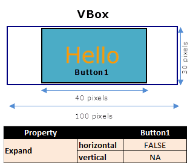
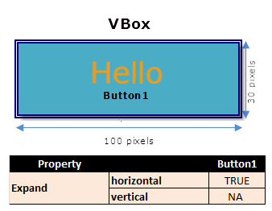
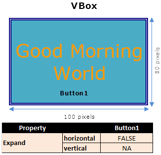

                              

VBox Behavior
-------------

A [VBox](VBox.md) has the following characteristics:

*   A VBox cannot be placed directly onto a form.
*   A VBox cannot be placed within another VBox.
*   The width of a widget in a VBox is the width of the VBox.
*   The height of a VBox is the cumulative height of the child widgets.
*   The shadow effects applied directly on widgets do not work when placed inside a VBox. To achieve the shadow effects, apply the shadows at Box level.
*   The _Expand vertical_ property is not applicable for widgets inside a VBox.

Based on the above characteristics of a VBox, the following section lists a possible Scenario and Use Cases for a VBox:

### Scenario 1

Create a VBox of width 100 px and add two buttons (**Button1** and **Button2**) with container weights of 50 and 50 respectively, consider the following cases:

##### Use Case 1

Set the following property values for the VBox and **Button1**:

VBox:

VBox width: 100 px

Button1:

Expand horizontal: _false_

Allocated width: 100 px

Text to be displayed: Hello

Width required to display the text 'Hello' (preferred width): 40 px

Height required to display the text 'Hello' (preferred height): 30 px

Layout

The layout with the above properties appears as follows:

Explanation:

For **Button1**, as the _Expand_ _horizontal_ property is set to _false_, it occupies a width of 40 px (preferred width) and not 100 px (allocated width), and occupies a height of 30 px (preferred height). However, **Button1** can be aligned in the _left_, _center_, and _right_ direction of the allocated space.

##### Use Case 2

Set the following property values for the VBox and **Button1**:

VBox:

VBox width: 100 px

Button1:

Expand horizontal: _true_

Allocated width: 100 px

Text to be displayed: Hello

Width required to display the text 'Hello' (preferred width): 40 px

Height required to display the text 'Hello' (preferred height): 30 px

Layout

The layout with the above properties appears as follows:

Behavior:

**Button1** occupies the allocated width (100 px) and the height is the preferred height (30 px).

Explanation:

As the _Expand horizontal_ property is set to _true_, the widget occupies a width of 100 px (allocated width) and not 40 px (preferred width) because the horizontal expansion is allowed.

The height occupied is 30 px (preferred height).

##### Use Case 3

Set the following property values for the VBox and **Button1**:

VBox:

VBox width: 100 px

Button1:

Expand horizontal: _false_

Allocated width: 100 px

Text to be displayed: Good Morning World

Width required to display the text 'Good Morning World' (preferred width): 120 px

Height required to display the text 'Good Morning World' (preferred height): 40 px

Layout

The layout with the above properties appears as follows:

Behavior:

**Button2** occupies the allocated width (100 px) and wraps the text to the next line and has an height of 80 px.

Reason

When the required width is more than the allocated width, the widget always occupies the complete allocated width irrespective of the _Expand_ property setting and wraps the text to the next line.

Here, **Button1** occupies a width of 100 px (allocated width). and wraps the text to the next line, and has an height of 80 px.

As the height of the VBox is dependent on the content, and in this use case, the text is wrapped to the next line, this results in a corresponding increase in height.

Here **Button1** occupies a height of 80 px.

