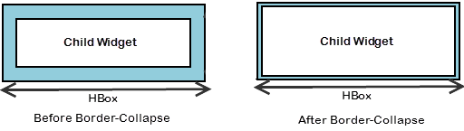

                                

VBox Properties
---------------

The properties for the VBox Widget are:

* * *


<details close markdown="block"><summary>accessibilityConfig Property</summary>

* * *

Enables you to control accessibility behavior and alternative text for the widget.

For more information on using accessibility features in your app, see the [Accessibility](../../../Iris/app_design_dev/Content/Accessibility_Overview.md) appendix in the Volt MX IrisUser Guide.

### Syntax

```

accessibilityConfig
```

### Type

Object

### Read/Write

Read + Write

### Remarks

*   The accessibilityConfig property is enabled for all the widgets which are supported under the Flex Layout.

> **_Note:_** From Volt MX Iris V9 SP2 GA version, you can provide i18n keys as values to all the attributes used inside the `accessibilityConfig` property. Values provided in the i18n keys take precedence over values provided in `a11yLabel`, `a11yValue`, and `a11yHint` fields.

The accessibilityConfig property is a JavaScript object which can contain the following key-value pairs.

  
| Key | Type | Description | ARIA Equivalent |
| --- | --- | --- | --- |
| a11yIndex | Integer with no floating or decimal number. | This is an optional parameter. Specifies the order in which the widgets are focused on a screen. | For all widgets, this parameter maps to the `aria-index`, `index`, or `taborder` properties. |
| a11yLabel | String | This is an optional parameter. Specifies alternate text to identify the widget. Generally the label should be the text that is displayed on the screen. | For all widgets, this parameter maps to the `aria-labelledby` property of ARIA in HTML. > **_Note:_** For the Image widget, this parameter maps to the **alt** attribute of ARIA in HTML. |
| a11yValue | String | This is an optional parameter. Specifies the descriptive text that explains the action associated with the widget. On the Android platform, the text specified for a11yValue is prefixed to the a11yHint. | This parameter is similar to the a11yLabel parameter. If the a11yValue is defined, the value of a11yValue is appended to the value of a11yLabel. These values are separated by a space. |
| a11yHint | String | This is an optional parameter. Specifies the descriptive text that explains the action associated with the widget. On the Android platform, the text specified for a11yValue is prefixed to the a11yHint. | For all widgets, this parameter maps to the `aria-describedby` property of ARIA in HTML. |
| a11yHidden | Boolean | This is an optional parameter. Specifies if the widget should be ignored by assistive technology. The default option is set to _false_. This option is supported on iOS 5.0 and above, Android 4.1 and above, and SPA | For all widgets, this parameter maps to the `aria-hidden` property of ARIA in HTML. |
| a11yARIA | Object | This is an optional parameter. For each widget, the key and value provided in this object are added as the attribute and value of the HTML tags respectively. Any values provided for attributes such as `aria-labelledby` and `aria-describedby` using this attribute, takes precedence over values given in `a11yLabel` and `a11yHint` fields. When a widget is provided with the following key value pair or attribute using the a11yARIA object, the tabIndex of the widget is automatically appended as zero.`{"role": "main"}``aria-label` | This parameter is only available on the Desktop Web platform. |

Android limitations

*   If the results of the concatenation of a11y fields result in an empty string, then `accessibilityConfig` is ignored and the text that is on widget is read out.
*   The soft keypad does not gain accessibility focus during the right/left swipe gesture when the keypad appears.

SPA/Desktop Web limitations

*   When `accessibilityConfig` property is configured for any widget, the `tabIndex` attribute is added automatically to the `accessibilityConfig` property.
*   The behavior of accessibility depends on the Web browser, Web browser version, Voice Over Assistant, and Voice Over Assistant version.
*   Currently SPA/Desktop web applications support only a few ARIA tags. To achieve more accessibility features, use the attribute a11yARIA. The corresponding tags will be added to the DOM as per these configurations.

### Example 1

This example uses the button widget, but the principle remains the same for all widgets that have an accessibilityConfig property.

```

//This is a generic property that is applicable for various widgets.
//Here, we have shown how to use the accessibilityConfig Property for button widget.
/*You need to make a corresponding use of the accessibilityConfig property for other applicable widgets.*/

Form1.myButton.accessibilityConfig = {
    "a11yLabel": "Label",
    "a11yValue": "Value",
    "a11yHint": "Hint"    
};
```

### Example 2

This example uses the button widget to implement internationalization in `accessibilityConfig` property, but the principle remains the same for all widgets.

```

/*Sample code to implement internationalization in accessibilityConfig property in Native platform.*/

Form1.myButton.accessibilityConfig = {
    "a11yLabel": voltmx.i18n.getLocalizedString("key1")     
};  
/*Sample code to implement internationalization in accessibilityConfig property in Desktop Web platform.*/

Form1.myButton.accessibilityConfig = {
    "a11yLabel": "voltmx.i18n.getLocalizedString(\"key3\")"
};
```

### Platform Availability

*   Available in the IDE
*   iOS, Android, SPA, and Desktop Web

* * *

</details>
<details close markdown="block"><summary>blockedUISkin</summary>

Specifies the skin that must be used to block the interface until the action in progress (for example, a service call) is completed.

### Syntax

```

blockedUISkin
```

### Type

String

### Read/Write

Read + Write

### Remarks

The default value for this property is None (No skin is applied).

To specify a skin, select a skin from the list.

For the skin to be available in the list, you must add a skin for Blocked UI under Widget Skins.

### Example

```

//Call back for box onClick event
function boxblockedUISkinTCSPAPlayClick(box){  
	//Call the service here to observe blockedUI skin  
}

//The below two functions will explain how to use blockedUISkin property for Box widget.
var basicConf = {id:"lblblockedUISkin", text:"Click this Box to see blockedUI skin while calling the service", isVisible:true};

var layoutConf = {contentAlignment :constants.CONTENT_ALIGN_CENTER, containerWeight:100, widgetAlignment:constants.WIDGET_ALIGN_CENTER};

//Creating the Label.
var lblblockedUISkin = new voltmx.ui.Label(basicConf, layoutConf, {});

//onClick event is triggered when user clicks on the box ,In this case we are calling the service inside the callback to observe the blockedUI skin.
var basicConfBox = {id:"boxblockedUISkin", isVisible:true, orientation:constants.BOX_LAYOUT_VERTICAL,onClick:boxblockedUISkinTCSPAPlayClick};

var layoutConfBox = {contentAlignment:constants.CONTENT_ALIGN_TOP_CENTER, containerWeight:100};

//Creating the Box
var boxblockedUISkin = new voltmx.ui.Box(basicConfBox, layoutConfBox, {blockedUISkin:"blockUISkin"});

//Adding label to box.  
**boxblockedUISkin.add(lblblockedUISkin);**
```

### Platform Availability

*   Available in the IDE
*   SPA (iPhone/Android/BlackBerry/Windows NTH)

</details>
<details close markdown="block"><summary>borderCollapse</summary>

Specifies if the space between the Box and its child widgets is considered.

### Syntax

```

borderCollapse
```

### Type

Boolean

### Read/Write

No

### Remarks

The default value for this property is false.

If set to _true,_ the default space between the parent and the child widget reduces.

If set to _false,_ the default space between the parent and the child widget retained.



### Example

```

//Creating the box with borderCollapse:true .(If you set the Border-Collapse value to true, the default space between the parent and the child widget reduces else not.)
var basicConfBox = {id:"boxBorderCollapse", isVisible:true, orientation:constants.BOX_LAYOUT_VERTICAL};

var layoutConfBox = {contentAlignment:constants.CONTENT_ALIGN_TOP_CENTER, containerWeight:100};

var PSPConfBox = {**borderCollapse:true**}

//Creating the box.
var boxBorderCollapse = new voltmx.ui.Box(basicConfBox, layoutConfBox, PSPConfBox );
```

### Platform Availability

*   Available in the IDE
*   Server side Mobile Web (basic)
*   Server side Mobile Web (BJS)

</details>
<details close markdown="block"><summary>containerWeight</summary>

Specifies percentage of width to be allocated by its parent widget. The parent widget space is distributed to its child widgets based on this weight factor. All its child widgets should sum up to 100% of weight except when placed in **voltmx.ui.ScrollBox**.

For example, a Form has Label1, Button1, and Button2 and the container weight could be 30 each for Label1 and Button1 and 40 for Button2, so that the sum of the container weight is 100.

### Syntax

```

containerWeight
```

### Type

Number (less than or equal to 100)

### Read/Write

Read + Write

### Example

```

//Defining the properties for a box with containerWeight:50 (box will occupy half of its parent widget).
var basicConfBox = {id:"boxContainerWeightTest", isVisible:true, orientation:constants.BOX_LAYOUT_VERTICAL, skin:"gradroundbox"};

var layoutConfBox = {**containerWeight:50,margin:[0,5,0,5]**};

//Creating the box.
boxContainerWeightTest = new voltmx.ui.Box(basicConfBox, layoutConfBox, {});
```

### Platform Availability

Available on all platforms

</details>
<details close markdown="block"><summary>contextMenu</summary>

Shows the list of actions (appropriate to the widget in focus) as menu items.

### Syntax

```

contextMenu
```

### Type

Array (voltmx.ui.Menuitem)

### Read/Write

Read + Write

### Remarks

Due to BlackBerry platform limitation, to display a context menu for an Box, you must define an [onclick event](Box_Events.md#onclick) for the Box.

The following are the characteristics of a context menu on _BlackBerry_ platform:

*   You can invoke the context menu either by clicking on the widget (applicable only on BlackBerry versions 6.x and above) or by a long press on the screen (or trackpad).
*   You can choose to add icons to indicate the menu items in the context menu (applicable only on BlackBerry versions 6.x and above).
*   BlackBerry layouts menu items in a 3 item grid view. The menu items _Switch Application_, _Help_, _Close_, and _Full Menu_ are added automatically based on the number of menu items added in the context menu. For example, If you add a context menu with 2 items, it will display _Full Menu_ item along with the items added. If you add a context menu with 3 items, it will display _Full Menu_, _Help_, and _Switch Application_ items along with the items added.
*   If the focus is on a widget that has a context menu; and if you click the _"menu key"_, the Full Menu appears along with the context menu items.
*   On Blackberry Non-Touch Devices, only _Full Menu_ item is displayed irrespective of number of items added in the context menu.

The context menu items in the _Full Menu_ will disappear if the focus is shifted from the widget which has the context menu.

The following images illustrate the context menu on various BlackBerry devices:

  
| BlackBerry 6.x | BlackBerry Touch Device (<6.x) | BlackBerry Non-Touch Device (<6.x) |
| --- | --- | --- |
|  |  |  |

The below description and procedure is applicable to Desktop Web platform only.

The context specific menu will be displayed with the array of menu items (appropriate to the widget in focus) on right-click mouse.

Default: _None_

Series of steps to be followed to use contextMenu:

1.  Define a menutemplate under project > templates > menus.  
      
    1.  Go to Applications View.
    2.  Expand the application for which you want to create a menu template.
    3.  Navigate to templates and expand menus, right-click desktop and select New Menu Template. The Create a New Menu window appears.
    4.  Enter a Name for the template and click Finish.
    5.  A new form is created. Drag-drop an HBox and then a VBox within an HBox. You can add other widgets within these widgets.
2.  Define a contextmenu template under project > templates > contexmenus.  
      
    1.  Go to Applications View.
    2.  Expand the application for which you want to create a contextmenu template.
    3.  Navigate to templates and expand contextmenus, right-click desktop and select New ContextMenu Template. The Create a New ContextMenu window appears.
    4.  Enter a Name for the template and click Finish. A new form is created.
    5.  Drag-drop a menucontainer. You can drag-drop a menucontainer widget only.
    6.  (optional) Select menuItemTemplate from the drop down.
    7.  Define data using the data property.
3.  Go to your project and then to desired form and drag-drop a hbox and navigate to Desktop Web properties in Widget Properties window.
4.  Select the contextmenu template from the dropdown.

### Example

```

//Defining contextMenu items for Windows 8 platform.
var appMenu1 = {id:"appmenuitemid1", text:"Add", image:"tc.png", onclick:callbackMenuItem1 };

var appMenu2 = {id:"appmenuitemid2", text:"Remove", image:"tc.png", onclick:callbackMenuItem2 };

var appMenu3 = {id:"appmenuitemid3", text:"Edit", image:"tc.png", onclick:callbackMenuItem3};

var appMenu4 = {id:"appmenuitemid4", text:"Close", image:"tc.png", onclick: callbackMenuItem4};
	
function callbackMenuItem1()
{
alert("Clicked on First menu item");
}

function callbackMenuItem2()
{
alert("Clicked on Second menu item");
}

function callbackMenuItem3()
{
alert("Clicked on Third menu item");
}

function callbackMenuItem4()
{
alert("Clicked on Fourth menu item");
}

//Defining the box with contextMenu:[appMenu1,appMenu2,appMenu3,appMenu4]
var basicConfBox = {id:"boxBorderCollapse", isVisible:true, orientation:constants.BOX_LAYOUT_VERTICAL};

var layoutConfBox = {contentAlignment:constants.CONTENT_ALIGN_TOP_CENTER, containerWeight:100};

var PSPConfBox = {**contextMenu:[appMenu1,appMenu2,appMenu3,appMenu4]**};

//Creating the box.
var boxBorderCollapse = new voltmx.ui.Box(basicConfBox, layoutConfBox, PSPConfBox );
```

The below example is applicable to Desktop Web platform only.

```

//Defining contextMenu template.  
function initializeaddtoabc() {
menucontainer12068 = new voltmx.ui.MenuContainer({
"id": "menucontainer12068", "isVisible": true,
"data": [{template: hbox12068, "label12068": {"text": "India"},
		children: [{template: hbox12068, "label12068": {"text": "Mumbai"},
		"image212068": {}, children: [] }]
		}, {template: hbox12068, "label12068": {"text": "Srilanka" },
		"image212068": {}
}],
"widgetDataMap": {"label12068": "label12068","image212068": "image212068"},
"menuItemTemplate": hbox12068}, {"widgetAlignment": constants.WIDGET_ALIGN_CENTER,
"containerWeight": "50", "margin": [0, 0, 0, 0],
"padding": [0, 0, 0, 0], "marginInPixel": false,
"paddingInPixel": false
}, {
"viewType": constants.MENU_CONTAINER_VIEW_TYPE_CONTEXTVIEW
});
};

//Defining the box with contextMenu:menucontainer12068
var basicConfBox = {id:"boxBorderCollapse", isVisible:true, orientation:constants.BOX_LAYOUT_VERTICAL};

var layoutConfBox = {contentAlignment:constants.CONTENT_ALIGN_TOP_CENTER, containerWeight:100};

var PSPConfBox = {**contextMenu:menucontainer12068**};

//Creating the box.
var boxBorderCollapse = new voltmx.ui.Box(basicConfBox, layoutConfBox, PSPConfBox );
```

**Availability**

*   Available in the IDE only for the Desktop Web platform
*   Android
*   BlackBerry
*   Windows Tablet

</details>
<details close markdown="block"><summary>enableCache</summary>

This property enables you to improve the performance of Positional Dimension Animations.

### Syntax

```

enableCache
```

### Type

Boolean

### Read/Write

Read + Write

### Remarks

The default value for this property is true.

When this property is used, it increases the memory consumption by the application. It enables tradeoff between performance and visual quality of the content.

**Availability**

Available in the IDE

This property is supported only on Windows platform

</details>
<details close markdown="block"><summary>focusSkin</summary>

This is a skin property and it determines the look and feel when there is focus on a widget.

### Syntax

```

focusSkin
```

### Type

String

### Read/Write

Read + Write

### Remarks

For more information on how to create and work with skins, see the _Working with Applications_ section of the _VoltMX Iris User Guide_.

You must be aware of the following:  
1\. On J2ME, if you do not specify the Focus skin, it is not possible to identify the focus change between the widgets.  
2\. Mobile Web does not support this property; instead browser specific focus will be applied.

### Example

```

//Defining the properties for a box with focusSkin:"boxGrayFocus"
var basicConfBox = {id:"boxFocusSkinTest", isVisible:true, orientation:constants.BOX_LAYOUT_VERTICAL, kin:"boxGray", **focusSkin:"boxGrayFocus"**};

var layoutConfBox = {contentAlignment:constants.CONTENT_ALIGN_TOP_CENTER, containerWeight:100};

//Creating the box.
boxFocusSkinTest = new voltmx.ui.Box(basicConfBox, layoutConfBox, {});

//Reading the focusSkin property of the box.
alert("box focusSkin is ::"+boxFocusSkinTest.focusSkin);
```

**Availability**

Available in the IDE

Available on all platforms. and SPA (Windows Tablet only)

</details>
<details close markdown="block"><summary>gridCell</summary>

Represents the grid cell details in the sequence colSpan, rowSpan, rowNo, colNo. Description of the details are:

*   colSpan: Specifies the number of columns that a grid should span. Default value is 1.
*   rowSpan: Specifies the number of rows that a grid should span. Default value is 1.
*   rowNo: Specifies the row number in where the widget is placed in a grid layout.
*   colNo: Specifies the column number in where the widget is placed in a grid layout.

### Syntax

```

gridCell
```

### Type

JSObject

### Read/Write

Read + Write

### Remarks

This property is applicable only when a widget is placed inside a container widget with Grid Layout applied.

Layout type is not visible as a property. It is set when the user applies XYLayout or GridLayout on a form. The default option is XYLayout. To set GridLayout, right-click on the form and select Apply GridLayout.

### Example

```

//Defining properties for a box with gridCell.
var basicConfBox = {id:"boxLayoutAlignmentLeftTest", isVisible:true, orientation:constants.BOX_LAYOUT_VERTICAL,skin:"gradroundbox"};

var layoutConfBox = {containerWeight:100, percent:false, layoutType: constants.CONTAINER_LAYOUT_GRID,
layoutMeta: {
			 "cols": 8,
			 "colmeta": ["15", "15", "15", "15", "15", "15", "5", "5"],
			 "rows": 4
},**gridCell: {"colSpan":1, "rowSpan":1, "rowNo":1, "colNo":1}** };  
//Creating the box.
boxLayoutAlignmentLeftTest = new voltmx.ui.Box(basicConfBox, layoutConfBox, {});
```

**Availability**

*   Windows Tablet

</details>
<details close markdown="block"><summary>hoverSkin</summary>

Specifies the look and feel of a widget when the cursor hovers on the widget.

### Syntax

```

hoverSkin
```

### Type

String

### Read/Write

Yes

### Platform Availability

*   Available in the IDE
*   Windows Tablet

</details>
<details close markdown="block"><summary>id</summary>

id is a unique identifier of a Box consisting of alpha numeric characters. Every Box widget should have a unique id within a Form.

### Syntax

```

id
```

### Type

String

### Read/Write

Read only

### Example

```

//Creating the box with the ID :"boxIdTest".
var basicConfBox = {**id:"boxIdTest"**, isVisible:true, orientation:constants.BOX_LAYOUT_VERTICAL};

var layoutConfBox = {contentAlignment:constants.CONTENT_ALIGN_TOP_CENTER, containerWeight:100};

//Creating the box.
boxIdTest = new voltmx.ui.Box(basicConfBox, layoutConfBox, {});

//Reading the id of the box.
alert("box id is ::"+boxIdTest.id);
```

### Platform Availability

Available in the IDE

Available on all platforms

</details>
<details close markdown="block"><summary>info</summary>

A custom JSObject with the key value pairs that a developer can use to store the context with the widget. This will help in avoiding the globals to most part of the programming.

### Syntax

```

info
```

### Type

JSObject

### Read/Write

Yes - (Read and Write)

### Remarks

This is a **non-Constructor** property. You cannot set this property through widget constructor. But you can read and write data to it.

Info property can hold any JSObject. After assigning the JSObject to info property, the JSObject should not be modified. For example,

```

var inf = {a: 'hello'};
widget.info = inf; //works
widget.info.a = 'hello world'; //This will not update the widget info a property to Hello world. widget.info.a will have old value as hello.
```

### Example

```

//Creating the box with the info property.
var basicConfBox = {id:"boxIdTest", isVisible:true, orientation:constants.BOX_LAYOUT_VERTICAL};

var layoutConfBox = {contentAlignment:constants.CONTENT_ALIGN_TOP_CENTER, containerWeight:100};

//Creating the box.
boxIdTest = new voltmx.ui.Box(basicConfBox, layoutConfBox, {});  
**boxIdTest.info = {key:"Boxnumber"};**  
//Reading the info of the box.
alert("box info is ::"+boxIdTest.info);
```

### Platform Availability

Available on all platforms

</details>
<details close markdown="block"><summary>isVisible</summary>

This property controls the visibility of a widget on the form.

### Syntax

```

isVisible
```

### Type

Boolean

### Read/Write

Read + Write

### Remarks

The default value for this property true.

If set to _false,_ the widget is not displayed.

If set to _true,_ the widget is displayed.

This property is not applicable if the widget is placed in a [Segment](Segment.md). When the widget is placed in a Segment, the default _Visibility_ is set to _true_. If you want to change the value to _false_, you can do so using the [Segment Methods](Segment_Methods.md).

### Example

```

//Defining the properties for a box with isVisible:true.
var basicConfBox = {id:"boxisVisibleTest", **isVisible:true**, orientation:constants.BOX_LAYOUT_VERTICAL};

var layoutConfBox = {contentAlignment:constants.CONTENT_ALIGN_TOP_CENTER, containerWeight:100};

//Creating the box.
boxisVisibleTest = new voltmx.ui.Box(basicConfBox, layoutConfBox, {});

//Defining the properties for a box with isVisible:false.
basicConfBox = {id:"boxisVisibleTestFalse", isVisible:false, orientation:constants.BOX_LAYOUT_HORIZONTAL}; layoutConfBox = {contentAlignment:constants.CONTENT_ALIGN_TOP_CENTER, containerWeight:100};

//Creating the box.
boxisVisibleTestFalse = new voltmx.ui.Box(basicConfBox, layoutConfBox, {});

//Reading the isVisible property of the box
alert("Box visibility is ::"+boxisVisibleTestFalse.isVisible); 

alert("Second box visibility is ::"+boxisVisibleTest.isVisible);
```

> **_Note:_** You can set the visibility of a widget dynamically from code using the setVisibility method.

### Platform Availability

Available in the IDE (Except for form/popup)

Available on all platforms. platform.

</details>
<details close markdown="block"><summary>layoutAlignment</summary>

This property is applicable if the [percent](#percent) property is set to _false_. Specifies the direction in which the widgets are laid out.

### Syntax

```

layoutAlignment
```

### Type

Number

### Read/Write

No

### Remarks

The default value for this property is BOX\_LAYOUT\_ALIGN\_FROM\_LEFT.

The available options are:

*   BOX\_LAYOUT\_ALIGN\_FROM\_LEFT: The widgets placed inside a box are aligned left.
*   BOX\_LAYOUT\_ALIGN\_FROM\_CENTER: The widgets placed inside a box are aligned center.
*   BOX\_LAYOUT\_ALIGN\_FROM\_RIGHT: The widgets placed inside a box are aligned right.

To set the value through code, prefix the option with _constants._ such as _**constants.<option>

### Example

```

//Defining properties for a box with layoutAlignment:BOX_LAYOUT_ALIGN_FROM_LEFT(If percent property is false then this property is considered).
var basicConfBox = {id:"boxLayoutAlignmentLeftTest", isVisible:true, orientation:constants.BOX_LAYOUT_VERTICAL,skin:"gradroundbox"};

var layoutConfBox = {containerWeight:100, percent:false, **layoutAlignment:constants.BOX_LAYOUT_ALIGN_FROM_LEFT**};

//Creating the box.
boxLayoutAlignmentLeftTest = new voltmx.ui.Box(basicConfBox, layoutConfBox, {});
```

**Availability**

Available in the IDE

Available on all platforms

</details>
<details close markdown="block"><summary>layoutMeta</summary>

A custom JSObject with the key, value pairs that developer can use to provide the meta info about the grid layout. The following are the mandatory keys required to be part of the Meta.

### Syntax

```

layoutMeta
```

### Type

JSObject

### Read/Write

Read + Write

### Remarks

The data for layoutmeta data is set when you set grid layout view properties for rows and columns. This property can be set using Volt MX Iris Grid Layout view. To set the view, go to Window > Show View > Others and select GridLayout View from Volt MX Iris folder.

**rows :** no of grid rows

**cols** : no of grid cols

**colmeta**: \[{width:"width in %"}\]

The sum total of percentage (%) widths of each of the columns in the grid layout should add up to 100%.

### Example

```

//Defining properties for a box with layoutMeta.
var basicConfBox = {id:"boxLayoutAlignmentLeftTest", isVisible:true, orientation:constants.BOX_LAYOUT_VERTICAL,skin:"gradroundbox"};

var layoutConfBox = {containerWeight:100, percent:false, layoutType: constants.CONTAINER_LAYOUT_GRID,
**layoutMeta: {
	"cols": 8,
	"colmeta": ["15", "15", "15", "15", "15", "15", "5", "5"],
	"rows": 4
}}**;  
//Creating the box.
boxLayoutAlignmentLeftTest = new voltmx.ui.Box(basicConfBox, layoutConfBox, {});
```

**Availability**

*   Windows Tablet

</details>
<details close markdown="block"><summary>layoutType</summary>

Defines the type of the layout of container widget. Following are the available options:

*   CONTAINER\_LAYOUT\_BOX: This is the default options on both Windows Tablet and Desktop Web platforms.
*   CONTAINER\_LAYOUT\_GRID: In grid layout the form is split it to rows and columns.

> **_Note:_** Layout type is not visible as a property. It is set when the user applies XYLayout or GridLayout on a form. From the IDE, the default option is XYLayout. To set GridLayout, right-click on the form and select Apply GridLayout.  

### Syntax

```

layoutType
```

### Type

String

### Read/Write

Read only

### Example

```

//Defining properties for a box with layoutType:CONTAINER_LAYOUT_GRID.
var basicConfBox = {id:"boxLayoutAlignmentLeftTest", isVisible:true, orientation:constants.BOX_LAYOUT_VERTICAL,skin:"gradroundbox"};

var layoutConfBox = {containerWeight:100, percent:false, **layoutType: constants.CONTAINER_LAYOUT_GRID**,
layoutMeta: {
			"cols": 8,
			"colmeta": ["15", "15", "15", "15", "15", "15", "5", "5"],
			"rows": 4
}};

//Creating the box.
boxLayoutAlignmentLeftTest = new voltmx.ui.Box(basicConfBox, layoutConfBox, {});
```

**Availability**

*   Available in the IDE
*   Windows Tablet

</details>
<details close markdown="block"><summary>margin</summary>

Defines the space around a widget. You can use this option to define the left, top, right, and bottom distance between the widget and the next element.

### Syntax

```

margin
```

### Type

Array of Numbers

### Read/Write

Read + Write

### Remarks

To define the margin values for a platform, click the () button against the property to open the _Margin_ screen. Select the checkbox against the platform for which you want to define the margins and enter the top, left, right, and bottom margin values.

If you want to use the margin values set for a platform across other platforms, you can click the _Apply To_ button and select the platforms on which you want the margin values to be applied.

The following image illustrates the window to define the margins for platforms:


The following image illustrates a widget with a defined margin:


### Example

```

//Defining the properties of a box with margin:[0,5,0,5], Directions :left,top,right,bottom respectively.
var basicConfBox = {id:"boxMarginTest", isVisible:true, orientation:constants.BOX_LAYOUT_VERTICAL};

var layoutConfBox = { containerWeight:100, **margin:[0,5,0,5]**};

//Creating the box
boxMarginTest = new voltmx.ui.Box(basicConfBox, layoutConfBox, {});
```

**Availability**

Available in the IDE

Available on all platforms.

</details>
<details close markdown="block"><summary>marginInPixel</summary>

Indicates if the margin is to be applied in pixels or in percentage.

### Syntax

```

marginInPixel
```

### Type

Boolean

### Read/Write

No

### Remarks

The default value for this property is false.

If set to _true,_ the margins are applied in pixels.

If set to _false,_ the margins are applied as set in [margin](#margin) property.

### Example

```

//Defining the properties for a box with margin in pixels.
var basicConfBox = {id:"boxMarginTest", isVisible:true, orientation:constants.BOX_LAYOUT_VERTICAL};

var layoutConfBox = { containerWeight:100, margin:[0,5,0,5], **marginInPixel:true**};

//Creating the box
boxMarginTest = new voltmx.ui.Box(basicConfBox, layoutConfBox, {});
```

**Availability**

*   Available in the IDE
*   iPhone
*   iPad
*   Android
*   Windows Phone

</details>
<details close markdown="block"><summary>orientation</summary>

Specifies the orientation of the VBox. The widgets placed in a VBox are aligned vertically.

### Syntax

```

orientation
```

### Type

Number

### Read/Write

Read only

### Remarks

The default value for this property is BOX\_LAYOUT\_VERTICAL.

To set the value through code, prefix the option with _constants._ such as _**constants.<option>**_ .

### Example

```

//Creating the box with the orientation:constants.BOX_LAYOUT_VERTICAL.
var basicConfBox = {id:"boxIdTest", isVisible:true, **orientation:constants.BOX_LAYOUT_VERTICAL**};

var layoutConfBox = {contentAlignment:constants.CONTENT_ALIGN_TOP_CENTER, containerWeight:100};

//Creating the box.
boxIdTest = new voltmx.ui.Box(basicConfBox, layoutConfBox, {});

//Reading the orientation of the box.
alert("box orientation is ::"+boxIdTest.orientation);
```

### Platform Availability

Available on all platforms

</details>
<details close markdown="block"><summary>padding</summary>

Defines the space between the content of the widget and the widget boundaries. You can use this option to define the top, left, right, and bottom distance between the widget content and the widget boundary.

### Syntax

```

padding
```

### Type

Array of Numbers

### Read/Write

Read + Write

### Remarks

To define the padding values for a platform, click the () button against the property to open the _Padding_ screen. Select the checkbox against the platform for which you want to define the padding's and enter the top, left, right, and bottom padding values.

If you want to use the padding values set for a platform across other platforms, you can click the _Apply To_ button and select the platforms on which you want the padding values to be applied. The Array accepts the values in the sequence \[left, top, right, bottom\].

If no skin is applied to a Button, then Padding is not supported on iPhone. This is due to iOS Safari browser limitation. If you want the padding to be applied, apply a skin to the button and then apply padding.

The following image illustrates the window to define the padding's for platforms:

  
  
The following image illustrates a widget with a defined padding:


### Example

```

//Defining the properties of a box with padding:[10,10,10,10], Directions :left,top,right,bottom respectively.
var basicConfBox = {id:"boxPaddingTest", isVisible:true, orientation:constants.BOX_LAYOUT_VERTICAL};

var layoutConfBox = { containerWeight:100, **padding:[10,10,10,10]**};

//Creating the box.
boxPaddingTest = new voltmx.ui.Box(basicConfBox, layoutConfBox, {});
```

**Availability**

Available in the IDE

Available on all platforms

**Limitations**

*   iPhone - Not supported for Button unless a skin is specified.
*   Windows Phone/Windows Desktop - Not supported for Box, Image Gallery due to Browser limitation.
*   Mobile Web (BJS) - Not supported for ComboBox, Form, and ListBox due to Browser limitations.
*   Mobile Web (advanced) - Not supported for ComboBox, Form, and ListBox due to Browser limitations.

</details>
<details close markdown="block"><summary>paddingInPixel</summary>

Indicates if the padding is to be applied in pixels or in percentage.

### Syntax

```

paddingInPixel
```

### Type

Boolean

### Read/Write

No

### Remarks

The default value for this property is false.

If set to _true,_ the padding is applied in pixels.

If set to _false,_ the padding is applied as set in [padding](#padding) property.

This property can be set to _true_ or _false_ only for iPhone, iPad, Android and Windows Phone. On other platforms this property does not give any results even when set to _true_.

For backward compatibility on older projects, this property is will be made _true_ for iPhone, iPad, Android and Windows Phone and for other platforms it will be _false_.

### Example

```

//Defining the properties of a box with padding in pixels.
var basicConfBox = {id:"boxPaddingTest", isVisible:true, orientation:constants.BOX_LAYOUT_VERTICAL};

var layoutConfBox = { containerWeight:100, padding:[10,10,10,10], **paddingInPixel:true**};

//Creating the box.
boxPaddingTest = new voltmx.ui.Box(basicConfBox, layoutConfBox, {});
```

**Availability**

*   Available in the IDE
*   iPhone
*   iPad
*   Android
*   Windows Phone

</details>
<details close markdown="block"><summary>skin</summary> 

Specifies the look and feel of the widget when not in focus.

### Syntax

```

skin
```

### Type

String

### Read/Write

Read + Write

### Example

```

//Defining the properties for a box with skin:"boxGray"
var basicConfBox = {id:"boxSkinTest", isVisible:true, orientation:constants.BOX_LAYOUT_VERTICAL, **skin:"boxGray"**};

var layoutConfBox = {contentAlignment:constants.CONTENT_ALIGN_TOP_CENTER, containerWeight:100};

//Creating the box.
boxSkinTest = new voltmx.ui.Box(basicConfBox, layoutConfBox, {});

//Reading the skin property of the box.
alert("box skin is ::"+boxSkinTest.skin);
```

**Availability**

Available in the IDE

Available on all platforms

</details>
<details close markdown="block"><summary>viewConfig</summary>

View Configuration is applicable only when container widget layout is grid.

### Syntax

```

viewConfig
```

### Type

Object

### Read/Write

No

### Remarks

For more information on applying the Grid layout, refer Volt MX Iris User Guide.

ViewConfig displays two types of views:

*   Normal view
*   Grid view - Windows 8 or 8.1

Following are the available properties:
*   **view:** Specifies the type of view to be rendered. This option is available in both Normal grid and Grid view. Following are the available options :
   *   constants.CONTAINER\_LAYOUT\_GRID (Default option)
   *   constants.CONTAINER\_LAYOUT\_GRIDVIEW
*   **gridSizeMode:** Specifies the behavior of the grid with respect to size, rows, and columns. This option is available in both Normal grid and Grid view. The available options are:
    *   fixed grid - Use this option to fix the number of rows and columns. For example, columns = 4, rows = 2.  
        1 2 3 4  
        5 6 7 8  
    *   Vertically expand - Use this option to fix the number of columns and rows can grow indefinitely. For example, columns = 3, rows = infinite.  
        1 2 3  
        4 5 6  
        7 8
    *   Horizontally expand - Use this option to fix the number of rows are fixed and columns can grow indefinitely. For example, rows = 3, columns = infinite.  
        1 4 7  
        2 5 8  
        3 6  
*   **referenceWidth:** Specifies the width of the cell. This option is supported in Grid view only.

**Type**: Number  

**Default Value:** 0 (Accepts positive numbers only)

*   **referenceHeight:** Specifies the height of the cell. This option is supported in Grid view only.

**Type**: Number  

**Default Value:** 0 (Accepts positive numbers only)

*   **onClick:** If an onClick event is defined on a widget, the event callback is invoked by the platform when the user performs a click action in each cell. This option is supported in Grid view only.
*   **enableItemClick:** This property enables the click behavior on each cell in grid view.This option is supported in Grid view only.

**Type**: Boolean  
 
**Default Value:** false (item click is disabled)

*   **selectionMode:** This property enables you to select the items in grid view. This option is supported in Grid view only.
    The available options are:

    *   0 - None
    *   1 - Single
    *   2 - Multiple

> **_Note:_** When you set _righttap_ event using _setGestureRecognizer_ to a container widget, the selection mode will be considered from righttap gesture arguments, the values you entered are ignored.

**Type**: Number  

**Default Value:** 0

*   **onSelect:** An event callback is invoked by the platform when you right tap using mouse or selects with touch. This option is supported in Grid view only.

> **_Note:_** This event is invoked only when you set _selectionModeView!=0_ (None). If you set righttap event using setGestureRecognizer to a container widget, righttap gesture callback is set to onSelect automatically.

*   **orientation:** Specifies the orientation of the grid. This option is supported in Grid view only.
    The available options are:

    *   0 - Horizontal
    *   1 - Vertical

**Type**: Number  

**Default Value:** When the value is not provided, it the rowCount is more than 0 and gridSizeMode is set to constants.GRID\_SIZE\_MODE\_VERTICAL, the orientation is set to "vertical" else it is set to "Horizontal".

Possible values for Size Mode:

*   constants.GRID\_TYPE\_FIXED
*   constants.GRID\_TYPE\_GROW\_COLUMNS
*   constants.GRID\_TYPE\_GROW\_ROWS

**Availability**

Available in the IDE

This property is available on Windows Tablet platform.

</details>
<details close markdown="block"><summary>widgetAlignment</summary>

Indicates how a widget is to be anchored with respect to its parent. Each of these below options have a horizontal alignment attribute and a vertical alignment attribute. For example, WIDGET\_ALIGN\_TOP\_LEFT specifies the vertical alignment as TOP and horizontal alignment as LEFT.

### Syntax

```

widgetAlignment
```

### Type

Number

### Read/Write

Read only

### Remarks

The default value for this property is WIDGET\_ALIGN\_CENTER.

The available options are:

*   WIDGET\_ALIGN\_TOP\_LEFT - (BlackBerry 10 supports this option)
*   WIDGET\_ALIGN\_TOP\_CENTER
*   WIDGET\_ALIGN\_TOP\_RIGHT
*   WIDGET\_ALIGN\_MIDDLE\_LEFT
*   WIDGET\_ALIGN\_CENTER - (BlackBerry 10 supports this option)
*   WIDGET\_ALIGN\_MIDDLE\_RIGHT
*   WIDGET\_ALIGN\_BOTTOM\_LEFT
*   WIDGET\_ALIGN\_BOTTOM\_CENTER
*   WIDGET\_ALIGN\_BOTTOM\_RIGHT - (BlackBerry 10 supports this option)

### Example

```

//Defining the properties of a box with widgetAlignment:constants.WIDGET_ALIGN_TOP_LEFT.
var basicConfBox = {id:"boxwidgetAlignment", isVisible:true, orientation:constants.BOX_LAYOUT_VERTICAL, skin:"gradroundbox"};

var layoutConfBox = {containerWeight:99, **widgetAlignment:constants.WIDGET_ALIGN_TOP_LEFT**};

//Creating the box.
boxwidgetAlignment = new voltmx.ui.Box(basicConfBox, layoutConfBox, {});
```

**Availability**

*   Available in the IDE
*   SPA

