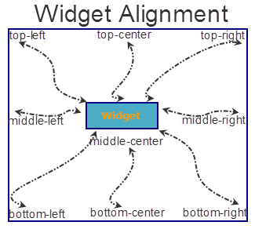

                               


Widget Common Properties
========================

Widget is the base class for all widgets (controls) in a framework, for example Button, Label, Image, and Segmented UI all are derived from the base Widget class.

The properties (common for all the widgets) of the Widget class are:

*   [Alignment](#Alignmen)
*   [Expand (horizontal and vertical)](#Expand)
*   [Expand (Horizontal)](#Expand)
*   [Focus Skin Property](#Focus)
*   [ID](#ID)
*   [Location](#Location)
*   [Margin(%)](#Margin)
*   [Retain Flex Position Properties](#Mirror_Flex_Position_Property)
*   [Retain Content Alignment](#Mirror_Content_Alignment_Property)
*   [Skin Property](#Normal)
*   [Padding(%)](#Padding)
*   [Render](#Render)
*   [Size](#Size)
*   [Text](#Text)
*   [Title](#Title2)
*   [Text i18n Key](#Text2)
*   [Title i18n Key](#Title)
*   [isVisible](#Visible)

* * *


<details close markdown="block"><summary>Alignment Property</summary>

* * *

Specifies the widget alignment in a box. A widget can be aligned _top-left_, _top-center_, _top-right_, _middle-left_, _middle-center_, _middle-right_, _bottom-left_, _bottom-center_, or _bottom-right._

> **_Note:_** This property is not supported on [Browser](Browser.md), [DataGrid](DataGrid.md), [Map](Map.md), [PickerView](PickerView.md), [Segment](Segment.md) and [Slider](Slider.md) widgets.

> **_Note:_** The alignment property is applicable only if the widget size is lesser than the allocated size.

The following image illustrates the widget alignment property:



### Type

Number

### Read/Write

No

### Accessible from IDE

Yes

### Availability on platforms

The following table shows the list of available platforms and property availability:

  
| Platform | Availability | Comments |
| --- | --- | --- |
| iPad | Yes |  |
| iPhone | Yes |  |
| Android/Android Tablet | **Yes** |  |
| Mobile Web (basic) | **Yes** |  |
| Mobile Web (advanced) | **Yes** |  |
| SPA | **Yes** |  |

* * *

</details>
<details close markdown="block"><summary>Expand Property (horizontal and vertical)</summary>

* * *

Specifies the widget expansion in the horizontal and vertical direction.

> **_Note:_** Mobile Web does not support the Expand property. This is because a widget in a Mobile Web cannot expand or contract based on the neighboring widget (default behavior of a widget in a Mobile Web).

> **_Note:_** This property is not supported on [Browser](Browser.md), [Image](Image.md), [Map](Map.md), [PickerView](PickerView.md) widgets.

The Expand property provides you with the following options:

_horizontal_

Specifies if the widget must expand horizontally.

**Default:** _true_ (the checkbox is selected and the widget occupies the entire available width)


If you set the value to _false_ (clear the checkbox), the widget occupies the preferred width.

_Vertical_

Specifies if the widget must expand vertically.

**Default:** _false_ (the checkbox is not selected and the widget occupies the preferred height)

If you set the value to _true_ (select the checkbox), the widget occupies the entire available height.


### Type

Boolean

### Read/Write

No

### Accessible from IDE

Yes

### Availability on platforms

The following table shows the list of available platforms and property availability:

  
| Platform | Availability | Comments |
| --- | --- | --- |
| iPad | Yes |  |
| iPhone | Yes |  |
| Android/Android Tablet | **Yes** |  |
| Mobile Web (basic) |  |  |
| Mobile Web (advanced) |  |  |
| SPA |  |  |

* * *

</details>
<details close markdown="block"><summary>Expand Property (horizontal)</summary>

* * *

Specifies the widget expansion in the horizontal direction.

> **_Note:_** **Important!** Mobile Web does not support the Expand property. This is because a widget in a Mobile Web cannot expand or contract based on the neighboring widget (default behavior of a widget in a Mobile Web).

> **_Note:_** **Important!** This property is not supported on [Browser](Browser.md), [Image](Image.md), [Map](Map.md), and [PickerView](PickerView.md) widgets.

The Expand property provides you with the following option:

_horizontal_

Specifies if the widget must expand horizontally.

**Default:** _true_ (the checkbox is selected and the widget occupies the entire available width)


If you set the value to _true_ (select the checkbox), the widget occupies the entire available height.

### Type

Boolean

### Accessible from code

No

### Accessible from IDE

Yes

### Availability on platforms

The following table shows the list of available platforms and property availability:

  
| Platform | Availability | Comments |
| --- | --- | --- |
| iPad | Yes |  |
| iPhone | Yes |  |
| Android/Android Tablet | **Yes** |  |
| Mobile Web (basic) |  |  |
| Mobile Web (advanced) |  |  |

* * *

</details>
<details close markdown="block"><summary>Focus Skin Property</summary>

* * *

This is a skin property and it determines the look and feel when there is focus on a widget.

For more information on how to create and work with skins, see the _Working with Applications_ section of the _Volt MX Iris User Guide_.

> **_Note:_**  
1\. Mobile Web does not support this property. For Advanced Mobile Web platforms, a platform specific progress indicator is displayed. For other Mobile Web platforms (Basic and BJS), the screen is refreshed.  
2\. For the Pickerview widget on Android, borders, font weight, font size, and font style are ignored.

### Type

Object

### Read / Write

Yes (Write only)

You can change the focus skin of a button with ID _btn1_ and in form _frm1_ during the runtime by entering the following code:

```
 
frm1.btn1.focusSkin="skin1";
```

  
### Accessible from IDE

Yes

### Availability on platforms

The following table shows the list of available platforms and property availability:

  
| Platform | Availability | Comments |
| --- | --- | --- |
| iPad | Yes |  |
| iPhone | Yes |  |
| Android/Android Tablet | **Yes** |  |
| Mobile Web (basic) |  |  |
| Mobile Web (advanced) |  |  |
| SPA |  |  |

* * *

</details>
<details close markdown="block"><summary>ID Property</summary>

* * *

Defines a string of alpha numeric characters that uniquely identifies a widget within an application.

### Type

String

### Read/Write

Yes (Read-only access)

**Example** If you want to access a widget with ID _widget1_ in a Form whose ID is _frm1_, enter the following:

```

var idcheck = frm1.widget1.id;
voltmx.print ("widget1 id is :"+idcheck);

```

### Accessible from IDE

Yes

### Availability on platforms

The following table shows the list of available platforms and property availability:

  
| Platform | Availability | Comments |
| --- | --- | --- |
| iPad | Yes |  |
| iPhone | Yes |  |
| Android/Android Tablet | **Yes** |  |
| Mobile Web (basic) |  |  |
| Mobile Web (advanced) | **Yes** |  |
| SPA | **Yes** |  |

* * *

</details>
<details close markdown="block"><summary>Location Property</summary>

* * *

Specifies the location of a widget with respect to the x and y axis of the parent container. This property is used by the IDE to retain the positioning of the widgets as desired by the developer.

> **_Note:_** **Note:** If the parent container is a form, you can only modify the y axis.

When you select the Location property the following additional properties are visible:

*   **x**: Specifies the x coordinate of the widget.
*   **y**: Specifies the y coordinate of the widget.

### Type

Number

### Read/Write

No

### Accessible from IDE

Yes

### Availability on platforms

The following table shows the list of available platforms and property availability:

  
| Platform | Availability | Comments |
| --- | --- | --- |
| iPad | Yes |  |
| iPhone | Yes |  |
| Android/Android Tablet | **Yes** |  |
| Mobile Web (basic) |  |  |
| Mobile Web (advanced) | **Yes** |  |
| SPA | **Yes** |  |

* * *

</details>
<details close markdown="block"><summary>Margin Property</summary>

* * *

Defines the space around a widget. You can use this option to define the top, left, right, and bottom distance between the widget and the next element.

To define the margin values for a platform, click the Ellipsis () button against the property to open the _Margin_ screen. Select the checkbox against the platform for which you want to define the margins and enter the top, left, right, and bottom margin values.

If you want to use the margin values set for a platform across other platforms, you can click the _Apply To_ button and select the platforms on which you want the margin values to be applied.

The following image illustrates a widget with a defined margin:


### Type

Number

### Read/Write

No

### Accessible from IDE

Yes

### Availability on platforms

The following table shows the list of available platforms and property availability:

  
| Platform | Availability | Comments |
| --- | --- | --- |
| iPad | Yes |  |
| iPhone | Yes |  |
| Android/Android Tablet | **Yes** |  |
| SPA | **Yes** |  |

* * *

</details>
<details close markdown="block"><summary>retainFlexPositionProperties Property</summary>

* * *

This property is used to retain flex positional property values as they were defined. The flex positional properties are left, right, and padding.

> **_Note:_** Locale-level configurations take priority when invalid values are given to this property, or if it is not defined.

The mirroring widget layout properties should be defined as follows.

```

function getIsFlexPositionalShouldMirror(widgetRetainFlexPositionPropertiesValue) {
    return (isI18nLayoutConfigEnabled &&
    localeLayoutConfig[defaultLocale]
    ["mirrorFlexPositionalProperties"] == true &&
    !widgetRetainFlexPositionPropertiesValue);
}
```

The following table illustrates how widgets consider Local flag and Widget flag values.

  
| Properties | Local Flag Value | Widget Flag Value | Action |
| --- | --- | --- | --- |
| Mirror/retain FlexPositionProperties | true | true | Use the designed layout from widget for all locales. Widget layout overrides everything else. |
| Mirror/retain FlexPositionProperties | true | false | Use Mirror FlexPositionProperties since locale-level Mirror is true. |
| Mirror/retain FlexPositionProperties | true | not specified | Use Mirror FlexPositionProperties since locale-level Mirror is true. |
| Mirror/retain FlexPositionProperties | false | true | Use the designed layout from widget for all locales. Widget layout overrides everything else. |
| Mirror/retain FlexPositionProperties | false | false | Use the Design/Model-specific default layout. |
| Mirror/retain FlexPositionProperties | false | not specified | Use the Design/Model-specific default layout. |
| Mirror/retain FlexPositionProperties | not specified | true | Use the designed layout from widget for all locales. Widget layout overrides everything else. |
| Mirror/retain FlexPositionProperties | not specified | false | Use the Design/Model-specific default layout. |
| Mirror/retain FlexPositionProperties | not specified | not specified | Use the Design/Model-specific default layout. |

### Syntax
```

retainFlexPositionProperties
```

### Type

Boolean

### Read/Write

No (only during widget-construction time)

### Example

```

//This is a generic property that is applicable for various widgets.
//Here, we have shown how to use the retainFlexPositionProperties property for Button widget.
/*You need to make a corresponding use of the 
retainFlexPositionProperties property for other applicable widgets.*/
var btn = new voltmx.ui.Button({
    "focusSkin": "defBtnFocus",
    "height": "50dp",
    "id": "myButton",
    "isVisible": true,
    "left": "0dp",
    "skin": "defBtnNormal",
    "text": "always left",
    "top": "0dp",
    "width": "260dp",
    "zIndex": 1
}, {
    "contentAlignment": constants.CONTENT_ALIGN_CENTER,
    "displayText": true,
    "padding": [0, 0, 0, 0],
    "paddingInPixel": false,
    "retainFlexPositionProperties": true,
    "retainContentAlignment": false
}, {});
```

### Platform Availability

*   Available in IDE
*   Windows, iOS, Android, and SPA

  
| Platform | Availability |
| --- | --- |
| iPad | Yes |
| iPhone | Yes |
| Android/Android Tablet | **Yes** |
| Windows | **Yes** |
| SPA | **Yes** |
| Desktop Web | **Yes** |
| SPA | **Yes** |

* * *

</details>
<details close markdown="block"><summary>retainContentAlignment Property</summary>

* * *

This property is used to retain the content alignment property value, as it was defined.

> **_Note:_** Locale-level configurations take priority when invalid values are given to this property, or if it is not defined.

The mirroring widget layout properties should be defined as follows.

```

function getIsFlexPositionalShouldMirror(widgetRetainFlexPositionPropertiesValue) {
    return (isI18nLayoutConfigEnabled &&
    localeLayoutConfig[defaultLocale]
    ["mirrorFlexPositionalProperties"] == true &&
    !widgetRetainFlexPositionPropertiesValue);
}
```

The following table illustrates how widgets consider Local flag and Widget flag values.

  
| Properties | Local Flag Value | Widget Flag Value | Action |
| --- | --- | --- | --- |
| Mirror/retain FlexPositionProperties | true | true | Use the designed layout from widget for all locales. Widget layout overrides everything else. |
| Mirror/retain FlexPositionProperties | true | false | Use Mirror FlexPositionProperties since locale-level Mirror is true. |
| Mirror/retain FlexPositionProperties | true | not specified | Use Mirror FlexPositionProperties since locale-level Mirror is true. |
| Mirror/retain FlexPositionProperties | false | true | Use the designed layout from widget for all locales. Widget layout overrides everything else. |
| Mirror/retain FlexPositionProperties | false | false | Use the Design/Model-specific default layout. |
| Mirror/retain FlexPositionProperties | false | not specified | Use the Design/Model-specific default layout. |
| Mirror/retain FlexPositionProperties | not specified | true | Use the designed layout from widget for all locales. Widget layout overrides everything else. |
| Mirror/retain FlexPositionProperties | not specified | false | Use the Design/Model-specific default layout. |
| Mirror/retain FlexPositionProperties | not specified | not specified | Use the Design/Model-specific default layout. |

### Syntax
```

retainContentAlignment
```
### Type

Boolean

### Read/Write

No (only during widget-construction time)

### Example

```

//This is a generic property that is applicable for various widgets.
//Here, we have shown how to use the retainContentAlignment property for Button widget.
/*You need to make a corresponding use of the 
retainContentAlignment property for other applicable widgets.*/
var btn = new voltmx.ui.Button({
    "focusSkin": "defBtnFocus",
    "height": "50dp",
    "id": "myButton",
    "isVisible": true,
    "left": "0dp",
    "skin": "defBtnNormal",
    "text": "text always from top left",
    "top": "0dp",
    "width": "260dp",
    "zIndex": 1
}, {
    "contentAlignment": constants.CONTENT_ALIGN_TOP_LEFT,
    "displayText": true,
    "padding": [0, 0, 0, 0],
    "paddingInPixel": false,
    "retainFlexPositionProperties": false,
    "retainContentAlignment": true
}, {});
```

### Platform Availability

*   Available in IDE
*   Windows, iOS, Android, and SPA

  
| Platform | Availability |
| --- | --- |
| iPad | Yes |
| iPhone | Yes |
| Android/Android Tablet | **Yes** |
| Windows | **Yes** |
| SPA | **Yes** |
| Desktop Web | **Yes** |
| SPA | **Yes** |

* * *

</details>
<details close markdown="block"><summary>Skin Property</summary>

* * *

This is a skin property and it determines the look and feel of a widget. For more information on how to create and work with skins, see the _Working with Applications_ section of the _VoltMX IrisUser Guide_.

> **_Note:_** **Important!** This property is not supported on [Browser](Browser.md), [Image](Image.md), [Map](Map.md), [PickerView](PickerView.md), and [Slider](Slider.md) widgets.

> **_Note:_** For the [Signature](Signature.md) widget, the font color you specify in the skin is the color of the Signature. The background color specified in the skin is the background color of the Signature widget.

### Type

Object

### Read/Write

Yes (Write)

### Example

You can change the skin of a button with ID _btn1_ in form _frm1_ during runtime by entering the following code:

```

frm1.btn1.skin="skin1";
```

Accessible from IDE

Yes

Availability on platforms

The following table shows the list of available platforms and property availability:

  
| Platform | Availability | Comments |
| --- | --- | --- |
| iPad | Yes |  |
| iPhone | Yes |  |
| Android/Android Tablet | **Yes** |  |
| Mobile Web (basic) | **Yes** |  |
| Mobile Web (advanced) | **Yes** |  |
| SPA | **Yes** |  |

* * *

</details>
<details close markdown="block"><summary>Padding Property</summary>

* * *

Defines the space between the content of the widget and the widget boundaries. You can use this option to define the top, left, right, and bottom distance between the widget content and the widget boundary.

To define the padding values for a platform, click the Ellipsis () button against the property to open the _Padding_ screen. Select the checkbox against the platform for which you want to define the padding's and enter the top, left, right, and bottom padding values.

If you want to use the padding values set for a platform across other platforms, you can click the _Apply To_ button and select the platforms on which you want the padding values to be applied.

> **_Note:_** **Note:** Due to Browser restrictions, you cannot apply Padding for a [ListBox](ListBox.md) widget on Mobile Web platform.

> **_Note:_** **Note:** If no skin is applied to a Button, then Padding is not supported on iPhone. This is due to iOS Safari browser limitation. If you want the padding to be applied, apply a skin to the button and then apply padding.

The following image illustrates a widget with a defined padding:


### Type

Number

### Read/Write

No

### Accessible from IDE

Yes

### Availability on platforms

The following table shows the list of available platforms and property availability:

  
| Platform | Availability | Comments |
| --- | --- | --- |
| iPad | Yes |  |
| iPhone | Yes | Not supported for Button unless a skin is specified. |
| Android/Android Tablet | **Yes** |  |
| Mobile Web (basic) |  |  |
| Mobile Web (advanced) | **Yes** | Not supported for ComboBox, Form, and ListBoxdue to browser limitations. |
| SPA | **Yes** |  |

* * *

</details>
<details close markdown="block"><summary>Render Property</summary>

* * *

Specifies if the widget code must be included in the platform when the code is generated.

You can use the _Render_ property to specify the platforms on which the widget will not be available.

By default, the _Render_ property includes all the platforms. You must explicitly clear the check box against the platforms that you want to exclude.

The following illustration shows the render option:


Unlike the _Visible_ property, the _Render_ property does not include the widget in the code generated for the excluded platforms and hence the generated code results in an optimized application for the excluded platforms.

> **_Note:_** **Note:** When two widgets are placed side by side in an HBox, and you exclude one widget from code generation, the widget which is rendered respects its container weight and does not expand. However, on _Mobile Web advanced platform_, due to the browser behavior, the widget which is rendered does not respect the container weight and expands to occupy the available width.

### Type

String

### Read/Write

No

### Accessible from IDE

Yes

### Availability on platforms

The following table shows the list of available platforms and property availability:

  
| Platform | Availability | Comments |
| --- | --- | --- |
| iPad | Yes |  |
| iPhone | Yes |  |
| Android/Android Tablet | **Yes** |  |
| SPA | **Yes** |  |

* * *

</details>
<details close markdown="block"><summary>Text Property</summary>

* * *

Specifies a general or descriptive text for the widget.

### Type

String

### Read/Write

Yes (Read and Write)

To set the text of a widget with ID _widget1_ on a form _frm1_ enter the following code:

```

frm1.widget1.text="sample text";
```

### Accessible from IDE

Yes

Availability on platforms

The following table shows the list of available platforms and property availability:

  
| Platform | Availability | Comments |
| --- | --- | --- |
| iPad | Yes |  |
| iPhone | Yes |  |
| Android/Android Tablet | **Yes** |  |
| SPA | **Yes** |  |

* * *

</details>
<details close markdown="block"><summary>Title Property</summary>

* * *

Specifies a general or descriptive text for the widget.

### Type

String

### Read/Write

No

### Accessible from IDE

Yes

Availability on platforms

The following table shows the list of available platforms and property availability:

  
| Platform | Availability | Comments |
| --- | --- | --- |
| iPad | Yes |  |
| iPhone | Yes |  |
| Android/Android Tablet | **Yes** |  |
| Mobile Web (basic) | **Yes** |  |
| Mobile Web (advanced) | **Yes** |  |
| SPA | **Yes** |  |

* * *

</details>
<details close markdown="block"><summary>Text i18n Key Property</summary>

* * *

Specifies the I18N key to be used for internationalization.

### Type

String

### Read/Write

No

### Accessible from IDE

Yes

### Availability on platforms

The following table shows the list of available platforms and property availability:

  
| Platform | Availability | Comments |
| --- | --- | --- |
| iPad | Yes |  |
| iPhone | Yes |  |
| Android/Android Tablet | **Yes** |  |
| SPA | **Yes** |  |

* * *

</details>
<details close markdown="block"><summary>Title i18n Key Property</summary>

* * *

Specifies the I18N key to be used for internationalization.

### Type

String

### Read/Write

No

### Accessible from IDE

Yes

### Availability on platforms

The following table shows the list of available platforms and property availability:

  
| Platform | Availability | Comments |
| --- | --- | --- |
| iPad | Yes |  |
| iPhone | Yes |  |
| Android/Android Tablet | **Yes** |  |
| SPA | **Yes** |  |

* * *

</details>
<details close markdown="block"><summary>isVisible Property</summary>

* * *

Specifies the visibility of the widget.

**Default:** _true_ (the checkbox is selected)

If you do not want the widget to be visible, set the value to _false_ (clear the checkbox).

> **_Note:_** This property is not applicable if the widget is placed in a [Segment](Segment.md). When the widget is placed in a Segment, the default _Visibility_ is set to _true_. If you want to change the value to _false_, you can do so using the [Segment Methods](Segment_Methods.md#segmentedui-methods).

### Type

Boolean

### Read/Write

Yes (Read Only)

For example, to find out if a widget whose ID is _widget1_ on a Form whose ID is _frm1_ is visible or not, enter the following:

```

var visibility=frm1.widget1.isVisible;
voltmx.print(visibility);
```

If the button is visible, _true_ is returned and if the button is not visible, _false_ is returned.

Accessible from IDE

Yes (Except for form/popup)

Availability on platforms

The following table shows the list of available platforms and property availability:

  
| Platform | Availability | Comments |
| --- | --- | --- |
| iPad | Yes |  |
| iPhone | Yes |  |
| Android/Android Tablet | **Yes** |  |
| SPA | **Yes** |  |

* * *

