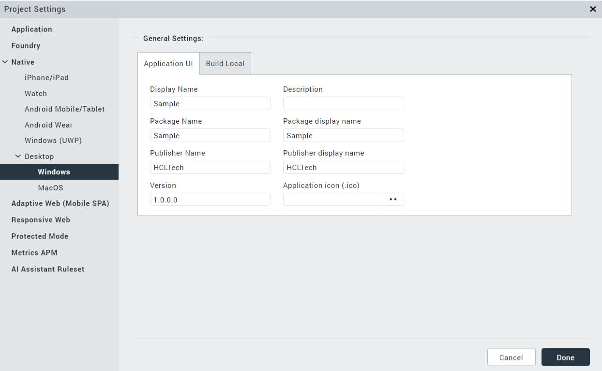

A desktop native application is an application that can be installed and run locally on a desktop computer.  The desktop native application is a web application  running in an electron environment with the ability to integrate with the desktop environment and communicate and work with the desktop resources as the application developer permits.  Access to the desktop environment is managed by poly-filling existing Volt MX apis or adding your own using Native Function Interfaces.  As is typically the case with Volt MX built applications, the desktop native applications can be client-server based and interface with the Volt MX Foundry server using services and providers specific to your application needs.   Using Volt MX, desktop native applications can be created for Mac and Windows computers.  

> **_Note:_**  The electron JS based desktop native build doesn’t support “free-form” architecture applications. It supports only MVC architecture applications.

### Desktop Native Applications

### Creating Desktop Native Applications

To create a desktop native application in Volt MX, create a project and choose Native App and then select Desktop for the target device size.  When the project is created, the forms for the application will be under the Responsive Web/Desktop.  

When a form is selected, you can choose from the different platforms to show a device shell specific to the platform. 

Widgets from the widget libraries can be used to layout the UI you need for your application look and feel.  Each widget has a set of properties that can be used configure the widget for the appearance and capabilities you’d like.

### Window Events and Properties

In Volt MX, a form is used to represent the window of your desktop native application.  A desktop window has a set of properties for managing its size and state.  These are represented in the Form tab of the Volt MX properties when the form is selected on the canvas or in the project explorer.  These properties determine if the window can be minimized, maximized, restored or closed and can be set differently for each platform on which your application will run.

In addition to properties, there are a set of actions your application can take when window events are triggered.  These are accessible in the Action tab.  In addition to general actions, there are a set specific to the desktop window state.
 

These properties and actions are added to your desktop native application through the Volt MX Form NFI which is a default NFI.  Default NFIs are automatically added to your application.

### Adding Menus and Tray icons to your application

Windows in desktop native application typically have menu bars with actions to perform specific to your application.  In Volt MX, these menus are created, modified and deleted using apis and passing menu templates to define the menus and their capabilities.  The apis are defined as follows:

*	voltmx.application.createDesktopAppMenu(menuTemplate)
*	voltmx.application.deleteDesktopAppMenu()
*	voltmx.application.insertDesktopAppMenuItem(menuTemplate, id,
    position)
   id can be the menu id or label; position is 'before' or 'after'
*	voltmx.application.deleteDesktopAppMenuItem(menuid)   
     menuid can be the id or label
*	voltmx.application.createDesktopTrayItem(iconPath, menuTemplate,
    toolTip) 
*	voltmx.application.deleteDesktopTrayItem()

These apis are added to your desktop native application through the Volt MXA pplication NFI which is a default NFI.  Default NFIs are automatically added to your application.

The template definition for menus of desktop native applications follows the protocol for electron menu definition:  See [here](https://www.electronjs.org/docs/latest/api/menu)

### Application Security

Applications that you build for Desktop Native platforms are electron applications.  They are generated configured for Context Isolation and Process Sandboxing.  With Context Isolation, electron code and preload scripts are run in a separate javascript context from the Volt MX forms.

There are typically two types of processes with electron applications; the main process and renderer processes.  The Volt MX forms run in renderer processes.  Process Sandboxing is used to limit the resources of your local computer the renderer processes have access to.  Resources of the local computer can be accessed from the main process, but not directly by the renderer processes.

In order for the renderer processes to be able to communicate with the main process to access local resources, they communicate across the context bridge.  The main process will expose to the renderer processes only the apis it permits the renderer processes to call through the context bridge.  Within Volt MX this set of apis and restrictions of resources are managed through Native Function Interfaces (NFIs).

### Desktop Native NFIs

A Native Function Interface (NFI) is an extension to your application to invoke additional modules to add features.  For desktop native applications NFIs enable you to call node modules and access your local desktop resources. 

Volt MX provides several NFIs that you can add to your desktop native application and you can build your own.

> **Note:** To see the default NFIs reflected in Iris, you need to build the application at least once in the desktop native environment.

The NFIs provided are the following:

 

<html>
<head>

</head>
<body>
<table>
  <tr>
    <td>VoltMXApplication</td>
    <td>Provides apis to manage window menus and tray icons</td>
  </tr>
  <tr>
    <td>VoltMXDB</td>
    <td>Provide apis for local desktop DB manipulation using sqlite</td>
  </tr>
   <tr>
    <td>VoltMXForm</td>
    <td>Provides apis for window state management such as maximized, minimized, restored</td>
  </tr>
   <tr>
    <td>VoltMXIO</td>
    <td>Provides apis for file IO on the local desktop</td>
  </tr>
</table>
</body>
</html>

 

Desktop native NFIs are zip files containing a number of files.  All of these files must be zipped in a folder named the same as the NFI.  With the exception of the api file, the other files will be generated for you when using the Create option in the popup for managing NFIs.

<html>
<head>

</head>
<body>
<table>
  <tr>
    <td>api file (.js)  </td>
    <td>This is the javascript file containing the functions you want to call from your desktop native application</td>
  </tr>
  <tr>
    <td>wrapper file (.js)</td>
    <td>The wrapper file’s primary responsibility is to assign the api define in your preload file into the namespace for the voltmx application to address it.</td>
  </tr>
   <tr>
    <td>preload file (.js)</td>
    <td>The preload file defines the apis and parameters to be passed across the bridge between the renderer and main processes.</td>
  </tr>
   <tr>
    <td>handler file (.js)</td>
    <td>The handler file receives the calls in the main process and invokes the apis from the api file.</td>
  </tr>
     <tr>
    <td>bootstrap file (.js)</td>
    <td>The bootstrap file defines the channel constants to identify the requests passed across the bridge.</td>
  </tr>
     <tr>
    <td>intellisense directory with a tern.json file</td>
    <td>The tern.json file is used for intellisense of the apis.</td>
  </tr>
     <tr>
    <td>metadata.properties file</td>
    <td>The metadata.properties file identifies the metadata of the NFI so Volt MX code generation knows what to include in the application.</td>
  </tr>
</table>
</body>
</html>

 

Included in the metadata.properties file are a set of properties.

<html>
<head>

</head>
<body>
<table>
  <tr>
    <td>moduleName= < NFI module name ></td>
    <td>The name of the NFI.  e.g. VoltMXApplication</td>
  </tr>
  <tr>
    <td>moduleVersion= < module version ></td>
    <td>The version of the NFI module; e.g. 1.0.0</td>
  </tr>
   <tr>
    <td>moduleDescription= < some text ></td>
    <td>A description of the purpose of the NFI and the categories of apis provided.</td>
  </tr>
   <tr>
    <td>os=Desktop</td>
    <td>Must be ‘Desktop’</td>
  </tr>
     <tr>
    <td>sdkVersion= < a version > </td>
    <td>Typically the version of the environment on which it’s supported.  For desktop native this will be same as the module version.</td>
  </tr>
     <tr>
    <td>apiNamespace= < namespace for the apis ></td>
    <td>Namespace to categorize the apis.  e.g. com.sample.io</td>
  </tr>
     <tr>
    <td>wrapperFile= < name of wrapper js file > </td>
    <td></td>
  </tr>
  <tr>
    <td>handlerFile= < name of handler js file ></td>
    <td></td>
  </tr>
  <tr>
    <td>preloadFile= < name of preload js file ></td>
    <td></td>
  </tr>
  <tr>
    <td>nodeModules= < list of node dependencies > </td>
    <td>Optional. Comma separated list of node module dependencies and their version</td>
  </tr>
</table>
</body>
</html>

 

To add NFIs to your desktop native application, from the menu select Edit -> Manage Native Function Apis.  Select the Desktop tab.  From this popup you can import an NFI, create a new NFI, or delete an existing NFI from your application.

All enabled packages under the Desktop tab will get added to the desktop native application.

### Import NFI

When choosing to import an NFI, select the zip file containing the NFI.  The metadata.properties file will identify the information related to the NFI and it’ll get added to the list.

### Create NFI

When choosing the Create button to create an NFI, the following popup is displayed.

Select the js file that contains the api you’d like your application to be able to call.  

When the js file is selected, the table will fill-in with exported functions from the js file and their parameter names.  If the application doesn’t need a response back from the api, you can change it to Async.  If the application needs a response back, make it Sync.
If there is a function in the javascript file you do not want to include as an api, you can choose Disable to exclude it from the apis that can be called from your application.

If there are additional javascript files needed by your application (not including dependent node modules), select the folder containing the javascript files in the Additional JS (optional) field.  Note all files in the hierarchy of the folder will be copied to the NFI.

Name the NFI.  Give the NFI a version.  Enter a namespace for the api.
If there are node module dependencies select a .json file in the Add node dependencies (.json) field.  The json will be parsed and the ‘dependencies’ element in the json will be included as node module dependencies for your application.

<b>For example:</b>

When you click the Create button an NFI zip file with the NFI name is created and saved to the < workspace >/desktopNativeNFIs directory.

You may unzip an NFI and enhance the preload, handlers and wrapper javascript files.  The preload and wrapper cannot contain references to node modules.  The handler can.
For information regarding the type of parameters that can be passed across the bridge (defined in the preload file), see the electron documentation regarding the contextBridge.

### NFI Apis

### Volt MX Form

<html>
<head>

</head>
<body>
<table>
  <tr>
    <td>voltmx.form.enableMaximizable(enable)</td>
    <td>Enable/disable window maximize button</td>
  </tr>
  <tr>
    <td>voltmx.form.enableMinimizable(enable)</td>
    <td>Enable/disable window minimize button</td>
  </tr>
   <tr>
    <td>voltmx.form.enableRestorable(enable)</td>
    <td>Enable/disable window restore button</td>
  </tr>
   <tr>
    <td>voltmx.form.enableClosable(enable)</td>
    <td>Enable/disable window close</td>
  </tr>
   <tr>
    <td>voltmx.form.setTitle(aTitle)</td>
    <td>Sets the window title</td>
  </tr>
</table>
</body>
</html>

### Volt MX Application

<html>
<head>

</head>
<body>
<table>
  <tr>
    <td>voltmx.application.createDesktopAppMenu(menuTemplate)</td>
    <td>Create and set the window menubar from the menu template. This will overwrite all default options.</td>
  </tr>
  <tr>
    <td>voltmx.application.deleteDesktopAppMenu()</td>
    <td>Delete the window menubar. This will remove all default options as well.</td>
  </tr>
   <tr>
    <td>voltmx.application.insertDesktopAppMenuItem(menuTemplate, id, position)</td>
    <td>Insert a menu or menuitem in the window menubar.id is the id or label of a menuitem relative to which this menu template will be placed.Position is ‘before’ or ‘after’</td>
  </tr>
   <tr>
    <td>voltmx.application.deleteDesktopAppMenuItem(menuid)</td>
    <td>Delete the menu item from the menubar having the id or label</td>
  </tr>
   <tr>
    <td>voltmx.application.createDesktopTrayItem(iconPath, menuTemplate, toolTip)</td>
    <td>Add an application tray item for the application. See <a href="https://www.electronjs.org/docs/latest/api/native-image#supported-formats" target="_blank">here</a> for supported image formats. </td>
  </tr>
     <tr>
    <td>voltmx.application.deleteDesktopTrayItem()</td>
    <td>Delete the application from the tray</td>
  </tr>
  </tr>
     <tr>
    <td>voltmxapplication.application.addContextMenuItems(contextMenu)</td>
    <td>Adds a context menu using the specified contextMenu template</td>
  </tr>
  <tr>
    <td>voltmxapplication.application.removeContextMenu()</td>
    <td>Deletes the entire context menu</td>
  </tr>
    <tr>
    <td>voltmxapplication.application.removeContextMenuItems(label)</td>
    <td>Deletes a specific context menu item identified by the provided ID or label
</td>
</tr>
</table>
</body>
</html>
 
<b>Note :</b>  Any menu item changes enacted by these APIs will not be persisted beyond the app launch during which they were invoked.
 

### Volt MX IO

<html>
<head>

</head>
<body>
<table>
<tr>
    <td>voltmx.io.FileSystem.copyBundledRawFileTo()</td>
    <td>Returns Boolean value,if failure throws appropriate exception, See VoltMX voltmx.io.documentation</td>
  </tr>
  <tr>
    <td>voltmx.io.FileSystem.getDataDirectoryPath()</td>
    <td>Return the directory where application data is stored.</td>
  </tr>
  <tr>
    <td>new voltmx.io.File(filePath).createFile()</td>
    <td>Create a file having the path and name of the filePath</td>
  </tr>
   <tr>
    <td>new voltmx.io.File(filePath).copyTo(targetPath, newName)</td>
    <td>Copy the file or directory</td>
  </tr>
   <tr>
    <td>new voltmx.io.File(filePath).createDirectory()</td>
    <td>Create a directory having the filePath name and/or hierarchy</td>
  </tr>
   <tr>
    <td>new voltmx.io.File(filePath).exists()</td>
    <td>Return a boolean if the filePath exists</td>
  </tr>
     <tr>
    <td>new voltmx.io.File(filePath).getFileList()</td>
    <td>Return an array of the files in the directory</td>
  </tr>
   <tr>
    <td>new voltmx.io.File(filePath).isDirectory()</td>
    <td>Return a Boolean if the filePath is a directory</td>
  </tr>
   <tr>
    <td>new voltmx.io.File(filePath).isFile()</td>
    <td>Return a boolean if the filePath is a file</td>
  </tr>
   <tr>
    <td>new voltmx.io.File(filePath).moveTo(targetPath, newName)</td>
    <td>Move the file or directory</td>
  </tr>
   <tr>
    <td>new voltmx.io.File(filePath).read()</td>
    <td>Read the file content as a buffer</td>
  </tr>
   <tr>
    <td>new voltmx.io.File(filePath).readAsText()</td>
    <td>Read the file content as a string.</td>
  </tr>
   <tr>
    <td>new voltmx.io.File(filePath).remove(deleteRecursive)</td>
    <td>Remove the file or directory.deleteRecursive is a boolean</td>
  </tr>
   <tr>
    <td>new voltmx.io.File(filePath).rename(newName)</td>
    <td>Rename the file</td>
  </tr>
   <tr>
    <td>new voltmx.io.File(filePath).write(data, append)</td>
    <td>Write the string or buffer to the file</td>
  </tr>
</table>
</body>
</html>

### Volt MX DB

<html>
<head>

</head>
<body>
<table>
  <tr>
    <td>voltmx.db.changeVersion(dbaseObjectId, oldVersion, newVersion, transactionCallback, errorCallback, successCallback)</td>
    <td>Change the version of the database.
See VoltMX voltmx.db documentation</td>
  </tr>
  <tr>
    <td>voltmx.db.executeSql(transactionId, sqlStatement, args, successCallback, errorCallback)</td>
    <td>Execute an SQL statement in the transaction.
See VoltMX voltmx.db documentation</td>
  </tr>
   <tr>
    <td>voltmx.db.openDatabase(dbName, version, displayName, estimatedSize)</td>
    <td>Open the database and return the dbaseObjectId.
See VoltMX voltmx.db documentation <b>Note:</b><li>If the dbName contains an absolute path, the openDatabase function will create or open the database file in the corresponding location.<li>If dbName is just a file name, the function will create or open the database file in the application's data directory path.
</li></li></td>
  </tr>
   <tr>
    <td>voltmx.db.sqlResultsetRowItem(transactionId, sqlResultSet, index)</td>
    <td>Return the indexed item from the result set.
See VoltMX voltmx.db documentation</td>
  </tr>
   <tr>
    <td>voltmx.db.readTransaction(dbaseObjectId, transactionCallback, transactionErrorCallback, successCallback)</td>
    <td>Execute a transaction to read records from the database.
See VoltMX voltmx.db documentation</td>
  </tr>
     <td>voltmx.db.transaction(dbaseObjectId, transactionCallback, transactionErrorCallback, successCallback)</td>
    <td>Execute a transaction to read or write to the database.
See VoltMX voltmx.db documentation</td>
  </tr>
</table>
</body>
</html>

### Mandatory Steps in Building an Application for Desktop Native:

1.  Desktop Native plugin 

    * Build the project at least once to download the Desktop Native plugin. 
    
2.  Select the desired Database configuration. 

3.  If SQLite Database is selected, Enable OfflineObjects VoltMXDB NFI

    * Navigate to Edit -> Open Manage Native Function API(s).
    * Select the Desktop tab.
    * Enable <b>VoltMXDB.</b> 

    > **Note:** Version 2.0.0 of VoltMXDB includes all the Offline Object updates.

4.  Rebuild the Application to apply the changes. 

    > **Note:** Unlike IndexedDB, where the database can be viewed directly in Developer Tools under the Application tab, SQLite database file for
                Desktop Native resides in the system's user app data folder for both Windows and macOS.

    * Windows : `<System Drive>\Users\<User>\AppData\Roaming\<YourApp>\data\sync.db`
    * macOS : `/Users/<User>/Library/Application Support/<YourApp>/data/sync.db`

### Desktop Native(Electron Apps)
  IndexedDB is the database that supports offline objects.

### Building a Desktop Native Application

### Build Prerequisites

To build and package application,

* Ensure to have Node.js version 16.4.0 or higher installed. You can download it from the [here](https://nodejs.org/en)
* Git is required for version control. Install it from [here](https://git-scm.com/)
* For Windows Application : The Wix Toolset must be installed in your Windows environment. To install the Wix Toolset, see [here](https://wixtoolset.org/)

### Building

Once you’ve created the forms of your application, added widgets, setup properties and actions and you’re ready to build and run, choose Build -> Build Native Local.

 
Choose Generate Native App from the Post Build Action dropdown and in the Platform and Channels table,  under the DESKTOP channel choose the option for the (Local Machine) app or Installer you’d like to build.  The app and Installer are listed for the platform on which your Volt MX is running.  Due to platform module dependencies, you can only build the app for the same OS on which Volt MX is running.  Note:  The app will be generated to run across architectures for the same OS.

When the build is completed, the generated app will be in the <workspace>/nativeApps folder.
If the Installer was chosen the dmg or msi will be located in the <workspace>/nativeApps/<project>/out/make.

Icons for the application and application signing can be configured in the Project -> Settings under the Native section for MacOS or Windows.

### Project Settings

Desktop Native platforms support two databases, namely IndexedDB and SQLite.

To switch the database, select the appropriate option from <b>Project Settings -> Native -> Desktop</b>

There are some platform specific project settings for the macOS and Windows native platforms. To view or update these settings, go to <b>Project Settings -> Native -> Desktop</b> and choose either macOS or Windows.

### Windows Application Settings

The screen shot below shows the Application UI tab of the Windows application settings.

* Display Name – The name of your application.
* Description – A short description of your application.
* Package Name – A short name used when packaging you application.
* Package Display Name – A human readable name for your package.  Usually the same as the Display Name
* Publisher Name – The (short) name of your company.
* Publisher Display Name – A possibly longer, more descriptive name of your company.
* Version – The version of your application
* Application icon (.ico) – An icon file to be used for your application.   The file is picked using a file picker.  The icon you choose will be copied into your project when the settings are saved.  It is recommended that you use a 256x256 px icon.

The next screen shot shows the Build Local tab of the Windows settings

* Windows signing certificate – A valid signing certificate for your Windows application.  This file is chosen using a file picker.  The certificate file is copied into your project when the settings are saved.

* Certificate password – The password associated with your signing certificate.

### MacOS Application Settings

The following screen shot shows the MacOS specific project settings.

* Bundle Identifier – The bundle ID for your application.
* Bundle Version – The version of your application
* Enable App Notarization – Enable the checkbox to Notarize your app
*	Developer ID – Your Apple Developer ID.
* Development Team ID – The Apple Developer Team to which you belong.
* App Password – An application password generated for your app on the Apple Developer site.
* MacOS icon set (.icns) – An icon set file containing all the required icon formats for your MacOS application.  The icon set format allows you to embed all needed sizes into a single file.

NOTE:  For signing and notarizing MacOS applications, we use the process documented in the following article: [here](https://www.electronforge.io/guides/code-signing/code-signing-macos)

We use the app-specific password option for notarizing your application.  To learn about app-specific passwords and how to generate them, see [here](https://support.apple.com/en-us/HT204397)

### Offline Objects

### Supported Databases	

**DesktopNative Support**

* IndexedDB (Default)
* SQLite

>**_NOTE_** : To switch the database, select the appropriate option from **Project Settings -> Native -> Desktop**

### Supported Architecture

**Windows**

* Installer Type: .msi
* Supported Versions: Windows 10 and later
* Architecture: x86 (32-bit), x64 (64-bit)

**Mac**

* Installer Type: .dmg
* Architecture: arm, x64

>**_NOTE_** : The build-system architecture will determine what target devices can run the application. For example, an app built on an ARM chip will only work on a system with an ARM chip.

### App Uninstallation

<b>MacOS</b>

An uninstaller app named "Uninstall_`<appname>"` will be created in the application's installation directory. You can use this app to uninstall the application.

<b>Windows</b>

An uninstaller shortcut named "Uninstall_`<appname>"` will be created in the application's installation directory. This shortcut can be used to uninstall the application.

>**Note** : This process will delete the AppData folder under Users directory and all contents within the installation directory but the empty installation directory itself will need to be manually removed.

### Modifying Native Apps

After your app is built, there may be scenarios where you want to modify your application, in particular, the startup file, main.js.  When an application is generated, main.js will reside in the <workspace>/nativeApps/<project> directory.  This main.js file is copied from the com.kony.desktopnative plugin in the <workspace>/bundles/com.kony.desktopnative/desktopnative directory.  If you modify the main.js in this plugin, it will get overwritten when you upgrade to a newer version of the com.kony.desktopnative plugin.

### TroubleShooting

* 	When building and/or running an application on a Mac, a terminal window opens and does not exit.  You can configure your environment so the terminal windows are automatically exited.  See 
[here](https://support.apple.com/guide/terminal/change-profiles-shell-settings-trmlshll/2.13/mac/13.0)

* When building a desktop native application on a Mac, you may get a build failure error due to the temp/<project> or nativeApps/<project> directory not able to be deleted. This may occur due to the terminal windows opened during build and/or run of the application, remaining open.  Close them and retry the build.  Alternatively you can manually delete the <project> directory under temp and/or nativeApps and build again. 

* There was an electron-forge security vulnerability due to the http-cache-semantics package that was indirectly included.  Electron-forge is a node development time dependency.  If you are concerned, the vulnerability can be removed by adding http-cache-semantics 1.1.1 to package.json devDependencies (in <workspace>/bundles/com.kony.desktopnative directory).  If you modify the package.json in the com.kony.desktopnative directory, be aware, it will get overwritten when you upgrade to a newer version of the com.kony.desktopnative plugin.

### Debugging your Desktop Native Application

### Debugging the renderer process

If you are having issues with your desktop native generated application and would like to debug it, the renderer process can be debugged by building the app in Debug mode (in Build Native Local popup) and running the application.  When the window opens, there should be a View menu with Open Developer Tools and Reload items.  When you choose Open Developer Tools, you can place your breakpoints in the javascript code and reload the application.

### Debugging the main process

If the window does not open at all or you need to debug the main process for another reason, you can do so by modifying the run.bat or run.sh and adding the –inspect-brk=<port> flag to the line running electron.  For example:

node_modules\.bin\electron . --inspect-brk=9292

You’ll also need to open a chrome browser and navigate to chrome://inspect.  In the Configure section of the inspect page, define the port you wish to debug on (in our example above it would be localhost:9292).

Then run run.bat or run.sh and you will be able to debug the main process.

### Notes

* Ensure that you use 'voltmx.ui.Alert’ API instead of native alerts for consistent behavior.
* Do not use a for loop to run CRUD operations, if you use please use promises from application code.
* ScreenRecorder apis will not function without the use of electron’s desktopCapturer.  See [here](https://www.electronjs.org/docs/latest/api/desktop-capturer)
To add this capability to the desktop native application an NFI would need to be created with apis to access desktopCapturer from the main process.

* For GeoLocation, you will need to alter the main.js of the application to add your Google API key.  See the GOOGLE_API_KEY section of [here](https://www.electronjs.org/docs/latest/api/environment-variables)

* Volt MX Camera widget is not supported for DesktopNative apps at this time.  However the camera apis do function.

* Protected mode has no affect for desktop native apps at this time.
* When running a desktop native app on a MacOS platform during development, the first window menu entry will say ‘Electron’ rather than the project name.  However when the installer is built for the app, the menu will correctly be the project name for the installed app.  The menu will be correct on Windows during development and in the installed app.

### Known Issues

* Error reporting in Iris needs improvements for notarization flow
* For windows, project settings under General -> Application UI settings are not being applied during app package generation

