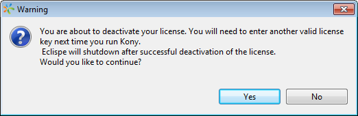



Deactivating the VoltMX Studio License
====================================

To deactivate the VoltMX Studio license, follow these steps:

1.  From the **Help** menu, click **About VoltMX License**. The VoltMX Studio license details view appears.

3.  Click **Deactivate License**. A warning message appears.
    
    
    
4.  Click **Yes** to confirm license deactivation. A confirmation message appears.
5.  Click **OK** to exit VoltMX Studio.

Pre-activated License
---------------------

A pre-activated license is issued if you are not able to connect to licensing server due to a firewall or proxy issues. With this license, you do not have to enter internet connection details as the license is already activated.

If you need to use another license in VoltMX Studio or use the pre-activated license in a different machine, you need not deactivate the pre-activated license. In this scenario, follow the steps mentioned below.

To deactivate a pre-activated license, follow these steps:

1.  Navigate to User Home Directory. For example, C:\\Users\\<User Name>.
2.  Delete `.voltmx` folder, `.keditor` folder, and `ide_k` file from your home directory and provide the pre-activated license to the installer/VoltMX Studio.
