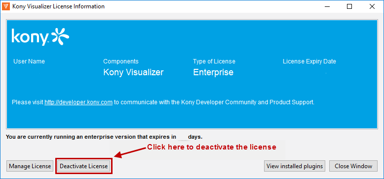
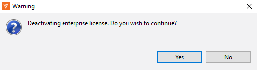

License Deactivation
====================

License will be deactivated based on the expiry date.

VoltMX Iris Enterprise
--------------------------

The license will be registered based on the Windows user name on your local machine. License deactivation is now possible through Enterprise Edition.

To deactivate the VoltMX Iris Enterprise license, follow these steps:

1.  From the **Help** menu, click **About VoltMX License**. The VoltMX Iris Enterprise license details view appears.

3.  Click **Deactivate License**. A warning message appears.
    
    
    
4.  Click **Yes** to confirm license deactivation. A confirmation message appears.
5.  Click **OK** to exit VoltMX Iris.

Pre-activated License
---------------------

A pre-activated license is issued if you cannot connect to the licensing server due to a firewall or proxy issues. You do not enter Internet connection details because the license is already activated. To use another license in the same instance of VoltMX Iris Enterprise or to use the pre-activated license in a different machine, you have to delete specific files and folders in user's home directory.

To use another license in VoltMX Iris Enterprise or use the pre-activated license in a different machine, follow these steps: 

1.  Navigate to User Home Directory - for example, `C:\Users\<User Name>`.
2.  Delete `.voltmx` folder, `.keditor` folder, and `ide_k` file from the home directory folder.
