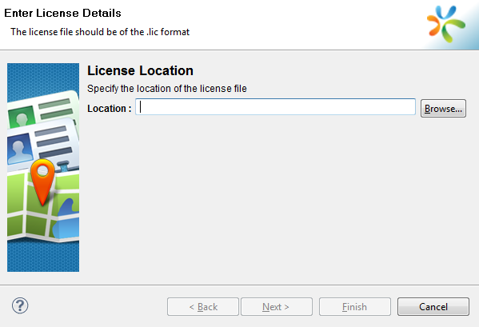
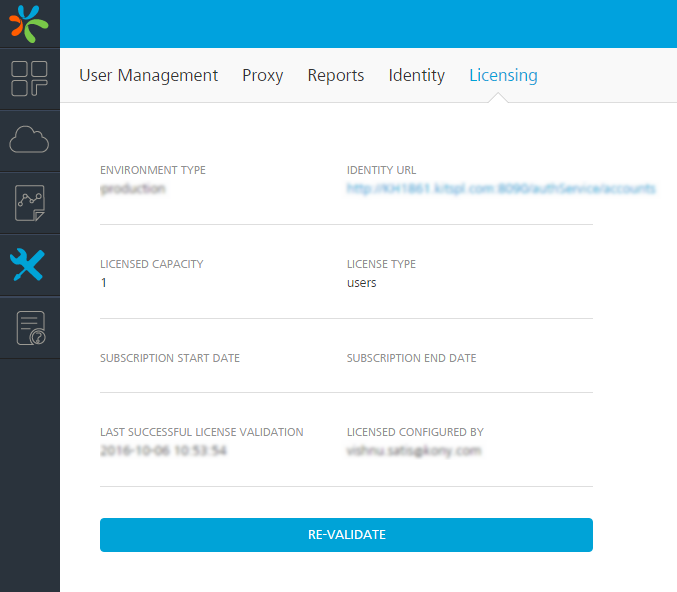
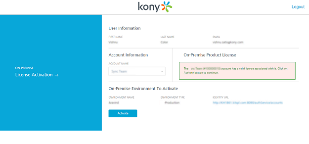

License Validity
----------------

The license validity is the remaining application usage period from the current day. When the license validity is lesser than or equal to 30 days, the Notification dialog box is displayed automatically on each launch. For each day, the license validity period decreases by one. After the validity period, the license expires disabling you to access the application. If you view the license expiry message as displayed below, you need to upgrade the license with a commercial version within the required time.

### Upgrading license while launching VoltMX Iris Enterprise

To upgrade your existing license, follow these steps:

1.  While launching the VoltMX Iris Enterprise, the following **Notification** dialog box is displayed automatically if the license validity is lesser than or equal to 30 days.
2.  To upgrade your license some other time, click **Later**.
3.  If you have a valid license with you and you wish to upgrade it now, click **Yes**. The **Enter License Details** dialog box appears.
    
    
    
4.  **Browse** for the location of the license file, and then click **Finish**.

### Viewing the License Validity on VoltMX Iris Enterprise

To view the license validity on VoltMX Iris Enterprise, follow these steps:

1.  Click **Help**. The help pane appears.
2.  Click **About VoltMX License**. The **VoltMX Iris Enterprise License Information** dialog box appears and displays your license information.
3.  To deactivate the license, follow the steps mentioned in [Deactivating the License](License Deactivation.md) section.
    

### Revalidating VoltMX Foundry license

To re-validate VoltMX Foundry license, follow these steps:

1.  Go to **Licensing** section under Settings.
    
    
    
2.  Click **RE-VALIDATE**, a confirmation dialog appears.
3.  Click on **Continue**. You will be redirected to VoltMX Cloud Account Sign-in page.
4.  Enter your VoltMX account credentials and click **Sign in**. After your credentials are validated, you will be redirected to **Licensing Activation** page.
    
    
    
5.  From **ACCOUNT NAME** list, select an account name. Based on the license validity, a message is displayed under **On-Premise Product license**.
    
    *   If the account does not have a valid license, you cannot proceed further. Please contact VoltMX Support.
    
    *   If the account has a valid license, click on **Activate** button. The license will be activated and you will be redirected to the **Licensing** section of your VoltMX Foundry console.The page displays all the license related information.
